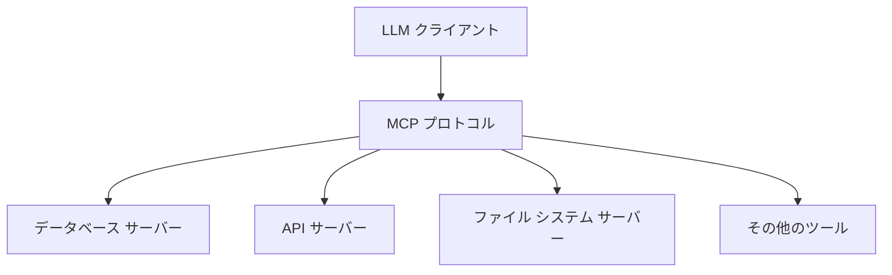
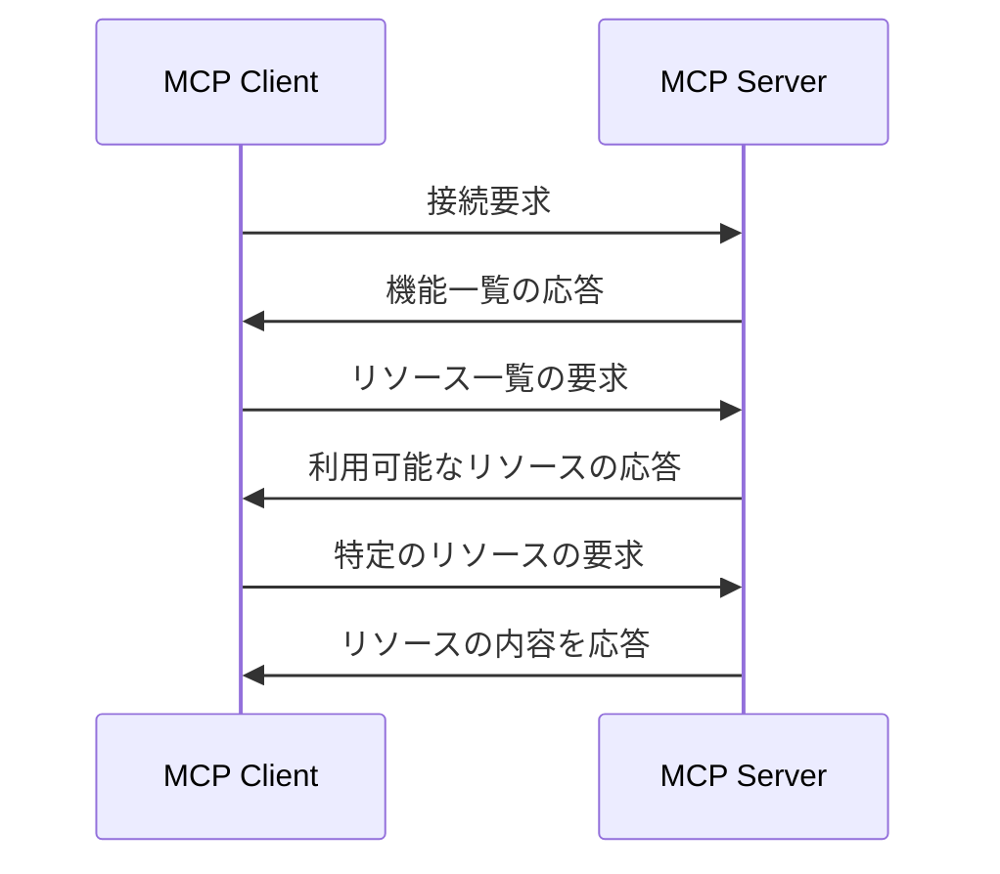

# 00 - MCPの紹介

## 📖 概要

Model Context Protocol (MCP) は、AIパイプラインにおける重要な標準化プロトコルです。この章では、MCPとは何か、なぜ標準化が重要なのか、そして実際の使用事例とメリットについて学びます。

## 🎯 学習目標

この章を完了すると、以下のことができるようになります：

- Model Context Protocol (MCP) が何であるかを説明できる
- MCPが解決する問題を理解できる
- MCPの主要なメリットを説明できる
- 実際の使用事例を理解できる

## 🤔 Model Context Protocol とは？

Model Context Protocol (MCP) は、大規模言語モデル（LLM）とデータソースやツールの間で標準化された通信を可能にするプロトコルです。

### 従来の課題

AI アプリケーション開発では、以下のような課題がありました：

- **統合の複雑さ**: 各データソースやツールに対して個別の統合コードが必要
- **標準化の欠如**: 一貫性のないインターフェースとAPI設計
- **再利用性の低さ**: 他のプロジェクトで再利用が困難
- **保守性の問題**: 各統合の個別メンテナンスが必要

### MCPによる解決

MCPは、これらの課題を以下のように解決します：



## 🏗️ MCPの基本アーキテクチャ

MCPは、**クライアント・サーバー**アーキテクチャを採用しています：

### クライアント側
- **LLMホスト**: ChatGPT、Claude、その他のAIアシスタント
- **役割**: リソースへのアクセスを要求し、応答を処理

### サーバー側
- **MCPサーバー**: 特定のデータソースやツールへのアクセスを提供
- **役割**: 標準化されたインターフェースでリソースを公開

## 🔧 主要な概念

### 1. ツール (Tools)
LLMが実行できる機能やアクションです。

**例**:
- ファイルの読み書き
- データベースクエリの実行
- Web APIの呼び出し
- 計算処理の実行

### 2. リソース (Resources)
LLMがアクセスできるデータです。

**例**:
- ファイルの内容
- データベースのレコード
- Web ページの内容
- APIからのデータ

### 3. プロンプト (Prompts)
再利用可能なプロンプトテンプレートです。

**例**:
- コードレビュー用のプロンプト
- ドキュメント作成用のプロンプト
- データ分析用のプロンプト

## 🌟 MCPのメリット

### 1. 標準化による効率性
```javascript
// MCP以前：各サービス毎に個別実装
const googleDriveClient = new GoogleDriveAPI();
const dropboxClient = new DropboxAPI();
const localFileSystem = new FileSystemAPI();

// MCP使用：統一されたインターフェース
const mcpClient = new MCPClient();
await mcpClient.connectToServer('file-server');
const files = await mcpClient.listResources();
```

### 2. 再利用性の向上
- 一度作成したMCPサーバーは、任意のMCPクライアントで利用可能
- プロジェクト間での容易な共有

### 3. 拡張性
- 新しいデータソースやツールを簡単に追加
- 既存のクライアントコードを変更せずに機能拡張

### 4. 保守性
- 標準化されたプロトコルにより、デバッグとトラブルシューティングが簡単
- 一貫性のあるエラーハンドリング

## 🎯 実際の使用事例

### 1. 開発者アシスタント
```
[開発者] → [MCP Client] → [GitHub Server]
                      → [Database Server]  
                      → [Documentation Server]
```

**機能**:
- コードリポジトリの検索と分析
- データベースクエリの生成と実行
- ドキュメントの自動生成

### 2. データ分析プラットフォーム
```
[アナリスト] → [MCP Client] → [SQL Database Server]
                          → [Excel Server]
                          → [Visualization Server]
```

**機能**:
- 複数のデータソースからの統合分析
- レポートの自動生成
- データ可視化の作成

### 3. カスタマーサポート
```
[オペレーター] → [MCP Client] → [CRM Server]
                            → [Knowledge Base Server]
                            → [Ticketing System Server]
```

**機能**:
- 顧客情報の迅速な取得
- 過去の対応履歴の検索
- 適切な回答の提案

## 🔄 MCPの通信フロー



## 📊 MCPがもたらす変革

### 従来のアプローチ vs MCPアプローチ

| 項目 | 従来のアプローチ | MCPアプローチ |
|------|------------------|---------------|
| 統合の複雑さ | 高い（各サービス毎に個別実装） | 低い（統一されたプロトコル） |
| 開発時間 | 長い | 短い |
| 保守性 | 低い | 高い |
| 再利用性 | 低い | 高い |
| スケーラビリティ | 限定的 | 高い |

## 🎉 まとめ

Model Context Protocol (MCP) は、AI アプリケーション開発における革新的なアプローチです：

- **標準化**: 一貫性のあるインターフェースによる開発効率の向上
- **拡張性**: 新しいツールやデータソースの簡単な追加
- **再利用性**: プロジェクト間でのコンポーネント共有
- **保守性**: 統一されたプロトコルによる簡単なメンテナンス

次の章では、MCPのコア概念をより詳しく学んでいきます。

## 🔗 次のステップ

**[01-CoreConcepts](../01-CoreConcepts/)** に進んで、MCPの技術的な詳細を学びましょう。

## 📚 参考資料

- [Model Context Protocol 公式仕様](https://modelcontextprotocol.io/)
- [MCP GitHub リポジトリ](https://github.com/modelcontextprotocol)
- [MCP Examples](https://github.com/modelcontextprotocol/servers)

---

*この章で学んだ内容について質問がある場合は、次の章に進む前に理解を深めることをお勧めします。*