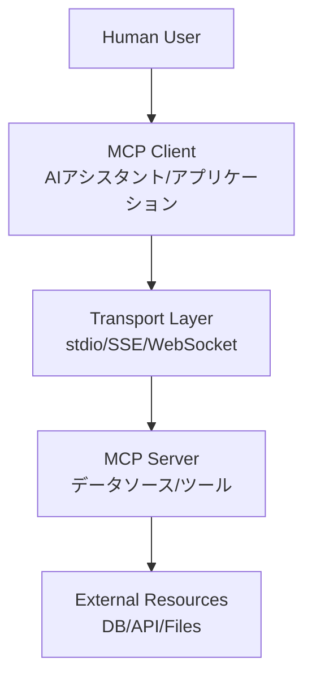
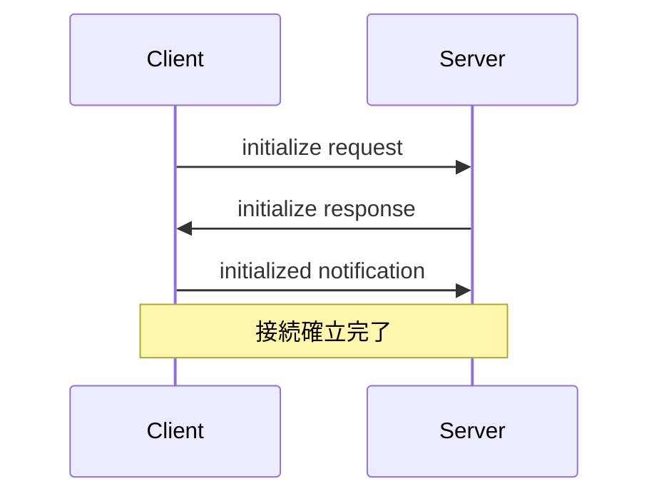
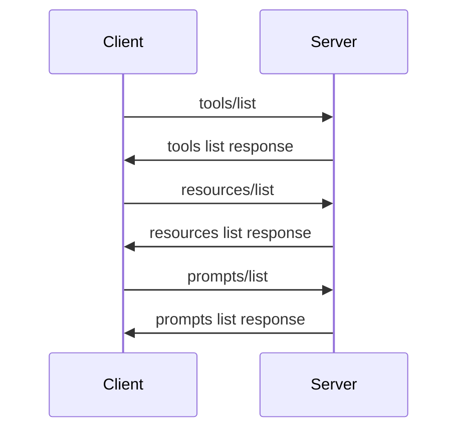
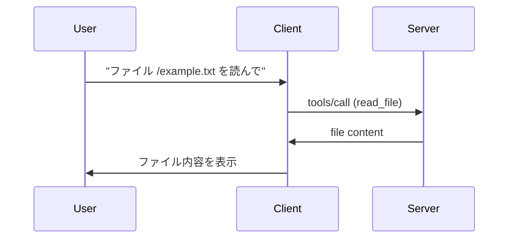

# 01 - MCPのコア概念

## 📖 概要

この章では、Model Context Protocol (MCP) の核となる技術概念を詳しく学習します。クライアント・サーバーアーキテクチャ、主要なプロトコルコンポーネント、メッセージングパターンについて深く理解していきます。

## 🎯 学習目標

この章を完了すると、以下のことができるようになります：

- MCPのクライアント・サーバーアーキテクチャを説明できる
- 主要なプロトコルコンポーネント（ツール、リソース、プロンプト）を理解できる
- MCPのメッセージングパターンを説明できる
- JSON-RPC 2.0 の基本を理解できる

## 🏗️ MCPアーキテクチャの詳細

### クライアント・サーバーモデル

MCPは、明確に定義されたクライアント・サーバーアーキテクチャを採用しています：



### 通信レイヤー

MCPは複数の通信方式をサポートしています：

#### 1. Standard I/O (stdio)
最も基本的で軽量な通信方式です。

```javascript
// Node.js での stdio サーバー例
import { Server } from '@modelcontextprotocol/sdk/server/index.js';

const server = new Server(
  {
    name: "example-server",
    version: "1.0.0"
  },
  {
    capabilities: {
      tools: {},
      resources: {}
    }
  }
);

// stdio transport で接続
server.connect(process.stdin, process.stdout);
```

#### 2. Server-Sent Events (SSE)
Web ベースのアプリケーションに適しています。

```javascript
// SSE サーバー例
import { SSEServerTransport } from '@modelcontextprotocol/sdk/server/sse.js';

const transport = new SSEServerTransport('/message', response);
server.connect(transport);
```

#### 3. WebSocket
双方向の即座通信が必要な場合に使用します。

```javascript
// WebSocket サーバー例
import { WebSocketServerTransport } from '@modelcontextprotocol/sdk/server/websocket.js';

const transport = new WebSocketServerTransport(websocket);
server.connect(transport);
```

## 🔧 主要なプロトコルコンポーネント

### 1. ツール (Tools)

ツールは、LLMが実行できる機能やアクションを定義します。

#### ツールの定義構造

```typescript
interface Tool {
  name: string;
  description: string;
  inputSchema: {
    type: "object";
    properties: Record<string, any>;
    required?: string[];
  };
}
```

#### 実装例

```javascript
// ファイル読み取りツールの定義
const readFileeTool = {
  name: "read_file",
  description: "指定されたパスのファイルを読み取る",
  inputSchema: {
    type: "object",
    properties: {
      path: {
        type: "string",
        description: "読み取るファイルのパス"
      }
    },
    required: ["path"]
  }
};

// ツールの実行ハンドラー
server.setRequestHandler(CallToolRequestSchema, async (request) => {
  const { name, arguments: args } = request.params;
  
  if (name === "read_file") {
    const content = await fs.readFile(args.path, 'utf8');
    return {
      content: [
        {
          type: "text",
          text: content
        }
      ]
    };
  }
  
  throw new Error(`Unknown tool: ${name}`);
});
```

### 2. リソース (Resources)

リソースは、LLMがアクセスできるデータを表します。

#### リソースの定義構造

```typescript
interface Resource {
  uri: string;
  name: string;
  description?: string;
  mimeType?: string;
}
```

#### 実装例

```javascript
// リソース一覧の提供
server.setRequestHandler(ListResourcesRequestSchema, async () => {
  return {
    resources: [
      {
        uri: "file:///projects/docs/readme.md",
        name: "プロジェクト README",
        description: "プロジェクトの主要ドキュメント",
        mimeType: "text/markdown"
      },
      {
        uri: "db://users/table",
        name: "ユーザーテーブル",
        description: "アプリケーションのユーザーデータ",
        mimeType: "application/json"
      }
    ]
  };
});

// リソース内容の提供
server.setRequestHandler(ReadResourceRequestSchema, async (request) => {
  const { uri } = request.params;
  
  if (uri === "file:///projects/docs/readme.md") {
    const content = await fs.readFile('/projects/docs/readme.md', 'utf8');
    return {
      contents: [
        {
          uri: uri,
          mimeType: "text/markdown",
          text: content
        }
      ]
    };
  }
  
  throw new Error(`Unknown resource: ${uri}`);
});
```

### 3. プロンプト (Prompts)

プロンプトは、再利用可能なプロンプトテンプレートです。

#### プロンプトの定義構造

```typescript
interface Prompt {
  name: string;
  description?: string;
  arguments?: Array<{
    name: string;
    description?: string;
    required?: boolean;
  }>;
}
```

#### 実装例

```javascript
// プロンプト一覧の提供
server.setRequestHandler(ListPromptsRequestSchema, async () => {
  return {
    prompts: [
      {
        name: "code-review",
        description: "コードレビュー用のプロンプト",
        arguments: [
          {
            name: "code",
            description: "レビュー対象のコード",
            required: true
          },
          {
            name: "language",
            description: "プログラミング言語",
            required: true
          }
        ]
      }
    ]
  };
});

// プロンプト内容の提供
server.setRequestHandler(GetPromptRequestSchema, async (request) => {
  const { name, arguments: args } = request.params;
  
  if (name === "code-review") {
    return {
      messages: [
        {
          role: "user",
          content: {
            type: "text",
            text: `以下の${args.language}コードをレビューしてください：\n\n${args.code}`
          }
        }
      ]
    };
  }
  
  throw new Error(`Unknown prompt: ${name}`);
});
```

## 📡 メッセージングパターン

MCPは、JSON-RPC 2.0 プロトコルを基盤として使用しています。

### JSON-RPC 2.0 の基本

#### リクエスト形式

```json
{
  "jsonrpc": "2.0",
  "id": 1,
  "method": "tools/call",
  "params": {
    "name": "read_file",
    "arguments": {
      "path": "/path/to/file.txt"
    }
  }
}
```

#### レスポンス形式

```json
{
  "jsonrpc": "2.0",
  "id": 1,
  "result": {
    "content": [
      {
        "type": "text",
        "text": "ファイルの内容..."
      }
    ]
  }
}
```

#### エラーレスポンス

```json
{
  "jsonrpc": "2.0",
  "id": 1,
  "error": {
    "code": -32601,
    "message": "Method not found",
    "data": {
      "method": "unknown_method"
    }
  }
}
```

### 主要なメソッド

#### 1. 初期化メソッド

```typescript
// クライアントからの初期化
{
  "method": "initialize",
  "params": {
    "protocolVersion": "2024-11-05",
    "capabilities": {
      "roots": {
        "listChanged": true
      }
    },
    "clientInfo": {
      "name": "example-client",
      "version": "1.0.0"
    }
  }
}
```

#### 2. ツール関連メソッド

```typescript
// ツール一覧の取得
{
  "method": "tools/list"
}

// ツールの実行
{
  "method": "tools/call",
  "params": {
    "name": "read_file",
    "arguments": {
      "path": "/example.txt"
    }
  }
}
```

#### 3. リソース関連メソッド

```typescript
// リソース一覧の取得
{
  "method": "resources/list"
}

// リソースの読み取り
{
  "method": "resources/read",
  "params": {
    "uri": "file:///example.txt"
  }
}
```

## 🔄 通信フローの詳細

### 1. 接続とハンドシェイク



### 2. 機能発見



### 3. 実際の作業フロー



## 🛡️ エラーハンドリング

### 標準エラーコード

| コード | 意味 | 説明 |
|--------|------|------|
| -32700 | Parse error | 不正なJSON |
| -32600 | Invalid Request | 不正なリクエスト構造 |
| -32601 | Method not found | 存在しないメソッド |
| -32602 | Invalid params | 不正なパラメータ |
| -32603 | Internal error | サーバー内部エラー |

### エラーハンドリング実装例

```javascript
server.setRequestHandler(CallToolRequestSchema, async (request) => {
  try {
    const { name, arguments: args } = request.params;
    
    // バリデーション
    if (!name) {
      throw new McpError(
        ErrorCode.InvalidParams,
        "Tool name is required"
      );
    }
    
    // ツール実行
    const result = await executeTool(name, args);
    return result;
    
  } catch (error) {
    if (error instanceof McpError) {
      throw error;
    }
    
    // 予期しないエラーを適切にラップ
    throw new McpError(
      ErrorCode.InternalError,
      `Tool execution failed: ${error.message}`
    );
  }
});
```

## 🔐 セキュリティ考慮事項

### 1. 入力検証

```javascript
// 厳密な入力検証
function validateToolInput(name, args) {
  const schema = getToolSchema(name);
  const validator = ajv.compile(schema);
  
  if (!validator(args)) {
    throw new McpError(
      ErrorCode.InvalidParams,
      `Invalid arguments: ${ajv.errorsText(validator.errors)}`
    );
  }
}
```

### 2. 権限管理

```javascript
// 基本的なアクセス制御
function checkPermissions(toolName, clientId) {
  const permissions = getClientPermissions(clientId);
  
  if (!permissions.tools.includes(toolName)) {
    throw new McpError(
      ErrorCode.MethodNotFound,
      `Access denied for tool: ${toolName}`
    );
  }
}
```

## 📊 パフォーマンス最適化

### 1. 接続プール

```javascript
class ConnectionPool {
  constructor(maxConnections = 10) {
    this.pool = [];
    this.maxConnections = maxConnections;
  }
  
  async getConnection() {
    if (this.pool.length > 0) {
      return this.pool.pop();
    }
    
    if (this.activeConnections < this.maxConnections) {
      return await this.createConnection();
    }
    
    // 接続を待機
    return await this.waitForConnection();
  }
}
```

### 2. レスポンスキャッシング

```javascript
class ResponseCache {
  constructor(ttl = 60000) { // 1分のTTL
    this.cache = new Map();
    this.ttl = ttl;
  }
  
  get(key) {
    const item = this.cache.get(key);
    if (!item) return null;
    
    if (Date.now() - item.timestamp > this.ttl) {
      this.cache.delete(key);
      return null;
    }
    
    return item.value;
  }
  
  set(key, value) {
    this.cache.set(key, {
      value,
      timestamp: Date.now()
    });
  }
}
```

## 🎉 まとめ

この章では、MCPのコア概念について学習しました：

### 主要なポイント

1. **アーキテクチャ**: クライアント・サーバーモデルと多様な通信レイヤー
2. **コンポーネント**: ツール、リソース、プロンプトの3つの主要要素
3. **メッセージング**: JSON-RPC 2.0 ベースの標準化された通信
4. **エラーハンドリング**: 堅牢なエラー管理システム
5. **セキュリティ**: 入力検証と権限管理の重要性

### 次のステップ

これらの概念を理解したら、次はセキュリティについて学んでいきましょう。

## 🔗 次のステップ

**[02-Security](../02-Security/)** に進んで、MCPシステムのセキュリティについて学びましょう。

## 📚 参考資料

- [MCP Protocol Specification](https://spec.modelcontextprotocol.io/)
- [JSON-RPC 2.0 Specification](https://www.jsonrpc.org/specification)
- [MCP SDK Documentation](https://github.com/modelcontextprotocol/typescript-sdk)

---

*コア概念の理解は、実践的なMCP開発の基盤となります。不明な点があれば、次に進む前に再確認することをお勧めします。*