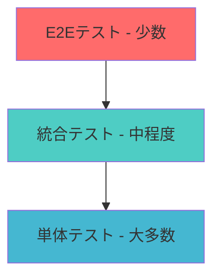

# サーバーテスト - Testing your server

> MCPサーバーの品質を保証するための包括的なテスト手法

## 📋 概要

開発において、テストは品質を保証する重要なプロセスです。この章では、MCPサーバーをテストするための様々なツールと手法について学習します。

## 🎯 学習目標

- MCPサーバーのテスト戦略を理解する
- 単体テスト、統合テスト、E2Eテストの実装方法を学ぶ
- テスト自動化とCI/CDパイプラインの構築方法を習得する
- デバッグ技術とトラブルシューティング手法を身につける

## 🧪 テスト戦略

### 1. テストピラミッド



### 2. MCPテストの重点領域

- **プロトコル準拠**: JSON-RPC 2.0仕様への準拠
- **ツール機能**: 各ツールの正確な動作
- **エラーハンドリング**: 例外状況での適切な対応
- **パフォーマンス**: レスポンス時間とリソース使用量
- **セキュリティ**: 認証・認可・入力検証

## 🔧 テストツールと環境

### Node.js/TypeScript環境

#### 1. Jest による単体テスト

```typescript
// tests/tools.test.ts
import { Server } from "@modelcontextprotocol/sdk/server/index.js";
import { CallToolRequestSchema } from "@modelcontextprotocol/sdk/types.js";

describe('MCP Server Tools', () => {
  let server: Server;

  beforeEach(() => {
    server = new Server(
      {
        name: "test-server",
        version: "1.0.0",
      },
      {
        capabilities: {
          tools: {},
        },
      }
    );

    // ツールの登録
    server.setRequestHandler(CallToolRequestSchema, async (request) => {
      const { name, arguments: args } = request.params;

      switch (name) {
        case "calculate":
          return {
            content: [
              {
                type: "text",
                text: `結果: ${args.a + args.b}`,
              },
            ],
          };
        default:
          throw new Error(`未知のツール: ${name}`);
      }
    });
  });

  test('計算ツールが正しく動作する', async () => {
    const request = {
      params: {
        name: "calculate",
        arguments: { a: 5, b: 3 }
      }
    };

    const response = await server.request(request);
    expect(response.content[0].text).toBe("結果: 8");
  });

  test('未知のツールでエラーが発生する', async () => {
    const request = {
      params: {
        name: "unknown-tool",
        arguments: {}
      }
    };

    await expect(server.request(request)).rejects.toThrow('未知のツール: unknown-tool');
  });
});
```

#### 2. package.json テスト設定

```json
{
  "scripts": {
    "test": "jest",
    "test:watch": "jest --watch",
    "test:coverage": "jest --coverage",
    "test:ci": "jest --ci --coverage --watchAll=false"
  },
  "devDependencies": {
    "@types/jest": "^29.5.0",
    "jest": "^29.5.0",
    "ts-jest": "^29.1.0"
  },
  "jest": {
    "preset": "ts-jest",
    "testEnvironment": "node",
    "collectCoverageFrom": [
      "src/**/*.{ts,js}",
      "!src/**/*.d.ts"
    ]
  }
}
```

### Python環境

#### 1. pytest による単体テスト

```python
# tests/test_server.py
import pytest
import asyncio
from mcp.server.models import InitializeResult
from mcp.server.session import ServerSession
from mcp.types import CallToolRequest, CallToolResult

class TestMCPServer:
    def setup_method(self):
        """テスト前のセットアップ"""
        self.server = create_test_server()

    @pytest.mark.asyncio
    async def test_calculate_tool(self):
        """計算ツールのテスト"""
        request = CallToolRequest(
            params={
                "name": "calculate",
                "arguments": {"a": 10, "b": 5}
            }
        )
        
        result = await self.server.call_tool(request)
        assert result.content[0].text == "結果: 15"

    @pytest.mark.asyncio
    async def test_invalid_tool(self):
        """無効なツール名のテスト"""
        request = CallToolRequest(
            params={
                "name": "invalid_tool",
                "arguments": {}
            }
        )
        
        with pytest.raises(ValueError, match="未知のツール"):
            await self.server.call_tool(request)

    @pytest.mark.asyncio
    async def test_tool_with_missing_arguments(self):
        """引数不足のテスト"""
        request = CallToolRequest(
            params={
                "name": "calculate",
                "arguments": {"a": 10}  # bが不足
            }
        )
        
        with pytest.raises(ValueError, match="必須引数が不足"):
            await self.server.call_tool(request)

def create_test_server():
    """テスト用のサーバーインスタンスを作成"""
    # サーバーの初期化とツール登録
    pass
```

## 🔄 統合テスト

### MCPクライアント-サーバー統合テスト

```typescript
// tests/integration.test.ts
import { spawn } from 'child_process';
import { Client } from "@modelcontextprotocol/sdk/client/index.js";
import { StdioClientTransport } from "@modelcontextprotocol/sdk/client/stdio.js";

describe('MCP Integration Tests', () => {
  let client: Client;
  let serverProcess: any;

  beforeAll(async () => {
    // サーバープロセスの起動
    serverProcess = spawn('node', ['dist/server.js'], {
      stdio: ['pipe', 'pipe', 'pipe']
    });

    // クライアントの初期化
    const transport = new StdioClientTransport({
      command: 'node',
      args: ['dist/server.js']
    });

    client = new Client({
      name: "test-client",
      version: "1.0.0"
    }, {
      capabilities: {}
    });

    await client.connect(transport);
  });

  afterAll(async () => {
    await client.close();
    serverProcess.kill();
  });

  test('ツール一覧を取得できる', async () => {
    const response = await client.listTools();
    expect(response.tools).toHaveLength(1);
    expect(response.tools[0].name).toBe('calculate');
  });

  test('ツールを実行できる', async () => {
    const response = await client.callTool({
      name: "calculate",
      arguments: { a: 7, b: 3 }
    });

    expect(response.content[0].text).toBe("結果: 10");
  });
});
```

## 🧪 E2Eテスト

### Playwright を使用したブラウザテスト

```typescript
// tests/e2e.test.ts
import { test, expect } from '@playwright/test';

test.describe('MCP Web Interface', () => {
  test('サーバー接続とツール実行', async ({ page }) => {
    await page.goto('http://localhost:3000');

    // サーバー接続
    await page.fill('#server-url', 'ws://localhost:8080');
    await page.click('#connect-btn');

    // 接続成功の確認
    await expect(page.locator('#status')).toContainText('Connected');

    // ツール実行
    await page.fill('#tool-input', '5 + 3を計算して');
    await page.click('#execute-btn');

    // 結果の確認
    await expect(page.locator('#result')).toContainText('結果: 8');
  });
});
```

## 📊 パフォーマンステスト

### 負荷テスト

```typescript
// tests/performance.test.ts
import { performance } from 'perf_hooks';

describe('Performance Tests', () => {
  test('大量リクエストの処理性能', async () => {
    const requests = Array.from({ length: 1000 }, (_, i) => ({
      name: "calculate",
      arguments: { a: i, b: i + 1 }
    }));

    const startTime = performance.now();

    const promises = requests.map(req => client.callTool(req));
    const results = await Promise.all(promises);

    const endTime = performance.now();
    const duration = endTime - startTime;

    expect(results).toHaveLength(1000);
    expect(duration).toBeLessThan(5000); // 5秒以内
    
    console.log(`1000リクエストの処理時間: ${duration.toFixed(2)}ms`);
  });

  test('メモリ使用量の監視', async () => {
    const initialMemory = process.memoryUsage();

    // 大量のデータを処理
    for (let i = 0; i < 1000; i++) {
      await client.callTool({
        name: "data-processing",
        arguments: { data: 'x'.repeat(10000) }
      });
    }

    const finalMemory = process.memoryUsage();
    const memoryGrowth = finalMemory.heapUsed - initialMemory.heapUsed;

    // メモリ増加が許容範囲内であることを確認
    expect(memoryGrowth).toBeLessThan(100 * 1024 * 1024); // 100MB
  });
});
```

## 🐛 デバッグとトラブルシューティング

### 1. ログの活用

```typescript
// src/logger.ts
import winston from 'winston';

export const logger = winston.createLogger({
  level: process.env.LOG_LEVEL || 'info',
  format: winston.format.combine(
    winston.format.timestamp(),
    winston.format.errors({ stack: true }),
    winston.format.json()
  ),
  transports: [
    new winston.transports.File({ 
      filename: 'error.log', 
      level: 'error' 
    }),
    new winston.transports.File({ 
      filename: 'combined.log' 
    }),
    new winston.transports.Console({
      format: winston.format.simple()
    })
  ]
});

// 使用例
logger.info('サーバー開始', { port: 8080 });
logger.error('ツール実行エラー', { tool: 'calculate', error: error.message });
```

### 2. デバッガーの設定

```json
// .vscode/launch.json
{
  "version": "0.2.0",
  "configurations": [
    {
      "name": "Debug MCP Server",
      "type": "node",
      "request": "launch",
      "program": "${workspaceFolder}/dist/server.js",
      "outFiles": ["${workspaceFolder}/dist/**/*.js"],
      "env": {
        "NODE_ENV": "development",
        "LOG_LEVEL": "debug"
      }
    },
    {
      "name": "Debug Tests",
      "type": "node",
      "request": "launch",
      "program": "${workspaceFolder}/node_modules/.bin/jest",
      "args": ["--runInBand"],
      "console": "integratedTerminal",
      "internalConsoleOptions": "neverOpen"
    }
  ]
}
```

## 🔄 CI/CDパイプライン

### GitHub Actions設定

```yaml
# .github/workflows/test.yml
name: Test

on:
  push:
    branches: [ main, develop ]
  pull_request:
    branches: [ main ]

jobs:
  test:
    runs-on: ubuntu-latest

    strategy:
      matrix:
        node-version: [18.x, 20.x]

    steps:
    - uses: actions/checkout@v3

    - name: Node.js ${{ matrix.node-version }}のセットアップ
      uses: actions/setup-node@v3
      with:
        node-version: ${{ matrix.node-version }}
        cache: 'npm'

    - name: 依存関係のインストール
      run: npm ci

    - name: リントチェック
      run: npm run lint

    - name: 型チェック
      run: npm run type-check

    - name: 単体テスト
      run: npm run test:ci

    - name: E2Eテスト
      run: npm run test:e2e

    - name: カバレッジレポートのアップロード
      uses: codecov/codecov-action@v3
      with:
        file: ./coverage/lcov.info
```

## 📈 テストメトリクス

### カバレッジ目標

- **行カバレッジ**: 90%以上
- **関数カバレッジ**: 95%以上
- **ブランチカバレッジ**: 85%以上

### 品質ゲート

```typescript
// jest.config.js
module.exports = {
  coverageThreshold: {
    global: {
      branches: 85,
      functions: 95,
      lines: 90,
      statements: 90
    }
  }
};
```

## 🔍 テストベストプラクティス

### 1. テスト命名規則

```typescript
// ❌ 悪い例
test('test1', () => {});

// ✅ 良い例
test('計算ツールは正の整数で正しい結果を返す', () => {});
test('無効な引数でValueErrorが発生する', () => {});
```

### 2. テストデータの管理

```typescript
// tests/fixtures/testData.ts
export const validCalculateRequests = [
  { a: 5, b: 3, expected: 8 },
  { a: -2, b: 7, expected: 5 },
  { a: 0, b: 0, expected: 0 }
];

export const invalidRequests = [
  { a: "string", b: 3 },
  { a: null, b: undefined },
  { a: 5 } // b missing
];
```

### 3. モックとスタブの活用

```typescript
// tests/mocks/externalService.ts
import { jest } from '@jest/globals';

export const mockExternalAPI = {
  getData: jest.fn().mockResolvedValue({ data: 'mocked' }),
  processData: jest.fn().mockImplementation((data) => `processed-${data}`)
};
```

## 🎓 実習課題

### 課題1: 基本テストの実装
- 自分のMCPサーバーに単体テストを追加する
- カバレッジ90%以上を達成する

### 課題2: 統合テストの作成
- クライアント-サーバー間の統合テストを実装する
- エラーケースを含む包括的なテストスイートを作成する

### 課題3: CI/CDパイプラインの構築
- GitHub Actionsでテスト自動化を設定する
- プルリクエスト時の品質ゲートを実装する

## 📚 関連リソース

- [Jest公式ドキュメント](https://jestjs.io/ja/)
- [pytest公式ドキュメント](https://docs.pytest.org/)
- [Playwright](https://playwright.dev/)
- [MCPプロトコル仕様](https://spec.modelcontextprotocol.io/)

## 🔗 次のステップ

テストの実装が完了したら、[08-deployment](../08-deployment/README.md) でサーバーのデプロイメント手法について学習しましょう。

---

*品質の高いMCPサーバーの開発には、包括的なテスト戦略が不可欠です。このガイドを参考に、信頼性の高いサーバーを構築してください。*