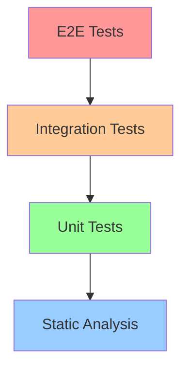

# 07 - MCPサーバーのテスト

## 📖 概要

MCPサーバーの開発において、テストは品質保証と信頼性確保のための重要な要素です。この章では、包括的なテスト戦略、テストツールの使用方法、そして効果的なテスト手法について学習します。

## 🎯 学習目標

この章を完了すると、以下のことができるようになります：

- MCPサーバーのテスト戦略を立案できる
- 単体テスト（Unit Test）を実装できる
- 統合テスト（Integration Test）を作成できる
- エンドツーエンドテスト（E2E Test）を設計できる
- パフォーマンステストを実行できる
- CI/CDパイプラインでテストを自動化できる

## 🧪 テスト戦略の概要

### テストピラミッド



| テストレベル | 目的 | 実行速度 | 作成コスト | 保守コスト |
|-------------|------|----------|-----------|-----------|
| Unit Tests | 個別機能の検証 | 高速 | 低 | 低 |
| Integration Tests | コンポーネント間の連携 | 中速 | 中 | 中 |
| E2E Tests | エンドユーザー体験 | 低速 | 高 | 高 |
| Performance Tests | 性能要件の検証 | 低速 | 高 | 中 |

## 🔧 テスト環境の設定

### 1. Node.js/TypeScript環境

```bash
# テスト関連パッケージのインストール
npm install --save-dev jest @types/jest ts-jest
npm install --save-dev supertest @types/supertest
npm install --save-dev @testing-library/jest-dom

# テスト設定ファイル
npx ts-jest config:init
```

### 2. Python環境

```bash
# テスト関連パッケージのインストール
pip install pytest pytest-asyncio pytest-cov
pip install httpx pytest-httpx
pip install factory-boy faker
```

### 3. 設定ファイル

**jest.config.js** (Node.js):
```javascript
module.exports = {
  preset: 'ts-jest',
  testEnvironment: 'node',
  roots: ['<rootDir>/src', '<rootDir>/tests'],
  testMatch: [
    '**/__tests__/**/*.ts',
    '**/*.(test|spec).ts'
  ],
  collectCoverageFrom: [
    'src/**/*.ts',
    '!src/**/*.d.ts',
  ],
  coverageDirectory: 'coverage',
  coverageReporters: ['text', 'lcov', 'html'],
  setupFilesAfterEnv: ['<rootDir>/tests/setup.ts']
};
```

**pytest.ini** (Python):
```ini
[tool:pytest]
testpaths = tests
python_files = test_*.py *_test.py
python_classes = Test*
python_functions = test_*
addopts = 
    --cov=src
    --cov-report=html
    --cov-report=term-missing
    --asyncio-mode=auto
```

## 🔍 単体テスト（Unit Tests）

### MCPツールのテスト

```typescript
// src/tools/calculator.ts
export class Calculator {
  add(a: number, b: number): number {
    return a + b;
  }
  
  divide(a: number, b: number): number {
    if (b === 0) {
      throw new Error('Division by zero');
    }
    return a / b;
  }
}

// tests/tools/calculator.test.ts
import { Calculator } from '../../src/tools/calculator';

describe('Calculator', () => {
  let calculator: Calculator;
  
  beforeEach(() => {
    calculator = new Calculator();
  });
  
  describe('add', () => {
    it('should add two positive numbers', () => {
      expect(calculator.add(2, 3)).toBe(5);
    });
    
    it('should handle negative numbers', () => {
      expect(calculator.add(-2, 3)).toBe(1);
    });
  });
  
  describe('divide', () => {
    it('should divide two numbers', () => {
      expect(calculator.divide(10, 2)).toBe(5);
    });
    
    it('should throw error when dividing by zero', () => {
      expect(() => calculator.divide(10, 0))
        .toThrow('Division by zero');
    });
  });
});
```

### Python での単体テスト

```python
# src/tools/text_processor.py
class TextProcessor:
    def word_count(self, text: str) -> int:
        if not text:
            return 0
        return len(text.split())
    
    def reverse_text(self, text: str) -> str:
        return text[::-1]

# tests/tools/test_text_processor.py
import pytest
from src.tools.text_processor import TextProcessor

class TestTextProcessor:
    def setup_method(self):
        self.processor = TextProcessor()
    
    def test_word_count_empty_string(self):
        assert self.processor.word_count("") == 0
    
    def test_word_count_single_word(self):
        assert self.processor.word_count("hello") == 1
    
    def test_word_count_multiple_words(self):
        assert self.processor.word_count("hello world test") == 3
    
    def test_reverse_text(self):
        assert self.processor.reverse_text("hello") == "olleh"
```

## 🔗 統合テスト（Integration Tests）

### MCPサーバーとの統合テスト

```typescript
// tests/integration/mcp-server.test.ts
import { Server } from '@modelcontextprotocol/sdk/server/index.js';
import { TestTransport } from './test-transport';

describe('MCP Server Integration', () => {
  let server: Server;
  let transport: TestTransport;
  
  beforeEach(async () => {
    server = new Server({
      name: "test-server",
      version: "1.0.0"
    }, {
      capabilities: {
        tools: {},
        resources: {}
      }
    });
    
    transport = new TestTransport();
    await server.connect(transport);
  });
  
  afterEach(async () => {
    await transport.close();
  });
  
  it('should list available tools', async () => {
    const response = await transport.sendRequest({
      jsonrpc: "2.0",
      id: 1,
      method: "tools/list"
    });
    
    expect(response.result).toHaveProperty('tools');
    expect(Array.isArray(response.result.tools)).toBe(true);
  });
  
  it('should call calculator tool', async () => {
    const response = await transport.sendRequest({
      jsonrpc: "2.0",
      id: 2,
      method: "tools/call",
      params: {
        name: "calculator",
        arguments: {
          operation: "add",
          a: 5,
          b: 3
        }
      }
    });
    
    expect(response.result.content[0].text).toContain('8');
  });
});
```

### データベース統合テスト

```python
# tests/integration/test_database_integration.py
import pytest
import asyncio
from src.server import MCPServer
from src.database import Database

@pytest.fixture
async def test_db():
    db = Database(":memory:")  # SQLite in-memory database
    await db.initialize()
    yield db
    await db.close()

@pytest.fixture
async def mcp_server(test_db):
    server = MCPServer(database=test_db)
    await server.start()
    yield server
    await server.stop()

class TestDatabaseIntegration:
    @pytest.mark.asyncio
    async def test_create_and_retrieve_record(self, mcp_server):
        # レコード作成
        create_response = await mcp_server.call_tool(
            "create_record",
            {"name": "Test User", "email": "test@example.com"}
        )
        
        assert create_response["success"] is True
        record_id = create_response["id"]
        
        # レコード取得
        get_response = await mcp_server.call_tool(
            "get_record",
            {"id": record_id}
        )
        
        assert get_response["name"] == "Test User"
        assert get_response["email"] == "test@example.com"
```

## 🌐 エンドツーエンドテスト（E2E Tests）

### Playwright を使用したE2Eテスト

```typescript
// tests/e2e/mcp-workflow.test.ts
import { test, expect } from '@playwright/test';

test.describe('MCP Workflow E2E', () => {
  test('complete user workflow', async ({ page }) => {
    // MCPクライアントアプリケーションにアクセス
    await page.goto('http://localhost:3000');
    
    // サーバー接続テスト
    await page.click('[data-testid="connect-server"]');
    await expect(page.locator('.connection-status'))
      .toHaveText('Connected');
    
    // ツール一覧の取得
    await page.click('[data-testid="list-tools"]');
    await expect(page.locator('.tools-list'))
      .toContainText('calculator');
    
    // ツールの実行
    await page.fill('[data-testid="tool-input"]', '{"a": 10, "b": 5}');
    await page.click('[data-testid="execute-tool"]');
    
    // 結果の確認
    await expect(page.locator('.tool-result'))
      .toContainText('15');
  });
});
```

### コマンドライン統合テスト

```bash
#!/bin/bash
# tests/e2e/cli-workflow.sh

set -e

echo "Starting E2E CLI Tests..."

# サーバーを背景で起動
node dist/server/index.js &
SERVER_PID=$!

# サーバーの起動を待機
sleep 2

# テストシナリオ1: ツール一覧の取得
echo "Testing tools/list..."
RESULT=$(echo '{"jsonrpc":"2.0","id":1,"method":"tools/list"}' | node dist/client/test-client.js)
echo $RESULT | grep -q "calculator" || exit 1

# テストシナリオ2: ツールの実行
echo "Testing tools/call..."
RESULT=$(echo '{"jsonrpc":"2.0","id":2,"method":"tools/call","params":{"name":"calculator","arguments":{"a":5,"b":3}}}' | node dist/client/test-client.js)
echo $RESULT | grep -q "8" || exit 1

# クリーンアップ
kill $SERVER_PID

echo "All E2E tests passed!"
```

## ⚡ パフォーマンステスト

### 負荷テスト

```typescript
// tests/performance/load-test.ts
import { performance } from 'perf_hooks';

describe('MCP Server Performance', () => {
  it('should handle concurrent requests', async () => {
    const concurrentRequests = 100;
    const startTime = performance.now();
    
    const promises = Array.from({ length: concurrentRequests }, (_, i) => 
      transport.sendRequest({
        jsonrpc: "2.0",
        id: i,
        method: "tools/call",
        params: {
          name: "calculator",
          arguments: { a: i, b: i + 1 }
        }
      })
    );
    
    const results = await Promise.all(promises);
    const endTime = performance.now();
    
    const duration = endTime - startTime;
    const averageResponseTime = duration / concurrentRequests;
    
    expect(results).toHaveLength(concurrentRequests);
    expect(averageResponseTime).toBeLessThan(100); // 100ms以下
    
    console.log(`Average response time: ${averageResponseTime}ms`);
  });
});
```

### メモリ使用量テスト

```python
# tests/performance/memory_test.py
import psutil
import asyncio
import pytest
from src.server import MCPServer

class TestMemoryUsage:
    @pytest.mark.asyncio
    async def test_memory_leak_detection(self):
        server = MCPServer()
        process = psutil.Process()
        
        # 初期メモリ使用量
        initial_memory = process.memory_info().rss / 1024 / 1024  # MB
        
        # 大量のリクエスト処理
        for i in range(1000):
            await server.call_tool("calculator", {"a": i, "b": i + 1})
            
            # 定期的にガベージコレクション
            if i % 100 == 0:
                import gc
                gc.collect()
        
        # 最終メモリ使用量
        final_memory = process.memory_info().rss / 1024 / 1024  # MB
        memory_increase = final_memory - initial_memory
        
        # メモリ増加量が許容範囲内かチェック
        assert memory_increase < 50, f"Memory increased by {memory_increase}MB"
```

## 🚀 CI/CDでのテスト自動化

### GitHub Actions設定

```yaml
# .github/workflows/test.yml
name: Test Suite

on:
  push:
    branches: [ main, develop ]
  pull_request:
    branches: [ main ]

jobs:
  test:
    runs-on: ubuntu-latest
    
    strategy:
      matrix:
        node-version: [18, 20]
        python-version: [3.8, 3.9, '3.10']
    
    steps:
    - uses: actions/checkout@v3
    
    - name: Setup Node.js
      uses: actions/setup-node@v3
      with:
        node-version: ${{ matrix.node-version }}
        cache: 'npm'
    
    - name: Setup Python
      uses: actions/setup-python@v4
      with:
        python-version: ${{ matrix.python-version }}
    
    - name: Install dependencies
      run: |
        npm ci
        pip install -r requirements.txt
    
    - name: Run linting
      run: |
        npm run lint
        flake8 src tests
    
    - name: Run unit tests
      run: |
        npm test
        pytest tests/unit
    
    - name: Run integration tests
      run: |
        npm run test:integration
        pytest tests/integration
    
    - name: Run E2E tests
      run: |
        npm run test:e2e
    
    - name: Upload coverage
      uses: codecov/codecov-action@v3
```

### テストレポート設定

```json
{
  "scripts": {
    "test": "jest",
    "test:watch": "jest --watch",
    "test:coverage": "jest --coverage",
    "test:integration": "jest --testPathPattern=integration",
    "test:e2e": "playwright test",
    "test:performance": "jest --testPathPattern=performance",
    "test:all": "npm run test && npm run test:integration && npm run test:e2e"
  }
}
```

## 🔧 テストユーティリティ

### モックとスタブ

```typescript
// tests/utils/mocks.ts
export class MockTransport {
  private responses: Map<string, any> = new Map();
  
  setResponse(method: string, response: any): void {
    this.responses.set(method, response);
  }
  
  async sendRequest(request: any): Promise<any> {
    const response = this.responses.get(request.method);
    if (!response) {
      throw new Error(`No mock response for ${request.method}`);
    }
    return { ...response, id: request.id };
  }
}

// テストでの使用例
describe('MCP Client', () => {
  it('should handle server responses', async () => {
    const mockTransport = new MockTransport();
    mockTransport.setResponse('tools/list', {
      result: { tools: [{ name: 'calculator' }] }
    });
    
    const client = new MCPClient(mockTransport);
    const tools = await client.listTools();
    
    expect(tools).toHaveLength(1);
    expect(tools[0].name).toBe('calculator');
  });
});
```

### テストデータファクトリ

```python
# tests/utils/factories.py
import factory
from src.models import User, Task

class UserFactory(factory.Factory):
    class Meta:
        model = User
    
    name = factory.Faker('name')
    email = factory.Faker('email')
    created_at = factory.Faker('date_time')

class TaskFactory(factory.Factory):
    class Meta:
        model = Task
    
    title = factory.Faker('sentence', nb_words=4)
    description = factory.Faker('text')
    user = factory.SubFactory(UserFactory)
    completed = False

# 使用例
def test_task_creation():
    user = UserFactory()
    task = TaskFactory(user=user)
    
    assert task.user.name == user.name
    assert task.completed is False
```

## 📊 テストメトリクス

### カバレッジ目標

```javascript
// jest.config.js でカバレッジ閾値設定
module.exports = {
  // ... 他の設定
  coverageThreshold: {
    global: {
      branches: 80,
      functions: 80,
      lines: 80,
      statements: 80
    },
    './src/core/': {
      branches: 90,
      functions: 90,
      lines: 90,
      statements: 90
    }
  }
};
```

### テスト実行時間監視

```typescript
// tests/utils/performance-monitor.ts
export class TestPerformanceMonitor {
  private testTimes: Map<string, number> = new Map();
  
  startTest(testName: string): void {
    this.testTimes.set(testName, Date.now());
  }
  
  endTest(testName: string): number {
    const startTime = this.testTimes.get(testName);
    if (!startTime) return 0;
    
    const duration = Date.now() - startTime;
    console.log(`Test "${testName}" took ${duration}ms`);
    
    return duration;
  }
}

// 使用例
describe('Performance Tests', () => {
  const monitor = new TestPerformanceMonitor();
  
  beforeEach(() => {
    monitor.startTest(expect.getState().currentTestName);
  });
  
  afterEach(() => {
    monitor.endTest(expect.getState().currentTestName);
  });
});
```

## ✅ テストのベストプラクティス

### 1. テスト命名規則

```typescript
describe('CalculatorTool', () => {
  describe('add method', () => {
    it('should return sum when given two positive numbers', () => {
      // 条件 + 期待結果の明確な記述
    });
    
    it('should throw error when given invalid input', () => {
      // エラーケースも明確に記述
    });
  });
});
```

### 2. テストの独立性

```typescript
describe('Database Tests', () => {
  beforeEach(async () => {
    // 各テスト前に新しい状態を準備
    await database.reset();
    await database.seed();
  });
  
  afterEach(async () => {
    // テスト後のクリーンアップ
    await database.cleanup();
  });
});
```

### 3. テストデータの管理

```typescript
// tests/fixtures/test-data.ts
export const TEST_USERS = [
  { id: 1, name: 'Alice', email: 'alice@example.com' },
  { id: 2, name: 'Bob', email: 'bob@example.com' }
];

export const TEST_TASKS = [
  { id: 1, title: 'Test Task', userId: 1 },
  { id: 2, title: 'Another Task', userId: 2 }
];
```

## 🎉 まとめ

この章では、MCPサーバーの包括的なテスト戦略について学習しました：

- **テスト戦略**: ピラミッド型アプローチで効率的なテスト設計
- **単体テスト**: 個別機能の詳細な検証
- **統合テスト**: コンポーネント間の連携確認
- **E2Eテスト**: エンドユーザー体験の保証
- **パフォーマンステスト**: 性能要件の検証
- **CI/CD統合**: 自動化されたテストパイプライン

### 次のステップ

**[08-deployment](../08-deployment/)** に進んで、本番環境へのデプロイメント戦略を学びましょう。

## 📚 参考資料

- [Jest Documentation](https://jestjs.io/docs/getting-started)
- [Playwright Testing](https://playwright.dev/docs/intro)
- [pytest Documentation](https://docs.pytest.org/)
- [Testing Best Practices](https://github.com/goldbergyoni/javascript-testing-best-practices)
- [CI/CD Best Practices](https://docs.github.com/en/actions/learn-github-actions)

---

*テストは品質の守護者です。包括的なテスト戦略により、安全で信頼性の高いMCPサーバーを構築できます。*