# サーバーデプロイ - Deploy your server

> ローカル開発から本番環境へのMCPサーバーデプロイメント完全ガイド

## 📋 概要

開発したMCPサーバーを本番環境にデプロイするための包括的なガイドです。様々なプラットフォームでのデプロイ手法、セキュリティ考慮事項、監視・運用について学習します。

## 🎯 学習目標

- 各種クラウドプラットフォームへのデプロイ手法を習得する
- コンテナ化とオーケストレーションの基本を理解する
- 本番環境でのセキュリティ設定を学ぶ
- 監視・ログ・パフォーマンス管理の実装方法を身につける
- CI/CDパイプラインによる自動デプロイを構築する

## 🚀 デプロイメント戦略

### 1. デプロイメントオプション

```mermaid
graph TD
    A[MCPサーバー] --> B[クラウドVPS]
    A --> C[コンテナプラットフォーム]
    A --> D[サーバーレス]
    A --> E[オンプレミス]
    
    B --> B1[AWS EC2]
    B --> B2[Azure VM]
    B --> B3[GCP Compute]
    
    C --> C1[Docker]
    C --> C2[Kubernetes]
    C --> C3[Container Apps]
    
    D --> D1[AWS Lambda]
    D --> D2[Vercel]
    D --> D3[Azure Functions]
    
    style A fill:#4ecdc4
    style B fill:#45b7d1
    style C fill:#96ceb4
    style D fill:#feca57
```



## 🐳 コンテナ化 (Docker)

### 1. Dockerfile の作成

```dockerfile
# Dockerfile
# マルチステージビルドを使用して最適化
FROM node:18-alpine AS builder

WORKDIR /app

# パッケージファイルをコピー
COPY package*.json ./
COPY tsconfig.json ./

# 依存関係のインストール
RUN npm ci --only=production && npm cache clean --force

# ソースコードをコピー
COPY src/ ./src/

# TypeScriptをコンパイル
RUN npm run build

# 本番用の軽量イメージ
FROM node:18-alpine AS production

# セキュリティのため非rootユーザーを作成
RUN addgroup -g 1001 -S nodejs
RUN adduser -S nextjs -u 1001

WORKDIR /app

# 本番依存関係のみをコピー
COPY --from=builder /app/node_modules ./node_modules
COPY --from=builder /app/dist ./dist
COPY --from=builder /app/package*.json ./

# ユーザーを変更
USER nextjs

# ポートを公開
EXPOSE 8080

# ヘルスチェック
HEALTHCHECK --interval=30s --timeout=3s --start-period=5s --retries=3 \
    CMD node -e "require('http').get('http://localhost:8080/health', (res) => { process.exit(res.statusCode === 200 ? 0 : 1) })"

# アプリケーション起動
CMD ["node", "dist/server.js"]
```

### 2. .dockerignore の設定

```dockerignore
# .dockerignore
node_modules
npm-debug.log
Dockerfile
.dockerignore
.git
.gitignore
README.md
.env
.nyc_output
coverage
.vscode
.idea
*.log
```

### 3. Docker Compose による開発環境

```yaml
# docker-compose.yml
version: '3.8'

services:
  mcp-server:
    build: .
    ports:
      - "8080:8080"
    environment:
      - NODE_ENV=production
      - PORT=8080
    volumes:
      - ./config:/app/config:ro
    restart: unless-stopped
    healthcheck:
      test: ["CMD", "curl", "-f", "http://localhost:8080/health"]
      interval: 30s
      timeout: 10s
      retries: 3

  # Redis (セッションストア用)
  redis:
    image: redis:7-alpine
    ports:
      - "6379:6379"
    volumes:
      - redis_data:/data
    restart: unless-stopped

  # Nginx (リバースプロキシ)
  nginx:
    image: nginx:alpine
    ports:
      - "80:80"
      - "443:443"
    volumes:
      - ./nginx.conf:/etc/nginx/nginx.conf:ro
      - ./ssl:/etc/nginx/ssl:ro
    depends_on:
      - mcp-server
    restart: unless-stopped

volumes:
  redis_data:
```

## ☁️ クラウドプラットフォームへのデプロイ

### 1. Azure Container Apps

```yaml
# azure-containerapp.yml
apiVersion: 2022-03-01
location: japaneast
name: mcp-server-app
properties:
  managedEnvironmentId: /subscriptions/{subscription-id}/resourceGroups/{rg}/providers/Microsoft.App/managedEnvironments/{env}
  configuration:
    activeRevisionsMode: single
    ingress:
      external: true
      targetPort: 8080
      transport: http
      allowInsecure: false
    secrets:
      - name: openai-api-key
        value: "{your-api-key}"
  template:
    containers:
      - name: mcp-server
        image: {your-registry}/mcp-server:latest
        env:
          - name: NODE_ENV
            value: production
          - name: OPENAI_API_KEY
            secretRef: openai-api-key
        resources:
          cpu: 0.5
          memory: 1Gi
    scale:
      minReplicas: 1
      maxReplicas: 10
```

### 2. AWS ECS Fargate

```json
{
  "family": "mcp-server",
  "networkMode": "awsvpc",
  "requiresCompatibilities": ["FARGATE"],
  "cpu": "512",
  "memory": "1024",
  "executionRoleArn": "arn:aws:iam::{account}:role/ecsTaskExecutionRole",
  "taskRoleArn": "arn:aws:iam::{account}:role/ecsTaskRole",
  "containerDefinitions": [
    {
      "name": "mcp-server",
      "image": "{account}.dkr.ecr.{region}.amazonaws.com/mcp-server:latest",
      "portMappings": [
        {
          "containerPort": 8080,
          "protocol": "tcp"
        }
      ],
      "environment": [
        {
          "name": "NODE_ENV",
          "value": "production"
        }
      ],
      "secrets": [
        {
          "name": "OPENAI_API_KEY",
          "valueFrom": "arn:aws:secretsmanager:{region}:{account}:secret:mcp-server/api-keys"
        }
      ],
      "logConfiguration": {
        "logDriver": "awslogs",
        "options": {
          "awslogs-group": "/ecs/mcp-server",
          "awslogs-region": "{region}",
          "awslogs-stream-prefix": "ecs"
        }
      },
      "healthCheck": {
        "command": ["CMD-SHELL", "curl -f http://localhost:8080/health || exit 1"],
        "interval": 30,
        "timeout": 5,
        "retries": 3
      }
    }
  ]
}
```

### 3. Google Cloud Run

```yaml
# cloudrun.yml
apiVersion: serving.knative.dev/v1
kind: Service
metadata:
  name: mcp-server
  annotations:
    run.googleapis.com/ingress: all
spec:
  template:
    metadata:
      annotations:
        autoscaling.knative.dev/maxScale: "10"
        autoscaling.knative.dev/minScale: "1"
        run.googleapis.com/cpu-throttling: "false"
    spec:
      containerConcurrency: 100
      timeoutSeconds: 300
      containers:
      - image: gcr.io/{project-id}/mcp-server:latest
        ports:
        - containerPort: 8080
        env:
        - name: NODE_ENV
          value: production
        - name: OPENAI_API_KEY
          valueFrom:
            secretKeyRef:
              name: api-keys
              key: openai-api-key
        resources:
          limits:
            cpu: 1000m
            memory: 512Mi
        livenessProbe:
          httpGet:
            path: /health
            port: 8080
          initialDelaySeconds: 30
          periodSeconds: 30
```

## 🏗️ Kubernetes デプロイメント

### 1. Kubernetes マニフェスト

```yaml
# k8s/deployment.yml
apiVersion: apps/v1
kind: Deployment
metadata:
  name: mcp-server
  labels:
    app: mcp-server
spec:
  replicas: 3
  selector:
    matchLabels:
      app: mcp-server
  template:
    metadata:
      labels:
        app: mcp-server
    spec:
      containers:
      - name: mcp-server
        image: mcp-server:latest
        ports:
        - containerPort: 8080
        env:
        - name: NODE_ENV
          value: production
        - name: REDIS_URL
          value: redis://redis-service:6379
        envFrom:
        - secretRef:
            name: mcp-server-secrets
        resources:
          requests:
            memory: "256Mi"
            cpu: "250m"
          limits:
            memory: "512Mi"
            cpu: "500m"
        livenessProbe:
          httpGet:
            path: /health
            port: 8080
          initialDelaySeconds: 30
          periodSeconds: 30
        readinessProbe:
          httpGet:
            path: /ready
            port: 8080
          initialDelaySeconds: 5
          periodSeconds: 10

---
apiVersion: v1
kind: Service
metadata:
  name: mcp-server-service
spec:
  selector:
    app: mcp-server
  ports:
  - protocol: TCP
    port: 80
    targetPort: 8080
  type: ClusterIP

---
apiVersion: networking.k8s.io/v1
kind: Ingress
metadata:
  name: mcp-server-ingress
  annotations:
    nginx.ingress.kubernetes.io/rewrite-target: /
    cert-manager.io/cluster-issuer: letsencrypt-prod
spec:
  tls:
  - hosts:
    - mcp-server.yourdomain.com
    secretName: mcp-server-tls
  rules:
  - host: mcp-server.yourdomain.com
    http:
      paths:
      - path: /
        pathType: Prefix
        backend:
          service:
            name: mcp-server-service
            port:
              number: 80
```

### 2. ConfigMap と Secret

```yaml
# k8s/configmap.yml
apiVersion: v1
kind: ConfigMap
metadata:
  name: mcp-server-config
data:
  NODE_ENV: production
  PORT: "8080"
  LOG_LEVEL: info

---
apiVersion: v1
kind: Secret
metadata:
  name: mcp-server-secrets
type: Opaque
data:
  OPENAI_API_KEY: {base64-encoded-api-key}
  DATABASE_URL: {base64-encoded-db-url}
```

## 🔧 CI/CDパイプライン

### 1. GitHub Actions による自動デプロイ

```yaml
# .github/workflows/deploy.yml
name: Deploy to Production

on:
  push:
    branches: [main]
  release:
    types: [published]

env:
  REGISTRY: ghcr.io
  IMAGE_NAME: ${{ github.repository }}

jobs:
  build-and-push:
    runs-on: ubuntu-latest
    permissions:
      contents: read
      packages: write

    steps:
    - name: Checkout
      uses: actions/checkout@v3

    - name: Container Registryへのログイン
      uses: docker/login-action@v2
      with:
        registry: ${{ env.REGISTRY }}
        username: ${{ github.actor }}
        password: ${{ secrets.GITHUB_TOKEN }}

    - name: メタデータの抽出
      id: meta
      uses: docker/metadata-action@v4
      with:
        images: ${{ env.REGISTRY }}/${{ env.IMAGE_NAME }}
        tags: |
          type=ref,event=branch
          type=ref,event=pr
          type=sha,prefix={{branch}}-
          type=raw,value=latest,enable={{is_default_branch}}

    - name: イメージのビルドとプッシュ
      uses: docker/build-push-action@v4
      with:
        context: .
        push: true
        tags: ${{ steps.meta.outputs.tags }}
        labels: ${{ steps.meta.outputs.labels }}

  deploy:
    needs: build-and-push
    runs-on: ubuntu-latest
    environment: production

    steps:
    - name: Azure Container Appsへのデプロイ
      uses: azure/container-apps-deploy-action@v1
      with:
        resource-group: ${{ secrets.AZURE_RG }}
        container-app-name: mcp-server
        container-image: ${{ env.REGISTRY }}/${{ env.IMAGE_NAME }}:${{ github.sha }}
        azure-credentials: ${{ secrets.AZURE_CREDENTIALS }}

    - name: デプロイ通知
      uses: 8398a7/action-slack@v3
      with:
        status: ${{ job.status }}
        text: "MCP Server deployed to production"
      env:
        SLACK_WEBHOOK_URL: ${{ secrets.SLACK_WEBHOOK }}
```

## 🔒 セキュリティ設定

### 1. 環境変数とシークレット管理

```typescript
// src/config/environment.ts
import { z } from 'zod';

const envSchema = z.object({
  NODE_ENV: z.enum(['development', 'test', 'production']).default('development'),
  PORT: z.coerce.number().default(8080),
  
  // API Keys
  OPENAI_API_KEY: z.string().min(1, 'OpenAI API key is required'),
  
  // Database
  DATABASE_URL: z.string().url().optional(),
  REDIS_URL: z.string().url().optional(),
  
  // Security
  JWT_SECRET: z.string().min(32, 'JWT secret must be at least 32 characters'),
  CORS_ORIGIN: z.string().default('*'),
  
  // Monitoring
  SENTRY_DSN: z.string().url().optional(),
  LOG_LEVEL: z.enum(['error', 'warn', 'info', 'debug']).default('info'),
});

export const env = envSchema.parse(process.env);

// 本番環境での追加検証
if (env.NODE_ENV === 'production') {
  if (!env.OPENAI_API_KEY) {
    throw new Error('OpenAI API key is required in production');
  }
  
  if (env.CORS_ORIGIN === '*') {
    console.warn('Warning: CORS is set to allow all origins in production');
  }
}
```

### 2. HTTPS/TLS設定

```nginx
# nginx.conf
upstream mcp_server {
    server mcp-server:8080;
}

server {
    listen 80;
    server_name mcp-server.yourdomain.com;
    return 301 https://$server_name$request_uri;
}

server {
    listen 443 ssl http2;
    server_name mcp-server.yourdomain.com;

    ssl_certificate /etc/nginx/ssl/cert.pem;
    ssl_certificate_key /etc/nginx/ssl/key.pem;
    
    ssl_protocols TLSv1.2 TLSv1.3;
    ssl_ciphers HIGH:!aNULL:!MD5;
    ssl_prefer_server_ciphers on;
    
    # セキュリティヘッダー
    add_header Strict-Transport-Security "max-age=31536000; includeSubDomains" always;
    add_header X-Frame-Options DENY always;
    add_header X-Content-Type-Options nosniff always;
    add_header X-XSS-Protection "1; mode=block" always;
    add_header Referrer-Policy "strict-origin-when-cross-origin" always;

    location / {
        proxy_pass http://mcp_server;
        proxy_set_header Host $host;
        proxy_set_header X-Real-IP $remote_addr;
        proxy_set_header X-Forwarded-For $proxy_add_x_forwarded_for;
        proxy_set_header X-Forwarded-Proto $scheme;
        
        # WebSocket サポート
        proxy_http_version 1.1;
        proxy_set_header Upgrade $http_upgrade;
        proxy_set_header Connection "upgrade";
    }
}
```

## 📊 監視とログ

### 1. ヘルスチェック実装

```typescript
// src/routes/health.ts
import express from 'express';
import { promisify } from 'util';
import redis from 'redis';

const router = express.Router();

interface HealthStatus {
  status: 'healthy' | 'unhealthy';
  timestamp: string;
  version: string;
  uptime: number;
  services: {
    [key: string]: 'up' | 'down';
  };
}

router.get('/health', async (req, res) => {
  const healthStatus: HealthStatus = {
    status: 'healthy',
    timestamp: new Date().toISOString(),
    version: process.env.npm_package_version || '1.0.0',
    uptime: process.uptime(),
    services: {}
  };

  try {
    // Redis接続チェック
    if (process.env.REDIS_URL) {
      const client = redis.createClient({ url: process.env.REDIS_URL });
      await client.ping();
      healthStatus.services.redis = 'up';
      await client.quit();
    }

    // データベース接続チェック
    if (process.env.DATABASE_URL) {
      // データベース接続テスト
      healthStatus.services.database = 'up';
    }

    // 外部API接続チェック
    const openaiResponse = await fetch('https://api.openai.com/v1/models', {
      headers: {
        'Authorization': `Bearer ${process.env.OPENAI_API_KEY}`
      }
    });
    healthStatus.services.openai = openaiResponse.ok ? 'up' : 'down';

  } catch (error) {
    healthStatus.status = 'unhealthy';
    console.error('Health check failed:', error);
  }

  const statusCode = healthStatus.status === 'healthy' ? 200 : 503;
  res.status(statusCode).json(healthStatus);
});

router.get('/ready', (req, res) => {
  // アプリケーションの準備状態をチェック
  res.json({ status: 'ready', timestamp: new Date().toISOString() });
});

export default router;
```

### 2. 構造化ログ

```typescript
// src/utils/logger.ts
import winston from 'winston';
import { env } from '../config/environment';

const logger = winston.createLogger({
  level: env.LOG_LEVEL,
  format: winston.format.combine(
    winston.format.timestamp(),
    winston.format.errors({ stack: true }),
    env.NODE_ENV === 'production'
      ? winston.format.json()
      : winston.format.combine(
          winston.format.colorize(),
          winston.format.simple()
        )
  ),
  defaultMeta: {
    service: 'mcp-server',
    version: process.env.npm_package_version
  },
  transports: [
    new winston.transports.Console(),
    ...(env.NODE_ENV === 'production' ? [
      new winston.transports.File({ 
        filename: 'error.log', 
        level: 'error' 
      }),
      new winston.transports.File({ 
        filename: 'combined.log' 
      })
    ] : [])
  ]
});

export default logger;
```

### 3. メトリクス収集

```typescript
// src/middleware/metrics.ts
import prometheus from 'prom-client';
import express from 'express';

// カスタムメトリクス
const httpRequestDuration = new prometheus.Histogram({
  name: 'http_request_duration_seconds',
  help: 'Duration of HTTP requests in seconds',
  labelNames: ['method', 'route', 'status_code']
});

const mcpToolCalls = new prometheus.Counter({
  name: 'mcp_tool_calls_total',
  help: 'Total number of MCP tool calls',
  labelNames: ['tool_name', 'status']
});

export const metricsMiddleware = (req: express.Request, res: express.Response, next: express.NextFunction) => {
  const startTime = Date.now();

  res.on('finish', () => {
    const duration = (Date.now() - startTime) / 1000;
    httpRequestDuration
      .labels(req.method, req.route?.path || req.path, res.statusCode.toString())
      .observe(duration);
  });

  next();
};

export const recordToolCall = (toolName: string, success: boolean) => {
  mcpToolCalls.labels(toolName, success ? 'success' : 'error').inc();
};

// メトリクスエンドポイント
export const metricsRouter = express.Router();
metricsRouter.get('/metrics', async (req, res) => {
  res.set('Content-Type', prometheus.register.contentType);
  res.end(await prometheus.register.metrics());
});
```

## 🔄 スケーリングと最適化

### 1. 水平スケーリング設定

```yaml
# k8s/hpa.yml
apiVersion: autoscaling/v2
kind: HorizontalPodAutoscaler
metadata:
  name: mcp-server-hpa
spec:
  scaleTargetRef:
    apiVersion: apps/v1
    kind: Deployment
    name: mcp-server
  minReplicas: 2
  maxReplicas: 20
  metrics:
  - type: Resource
    resource:
      name: cpu
      target:
        type: Utilization
        averageUtilization: 70
  - type: Resource
    resource:
      name: memory
      target:
        type: Utilization
        averageUtilization: 80
  behavior:
    scaleUp:
      stabilizationWindowSeconds: 60
      policies:
      - type: Percent
        value: 100
        periodSeconds: 15
    scaleDown:
      stabilizationWindowSeconds: 300
      policies:
      - type: Percent
        value: 10
        periodSeconds: 60
```

### 2. ロードバランシング

```typescript
// src/server.ts
import cluster from 'cluster';
import os from 'os';

const numCPUs = os.cpus().length;

if (cluster.isPrimary && process.env.NODE_ENV === 'production') {
  console.log(`Master ${process.pid} is running`);

  // CPUコア数に基づいてワーカーを起動
  for (let i = 0; i < numCPUs; i++) {
    cluster.fork();
  }

  cluster.on('exit', (worker, code, signal) => {
    console.log(`Worker ${worker.process.pid} died`);
    console.log('Starting a new worker');
    cluster.fork();
  });
} else {
  // ワーカープロセスではサーバーを起動
  startServer();
}
```

## 📈 パフォーマンス最適化

### 1. キャッシュ戦略

```typescript
// src/cache/redis.ts
import Redis from 'ioredis';
import { env } from '../config/environment';

const redis = new Redis(env.REDIS_URL);

export class CacheService {
  async get<T>(key: string): Promise<T | null> {
    const value = await redis.get(key);
    return value ? JSON.parse(value) : null;
  }

  async set(key: string, value: any, ttl: number = 3600): Promise<void> {
    await redis.setex(key, ttl, JSON.stringify(value));
  }

  async invalidate(pattern: string): Promise<void> {
    const keys = await redis.keys(pattern);
    if (keys.length > 0) {
      await redis.del(...keys);
    }
  }
}

export const cache = new CacheService();
```

### 2. 接続プーリング

```typescript
// src/database/pool.ts
import { Pool } from 'pg';
import { env } from '../config/environment';

export const pool = new Pool({
  connectionString: env.DATABASE_URL,
  max: 20, // 最大接続数
  idleTimeoutMillis: 30000,
  connectionTimeoutMillis: 2000,
});

// グレースフルシャットダウン
process.on('SIGINT', async () => {
  await pool.end();
  process.exit(0);
});
```

## 🎓 実習課題

### 課題1: Dockerコンテナ化
- 自分のMCPサーバーをDockerコンテナ化する
- マルチステージビルドを使用した最適化を実装する

### 課題2: Kubernetesデプロイメント
- Kubernetesクラスターへのデプロイメントを設定する
- HPA（水平ポッドオートスケーラー）を実装する

### 課題3: CI/CDパイプライン構築
- GitHub Actionsによる自動デプロイパイプラインを構築する
- セキュリティスキャンと品質ゲートを組み込む

## 📚 関連リソース

- [Docker公式ドキュメント](https://docs.docker.com/)
- [Kubernetes公式ドキュメント](https://kubernetes.io/ja/docs/)
- [Azure Container Apps](https://docs.microsoft.com/ja-jp/azure/container-apps/)
- [AWS ECS](https://docs.aws.amazon.com/ecs/)
- [Google Cloud Run](https://cloud.google.com/run/docs)

## 🔗 次のステップ

デプロイメントが完了したら、[04-PracticalImplementation](../../04-PracticalImplementation/README.md) で実装の実践的な側面について深く学習しましょう。

---

*正しいデプロイメント戦略により、MCPサーバーを安全かつ効率的に本番環境で運用できます。このガイドを参考に、スケーラブルで信頼性の高いシステムを構築してください。*