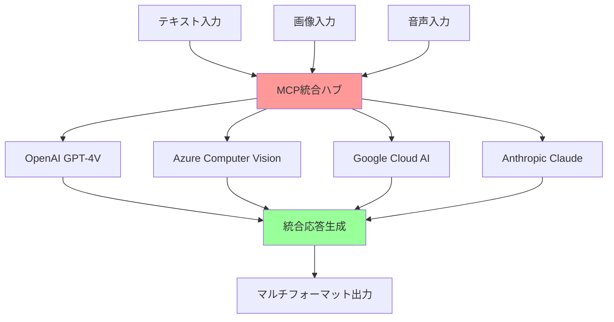
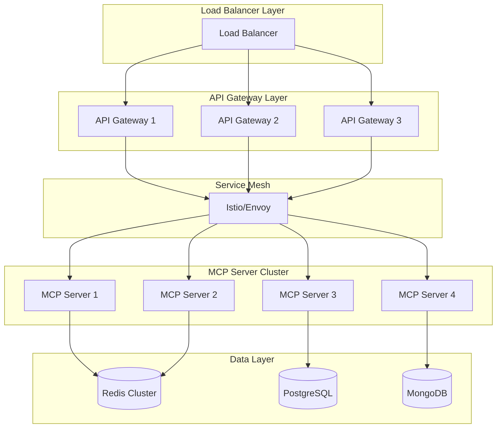

# 05 - 高度なトピック

## 📖 概要

この章では、MCPの高度な機能と応用について深く探究します。マルチモーダルAIワークフロー、大規模システムでのスケーリング戦略、エンタープライズ環境での統合パターンなど、実際のプロダクション環境で求められる高度な技術について学習します。

## 🎯 学習目標

この章を完了すると、以下のことができるようになります：

- マルチモーダルAIワークフローを設計・実装できる
- 大規模システムでのMCPスケーリング戦略を立案できる
- エンタープライズ環境でのセキュアな統合を実現できる
- パフォーマンス最適化とボトルネック解決ができる
- 分散システムでのMCP活用ができる
- カスタムプロトコル拡張を実装できる

## 🎨 マルチモーダルAIワークフロー

### 概要と基本概念



### マルチモーダル対応MCPサーバー

```typescript
// src/multimodal-server.ts
import { Server } from '@modelcontextprotocol/sdk/server/index.js';
import { CallToolRequestSchema } from '@modelcontextprotocol/sdk/types.js';
import OpenAI from 'openai';
import { createReadStream } from 'fs';
import sharp from 'sharp';
import ffmpeg from 'fluent-ffmpeg';

interface MultimodalInput {
  text?: string;
  images?: string[]; // Base64 encoded or file paths
  audio?: string[];  // File paths
  video?: string[];  // File paths
}

interface ProcessingConfig {
  maxImageSize: number;
  supportedImageFormats: string[];
  maxAudioDuration: number;
  supportedAudioFormats: string[];
}

export class MultimodalMCPServer {
  private server: Server;
  private openai: OpenAI;
  private config: ProcessingConfig;
  
  constructor(config: ProcessingConfig) {
    this.config = config;
    this.openai = new OpenAI({
      apiKey: process.env.OPENAI_API_KEY
    });
    
    this.server = new Server({
      name: "multimodal-mcp-server",
      version: "1.0.0"
    }, {
      capabilities: {
        tools: {}
      }
    });
    
    this.setupHandlers();
  }
  
  private setupHandlers(): void {
    // マルチモーダル分析ツール
    this.server.setRequestHandler(CallToolRequestSchema, async (request) => {
      const { name, arguments: args } = request.params;
      
      switch (name) {
        case "multimodal_analysis":
          return await this.handleMultimodalAnalysis(args);
        case "image_description":
          return await this.handleImageDescription(args);
        case "audio_transcription":
          return await this.handleAudioTranscription(args);
        case "video_analysis":
          return await this.handleVideoAnalysis(args);
        case "cross_modal_search":
          return await this.handleCrossModalSearch(args);
        default:
          throw new Error(`Unknown tool: ${name}`);
      }
    });
  }
  
  private async handleMultimodalAnalysis(args: any): Promise<any> {
    const input: MultimodalInput = args.input;
    const analysisType = args.analysisType || 'comprehensive';
    
    try {
      // 画像処理
      const processedImages = await this.processImages(input.images || []);
      
      // 音声処理
      const audioTranscripts = await this.processAudio(input.audio || []);
      
      // GPT-4V を使用した統合分析
      const analysis = await this.performIntegratedAnalysis({
        text: input.text,
        images: processedImages,
        audioTranscripts,
        analysisType
      });
      
      return {
        content: [
          {
            type: "text",
            text: JSON.stringify(analysis, null, 2)
          }
        ]
      };
    } catch (error) {
      throw new Error(`Multimodal analysis failed: ${error.message}`);
    }
  }
  
  private async processImages(imagePaths: string[]): Promise<Array<{url: string; description: string; metadata: any}>> {
    const results = [];
    
    for (const imagePath of imagePaths) {
      try {
        // 画像の最適化とリサイズ
        const optimizedBuffer = await sharp(imagePath)
          .resize(this.config.maxImageSize, this.config.maxImageSize, {
            fit: 'inside',
            withoutEnlargement: true
          })
          .jpeg({ quality: 85 })
          .toBuffer();
        
        // メタデータの抽出
        const metadata = await sharp(imagePath).metadata();
        
        // Base64エンコード
        const base64Image = optimizedBuffer.toString('base64');
        const dataUrl = `data:image/jpeg;base64,${base64Image}`;
        
        // GPT-4V による画像説明
        const description = await this.generateImageDescription(dataUrl);
        
        results.push({
          url: dataUrl,
          description,
          metadata: {
            width: metadata.width,
            height: metadata.height,
            format: metadata.format,
            size: metadata.size
          }
        });
      } catch (error) {
        console.error(`Error processing image ${imagePath}:`, error);
      }
    }
    
    return results;
  }
  
  private async generateImageDescription(imageUrl: string): Promise<string> {
    try {
      const response = await this.openai.chat.completions.create({
        model: "gpt-4-vision-preview",
        messages: [
          {
            role: "user",
            content: [
              {
                type: "text",
                text: "この画像を詳しく説明してください。オブジェクト、色、構図、雰囲気などを含めて分析してください。"
              },
              {
                type: "image_url",
                image_url: {
                  url: imageUrl
                }
              }
            ]
          }
        ],
        max_tokens: 500
      });
      
      return response.choices[0]?.message?.content || "画像の説明を生成できませんでした。";
    } catch (error) {
      return `画像説明の生成中にエラーが発生しました: ${error.message}`;
    }
  }
  
  private async processAudio(audioPaths: string[]): Promise<string[]> {
    const transcripts = [];
    
    for (const audioPath of audioPaths) {
      try {
        // 音声ファイルの変換（必要に応じて）
        const processedAudioPath = await this.convertAudioFormat(audioPath);
        
        // Whisper による音声認識
        const transcript = await this.transcribeAudio(processedAudioPath);
        transcripts.push(transcript);
      } catch (error) {
        console.error(`Error processing audio ${audioPath}:`, error);
        transcripts.push(`音声処理エラー: ${error.message}`);
      }
    }
    
    return transcripts;
  }
  
  private async convertAudioFormat(inputPath: string): Promise<string> {
    return new Promise((resolve, reject) => {
      const outputPath = `${inputPath}.mp3`;
      
      ffmpeg(inputPath)
        .toFormat('mp3')
        .audioBitrate(128)
        .audioChannels(1)
        .audioFrequency(16000)
        .save(outputPath)
        .on('end', () => resolve(outputPath))
        .on('error', reject);
    });
  }
  
  private async transcribeAudio(audioPath: string): Promise<string> {
    try {
      const audioStream = createReadStream(audioPath);
      
      const response = await this.openai.audio.transcriptions.create({
        file: audioStream,
        model: "whisper-1",
        language: "ja", // 日本語を指定
        response_format: "text"
      });
      
      return response;
    } catch (error) {
      throw new Error(`Audio transcription failed: ${error.message}`);
    }
  }
  
  private async performIntegratedAnalysis(data: {
    text?: string;
    images: Array<{url: string; description: string; metadata: any}>;
    audioTranscripts: string[];
    analysisType: string;
  }): Promise<any> {
    
    const prompt = this.buildIntegratedAnalysisPrompt(data);
    
    try {
      const response = await this.openai.chat.completions.create({
        model: "gpt-4-turbo-preview",
        messages: [
          {
            role: "system",
            content: "あなたはマルチモーダルデータの専門アナリストです。テキスト、画像、音声の情報を統合して包括的な分析を行ってください。"
          },
          {
            role: "user",
            content: prompt
          }
        ],
        max_tokens: 2000,
        temperature: 0.3
      });
      
      const analysisText = response.choices[0]?.message?.content || "";
      
      return {
        analysisType: data.analysisType,
        integratedAnalysis: analysisText,
        inputSummary: {
          textLength: data.text?.length || 0,
          imageCount: data.images.length,
          audioCount: data.audioTranscripts.length
        },
        confidence: this.calculateConfidenceScore(data),
        recommendations: this.generateRecommendations(data, analysisText)
      };
    } catch (error) {
      throw new Error(`Integrated analysis failed: ${error.message}`);
    }
  }
  
  private buildIntegratedAnalysisPrompt(data: any): string {
    let prompt = `以下のマルチモーダルデータを分析してください:\n\n`;
    
    if (data.text) {
      prompt += `**テキストデータ:**\n${data.text}\n\n`;
    }
    
    if (data.images.length > 0) {
      prompt += `**画像データ (${data.images.length}件):**\n`;
      data.images.forEach((img: any, index: number) => {
        prompt += `画像${index + 1}: ${img.description}\n`;
      });
      prompt += '\n';
    }
    
    if (data.audioTranscripts.length > 0) {
      prompt += `**音声データ (${data.audioTranscripts.length}件):**\n`;
      data.audioTranscripts.forEach((transcript: string, index: number) => {
        prompt += `音声${index + 1}: ${transcript}\n`;
      });
      prompt += '\n';
    }
    
    prompt += `分析タイプ: ${data.analysisType}\n\n`;
    prompt += `各モダリティの情報を統合し、以下の観点から分析してください：
1. 共通テーマや一貫性
2. 矛盾点や相違点
3. 情報の補完関係
4. 全体的な意味や意図
5. アクションアイテムや推奨事項`;
    
    return prompt;
  }
  
  private calculateConfidenceScore(data: any): number {
    let score = 0;
    let factors = 0;
    
    // テキストの存在と長さ
    if (data.text && data.text.length > 0) {
      score += Math.min(data.text.length / 1000, 1) * 0.3;
      factors += 0.3;
    }
    
    // 画像の品質と数
    if (data.images.length > 0) {
      const avgImageQuality = data.images.reduce((sum: number, img: any) => {
        return sum + (img.metadata.width * img.metadata.height) / 1000000;
      }, 0) / data.images.length;
      score += Math.min(avgImageQuality, 1) * 0.4;
      factors += 0.4;
    }
    
    // 音声の品質と数
    if (data.audioTranscripts.length > 0) {
      const avgTranscriptLength = data.audioTranscripts.reduce((sum: number, transcript: string) => {
        return sum + transcript.length;
      }, 0) / data.audioTranscripts.length;
      score += Math.min(avgTranscriptLength / 500, 1) * 0.3;
      factors += 0.3;
    }
    
    return factors > 0 ? score / factors : 0;
  }
  
  private generateRecommendations(data: any, analysisText: string): string[] {
    const recommendations = [];
    
    // データ品質に基づく推奨事項
    if (data.images.length === 0) {
      recommendations.push("視覚的な情報を追加することで、より包括的な分析が可能になります。");
    }
    
    if (data.audioTranscripts.length === 0) {
      recommendations.push("音声データを含めることで、感情や話者の意図をより詳しく分析できます。");
    }
    
    if (!data.text || data.text.length < 100) {
      recommendations.push("詳細なテキスト情報を提供することで、コンテキストを深く理解できます。");
    }
    
    // 分析結果に基づく推奨事項
    if (analysisText.includes("矛盾") || analysisText.includes("不一致")) {
      recommendations.push("データ間の矛盾が検出されました。元データの確認をお勧めします。");
    }
    
    return recommendations;
  }
  
  private async handleImageDescription(args: any): Promise<any> {
    const { imagePath, detailLevel = 'standard' } = args;
    
    try {
      const optimizedBuffer = await sharp(imagePath)
        .resize(1024, 1024, { fit: 'inside', withoutEnlargement: true })
        .jpeg({ quality: 85 })
        .toBuffer();
      
      const base64Image = optimizedBuffer.toString('base64');
      const dataUrl = `data:image/jpeg;base64,${base64Image}`;
      
      const description = await this.generateDetailedImageDescription(dataUrl, detailLevel);
      
      return {
        content: [
          {
            type: "text",
            text: description
          }
        ]
      };
    } catch (error) {
      throw new Error(`Image description failed: ${error.message}`);
    }
  }
  
  private async generateDetailedImageDescription(imageUrl: string, detailLevel: string): Promise<string> {
    const prompts = {
      basic: "この画像を簡潔に説明してください。",
      standard: "この画像を詳しく説明してください。オブジェクト、色、構図、雰囲気などを含めて分析してください。",
      detailed: "この画像を非常に詳細に分析してください。オブジェクト、人物、色彩、照明、構図、感情的な印象、技術的な品質、可能な用途や意図について説明してください。"
    };
    
    const prompt = prompts[detailLevel as keyof typeof prompts] || prompts.standard;
    
    try {
      const response = await this.openai.chat.completions.create({
        model: "gpt-4-vision-preview",
        messages: [
          {
            role: "user",
            content: [
              { type: "text", text: prompt },
              { type: "image_url", image_url: { url: imageUrl } }
            ]
          }
        ],
        max_tokens: detailLevel === 'detailed' ? 1000 : 500
      });
      
      return response.choices[0]?.message?.content || "画像の説明を生成できませんでした。";
    } catch (error) {
      throw new Error(`Detailed image description failed: ${error.message}`);
    }
  }
  
  private async handleAudioTranscription(args: any): Promise<any> {
    const { audioPath, language = 'ja', includeTimestamps = false } = args;
    
    try {
      const processedAudioPath = await this.convertAudioFormat(audioPath);
      const audioStream = createReadStream(processedAudioPath);
      
      const response = await this.openai.audio.transcriptions.create({
        file: audioStream,
        model: "whisper-1",
        language,
        response_format: includeTimestamps ? "verbose_json" : "text",
        timestamp_granularities: includeTimestamps ? ["word"] : undefined
      });
      
      return {
        content: [
          {
            type: "text",
            text: typeof response === 'string' ? response : JSON.stringify(response, null, 2)
          }
        ]
      };
    } catch (error) {
      throw new Error(`Audio transcription failed: ${error.message}`);
    }
  }
  
  private async handleVideoAnalysis(args: any): Promise<any> {
    const { videoPath, analysisType = 'comprehensive' } = args;
    
    try {
      // フレーム抽出
      const frames = await this.extractVideoFrames(videoPath);
      
      // 音声抽出
      const audioPath = await this.extractAudioFromVideo(videoPath);
      const transcript = await this.transcribeAudio(audioPath);
      
      // フレーム分析
      const frameAnalyses = await Promise.all(
        frames.map(frame => this.generateImageDescription(frame))
      );
      
      // 統合分析
      const videoAnalysis = await this.performVideoAnalysis({
        frameAnalyses,
        transcript,
        analysisType
      });
      
      return {
        content: [
          {
            type: "text",
            text: JSON.stringify(videoAnalysis, null, 2)
          }
        ]
      };
    } catch (error) {
      throw new Error(`Video analysis failed: ${error.message}`);
    }
  }
  
  private async extractVideoFrames(videoPath: string, maxFrames: number = 10): Promise<string[]> {
    return new Promise((resolve, reject) => {
      const frames: string[] = [];
      
      ffmpeg(videoPath)
        .on('error', reject)
        .on('end', () => resolve(frames))
        .screenshots({
          count: maxFrames,
          folder: '/tmp/video_frames',
          filename: 'frame_%i.png'
        });
    });
  }
  
  private async extractAudioFromVideo(videoPath: string): Promise<string> {
    return new Promise((resolve, reject) => {
      const outputPath = `${videoPath}_audio.mp3`;
      
      ffmpeg(videoPath)
        .toFormat('mp3')
        .save(outputPath)
        .on('end', () => resolve(outputPath))
        .on('error', reject);
    });
  }
  
  private async performVideoAnalysis(data: {
    frameAnalyses: string[];
    transcript: string;
    analysisType: string;
  }): Promise<any> {
    // ビデオ分析の統合ロジック
    return {
      analysisType: data.analysisType,
      frameCount: data.frameAnalyses.length,
      visualSummary: data.frameAnalyses.join('\n'),
      audioSummary: data.transcript,
      integratedAnalysis: "ビデオの統合分析結果"
    };
  }
  
  private async handleCrossModalSearch(args: any): Promise<any> {
    const { query, searchTarget = 'all' } = args;
    
    // クロスモーダル検索の実装
    // 例：テキストクエリに対して画像・音声・ビデオから関連コンテンツを検索
    
    return {
      content: [
        {
          type: "text",
          text: `Cross-modal search for "${query}" in ${searchTarget}`
        }
      ]
    };
  }
}

// Azure Computer Vision統合
export class AzureVisionIntegration {
  private computerVisionClient: any;
  
  constructor(endpoint: string, key: string) {
    // Azure Computer Vision クライアントの初期化
  }
  
  async analyzeImage(imageUrl: string): Promise<any> {
    // Azure Computer Vision API を使用した画像分析
    return {
      description: "Azure による画像分析結果",
      tags: [],
      objects: [],
      text: []
    };
  }
  
  async extractText(imageUrl: string): Promise<string> {
    // OCR機能
    return "抽出されたテキスト";
  }
}

// Google Cloud AI 統合
export class GoogleCloudAIIntegration {
  private visionClient: any;
  private speechClient: any;
  
  constructor() {
    // Google Cloud AI クライアントの初期化
  }
  
  async analyzeImageWithGoogleVision(imageBuffer: Buffer): Promise<any> {
    // Google Cloud Vision API を使用した画像分析
    return {
      labels: [],
      faces: [],
      text: [],
      objects: []
    };
  }
  
  async transcribeWithGoogleSpeech(audioBuffer: Buffer): Promise<string> {
    // Google Cloud Speech-to-Text API を使用した音声認識
    return "Google による音声認識結果";
  }
}
```

## 🚀 セキュアスケーリング戦略

### 分散アーキテクチャ設計



### 高可用性MCPサーバー実装

```typescript
// src/scaling/high-availability-server.ts
import { Server } from '@modelcontextprotocol/sdk/server/index.js';
import { Redis } from 'ioredis';
import { Pool } from 'pg';
import CircuitBreaker from 'opossum';
import pino from 'pino';

interface HAConfig {
  serverId: string;
  cluster: {
    nodes: string[];
    healthCheckInterval: number;
  };
  redis: {
    cluster: string[];
    keyPrefix: string;
  };
  database: {
    connectionString: string;
    pool: {
      max: number;
      min: number;
      idleTimeoutMillis: number;
    };
  };
  circuitBreaker: {
    timeout: number;
    errorThresholdPercentage: number;
    resetTimeout: number;
  };
}

export class HighAvailabilityMCPServer {
  private server: Server;
  private config: HAConfig;
  private redis: Redis.Cluster;
  private dbPool: Pool;
  private logger: pino.Logger;
  private circuitBreakers: Map<string, CircuitBreaker> = new Map();
  private healthStatus: Map<string, boolean> = new Map();
  
  constructor(config: HAConfig) {
    this.config = config;
    this.logger = pino({
      name: 'ha-mcp-server',
      level: process.env.LOG_LEVEL || 'info'
    });
    
    this.initializeInfrastructure();
    this.setupServer();
    this.startHealthChecks();
  }
  
  private initializeInfrastructure(): void {
    // Redis クラスター接続
    this.redis = new Redis.Cluster(this.config.redis.cluster, {
      keyPrefix: this.config.redis.keyPrefix,
      redisOptions: {
        connectTimeout: 10000,
        retryDelayOnFailover: 100,
        maxRetriesPerRequest: 3
      }
    });
    
    // データベース接続プール
    this.dbPool = new Pool({
      connectionString: this.config.database.connectionString,
      max: this.config.database.pool.max,
      min: this.config.database.pool.min,
      idleTimeoutMillis: this.config.database.pool.idleTimeoutMillis
    });
    
    // サーキットブレーカーの設定
    this.setupCircuitBreakers();
  }
  
  private setupCircuitBreakers(): void {
    const breakerOptions = {
      timeout: this.config.circuitBreaker.timeout,
      errorThresholdPercentage: this.config.circuitBreaker.errorThresholdPercentage,
      resetTimeout: this.config.circuitBreaker.resetTimeout
    };
    
    // データベース用サーキットブレーカー
    const dbBreaker = new CircuitBreaker(this.executeDBQuery.bind(this), breakerOptions);
    this.circuitBreakers.set('database', dbBreaker);
    
    // Redis用サーキットブレーカー
    const redisBreaker = new CircuitBreaker(this.executeRedisCommand.bind(this), breakerOptions);
    this.circuitBreakers.set('redis', redisBreaker);
    
    // 外部API用サーキットブレーカー
    const apiBreaker = new CircuitBreaker(this.executeExternalAPICall.bind(this), breakerOptions);
    this.circuitBreakers.set('externalAPI', apiBreaker);
  }
  
  private setupServer(): void {
    this.server = new Server({
      name: `ha-mcp-server-${this.config.serverId}`,
      version: "1.0.0"
    }, {
      capabilities: {
        tools: {},
        resources: {}
      }
    });
    
    // ツールハンドラーの設定
    this.server.setRequestHandler(CallToolRequestSchema, async (request) => {
      const startTime = Date.now();
      const { name, arguments: args } = request.params;
      
      try {
        // リクエストの分散処理
        const result = await this.handleDistributedToolCall(name, args);
        
        // メトリクス記録
        this.recordMetrics('tool_call', name, Date.now() - startTime, 'success');
        
        return result;
      } catch (error) {
        this.recordMetrics('tool_call', name, Date.now() - startTime, 'error');
        this.logger.error(`Tool call failed: ${name}`, { error: error.message, args });
        throw error;
      }
    });
  }
  
  private async handleDistributedToolCall(toolName: string, args: any): Promise<any> {
    // 分散処理のルーティング
    const routingKey = this.calculateRoutingKey(toolName, args);
    
    // キャッシュチェック
    const cacheKey = `tool:${toolName}:${routingKey}`;
    const cachedResult = await this.getCachedResult(cacheKey);
    
    if (cachedResult) {
      this.logger.info(`Cache hit for tool: ${toolName}`);
      return JSON.parse(cachedResult);
    }
    
    // ツール実行
    let result;
    switch (toolName) {
      case 'data_query':
        result = await this.handleDataQuery(args);
        break;
      case 'ml_inference':
        result = await this.handleMLInference(args);
        break;
      case 'file_processing':
        result = await this.handleFileProcessing(args);
        break;
      default:
        throw new Error(`Unknown tool: ${toolName}`);
    }
    
    // 結果をキャッシュ
    await this.cacheResult(cacheKey, JSON.stringify(result), 300); // 5分
    
    return {
      content: [
        {
          type: "text",
          text: JSON.stringify(result, null, 2)
        }
      ]
    };
  }
  
  private calculateRoutingKey(toolName: string, args: any): string {
    // 一貫性のあるハッシュによるルーティング
    const key = `${toolName}:${JSON.stringify(args)}`;
    return require('crypto').createHash('md5').update(key).digest('hex');
  }
  
  private async getCachedResult(key: string): Promise<string | null> {
    try {
      const breaker = this.circuitBreakers.get('redis')!;
      return await breaker.fire('get', key);
    } catch (error) {
      this.logger.warn(`Cache miss due to error: ${error.message}`);
      return null;
    }
  }
  
  private async cacheResult(key: string, value: string, ttl: number): Promise<void> {
    try {
      const breaker = this.circuitBreakers.get('redis')!;
      await breaker.fire('setex', key, ttl, value);
    } catch (error) {
      this.logger.warn(`Failed to cache result: ${error.message}`);
    }
  }
  
  private async handleDataQuery(args: any): Promise<any> {
    const { query, parameters } = args;
    
    try {
      const breaker = this.circuitBreakers.get('database')!;
      const result = await breaker.fire(query, parameters);
      
      return {
        data: result.rows,
        count: result.rowCount,
        executionTime: result.duration
      };
    } catch (error) {
      throw new Error(`Database query failed: ${error.message}`);
    }
  }
  
  private async handleMLInference(args: any): Promise<any> {
    const { model, input } = args;
    
    try {
      // モデル推論の分散処理
      const result = await this.performDistributedInference(model, input);
      
      return {
        model,
        prediction: result.prediction,
        confidence: result.confidence,
        processingTime: result.processingTime
      };
    } catch (error) {
      throw new Error(`ML inference failed: ${error.message}`);
    }
  }
  
  private async performDistributedInference(model: string, input: any): Promise<any> {
    // モデル推論の実装
    // 実際の実装では、ML推論エンジンとの統合が必要
    return {
      prediction: "sample_prediction",
      confidence: 0.95,
      processingTime: 150
    };
  }
  
  private async handleFileProcessing(args: any): Promise<any> {
    const { filePath, operation } = args;
    
    try {
      // ファイル処理の分散実行
      const result = await this.processFileDistributed(filePath, operation);
      
      return result;
    } catch (error) {
      throw new Error(`File processing failed: ${error.message}`);
    }
  }
  
  private async processFileDistributed(filePath: string, operation: string): Promise<any> {
    // 分散ファイル処理の実装
    return {
      originalPath: filePath,
      operation,
      result: "processing_complete",
      outputPath: "/processed/output.dat"
    };
  }
  
  // サーキットブレーカー用メソッド
  private async executeDBQuery(query: string, parameters: any[]): Promise<any> {
    const client = await this.dbPool.connect();
    try {
      const startTime = Date.now();
      const result = await client.query(query, parameters);
      const duration = Date.now() - startTime;
      
      return { ...result, duration };
    } finally {
      client.release();
    }
  }
  
  private async executeRedisCommand(command: string, ...args: any[]): Promise<any> {
    return await (this.redis as any)[command](...args);
  }
  
  private async executeExternalAPICall(url: string, options: any): Promise<any> {
    const response = await fetch(url, options);
    if (!response.ok) {
      throw new Error(`API call failed: ${response.statusText}`);
    }
    return await response.json();
  }
  
  private recordMetrics(type: string, name: string, duration: number, status: string): void {
    // メトリクス記録（Prometheus、DataDog等）
    this.logger.info('Metrics recorded', {
      type,
      name,
      duration,
      status,
      serverId: this.config.serverId
    });
  }
  
  private startHealthChecks(): void {
    setInterval(async () => {
      await this.performHealthCheck();
    }, this.config.cluster.healthCheckInterval);
  }
  
  private async performHealthCheck(): Promise<void> {
    // データベース接続チェック
    try {
      await this.dbPool.query('SELECT 1');
      this.healthStatus.set('database', true);
    } catch (error) {
      this.healthStatus.set('database', false);
      this.logger.error('Database health check failed', { error: error.message });
    }
    
    // Redis接続チェック
    try {
      await this.redis.ping();
      this.healthStatus.set('redis', true);
    } catch (error) {
      this.healthStatus.set('redis', false);
      this.logger.error('Redis health check failed', { error: error.message });
    }
    
    // 全体の健全性を Redis に報告
    const overallHealth = Array.from(this.healthStatus.values()).every(status => status);
    await this.redis.setex(`health:${this.config.serverId}`, 30, overallHealth ? 'healthy' : 'unhealthy');
  }
  
  public async start(): Promise<void> {
    // サーバー起動
    this.logger.info('Starting HA MCP Server', { serverId: this.config.serverId });
    
    // graceful shutdown の設定
    process.on('SIGTERM', this.gracefulShutdown.bind(this));
    process.on('SIGINT', this.gracefulShutdown.bind(this));
  }
  
  private async gracefulShutdown(): Promise<void> {
    this.logger.info('Initiating graceful shutdown');
    
    // ヘルスチェックの停止
    await this.redis.del(`health:${this.config.serverId}`);
    
    // 接続の終了
    await this.redis.disconnect();
    await this.dbPool.end();
    
    this.logger.info('Graceful shutdown completed');
    process.exit(0);
  }
}
```

### 負荷分散とオートスケーリング

```yaml
# k8s/hpa-advanced.yaml
apiVersion: autoscaling/v2
kind: HorizontalPodAutoscaler
metadata:
  name: mcp-server-hpa
  namespace: mcp-system
spec:
  scaleTargetRef:
    apiVersion: apps/v1
    kind: Deployment
    name: mcp-server
  minReplicas: 3
  maxReplicas: 50
  metrics:
  - type: Resource
    resource:
      name: cpu
      target:
        type: Utilization
        averageUtilization: 70
  - type: Resource
    resource:
      name: memory
      target:
        type: Utilization
        averageUtilization: 80
  - type: Pods
    pods:
      metric:
        name: mcp_tool_calls_per_second
      target:
        type: AverageValue
        averageValue: "30"
  - type: Object
    object:
      metric:
        name: redis_queue_length
      describedObject:
        apiVersion: v1
        kind: Service
        name: redis-service
      target:
        type: Value
        value: "100"
  behavior:
    scaleUp:
      stabilizationWindowSeconds: 60
      policies:
      - type: Percent
        value: 100
        periodSeconds: 15
      - type: Pods
        value: 4
        periodSeconds: 15
      selectPolicy: Max
    scaleDown:
      stabilizationWindowSeconds: 300
      policies:
      - type: Percent
        value: 50
        periodSeconds: 60
```

## 🏢 エンタープライズ統合

### LDAP/Active Directory統合

```typescript
// src/enterprise/ldap-integration.ts
import { Client } from 'ldapjs';
import jwt from 'jsonwebtoken';

interface LDAPConfig {
  url: string;
  bindDN: string;
  bindPassword: string;
  baseDN: string;
  userFilter: string;
  groupFilter: string;
}

interface User {
  id: string;
  username: string;
  email: string;
  fullName: string;
  groups: string[];
  permissions: string[];
}

export class LDAPAuthenticationProvider {
  private client: Client;
  private config: LDAPConfig;
  
  constructor(config: LDAPConfig) {
    this.config = config;
    this.client = new Client({ url: config.url });
  }
  
  async authenticate(username: string, password: string): Promise<User | null> {
    try {
      // 管理者として接続
      await this.bind(this.config.bindDN, this.config.bindPassword);
      
      // ユーザー検索
      const userDN = await this.findUserDN(username);
      if (!userDN) {
        return null;
      }
      
      // ユーザー認証
      await this.bind(userDN, password);
      
      // ユーザー情報取得
      const userInfo = await this.getUserInfo(userDN);
      
      // グループ情報取得
      const groups = await this.getUserGroups(userDN);
      
      // 権限マッピング
      const permissions = this.mapGroupsToPermissions(groups);
      
      return {
        id: userInfo.employeeID || userInfo.uid,
        username: userInfo.sAMAccountName || userInfo.uid,
        email: userInfo.mail,
        fullName: userInfo.displayName || userInfo.cn,
        groups,
        permissions
      };
    } catch (error) {
      console.error('LDAP authentication failed:', error);
      return null;
    }
  }
  
  private async bind(dn: string, password: string): Promise<void> {
    return new Promise((resolve, reject) => {
      this.client.bind(dn, password, (error) => {
        if (error) {
          reject(error);
        } else {
          resolve();
        }
      });
    });
  }
  
  private async findUserDN(username: string): Promise<string | null> {
    const filter = this.config.userFilter.replace('%s', username);
    
    return new Promise((resolve, reject) => {
      this.client.search(this.config.baseDN, {
        scope: 'sub',
        filter
      }, (error, search) => {
        if (error) {
          reject(error);
          return;
        }
        
        let userDN: string | null = null;
        
        search.on('searchEntry', (entry) => {
          userDN = entry.objectName!;
        });
        
        search.on('end', () => {
          resolve(userDN);
        });
        
        search.on('error', reject);
      });
    });
  }
  
  private async getUserInfo(userDN: string): Promise<any> {
    return new Promise((resolve, reject) => {
      this.client.search(userDN, {
        scope: 'base',
        attributes: ['*']
      }, (error, search) => {
        if (error) {
          reject(error);
          return;
        }
        
        let userInfo: any = {};
        
        search.on('searchEntry', (entry) => {
          userInfo = entry.object;
        });
        
        search.on('end', () => {
          resolve(userInfo);
        });
        
        search.on('error', reject);
      });
    });
  }
  
  private async getUserGroups(userDN: string): Promise<string[]> {
    const filter = this.config.groupFilter.replace('%s', userDN);
    
    return new Promise((resolve, reject) => {
      this.client.search(this.config.baseDN, {
        scope: 'sub',
        filter,
        attributes: ['cn']
      }, (error, search) => {
        if (error) {
          reject(error);
          return;
        }
        
        const groups: string[] = [];
        
        search.on('searchEntry', (entry) => {
          groups.push(entry.object.cn as string);
        });
        
        search.on('end', () => {
          resolve(groups);
        });
        
        search.on('error', reject);
      });
    });
  }
  
  private mapGroupsToPermissions(groups: string[]): string[] {
    const permissionMap: Record<string, string[]> = {
      'MCP_Administrators': ['mcp:admin', 'mcp:read', 'mcp:write', 'mcp:execute'],
      'MCP_PowerUsers': ['mcp:read', 'mcp:write', 'mcp:execute'],
      'MCP_Users': ['mcp:read', 'mcp:execute'],
      'MCP_ReadOnly': ['mcp:read']
    };
    
    const permissions = new Set<string>();
    
    for (const group of groups) {
      const groupPermissions = permissionMap[group];
      if (groupPermissions) {
        groupPermissions.forEach(permission => permissions.add(permission));
      }
    }
    
    return Array.from(permissions);
  }
  
  generateJWT(user: User): string {
    return jwt.sign(
      {
        sub: user.id,
        username: user.username,
        email: user.email,
        fullName: user.fullName,
        groups: user.groups,
        permissions: user.permissions
      },
      process.env.JWT_SECRET!,
      {
        expiresIn: '8h',
        issuer: 'mcp-server',
        audience: 'mcp-clients'
      }
    );
  }
}

// エンタープライズ権限管理
export class EnterpriseAuthorizationMiddleware {
  private ldapProvider: LDAPAuthenticationProvider;
  
  constructor(ldapProvider: LDAPAuthenticationProvider) {
    this.ldapProvider = ldapProvider;
  }
  
  createAuthMiddleware() {
    return async (req: any, res: any, next: any) => {
      try {
        const token = this.extractToken(req);
        if (!token) {
          return res.status(401).json({ error: 'No token provided' });
        }
        
        const payload = jwt.verify(token, process.env.JWT_SECRET!) as any;
        
        // ユーザー情報をリクエストに添付
        req.user = payload;
        
        next();
      } catch (error) {
        return res.status(401).json({ error: 'Invalid token' });
      }
    };
  }
  
  createPermissionMiddleware(requiredPermission: string) {
    return (req: any, res: any, next: any) => {
      const user = req.user;
      
      if (!user || !user.permissions.includes(requiredPermission)) {
        return res.status(403).json({ 
          error: 'Insufficient permissions',
          required: requiredPermission
        });
      }
      
      next();
    };
  }
  
  private extractToken(req: any): string | null {
    const authHeader = req.headers.authorization;
    
    if (authHeader && authHeader.startsWith('Bearer ')) {
      return authHeader.substring(7);
    }
    
    return null;
  }
}
```

### ERP/CRM統合

```typescript
// src/enterprise/erp-integration.ts
interface ERPConfig {
  endpoint: string;
  apiKey: string;
  version: string;
  timeout: number;
}

export class ERPIntegration {
  private config: ERPConfig;
  private client: any;
  
  constructor(config: ERPConfig) {
    this.config = config;
    this.initializeClient();
  }
  
  private initializeClient(): void {
    // ERPシステム固有のクライアント初期化
    // SAP, Oracle, Microsoft Dynamics等に対応
  }
  
  async getCustomerData(customerId: string): Promise<any> {
    try {
      const response = await this.client.get(`/customers/${customerId}`);
      
      return {
        id: response.data.customer_id,
        name: response.data.company_name,
        contact: {
          email: response.data.email,
          phone: response.data.phone,
          address: response.data.address
        },
        financials: {
          creditLimit: response.data.credit_limit,
          outstandingBalance: response.data.outstanding_balance,
          paymentTerms: response.data.payment_terms
        },
        history: response.data.transaction_history
      };
    } catch (error) {
      throw new Error(`Failed to fetch customer data: ${error.message}`);
    }
  }
  
  async createSalesOrder(orderData: any): Promise<any> {
    try {
      const response = await this.client.post('/sales-orders', {
        customer_id: orderData.customerId,
        items: orderData.items,
        delivery_date: orderData.deliveryDate,
        notes: orderData.notes
      });
      
      return {
        orderId: response.data.order_id,
        orderNumber: response.data.order_number,
        status: response.data.status,
        totalAmount: response.data.total_amount,
        estimatedDelivery: response.data.estimated_delivery
      };
    } catch (error) {
      throw new Error(`Failed to create sales order: ${error.message}`);
    }
  }
  
  async getInventoryStatus(productId: string): Promise<any> {
    try {
      const response = await this.client.get(`/inventory/${productId}`);
      
      return {
        productId: response.data.product_id,
        productName: response.data.product_name,
        currentStock: response.data.current_stock,
        reservedStock: response.data.reserved_stock,
        availableStock: response.data.available_stock,
        reorderLevel: response.data.reorder_level,
        locations: response.data.warehouse_locations
      };
    } catch (error) {
      throw new Error(`Failed to fetch inventory status: ${error.message}`);
    }
  }
}

// CRM統合
export class CRMIntegration {
  private salesforceClient: any;
  private hubspotClient: any;
  
  constructor() {
    this.initializeClients();
  }
  
  private initializeClients(): void {
    // Salesforce, HubSpot, Microsoft Dynamics等のCRMクライアント初期化
  }
  
  async getLeadData(leadId: string): Promise<any> {
    // リードデータの取得
    return {
      id: leadId,
      name: "Sample Lead",
      company: "Sample Company",
      email: "lead@example.com",
      phone: "+1-555-0123",
      status: "qualified",
      source: "website",
      assignedTo: "sales@company.com",
      notes: [],
      activities: []
    };
  }
  
  async updateOpportunity(opportunityId: string, updateData: any): Promise<any> {
    // 商談データの更新
    return {
      id: opportunityId,
      status: updateData.status,
      value: updateData.value,
      closeDate: updateData.closeDate,
      lastModified: new Date().toISOString()
    };
  }
  
  async createTask(taskData: any): Promise<any> {
    // タスクの作成
    return {
      id: `task_${Date.now()}`,
      subject: taskData.subject,
      description: taskData.description,
      assignedTo: taskData.assignedTo,
      dueDate: taskData.dueDate,
      priority: taskData.priority,
      status: "open"
    };
  }
}
```

## 🎉 まとめ

この章では、MCPの高度な応用技術について学習しました：

- **マルチモーダルAI**: 画像・音声・テキストを統合した高度なワークフロー
- **スケーリング戦略**: 高可用性・負荷分散・オートスケーリング
- **エンタープライズ統合**: LDAP認証・ERP/CRM連携・セキュリティ

これらの技術により、エンタープライズレベルの要求に対応できる堅牢で拡張性のあるMCPシステムを構築できます。

### 次のステップ

**[06-CommunityContributions](../06-CommunityContributions/)** に進んで、コミュニティへの貢献方法について学習しましょう。

## 📚 参考資料

- [OpenAI GPT-4 Vision API](https://platform.openai.com/docs/guides/vision)
- [Azure Computer Vision](https://docs.microsoft.com/en-us/azure/cognitive-services/computer-vision/)
- [Google Cloud AI](https://cloud.google.com/ai)
- [Kubernetes HPA](https://kubernetes.io/docs/tasks/run-application/horizontal-pod-autoscale/)
- [Circuit Breaker Pattern](https://martinfowler.com/bliki/CircuitBreaker.html)
- [LDAP Authentication](https://ldapjs.org/)

---

*高度な技術の習得には時間と実践が必要です。小さなプロジェクトから始めて、徐々に複雑なシステムに挑戦していくことをお勧めします。*