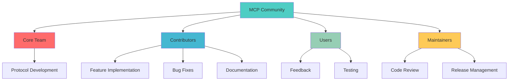

# コミュニティ貢献 - Community Contributions

> MCPエコシステムへの貢献方法、GitHub連携、コミュニティ駆動開発とフィードバック

## 📋 概要

MCPは活発なオープンソースエコシステムです。この章では、コミュニティに参加し、コードやドキュメントを貢献し、プロジェクトの発展に寄与する方法について学習します。

## 🎯 学習目標

- オープンソースプロジェクトへの貢献方法を理解する
- 効果的なGitHub コラボレーション手法を習得する
- コードレビューとマージプロセスに参加する
- コミュニティとの連携とネットワーキング方法を学ぶ
- MCPエコシステムの発展に寄与するための戦略を身につける

## 🤝 MCPコミュニティ参加

### 1. コミュニティ概要



### 2. 参加の段階

#### Level 1: ユーザー
- MCPを使用して学習・実験
- バグレポートの提出
- 機能要求の提案
- コミュニティフォーラムでの質問・回答

#### Level 2: 貢献者
- ドキュメントの改善
- 小さなバグ修正
- サンプルコードの提供
- テストケースの追加

#### Level 3: メンテナー
- 大規模な機能開発
- コードレビュー
- リリース管理
- 新規貢献者のメンタリング

## 📝 貢献の種類

### 1. コード貢献

#### 新機能の実装

```typescript
// 新機能提案のためのプロトタイプ
// src/features/advancedFiltering.ts

export interface AdvancedFilter {
  field: string;
  operator: 'equals' | 'contains' | 'startsWith' | 'regex';
  value: any;
  caseSensitive?: boolean;
}

export interface FilterGroup {
  logic: 'AND' | 'OR';
  filters: (AdvancedFilter | FilterGroup)[];
}

export class AdvancedFilteringTool {
  name = "advanced_filter";
  description = "高度なフィルタリング機能を提供するツール";
  
  inputSchema = {
    type: "object",
    properties: {
      data: {
        type: "array",
        description: "フィルタリング対象のデータ配列"
      },
      filterGroup: {
        type: "object", 
        description: "適用するフィルター条件"
      }
    },
    required: ["data", "filterGroup"]
  };

  async execute(args: { data: any[], filterGroup: FilterGroup }): Promise<any[]> {
    return this.applyFilterGroup(args.data, args.filterGroup);
  }

  private applyFilterGroup(data: any[], group: FilterGroup): any[] {
    const results = group.filters.map(filter => {
      if ('logic' in filter) {
        // ネストされたフィルターグループ
        return this.applyFilterGroup(data, filter);
      } else {
        // 単一フィルター
        return this.applyFilter(data, filter);
      }
    });

    if (group.logic === 'AND') {
      // 全ての結果の交集合
      return results.reduce((acc, result) => 
        acc.filter(item => result.includes(item))
      );
    } else {
      // 全ての結果の和集合
      const unionSet = new Set();
      results.forEach(result => 
        result.forEach(item => unionSet.add(item))
      );
      return Array.from(unionSet);
    }
  }

  private applyFilter(data: any[], filter: AdvancedFilter): any[] {
    return data.filter(item => {
      const fieldValue = this.getNestedValue(item, filter.field);
      return this.evaluateCondition(fieldValue, filter);
    });
  }

  private evaluateCondition(value: any, filter: AdvancedFilter): boolean {
    let fieldValue = String(value);
    let filterValue = String(filter.value);

    if (!filter.caseSensitive) {
      fieldValue = fieldValue.toLowerCase();
      filterValue = filterValue.toLowerCase();
    }

    switch (filter.operator) {
      case 'equals':
        return fieldValue === filterValue;
      case 'contains':
        return fieldValue.includes(filterValue);
      case 'startsWith':
        return fieldValue.startsWith(filterValue);
      case 'regex':
        const regex = new RegExp(filter.value, filter.caseSensitive ? 'g' : 'gi');
        return regex.test(fieldValue);
      default:
        return false;
    }
  }

  private getNestedValue(obj: any, path: string): any {
    return path.split('.').reduce((current, key) => current?.[key], obj);
  }
}
```

#### バグ修正

```typescript
// バグ修正の例
// 元のコード（バグあり）
export function calculateAverage(numbers: number[]): number {
  // バグ: 空配列の場合の処理が不適切
  return numbers.reduce((sum, num) => sum + num, 0) / numbers.length;
}

// 修正後のコード
export function calculateAverage(numbers: number[]): number {
  // 修正: 空配列の場合の適切な処理を追加
  if (numbers.length === 0) {
    throw new Error('空の配列の平均値は計算できません');
  }
  
  return numbers.reduce((sum, num) => sum + num, 0) / numbers.length;
}

// テストケースも追加
describe('calculateAverage', () => {
  test('正常な数値配列の平均値計算', () => {
    expect(calculateAverage([1, 2, 3, 4, 5])).toBe(3);
  });

  test('空配列の場合はエラーをスロー', () => {
    expect(() => calculateAverage([])).toThrow('空の配列の平均値は計算できません');
  });

  test('負の数を含む配列の処理', () => {
    expect(calculateAverage([-1, 0, 1])).toBe(0);
  });
});
```

### 2. ドキュメント貢献

#### APIドキュメントの改善

```markdown
<!-- docs/api/tools.md -->

# ツールAPI リファレンス

## 概要

MCPツールAPIは、サーバーがクライアントに提供する機能を定義します。各ツールは明確な仕様と使用例を持つ必要があります。

## 基本構造

### ツール定義

```typescript
interface Tool {
  name: string;           // ツールの一意識別子
  description: string;    // ツールの機能説明
  inputSchema: JSONSchema; // 入力パラメータのスキーマ
}
```

### 実装例

```typescript
const weatherTool: Tool = {
  name: "get_weather",
  description: "指定した都市の現在の天気情報を取得します",
  inputSchema: {
    type: "object",
    properties: {
      city: {
        type: "string",
        description: "天気を取得する都市名（日本語可）"
      },
      units: {
        type: "string",
        enum: ["celsius", "fahrenheit"],
        default: "celsius",
        description: "温度の単位"
      }
    },
    required: ["city"]
  }
};
```

## よくある間違いと対策

### ❌ 悪い例
```typescript
// 説明が不十分
const tool = {
  name: "calc",
  description: "計算する",
  // スキーマが不明確
  inputSchema: { type: "object" }
};
```

### ✅ 良い例
```typescript
const calculatorTool = {
  name: "calculate",
  description: "四則演算（加算、減算、乗算、除算）を実行します",
  inputSchema: {
    type: "object",
    properties: {
      operation: {
        type: "string",
        enum: ["add", "subtract", "multiply", "divide"],
        description: "実行する演算の種類"
      },
      operands: {
        type: "array",
        items: { type: "number" },
        minItems: 2,
        description: "演算に使用する数値（最低2つ）"
      }
    },
    required: ["operation", "operands"]
  }
};
```

## パフォーマンス考慮事項

- **レスポンス時間**: ツールの実行は10秒以内に完了することを推奨
- **メモリ使用量**: 大量のデータ処理時はストリーミングを検討
- **エラーハンドリング**: 明確なエラーメッセージと復旧方法を提供

## セキュリティガイドライン

1. **入力検証**: 全ての入力パラメータを厳密に検証
2. **権限チェック**: 機密操作には適切な権限確認を実装
3. **ログ記録**: セキュリティイベントを適切にログに記録

詳細な実装例については、[examples/](../examples/) ディレクトリを参照してください。
```

#### チュートリアルの作成

```markdown
<!-- tutorials/building-first-mcp-server.md -->

# 初回MCPサーバー構築チュートリアル

このチュートリアルでは、基本的なMCPサーバーをゼロから構築します。

## 前提条件

- Node.js 18以上
- TypeScript の基本知識
- コマンドライン操作の基本

## ステップ1: プロジェクトセットアップ

```bash
mkdir my-first-mcp-server
cd my-first-mcp-server
npm init -y
npm install @modelcontextprotocol/sdk
npm install -D typescript @types/node ts-node
```

## ステップ2: TypeScript設定

`tsconfig.json` を作成：

```json
{
  "compilerOptions": {
    "target": "ES2022",
    "module": "ES2022",
    "moduleResolution": "node",
    "esModuleInterop": true,
    "allowSyntheticDefaultImports": true,
    "strict": true,
    "skipLibCheck": true,
    "forceConsistentCasingInFileNames": true,
    "outDir": "./dist",
    "rootDir": "./src"
  },
  "include": ["src/**/*"],
  "exclude": ["node_modules", "dist"]
}
```

## ステップ3: 基本サーバー実装

`src/server.ts` を作成：

```typescript
import { Server } from "@modelcontextprotocol/sdk/server/index.js";
import { StdioServerTransport } from "@modelcontextprotocol/sdk/server/stdio.js";
import {
  ListToolsRequestSchema,
  CallToolRequestSchema,
} from "@modelcontextprotocol/sdk/types.js";

// サーバーインスタンスを作成
const server = new Server(
  {
    name: "my-first-server",
    version: "1.0.0",
  },
  {
    capabilities: {
      tools: {},
    },
  }
);

// ツール一覧ハンドラー
server.setRequestHandler(ListToolsRequestSchema, async () => ({
  tools: [
    {
      name: "hello",
      description: "挨拶メッセージを返すシンプルなツール",
      inputSchema: {
        type: "object",
        properties: {
          name: {
            type: "string",
            description: "挨拶する相手の名前"
          }
        },
        required: ["name"]
      }
    }
  ]
}));

// ツール実行ハンドラー
server.setRequestHandler(CallToolRequestSchema, async (request) => {
  const { name, arguments: args } = request.params;

  if (name === "hello") {
    const userName = args?.name || "World";
    return {
      content: [
        {
          type: "text",
          text: `こんにちは、${userName}さん！MCPサーバーからの挨拶です。`
        }
      ]
    };
  }

  throw new Error(`未知のツール: ${name}`);
});

// サーバー起動
async function main() {
  const transport = new StdioServerTransport();
  await server.connect(transport);
  console.error("My First MCP Server が起動しました");
}

if (import.meta.url === `file://${process.argv[1]}`) {
  main().catch(console.error);
}
```

## ステップ4: ビルドとテスト

`package.json` にスクリプトを追加：

```json
{
  "scripts": {
    "build": "tsc",
    "start": "node dist/server.js",
    "dev": "ts-node src/server.ts"
  }
}
```

ビルドして実行：

```bash
npm run build
npm start
```

## ステップ5: クライアントでテスト

別のターミナルで：

```bash
npx @modelcontextprotocol/inspector node dist/server.js
```

## 次のステップ

このチュートリアルを完了したら、以下を試してみてください：

1. 新しいツールを追加
2. データベース接続を実装
3. 外部APIとの統合
4. エラーハンドリングの改善

詳細な例は [examples/](../examples/) を参照してください。
```

### 3. テスト貢献

```typescript
// tests/integration/communityTests.ts
import { describe, test, expect, beforeAll, afterAll } from '@jest/globals';
import { spawn, ChildProcess } from 'child_process';
import { Client } from "@modelcontextprotocol/sdk/client/index.js";
import { StdioClientTransport } from "@modelcontextprotocol/sdk/client/stdio.js";

describe('Community Contributed Features', () => {
  let serverProcess: ChildProcess;
  let client: Client;

  beforeAll(async () => {
    // コミュニティ貢献サーバーを起動
    serverProcess = spawn('node', ['dist/community-server.js'], {
      stdio: ['pipe', 'pipe', 'pipe']
    });

    // クライアント接続
    const transport = new StdioClientTransport({
      command: 'node',
      args: ['dist/community-server.js']
    });

    client = new Client(
      { name: "community-test-client", version: "1.0.0" },
      { capabilities: {} }
    );

    await client.connect(transport);
  });

  afterAll(async () => {
    await client?.close();
    serverProcess?.kill('SIGTERM');
  });

  describe('Advanced Filtering Tool', () => {
    test('should filter data with simple conditions', async () => {
      const testData = [
        { name: 'Alice', age: 30, department: 'Engineering' },
        { name: 'Bob', age: 25, department: 'Marketing' },
        { name: 'Charlie', age: 35, department: 'Engineering' }
      ];

      const result = await client.callTool({
        name: 'advanced_filter',
        arguments: {
          data: testData,
          filterGroup: {
            logic: 'AND',
            filters: [
              { field: 'department', operator: 'equals', value: 'Engineering' },
              { field: 'age', operator: 'gte', value: 30 }
            ]
          }
        }
      });

      expect(result.content[0].text).toContain('Alice');
      expect(result.content[0].text).toContain('Charlie');
      expect(result.content[0].text).not.toContain('Bob');
    });

    test('should handle complex nested filter groups', async () => {
      const testData = [
        { name: 'Alice', age: 30, department: 'Engineering', level: 'Senior' },
        { name: 'Bob', age: 25, department: 'Marketing', level: 'Junior' },
        { name: 'Charlie', age: 35, department: 'Engineering', level: 'Principal' },
        { name: 'Diana', age: 28, department: 'Sales', level: 'Senior' }
      ];

      const result = await client.callTool({
        name: 'advanced_filter',
        arguments: {
          data: testData,
          filterGroup: {
            logic: 'OR',
            filters: [
              {
                logic: 'AND',
                filters: [
                  { field: 'department', operator: 'equals', value: 'Engineering' },
                  { field: 'level', operator: 'equals', value: 'Senior' }
                ]
              },
              {
                logic: 'AND', 
                filters: [
                  { field: 'department', operator: 'equals', value: 'Sales' },
                  { field: 'age', operator: 'gte', value: 25 }
                ]
              }
            ]
          }
        }
      });

      // Engineering + Senior または Sales + age >= 25
      expect(result.content[0].text).toContain('Alice');
      expect(result.content[0].text).toContain('Diana');
      expect(result.content[0].text).not.toContain('Bob');
      expect(result.content[0].text).not.toContain('Charlie');
    });
  });

  describe('Performance Tests for Community Features', () => {
    test('should handle large datasets efficiently', async () => {
      // 10,000件のテストデータを生成
      const largeDataset = Array.from({ length: 10000 }, (_, i) => ({
        id: i,
        name: `User${i}`,
        category: i % 5 === 0 ? 'premium' : 'standard',
        score: Math.random() * 100
      }));

      const startTime = performance.now();

      const result = await client.callTool({
        name: 'advanced_filter',
        arguments: {
          data: largeDataset,
          filterGroup: {
            logic: 'AND',
            filters: [
              { field: 'category', operator: 'equals', value: 'premium' },
              { field: 'score', operator: 'gte', value: 50 }
            ]
          }
        }
      });

      const endTime = performance.now();
      const executionTime = endTime - startTime;

      expect(executionTime).toBeLessThan(1000); // 1秒以内
      expect(result.content).toBeDefined();
    });
  });
});
```

## 🚀 GitHub コラボレーション

### 1. 効果的なIssue作成

```markdown
<!-- .github/ISSUE_TEMPLATE/bug_report.md -->
---
name: Bug Report
about: バグレポートの作成
title: '[BUG] '
labels: bug
assignees: ''

---

## バグの説明
バグの内容を明確かつ簡潔に説明してください。

## 再現手順
バグを再現するための手順：

1. Go to '...'
2. Click on '....'
3. Scroll down to '....'
4. See error

## 期待される動作
期待していた動作を明確かつ簡潔に説明してください。

## 実際の動作
実際に起こった動作を説明してください。

## スクリーンショット
該当する場合、問題を説明するスクリーンショットを追加してください。

## 環境情報
 - OS: [e.g. macOS, Windows, Linux]
 - Node.js Version: [e.g. 18.17.0]
 - MCP SDK Version: [e.g. 1.0.0]
 - Browser (if applicable): [e.g. chrome, safari]

## 追加情報
問題について他に追加したい情報があれば記載してください。

## チェックリスト
- [ ] 既存のIssueを検索し、重複していないことを確認した
- [ ] 最新版で問題が再現することを確認した
- [ ] 関連するログやエラーメッセージを含めた
```

```markdown
<!-- .github/ISSUE_TEMPLATE/feature_request.md -->
---
name: Feature Request
about: 新機能の提案
title: '[FEATURE] '
labels: enhancement
assignees: ''

---

## 機能の概要
提案する機能について簡潔に説明してください。

## 問題・課題
この機能がどのような問題を解決するか、またはどのような改善をもたらすか説明してください。

## 提案する解決策
実装したい機能について詳細に説明してください。

## 代替案
検討した他の解決策や機能があれば説明してください。

## 使用例
```typescript
// 提案する機能の使用例
const newFeature = new ProposedFeature({
  option1: 'value1',
  option2: 'value2'
});

const result = await newFeature.execute();
```

## 実装の考慮事項
- [ ] 後方互換性
- [ ] パフォーマンスへの影響
- [ ] セキュリティ考慮事項
- [ ] ドキュメント更新の必要性

## 優先度
- [ ] 緊急 (重大な問題を解決)
- [ ] 高 (重要な機能改善)
- [ ] 中 (便利な機能追加)
- [ ] 低 (nice-to-have)

## 追加情報
この機能要求について他に追加したい情報があれば記載してください。
```

### 2. プルリクエストベストプラクティス

```markdown
<!-- プルリクエストテンプレート -->
## 変更の概要
このプルリクエストでの変更内容を簡潔に説明してください。

## 関連Issue
Fixes #(issue番号)
Closes #(issue番号)
Relates to #(issue番号)

## 変更の種類
該当するものにチェックを入れてください：

- [ ] バグ修正 (既存の機能を壊さない変更)
- [ ] 新機能 (既存の機能を壊さない新しい機能)
- [ ] 破壊的変更 (既存の機能に影響を与える修正や新機能)
- [ ] ドキュメント更新
- [ ] スタイル変更 (フォーマット、空白など)
- [ ] リファクタリング (機能の変更を伴わないコードの改善)
- [ ] テスト追加・改善
- [ ] CI/CD設定

## テスト
実行したテストについて説明してください：

- [ ] 既存のテストが全て通ることを確認
- [ ] 新しいテストを追加（新機能・バグ修正の場合）
- [ ] 手動テストを実行
- [ ] エンドツーエンドテストを実行

## 変更詳細

### 追加された機能
- 機能1: 説明
- 機能2: 説明

### 修正されたバグ
- バグ1: 原因と修正内容
- バグ2: 原因と修正内容

### 破壊的変更
該当する場合、移行ガイドを含めてください：

```typescript
// 変更前
const oldApi = new OldAPI();
oldApi.deprecatedMethod();

// 変更後  
const newApi = new NewAPI();
newApi.improvedMethod();
```

## パフォーマンスへの影響
- [ ] パフォーマンスへの影響なし
- [ ] パフォーマンス改善
- [ ] パフォーマンス低下の可能性（理由を説明）

## セキュリティへの影響
- [ ] セキュリティへの影響なし
- [ ] セキュリティ改善
- [ ] セキュリティ審査が必要

## ドキュメント
- [ ] README更新
- [ ] API ドキュメント更新
- [ ] チュートリアル更新
- [ ] CHANGELOG更新

## チェックリスト
- [ ] コードが[コーディング規約](CONTRIBUTING.md#coding-style)に従っている
- [ ] 自己レビューを実施した
- [ ] コードにコメントを追加した（特に理解が困難な部分）
- [ ] 対応するドキュメントを更新した
- [ ] 変更により新しい警告が発生していない
- [ ] テストを追加し、新機能と既存機能の両方をカバーしている
- [ ] 依存する変更が既にマージされている

## スクリーンショット・デモ
該当する場合、変更の視覚的な証拠を提供してください。

## レビューアーへのメモ
レビューアーが特に注意すべき点や、フィードバックを求める箇所があれば記載してください。
```

### 3. 継続的インテグレーション

```yaml
# .github/workflows/community-contributions.yml
name: Community Contributions CI

on:
  pull_request:
    branches: [ main, develop ]
  push:
    branches: [ main, develop ]

jobs:
  code-quality:
    runs-on: ubuntu-latest
    
    steps:
    - uses: actions/checkout@v3
    
    - name: Setup Node.js
      uses: actions/setup-node@v3
      with:
        node-version: '18'
        cache: 'npm'
    
    - name: Install dependencies
      run: npm ci
    
    - name: Lint code
      run: npm run lint
    
    - name: Type check
      run: npm run type-check
    
    - name: Run tests
      run: npm run test:coverage
    
    - name: Upload coverage to Codecov
      uses: codecov/codecov-action@v3
      with:
        file: ./coverage/lcov.info
        flags: unittests
        name: codecov-umbrella

  security-check:
    runs-on: ubuntu-latest
    
    steps:
    - uses: actions/checkout@v3
    
    - name: Run security audit
      run: npm audit --audit-level moderate
    
    - name: Check for vulnerabilities
      run: npm audit --production --audit-level high

  community-tests:
    runs-on: ubuntu-latest
    
    steps:
    - uses: actions/checkout@v3
    
    - name: Setup Node.js
      uses: actions/setup-node@v3
      with:
        node-version: '18'
        cache: 'npm'
    
    - name: Install dependencies
      run: npm ci
    
    - name: Build project
      run: npm run build
    
    - name: Run community integration tests
      run: npm run test:community
    
    - name: Test example implementations
      run: |
        cd examples/community-features
        npm install
        npm test

  documentation-check:
    runs-on: ubuntu-latest
    
    steps:
    - uses: actions/checkout@v3
    
    - name: Check documentation links
      uses: gaurav-nelson/github-action-markdown-link-check@v1
      with:
        use-quiet-mode: 'yes'
        use-verbose-mode: 'yes'
        config-file: '.markdown-link-check.json'
    
    - name: Validate API documentation
      run: |
        npm install -g swagger-codegen-cli
        swagger-codegen-cli validate -i docs/api/openapi.yaml

  auto-merge:
    needs: [code-quality, security-check, community-tests, documentation-check]
    runs-on: ubuntu-latest
    if: github.actor == 'dependabot[bot]'
    
    steps:
    - name: Auto-merge Dependabot PRs
      uses: pascalgn/merge-action@v0.15.5
      with:
        github_token: ${{ secrets.GITHUB_TOKEN }}
        merge_method: squash
```

## 🌟 メンタリングとネットワーキング

### 1. 新規貢献者サポート

```typescript
// scripts/mentorship/newContributorGuide.ts
export interface MentorshipProgram {
  mentor: string;
  mentee: string;
  focusAreas: string[];
  startDate: Date;
  milestones: Milestone[];
}

export interface Milestone {
  title: string;
  description: string;
  dueDate: Date;
  completed: boolean;
  resources: string[];
}

export class CommunityMentorship {
  private programs: Map<string, MentorshipProgram> = new Map();

  createMentorshipProgram(mentee: string, focusAreas: string[]): MentorshipProgram {
    const program: MentorshipProgram = {
      mentor: this.assignMentor(focusAreas),
      mentee,
      focusAreas,
      startDate: new Date(),
      milestones: this.generateMilestones(focusAreas)
    };

    this.programs.set(mentee, program);
    return program;
  }

  private assignMentor(focusAreas: string[]): string {
    // メンターの専門分野とマッチング
    const mentors = {
      'protocol-development': ['alice@example.com', 'bob@example.com'],
      'documentation': ['carol@example.com', 'david@example.com'],
      'testing': ['eve@example.com', 'frank@example.com'],
      'community-management': ['grace@example.com', 'henry@example.com']
    };

    for (const area of focusAreas) {
      if (mentors[area as keyof typeof mentors]) {
        return mentors[area as keyof typeof mentors][0];
      }
    }

    return 'community@example.com'; // デフォルトメンター
  }

  private generateMilestones(focusAreas: string[]): Milestone[] {
    const baseMilestones: Milestone[] = [
      {
        title: 'コミュニティガイドライン理解',
        description: 'MCPコミュニティのガイドラインとベストプラクティスを学習',
        dueDate: new Date(Date.now() + 7 * 24 * 60 * 60 * 1000), // 1週間後
        completed: false,
        resources: [
          'docs/CONTRIBUTING.md',
          'docs/CODE_OF_CONDUCT.md',
          'https://github.com/modelcontextprotocol/spec'
        ]
      },
      {
        title: '開発環境セットアップ',
        description: 'ローカル開発環境の構築と動作確認',
        dueDate: new Date(Date.now() + 14 * 24 * 60 * 60 * 1000), // 2週間後
        completed: false,
        resources: [
          'docs/DEVELOPMENT.md',
          'examples/getting-started/'
        ]
      }
    ];

    // 専門分野別のマイルストーンを追加
    const specializedMilestones = {
      'protocol-development': [
        {
          title: 'プロトコル仕様理解',
          description: 'MCPプロトコルの詳細仕様を理解し、小さな改善を提案',
          dueDate: new Date(Date.now() + 21 * 24 * 60 * 60 * 1000),
          completed: false,
          resources: ['spec/protocol.md', 'examples/protocol-extensions/']
        }
      ],
      'documentation': [
        {
          title: 'ドキュメント改善',
          description: '既存ドキュメントの問題を特定し、改善PRを提出',
          dueDate: new Date(Date.now() + 21 * 24 * 60 * 60 * 1000),
          completed: false,
          resources: ['docs/writing-guide.md', 'tutorials/']
        }
      ]
    };

    focusAreas.forEach(area => {
      if (specializedMilestones[area as keyof typeof specializedMilestones]) {
        baseMilestones.push(...specializedMilestones[area as keyof typeof specializedMilestones]);
      }
    });

    return baseMilestones;
  }

  trackProgress(mentee: string, milestoneTitle: string): void {
    const program = this.programs.get(mentee);
    if (program) {
      const milestone = program.milestones.find(m => m.title === milestoneTitle);
      if (milestone) {
        milestone.completed = true;
        console.log(`🎉 ${mentee} がマイルストーン「${milestoneTitle}」を達成しました！`);
        this.checkGraduation(program);
      }
    }
  }

  private checkGraduation(program: MentorshipProgram): void {
    const completedMilestones = program.milestones.filter(m => m.completed).length;
    const totalMilestones = program.milestones.length;
    
    if (completedMilestones === totalMilestones) {
      console.log(`🎓 ${program.mentee} がメンタリングプログラムを修了しました！`);
      this.graduateMentee(program);
    }
  }

  private graduateMentee(program: MentorshipProgram): void {
    // 修了者を潜在的なメンターとして登録
    console.log(`${program.mentee} を新しいメンターとして登録します`);
    
    // 修了証明書を生成
    this.generateCertificate(program);
    
    // コミュニティへの貢献を認識
    this.recognizeContribution(program);
  }

  private generateCertificate(program: MentorshipProgram): void {
    const certificate = {
      recipient: program.mentee,
      program: 'MCP Community Mentorship',
      completionDate: new Date(),
      focusAreas: program.focusAreas,
      mentor: program.mentor
    };
    
    console.log('修了証明書:', certificate);
  }

  private recognizeContribution(program: MentorshipProgram): void {
    // GitHub Discussionsで功績を認識
    // 貢献者リストに追加
    // コミュニティイベントで紹介
    console.log(`${program.mentee} の貢献をコミュニティで認識します`);
  }
}
```

### 2. コミュニティイベント

```typescript
// scripts/events/communityEvents.ts
export interface CommunityEvent {
  id: string;
  title: string;
  type: 'hackathon' | 'workshop' | 'meetup' | 'conference' | 'online-session';
  description: string;
  dateTime: Date;
  duration: number; // 分
  location: string; // URLまたは物理的な場所
  organizers: string[];
  maxAttendees?: number;
  prerequisites: string[];
  agenda: AgendaItem[];
  resources: string[];
}

export interface AgendaItem {
  time: string;
  title: string;
  speaker?: string;
  duration: number;
  type: 'presentation' | 'workshop' | 'discussion' | 'break';
}

export class CommunityEventManager {
  private events: Map<string, CommunityEvent> = new Map();
  private registrations: Map<string, string[]> = new Map(); // eventId -> userIds

  createEvent(event: Omit<CommunityEvent, 'id'>): string {
    const eventId = `event_${Date.now()}_${Math.random().toString(36).substr(2, 9)}`;
    const fullEvent: CommunityEvent = { ...event, id: eventId };
    
    this.events.set(eventId, fullEvent);
    this.registrations.set(eventId, []);
    
    return eventId;
  }

  // MCP Hackathon テンプレート
  createMCPHackathon(startDate: Date): string {
    const event: Omit<CommunityEvent, 'id'> = {
      title: 'MCP Innovation Hackathon 2024',
      type: 'hackathon',
      description: 'MCPエコシステムを拡張する革新的なプロジェクトを48時間で開発するハッカソン',
      dateTime: startDate,
      duration: 48 * 60, // 48時間
      location: 'https://discord.gg/mcp-hackathon',
      organizers: ['community@mcp.org', 'dev-relations@mcp.org'],
      maxAttendees: 100,
      prerequisites: [
        'MCPの基本概念理解',
        'プログラミング経験（任意言語）',
        'Git/GitHubの基本操作'
      ],
      agenda: [
        {
          time: '09:00',
          title: 'オープニング・ルール説明',
          speaker: 'MCP Core Team',
          duration: 60,
          type: 'presentation'
        },
        {
          time: '10:00',
          title: 'チーム結成・アイデアピッチ',
          duration: 120,
          type: 'workshop'
        },
        {
          time: '12:00',
          title: '開発開始',
          duration: 43 * 60, // 43時間
          type: 'workshop'
        },
        {
          time: '07:00+2',
          title: 'プレゼンテーション準備',
          duration: 60,
          type: 'workshop'
        },
        {
          time: '08:00+2',
          title: '最終プレゼンテーション',
          duration: 120,
          type: 'presentation'
        },
        {
          time: '10:00+2',
          title: '審査・表彰式',
          duration: 60,
          type: 'presentation'
        }
      ],
      resources: [
        'https://docs.mcp.org/hackathon-guide',
        'https://github.com/mcp/hackathon-starter-kit',
        'https://discord.gg/mcp-development'
      ]
    };

    return this.createEvent(event);
  }

  // 技術ワークショップテンプレート
  createTechnicalWorkshop(topic: string, date: Date, speaker: string): string {
    const event: Omit<CommunityEvent, 'id'> = {
      title: `MCP Technical Workshop: ${topic}`,
      type: 'workshop',
      description: `${topic}について深く学ぶ実践的なワークショップ`,
      dateTime: date,
      duration: 120, // 2時間
      location: 'https://zoom.us/mcp-workshop',
      organizers: [speaker, 'education@mcp.org'],
      maxAttendees: 50,
      prerequisites: [
        'MCPの基本概念理解',
        '対象技術の基礎知識'
      ],
      agenda: [
        {
          time: '00:00',
          title: 'イントロダクション',
          speaker,
          duration: 15,
          type: 'presentation'
        },
        {
          time: '00:15',
          title: '理論解説',
          speaker,
          duration: 30,
          type: 'presentation'
        },
        {
          time: '00:45',
          title: 'ハンズオン実習',
          speaker,
          duration: 60,
          type: 'workshop'
        },
        {
          time: '01:45',
          title: 'Q&A・ディスカッション',
          speaker,
          duration: 15,
          type: 'discussion'
        }
      ],
      resources: [
        `https://github.com/mcp/workshop-${topic.toLowerCase().replace(' ', '-')}`,
        'https://docs.mcp.org/workshops'
      ]
    };

    return this.createEvent(event);
  }

  registerForEvent(eventId: string, userId: string): boolean {
    const event = this.events.get(eventId);
    if (!event) {
      return false;
    }

    const registrations = this.registrations.get(eventId) || [];
    
    // 既に登録済みかチェック
    if (registrations.includes(userId)) {
      return false;
    }

    // 定員チェック
    if (event.maxAttendees && registrations.length >= event.maxAttendees) {
      return false;
    }

    registrations.push(userId);
    this.registrations.set(eventId, registrations);
    
    console.log(`${userId} が ${event.title} に登録しました`);
    return true;
  }

  getUpcomingEvents(): CommunityEvent[] {
    const now = new Date();
    return Array.from(this.events.values())
      .filter(event => event.dateTime > now)
      .sort((a, b) => a.dateTime.getTime() - b.dateTime.getTime());
  }

  getEventAttendees(eventId: string): string[] {
    return this.registrations.get(eventId) || [];
  }

  sendEventReminder(eventId: string): void {
    const event = this.events.get(eventId);
    const attendees = this.getEventAttendees(eventId);
    
    if (event && attendees.length > 0) {
      console.log(`${event.title} のリマインダーを ${attendees.length} 人に送信します`);
      
      attendees.forEach(userId => {
        this.sendReminderEmail(userId, event);
      });
    }
  }

  private sendReminderEmail(userId: string, event: CommunityEvent): void {
    // 実際のメール送信ロジック
    console.log(`Reminder sent to ${userId} for ${event.title}`);
  }
}
```

## 🎓 実習課題

### 課題1: バグ修正貢献
- 既存のバグを特定し、修正のプルリクエストを作成する
- 適切なテストケースを含める

### 課題2: ドキュメント改善
- 既存ドキュメントの問題点を特定し、改善提案を行う
- 新しいチュートリアルを作成する

### 課題3: コミュニティイベント企画
- 技術的なワークショップまたはハッカソンを企画する
- イベント実行計画とリソースを準備する

## 📚 関連リソース

- [GitHub Collaboration Guide](https://docs.github.com/en/pull-requests/collaborating-with-pull-requests)
- [Open Source Contribution Guidelines](https://opensource.guide/how-to-contribute/)
- [Code Review Best Practices](https://google.github.io/eng-practices/review/)
- [Community Management Handbook](https://orbit.love/community-handbook)

## 🔗 次のステップ

コミュニティ貢献の方法を学んだ後は、実際にMCPエコシステムに参加し、継続的な貢献を通じてスキルを向上させ、ネットワークを構築していきましょう。

---

*MCPコミュニティは、あなたの貢献を待っています。小さな一歩から始めて、大きな影響を与えましょう！*