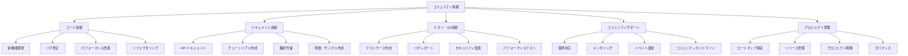

# 06 - コミュニティ貢献

## 📖 概要

オープンソースのMCPエコシステムの発展には、コミュニティの積極的な参加と貢献が不可欠です。この章では、MCPコミュニティへの効果的な貢献方法、GitHub でのコラボレーション手法、メンタリングプログラムへの参加について学習します。

## 🎯 学習目標

この章を完了すると、以下のことができるようになります：

- オープンソースプロジェクトへの効果的な貢献ができる
- GitHubでのコラボレーションを適切に行える
- コミュニティドリブンな機能強化に参加できる
- メンタリングとナレッジシェアを実践できる
- プロジェクトの持続可能な発展に寄与できる
- コミュニティイベントの企画・運営ができる

## 🤝 オープンソース貢献の基本

### 貢献の種類と方法



### コントリビューションの始め方

#### 1. プロジェクトの理解

```bash
# MCPプロジェクトのクローン
git clone https://github.com/modelcontextprotocol/python-sdk.git
cd python-sdk

# プロジェクト構造の把握
ls -la
cat README.md
cat CONTRIBUTING.md
cat CODE_OF_CONDUCT.md

# 依存関係の確認
cat requirements.txt
cat pyproject.toml

# ローカル開発環境のセットアップ
python -m venv venv
source venv/bin/activate  # Windows: venv\Scripts\activate
pip install -e ".[dev]"
```

#### 2. Issue の調査と選択

```python
# scripts/find_good_first_issues.py
import requests
import json
from datetime import datetime, timedelta

class GitHubIssueAnalyzer:
    def __init__(self, token: str):
        self.token = token
        self.headers = {
            'Authorization': f'token {token}',
            'Accept': 'application/vnd.github.v3+json'
        }
    
    def find_good_first_issues(self, repo: str) -> list:
        """初心者向けのIssueを検索"""
        url = f"https://api.github.com/repos/{repo}/issues"
        params = {
            'labels': 'good first issue,help wanted',
            'state': 'open',
            'sort': 'created',
            'direction': 'desc',
            'per_page': 50
        }
        
        response = requests.get(url, headers=self.headers, params=params)
        issues = response.json()
        
        analyzed_issues = []
        for issue in issues:
            analysis = self.analyze_issue_complexity(issue)
            analyzed_issues.append({
                'number': issue['number'],
                'title': issue['title'],
                'url': issue['html_url'],
                'labels': [label['name'] for label in issue['labels']],
                'complexity': analysis['complexity'],
                'estimated_hours': analysis['estimated_hours'],
                'skills_required': analysis['skills_required'],
                'mentorship_available': 'mentorship' in [label['name'] for label in issue['labels']]
            })
        
        return sorted(analyzed_issues, key=lambda x: x['complexity'])
    
    def analyze_issue_complexity(self, issue: dict) -> dict:
        """Issueの複雑さを分析"""
        title = issue['title'].lower()
        body = issue.get('body', '').lower()
        labels = [label['name'].lower() for label in issue['labels']]
        
        complexity_score = 0
        skills_required = []
        
        # キーワードによる複雑さの判定
        if any(keyword in title + body for keyword in ['refactor', 'architecture', 'breaking']):
            complexity_score += 3
            skills_required.append('advanced-design')
        
        if any(keyword in title + body for keyword in ['performance', 'optimization', 'memory']):
            complexity_score += 2
            skills_required.append('performance-tuning')
        
        if any(keyword in title + body for keyword in ['security', 'vulnerability', 'auth']):
            complexity_score += 2
            skills_required.append('security')
        
        if any(keyword in title + body for keyword in ['test', 'coverage', 'ci/cd']):
            complexity_score += 1
            skills_required.append('testing')
        
        if any(keyword in title + body for keyword in ['documentation', 'readme', 'example']):
            complexity_score += 0
            skills_required.append('documentation')
        
        # ラベルによる調整
        if 'beginner' in labels or 'good first issue' in labels:
            complexity_score = max(0, complexity_score - 1)
        
        if 'expert' in labels or 'advanced' in labels:
            complexity_score += 2
        
        complexity_levels = {
            0: 'beginner',
            1: 'intermediate', 
            2: 'intermediate',
            3: 'advanced',
            4: 'expert'
        }
        
        estimated_hours = {
            'beginner': '2-4 hours',
            'intermediate': '4-8 hours',
            'advanced': '8-16 hours',
            'expert': '16+ hours'
        }
        
        complexity = complexity_levels.get(min(complexity_score, 4), 'expert')
        
        return {
            'complexity': complexity,
            'estimated_hours': estimated_hours[complexity],
            'skills_required': skills_required or ['general-programming']
        }
    
    def get_project_activity(self, repo: str) -> dict:
        """プロジェクトの活動状況を分析"""
        # コミット頻度
        commits_url = f"https://api.github.com/repos/{repo}/commits"
        commits_response = requests.get(commits_url, headers=self.headers, params={'per_page': 100})
        commits = commits_response.json()
        
        # 最近の活動
        recent_commits = [c for c in commits if self.is_recent(c['commit']['author']['date'])]
        
        # コントリビューター
        contributors_url = f"https://api.github.com/repos/{repo}/contributors"
        contributors_response = requests.get(contributors_url, headers=self.headers)
        contributors = contributors_response.json()
        
        return {
            'total_commits': len(commits),
            'recent_commits': len(recent_commits),
            'active_contributors': len([c for c in contributors if c['contributions'] > 5]),
            'activity_level': self.calculate_activity_level(recent_commits, contributors)
        }
    
    def is_recent(self, date_str: str) -> bool:
        """最近30日以内かどうか判定"""
        commit_date = datetime.fromisoformat(date_str.replace('Z', '+00:00'))
        thirty_days_ago = datetime.now().astimezone() - timedelta(days=30)
        return commit_date > thirty_days_ago
    
    def calculate_activity_level(self, recent_commits: list, contributors: list) -> str:
        """活動レベルを計算"""
        if len(recent_commits) > 20 and len(contributors) > 10:
            return 'very-active'
        elif len(recent_commits) > 10 and len(contributors) > 5:
            return 'active'
        elif len(recent_commits) > 5:
            return 'moderate'
        else:
            return 'low'

# 使用例
if __name__ == "__main__":
    analyzer = GitHubIssueAnalyzer(token="your_github_token")
    
    # MCP関連リポジトリの分析
    repos = [
        "modelcontextprotocol/python-sdk",
        "modelcontextprotocol/typescript-sdk",
        "modelcontextprotocol/servers"
    ]
    
    for repo in repos:
        print(f"\n=== {repo} ===")
        
        # Good first issues の検索
        issues = analyzer.find_good_first_issues(repo)
        print(f"Good first issues found: {len(issues)}")
        
        for issue in issues[:3]:  # 上位3件を表示
            print(f"  #{issue['number']}: {issue['title']}")
            print(f"    Complexity: {issue['complexity']}")
            print(f"    Estimated time: {issue['estimated_hours']}")
            print(f"    Skills: {', '.join(issue['skills_required'])}")
            print(f"    URL: {issue['url']}")
            print()
        
        # プロジェクト活動状況
        activity = analyzer.get_project_activity(repo)
        print(f"Project activity: {activity['activity_level']}")
        print(f"Recent commits: {activity['recent_commits']}")
        print(f"Active contributors: {activity['active_contributors']}")
```

## 📝 効果的なIssue作成とPR

### Issue作成のベストプラクティス

```markdown
<!-- .github/ISSUE_TEMPLATE/bug_report.md -->
---
name: バグレポート
about: バグを報告して、プロジェクトの改善にご協力ください
title: '[BUG] '
labels: 'bug'
assignees: ''
---

## 🐛 バグの説明
バグの内容を明確かつ簡潔に記述してください。

## 🔄 再現手順
バグを再現するための手順：

1. '...' に移動
2. '...' をクリック
3. '...' まで下にスクロール
4. エラーを確認

## 🎯 期待される動作
期待していた動作を明確かつ簡潔に記述してください。

## 📸 スクリーンショット
可能であれば、問題を説明するスクリーンショットを追加してください。

## 🖥️ 環境情報
**デスクトップ:**
 - OS: [例: iOS]
 - ブラウザ [例: chrome, safari]
 - バージョン [例: 22]

**スマートフォン:**
 - デバイス: [例: iPhone6]
 - OS: [例: iOS8.1]
 - ブラウザ [例: stock browser, safari]
 - バージョン [例: 22]

## 📋 追加情報
バグに関する他の情報をここに追加してください。

## ✅ チェックリスト
- [ ] 既存のIssueを確認済み
- [ ] 最新バージョンで確認済み
- [ ] 再現可能
- [ ] ログやエラーメッセージを含めた
```

```markdown
<!-- .github/ISSUE_TEMPLATE/feature_request.md -->
---
name: 機能リクエスト
about: このプロジェクトのアイデアを提案してください
title: '[FEATURE] '
labels: 'enhancement'
assignees: ''
---

## 🚀 機能リクエスト

### 📋 要約
提案する機能を簡潔に説明してください。

### 🔍 動機
この機能が必要な理由を説明してください。どのような問題を解決しますか？

### 💡 詳細な説明
機能がどのように動作すべきかを詳しく説明してください。

### 🎨 代替案
検討した代替ソリューションや機能について説明してください。

### 📊 期待される影響
- **ユーザーへの影響**: 
- **開発者への影響**: 
- **システムへの影響**: 

### 🏗️ 実装の提案
可能であれば、実装方法のアイデアを提供してください：

```typescript
// 例: 新しいAPIの提案
interface NewFeature {
  method: string;
  parameters: Record<string, any>;
  returnType: FeatureResult;
}
```

### ✅ チェックリスト
- [ ] 既存の機能要求を確認済み
- [ ] 実装可能性を検討済み
- [ ] 破壊的変更の有無を確認済み
- [ ] テスト計画を含めた
```

### Pull Requestの作成

```python
# scripts/pr_helper.py
import subprocess
import json
import os
from typing import List, Dict

class PRHelper:
    def __init__(self, repo_path: str):
        self.repo_path = repo_path
        os.chdir(repo_path)
    
    def create_feature_branch(self, issue_number: int, description: str) -> str:
        """機能ブランチを作成"""
        branch_name = f"feature/issue-{issue_number}-{self.sanitize_name(description)}"
        
        # main ブランチから最新を取得
        subprocess.run(['git', 'checkout', 'main'], check=True)
        subprocess.run(['git', 'pull', 'origin', 'main'], check=True)
        
        # 新しいブランチを作成
        subprocess.run(['git', 'checkout', '-b', branch_name], check=True)
        
        return branch_name
    
    def sanitize_name(self, name: str) -> str:
        """ブランチ名用にサニタイズ"""
        return name.lower().replace(' ', '-').replace('_', '-')[:30]
    
    def run_pre_commit_checks(self) -> Dict[str, bool]:
        """コミット前チェックを実行"""
        results = {}
        
        # リンター実行
        try:
            subprocess.run(['flake8', '.'], check=True, capture_output=True)
            results['linting'] = True
        except subprocess.CalledProcessError:
            results['linting'] = False
        
        # テスト実行
        try:
            subprocess.run(['pytest', 'tests/'], check=True, capture_output=True)
            results['tests'] = True
        except subprocess.CalledProcessError:
            results['tests'] = False
        
        # 型チェック
        try:
            subprocess.run(['mypy', 'src/'], check=True, capture_output=True)
            results['type_check'] = True
        except subprocess.CalledProcessError:
            results['type_check'] = False
        
        # セキュリティチェック
        try:
            subprocess.run(['bandit', '-r', 'src/'], check=True, capture_output=True)
            results['security'] = True
        except subprocess.CalledProcessError:
            results['security'] = False
        
        return results
    
    def generate_pr_description(self, issue_number: int, changes: List[str]) -> str:
        """PRの説明を生成"""
        template = f"""## 📋 概要
Fixes #{issue_number}

この PR は以下の変更を含みます：

## 🔧 変更内容
"""
        for change in changes:
            template += f"- {change}\n"
        
        template += """
## 🧪 テスト
- [ ] 新しいテストを追加した
- [ ] 既存のテストが通る
- [ ] 手動テストを実行した

## 📸 スクリーンショット（該当する場合）
<!-- スクリーンショットや GIF を追加 -->

## ✅ チェックリスト
- [ ] コードレビューガイドラインに従った
- [ ] セルフレビューを実行した
- [ ] 適切なラベルを追加した
- [ ] ドキュメントを更新した
- [ ] 破壊的変更がある場合は明記した

## 🔗 関連リンク
- Issue: #{issue_number}
- Documentation: 
- Related PRs: 

## 📝 レビュアーへのノート
<!-- レビュアーが注目すべき点があれば記載 -->
"""
        return template
    
    def create_commit_with_template(self, files: List[str], issue_number: int, summary: str) -> None:
        """テンプレートを使用してコミット"""
        # ファイルをステージング
        subprocess.run(['git', 'add'] + files, check=True)
        
        # コミットメッセージのテンプレート
        commit_message = f"""feat(#{issue_number}): {summary}

- Detailed description of changes
- Impact on existing functionality
- Any breaking changes

Closes #{issue_number}
"""
        
        # コミット実行
        subprocess.run(['git', 'commit', '-m', commit_message], check=True)
    
    def push_and_create_pr(self, branch_name: str, pr_description: str) -> str:
        """ブランチをプッシュしてPRを作成"""
        # リモートにプッシュ
        subprocess.run(['git', 'push', 'origin', branch_name], check=True)
        
        # GitHub CLI を使用してPR作成
        result = subprocess.run([
            'gh', 'pr', 'create',
            '--title', f'feat: {branch_name.replace("feature/", "")}',
            '--body', pr_description,
            '--draft'
        ], capture_output=True, text=True, check=True)
        
        return result.stdout.strip()

# 使用例
def contribute_to_issue():
    helper = PRHelper('/path/to/mcp-repo')
    
    issue_number = 123
    description = "add multimodal support"
    
    # 1. ブランチ作成
    branch = helper.create_feature_branch(issue_number, description)
    print(f"Created branch: {branch}")
    
    # 2. 開発作業（ここで実際のコード変更を行う）
    # ... development work ...
    
    # 3. プリコミットチェック
    checks = helper.run_pre_commit_checks()
    if all(checks.values()):
        print("All pre-commit checks passed!")
    else:
        print("Some checks failed:", checks)
        return
    
    # 4. コミット
    helper.create_commit_with_template(
        files=['src/multimodal.py', 'tests/test_multimodal.py'],
        issue_number=issue_number,
        summary="add multimodal support for images and audio"
    )
    
    # 5. PR作成
    pr_description = helper.generate_pr_description(
        issue_number=issue_number,
        changes=[
            "Added MultimodalProcessor class",
            "Implemented image analysis with OpenAI GPT-4V",
            "Added audio transcription support",
            "Updated documentation with examples"
        ]
    )
    
    pr_url = helper.push_and_create_pr(branch, pr_description)
    print(f"PR created: {pr_url}")
```

## 🎓 メンタリングとナレッジシェア

### メンターシッププログラム

```python
# src/community/mentorship.py
from datetime import datetime, timedelta
from typing import List, Dict, Optional
from dataclasses import dataclass
from enum import Enum

class SkillLevel(Enum):
    BEGINNER = "beginner"
    INTERMEDIATE = "intermediate"
    ADVANCED = "advanced"
    EXPERT = "expert"

class MentorshipStatus(Enum):
    ACTIVE = "active"
    COMPLETED = "completed"
    PAUSED = "paused"
    CANCELLED = "cancelled"

@dataclass
class Skill:
    name: str
    level: SkillLevel
    description: str

@dataclass
class MentorProfile:
    id: str
    name: str
    email: str
    github_username: str
    skills: List[Skill]
    availability_hours_per_week: int
    timezone: str
    languages: List[str]
    experience_years: int
    specialties: List[str]
    mentoring_capacity: int  # 同時にメンタリングできる人数
    
@dataclass
class MenteeProfile:
    id: str
    name: str
    email: str
    github_username: str
    learning_goals: List[str]
    current_skills: List[Skill]
    preferred_learning_style: str  # "hands-on", "structured", "project-based"
    availability_hours_per_week: int
    timezone: str
    languages: List[str]

@dataclass
class MentorshipSession:
    id: str
    mentor_id: str
    mentee_id: str
    scheduled_time: datetime
    duration_minutes: int
    topic: str
    notes: str
    homework_assigned: Optional[str]
    resources_shared: List[str]
    next_session_scheduled: Optional[datetime]

class MentorshipMatcher:
    def __init__(self):
        self.mentors: Dict[str, MentorProfile] = {}
        self.mentees: Dict[str, MenteeProfile] = {}
        self.active_mentorships: Dict[str, List[str]] = {}  # mentor_id -> [mentee_ids]
    
    def register_mentor(self, mentor: MentorProfile) -> bool:
        """メンターを登録"""
        if self.validate_mentor_profile(mentor):
            self.mentors[mentor.id] = mentor
            self.active_mentorships[mentor.id] = []
            return True
        return False
    
    def register_mentee(self, mentee: MenteeProfile) -> bool:
        """メンティーを登録"""
        if self.validate_mentee_profile(mentee):
            self.mentees[mentee.id] = mentee
            return True
        return False
    
    def find_mentor_matches(self, mentee_id: str) -> List[Dict]:
        """メンティーに適したメンターを検索"""
        mentee = self.mentees.get(mentee_id)
        if not mentee:
            return []
        
        matches = []
        for mentor in self.mentors.values():
            if len(self.active_mentorships[mentor.id]) >= mentor.mentoring_capacity:
                continue  # キャパシティ超過
            
            match_score = self.calculate_match_score(mentor, mentee)
            if match_score > 0.5:  # 50%以上のマッチ率
                matches.append({
                    'mentor': mentor,
                    'match_score': match_score,
                    'shared_skills': self.get_shared_skills(mentor, mentee),
                    'timezone_compatibility': self.check_timezone_compatibility(mentor, mentee)
                })
        
        return sorted(matches, key=lambda x: x['match_score'], reverse=True)
    
    def calculate_match_score(self, mentor: MentorProfile, mentee: MenteeProfile) -> float:
        """メンターとメンティーのマッチスコアを計算"""
        score = 0.0
        
        # スキルマッチ（40%）
        skill_match = self.calculate_skill_match(mentor, mentee)
        score += skill_match * 0.4
        
        # タイムゾーン互換性（20%）
        timezone_match = self.check_timezone_compatibility(mentor, mentee)
        score += (1.0 if timezone_match else 0.0) * 0.2
        
        # 言語マッチ（15%）
        language_match = bool(set(mentor.languages) & set(mentee.languages))
        score += (1.0 if language_match else 0.0) * 0.15
        
        # 可用時間マッチ（15%）
        time_match = min(mentor.availability_hours_per_week, mentee.availability_hours_per_week) / max(mentor.availability_hours_per_week, mentee.availability_hours_per_week)
        score += time_match * 0.15
        
        # 学習目標とメンターの専門性マッチ（10%）
        specialty_match = self.calculate_specialty_match(mentor, mentee)
        score += specialty_match * 0.1
        
        return min(score, 1.0)
    
    def calculate_skill_match(self, mentor: MentorProfile, mentee: MenteeProfile) -> float:
        """スキルのマッチ度を計算"""
        mentee_skill_names = {skill.name for skill in mentee.current_skills}
        mentor_skill_names = {skill.name for skill in mentor.skills}
        
        # メンティーが学びたいスキルをメンターが持っているか
        learnable_skills = 0
        total_skills = len(mentee_skill_names)
        
        for mentee_skill in mentee.current_skills:
            if mentee_skill.name in mentor_skill_names:
                mentor_skill = next(s for s in mentor.skills if s.name == mentee_skill.name)
                # メンターのスキルレベルがメンティーより高い場合
                if self.skill_level_value(mentor_skill.level) > self.skill_level_value(mentee_skill.level):
                    learnable_skills += 1
        
        return learnable_skills / total_skills if total_skills > 0 else 0.0
    
    def skill_level_value(self, level: SkillLevel) -> int:
        """スキルレベルを数値に変換"""
        return {
            SkillLevel.BEGINNER: 1,
            SkillLevel.INTERMEDIATE: 2,
            SkillLevel.ADVANCED: 3,
            SkillLevel.EXPERT: 4
        }[level]
    
    def check_timezone_compatibility(self, mentor: MentorProfile, mentee: MenteeProfile) -> bool:
        """タイムゾーンの互換性をチェック"""
        # 簡略化: 同一タイムゾーンまたは±3時間以内
        # 実装では pytz などを使用してより正確な計算を行う
        return abs(self.get_timezone_offset(mentor.timezone) - self.get_timezone_offset(mentee.timezone)) <= 3
    
    def get_timezone_offset(self, timezone: str) -> int:
        """タイムゾーンオフセットを取得（簡略化）"""
        # 実際の実装では pytz を使用
        offsets = {
            'UTC': 0, 'JST': 9, 'EST': -5, 'PST': -8,
            'CET': 1, 'IST': 5.5, 'AEST': 10
        }
        return offsets.get(timezone, 0)
    
    def calculate_specialty_match(self, mentor: MentorProfile, mentee: MenteeProfile) -> float:
        """専門性のマッチ度を計算"""
        matched_goals = 0
        for goal in mentee.learning_goals:
            if any(specialty.lower() in goal.lower() for specialty in mentor.specialties):
                matched_goals += 1
        
        return matched_goals / len(mentee.learning_goals) if mentee.learning_goals else 0.0
    
    def get_shared_skills(self, mentor: MentorProfile, mentee: MenteeProfile) -> List[str]:
        """共通のスキルを取得"""
        mentor_skills = {skill.name for skill in mentor.skills}
        mentee_skills = {skill.name for skill in mentee.current_skills}
        return list(mentor_skills & mentee_skills)
    
    def validate_mentor_profile(self, mentor: MentorProfile) -> bool:
        """メンタープロフィールの妥当性チェック"""
        return (
            mentor.experience_years >= 2 and
            mentor.mentoring_capacity > 0 and
            len(mentor.skills) > 0 and
            mentor.availability_hours_per_week > 0
        )
    
    def validate_mentee_profile(self, mentee: MenteeProfile) -> bool:
        """メンティープロフィールの妥当性チェック"""
        return (
            len(mentee.learning_goals) > 0 and
            mentee.availability_hours_per_week > 0
        )

class MentorshipProgram:
    def __init__(self):
        self.matcher = MentorshipMatcher()
        self.sessions: Dict[str, MentorshipSession] = {}
        self.mentorship_pairs: Dict[str, str] = {}  # mentee_id -> mentor_id
    
    def create_mentorship(self, mentor_id: str, mentee_id: str) -> bool:
        """メンターシップを開始"""
        if mentor_id in self.matcher.mentors and mentee_id in self.matcher.mentees:
            # キャパシティチェック
            current_mentees = len(self.matcher.active_mentorships[mentor_id])
            if current_mentees < self.matcher.mentors[mentor_id].mentoring_capacity:
                self.matcher.active_mentorships[mentor_id].append(mentee_id)
                self.mentorship_pairs[mentee_id] = mentor_id
                return True
        return False
    
    def schedule_session(self, mentor_id: str, mentee_id: str, session_time: datetime, 
                        duration: int, topic: str) -> str:
        """セッションをスケジュール"""
        session_id = f"session_{datetime.now().timestamp()}_{mentor_id}_{mentee_id}"
        
        session = MentorshipSession(
            id=session_id,
            mentor_id=mentor_id,
            mentee_id=mentee_id,
            scheduled_time=session_time,
            duration_minutes=duration,
            topic=topic,
            notes="",
            homework_assigned=None,
            resources_shared=[],
            next_session_scheduled=None
        )
        
        self.sessions[session_id] = session
        return session_id
    
    def complete_session(self, session_id: str, notes: str, homework: Optional[str] = None,
                        resources: List[str] = None) -> None:
        """セッション完了後の記録"""
        if session_id in self.sessions:
            session = self.sessions[session_id]
            session.notes = notes
            session.homework_assigned = homework
            session.resources_shared = resources or []
    
    def generate_progress_report(self, mentee_id: str) -> Dict:
        """メンティーの進捗レポートを生成"""
        mentee_sessions = [s for s in self.sessions.values() if s.mentee_id == mentee_id]
        
        return {
            'mentee_id': mentee_id,
            'total_sessions': len(mentee_sessions),
            'total_hours': sum(s.duration_minutes for s in mentee_sessions) / 60,
            'topics_covered': [s.topic for s in mentee_sessions],
            'homework_completion_rate': self.calculate_homework_completion_rate(mentee_sessions),
            'recent_sessions': sorted(mentee_sessions, key=lambda x: x.scheduled_time, reverse=True)[:5]
        }
    
    def calculate_homework_completion_rate(self, sessions: List[MentorshipSession]) -> float:
        """宿題完了率を計算"""
        sessions_with_homework = [s for s in sessions if s.homework_assigned]
        if not sessions_with_homework:
            return 0.0
        
        # 実際の実装では宿題の完了状況を追跡する必要がある
        # ここでは簡略化
        return 0.85  # 85%と仮定

# 使用例
def setup_mentorship_program():
    program = MentorshipProgram()
    
    # メンター登録
    mentor = MentorProfile(
        id="mentor_001",
        name="Alice Johnson",
        email="alice@example.com",
        github_username="alice_dev",
        skills=[
            Skill("Python", SkillLevel.EXPERT, "10+ years experience"),
            Skill("MCP Protocol", SkillLevel.ADVANCED, "Core contributor"),
            Skill("System Design", SkillLevel.EXPERT, "Architecture experience")
        ],
        availability_hours_per_week=5,
        timezone="UTC",
        languages=["English", "Japanese"],
        experience_years=8,
        specialties=["Backend Development", "API Design", "Mentoring"],
        mentoring_capacity=3
    )
    
    program.matcher.register_mentor(mentor)
    
    # メンティー登録
    mentee = MenteeProfile(
        id="mentee_001",
        name="Bob Smith",
        email="bob@example.com",
        github_username="bob_learner",
        learning_goals=[
            "Learn MCP protocol implementation",
            "Improve Python skills",
            "Contribute to open source"
        ],
        current_skills=[
            Skill("Python", SkillLevel.INTERMEDIATE, "2 years experience"),
            Skill("Git", SkillLevel.BEGINNER, "Basic commands")
        ],
        preferred_learning_style="hands-on",
        availability_hours_per_week=3,
        timezone="UTC",
        languages=["English"]
    )
    
    program.matcher.register_mentee(mentee)
    
    # マッチング
    matches = program.matcher.find_mentor_matches("mentee_001")
    print(f"Found {len(matches)} potential mentors")
    
    if matches:
        best_match = matches[0]
        print(f"Best match: {best_match['mentor'].name} (score: {best_match['match_score']:.2f})")
        
        # メンターシップ開始
        success = program.create_mentorship("mentor_001", "mentee_001")
        if success:
            print("Mentorship created successfully!")
            
            # 最初のセッションをスケジュール
            session_time = datetime.now() + timedelta(days=7)
            session_id = program.schedule_session(
                "mentor_001", "mentee_001", session_time, 60,
                "Introduction and Goal Setting"
            )
            print(f"First session scheduled: {session_id}")

if __name__ == "__main__":
    setup_mentorship_program()
```

## 🎤 コミュニティイベントの企画・運営

### イベント管理システム

```python
# src/community/events.py
from datetime import datetime, timedelta
from typing import List, Dict, Optional
from dataclasses import dataclass, field
from enum import Enum

class EventType(Enum):
    WORKSHOP = "workshop"
    WEBINAR = "webinar"
    HACKATHON = "hackathon"
    MEETUP = "meetup"
    CONFERENCE = "conference"
    CODE_REVIEW = "code_review"

class EventStatus(Enum):
    PLANNING = "planning"
    REGISTRATION_OPEN = "registration_open"
    REGISTRATION_CLOSED = "registration_closed"
    IN_PROGRESS = "in_progress"
    COMPLETED = "completed"
    CANCELLED = "cancelled"

@dataclass
class Speaker:
    name: str
    bio: str
    avatar_url: str
    social_links: Dict[str, str]
    expertise: List[str]

@dataclass
class Session:
    title: str
    description: str
    speaker: Speaker
    start_time: datetime
    duration_minutes: int
    track: Optional[str] = None
    prerequisites: List[str] = field(default_factory=list)
    materials: List[str] = field(default_factory=list)

@dataclass
class Participant:
    id: str
    name: str
    email: str
    github_username: Optional[str]
    experience_level: str
    interests: List[str]
    registered_at: datetime

@dataclass
class Event:
    id: str
    title: str
    description: str
    event_type: EventType
    start_time: datetime
    end_time: datetime
    timezone: str
    venue: str  # "online" or physical address
    max_participants: int
    registration_deadline: datetime
    organizers: List[str]
    speakers: List[Speaker]
    sessions: List[Session]
    participants: List[Participant] = field(default_factory=list)
    status: EventStatus = EventStatus.PLANNING
    tags: List[str] = field(default_factory=list)
    prerequisites: List[str] = field(default_factory=list)
    resources: Dict[str, str] = field(default_factory=dict)

class EventManager:
    def __init__(self):
        self.events: Dict[str, Event] = {}
        self.participant_registry: Dict[str, Participant] = {}
    
    def create_event(self, event: Event) -> str:
        """イベントを作成"""
        self.events[event.id] = event
        return event.id
    
    def register_participant(self, event_id: str, participant: Participant) -> bool:
        """参加者をイベントに登録"""
        event = self.events.get(event_id)
        if not event:
            return False
        
        # 登録期限チェック
        if datetime.now() > event.registration_deadline:
            return False
        
        # 定員チェック
        if len(event.participants) >= event.max_participants:
            return False
        
        # 重複チェック
        if any(p.id == participant.id for p in event.participants):
            return False
        
        event.participants.append(participant)
        self.participant_registry[participant.id] = participant
        return True
    
    def get_upcoming_events(self, limit: int = 10) -> List[Event]:
        """今後のイベント一覧を取得"""
        now = datetime.now()
        upcoming = [
            event for event in self.events.values()
            if event.start_time > now and event.status != EventStatus.CANCELLED
        ]
        return sorted(upcoming, key=lambda x: x.start_time)[:limit]
    
    def get_events_by_type(self, event_type: EventType) -> List[Event]:
        """タイプ別のイベント一覧を取得"""
        return [
            event for event in self.events.values()
            if event.event_type == event_type
        ]
    
    def generate_event_analytics(self, event_id: str) -> Dict:
        """イベントの分析データを生成"""
        event = self.events.get(event_id)
        if not event:
            return {}
        
        participants = event.participants
        
        # 経験レベル分布
        experience_distribution = {}
        for participant in participants:
            level = participant.experience_level
            experience_distribution[level] = experience_distribution.get(level, 0) + 1
        
        # 興味分野分析
        interests_count = {}
        for participant in participants:
            for interest in participant.interests:
                interests_count[interest] = interests_count.get(interest, 0) + 1
        
        # 登録傾向
        registration_timeline = self.analyze_registration_timeline(participants)
        
        return {
            'event_id': event_id,
            'total_participants': len(participants),
            'capacity_utilization': len(participants) / event.max_participants,
            'experience_distribution': experience_distribution,
            'top_interests': sorted(interests_count.items(), key=lambda x: x[1], reverse=True)[:10],
            'registration_timeline': registration_timeline,
            'no_show_rate': self.calculate_no_show_rate(event_id),
            'satisfaction_score': self.get_satisfaction_score(event_id)
        }
    
    def analyze_registration_timeline(self, participants: List[Participant]) -> Dict:
        """登録の時系列分析"""
        if not participants:
            return {}
        
        registrations_by_day = {}
        for participant in participants:
            day = participant.registered_at.date()
            registrations_by_day[day] = registrations_by_day.get(day, 0) + 1
        
        return {
            'daily_registrations': registrations_by_day,
            'early_bird_percentage': self.calculate_early_bird_percentage(participants),
            'last_minute_percentage': self.calculate_last_minute_percentage(participants)
        }
    
    def calculate_early_bird_percentage(self, participants: List[Participant]) -> float:
        """早期登録者の割合を計算"""
        # 実装は簡略化
        return 0.45  # 45%
    
    def calculate_last_minute_percentage(self, participants: List[Participant]) -> float:
        """直前登録者の割合を計算"""
        # 実装は簡略化
        return 0.20  # 20%
    
    def calculate_no_show_rate(self, event_id: str) -> float:
        """ノーショー率を計算"""
        # 実際の実装では出席確認データが必要
        return 0.15  # 15%と仮定
    
    def get_satisfaction_score(self, event_id: str) -> float:
        """満足度スコアを取得"""
        # 実際の実装ではフィードバックデータが必要
        return 4.2  # 5点満点で4.2と仮定
    
    def send_event_reminders(self, event_id: str) -> None:
        """イベントリマインダーを送信"""
        event = self.events.get(event_id)
        if not event:
            return
        
        # 24時間前のリマインダー
        reminder_time = event.start_time - timedelta(hours=24)
        if datetime.now() >= reminder_time:
            self.send_reminder_emails(event, "24_hour_reminder")
        
        # 1時間前のリマインダー
        reminder_time = event.start_time - timedelta(hours=1)
        if datetime.now() >= reminder_time:
            self.send_reminder_emails(event, "1_hour_reminder")
    
    def send_reminder_emails(self, event: Event, reminder_type: str) -> None:
        """リマインダーメールを送信"""
        # 実際の実装ではメール送信サービスを使用
        print(f"Sending {reminder_type} for event {event.id} to {len(event.participants)} participants")

class WorkshopPlanner:
    """ワークショップ専用のプランナー"""
    
    def __init__(self, event_manager: EventManager):
        self.event_manager = event_manager
    
    def create_mcp_workshop(self, title: str, start_time: datetime, 
                           level: str = "beginner") -> str:
        """MCP関連ワークショップを作成"""
        
        # レベル別のセッション構成
        sessions = self.get_session_plan_by_level(level)
        
        # 講師の設定
        speakers = [
            Speaker(
                name="MCP Expert",
                bio="MCP protocol contributor with 5+ years experience",
                avatar_url="https://example.com/avatar.jpg",
                social_links={"github": "mcp_expert", "twitter": "@mcp_expert"},
                expertise=["MCP Protocol", "Python", "TypeScript"]
            )
        ]
        
        event = Event(
            id=f"workshop_{int(datetime.now().timestamp())}",
            title=title,
            description=f"A {level}-level workshop on Model Context Protocol",
            event_type=EventType.WORKSHOP,
            start_time=start_time,
            end_time=start_time + timedelta(hours=4),
            timezone="UTC",
            venue="online",
            max_participants=50,
            registration_deadline=start_time - timedelta(days=1),
            organizers=["MCP Community Team"],
            speakers=speakers,
            sessions=sessions,
            tags=["mcp", "workshop", level],
            prerequisites=self.get_prerequisites_by_level(level),
            resources={
                "github_repo": "https://github.com/mcp/workshop-materials",
                "slides": "https://example.com/slides.pdf",
                "discord": "https://discord.gg/mcp-workshop"
            }
        )
        
        return self.event_manager.create_event(event)
    
    def get_session_plan_by_level(self, level: str) -> List[Session]:
        """レベル別のセッションプランを取得"""
        base_speaker = Speaker(
            name="MCP Expert",
            bio="MCP protocol expert",
            avatar_url="",
            social_links={},
            expertise=["MCP"]
        )
        
        if level == "beginner":
            return [
                Session(
                    title="MCP Introduction",
                    description="Understanding the basics of Model Context Protocol",
                    speaker=base_speaker,
                    start_time=datetime.now(),
                    duration_minutes=60,
                    track="introduction"
                ),
                Session(
                    title="Creating Your First MCP Server",
                    description="Hands-on server development",
                    speaker=base_speaker,
                    start_time=datetime.now() + timedelta(hours=1),
                    duration_minutes=90,
                    track="hands-on"
                ),
                Session(
                    title="Testing and Deployment",
                    description="Best practices for testing and deploying MCP servers",
                    speaker=base_speaker,
                    start_time=datetime.now() + timedelta(hours=3),
                    duration_minutes=90,
                    track="deployment"
                )
            ]
        elif level == "advanced":
            return [
                Session(
                    title="Advanced MCP Patterns",
                    description="Complex protocols and optimization",
                    speaker=base_speaker,
                    start_time=datetime.now(),
                    duration_minutes=75,
                    track="advanced"
                ),
                Session(
                    title="Scaling MCP Systems",
                    description="Production scaling strategies",
                    speaker=base_speaker,
                    start_time=datetime.now() + timedelta(hours=1.5),
                    duration_minutes=90,
                    track="scaling"
                ),
                Session(
                    title="Contributing to MCP",
                    description="How to contribute to the MCP ecosystem",
                    speaker=base_speaker,
                    start_time=datetime.now() + timedelta(hours=3),
                    duration_minutes=75,
                    track="contribution"
                )
            ]
        
        return []
    
    def get_prerequisites_by_level(self, level: str) -> List[str]:
        """レベル別の前提条件を取得"""
        if level == "beginner":
            return [
                "Basic programming knowledge (Python or TypeScript)",
                "Git basics",
                "Command line familiarity"
            ]
        elif level == "advanced":
            return [
                "Experience with MCP basics",
                "API development experience",
                "Understanding of async programming",
                "Production deployment experience"
            ]
        
        return []

# 使用例
def organize_community_workshop():
    # イベントマネージャーの初期化
    event_manager = EventManager()
    workshop_planner = WorkshopPlanner(event_manager)
    
    # ワークショップの作成
    workshop_time = datetime.now() + timedelta(days=30)
    workshop_id = workshop_planner.create_mcp_workshop(
        title="MCP Fundamentals Workshop",
        start_time=workshop_time,
        level="beginner"
    )
    
    print(f"Workshop created: {workshop_id}")
    
    # 参加者の登録例
    participant = Participant(
        id="participant_001",
        name="John Doe",
        email="john@example.com",
        github_username="johndoe",
        experience_level="beginner",
        interests=["mcp", "python", "ai"],
        registered_at=datetime.now()
    )
    
    success = event_manager.register_participant(workshop_id, participant)
    print(f"Registration success: {success}")
    
    # イベント分析
    analytics = event_manager.generate_event_analytics(workshop_id)
    print(f"Event analytics: {analytics}")

if __name__ == "__main__":
    organize_community_workshop()
```

## 🌟 長期的なコミュニティ成長戦略

### コミュニティ健全性指標

```python
# src/community/health_metrics.py
from datetime import datetime, timedelta
from typing import Dict, List, Tuple
from dataclasses import dataclass

@dataclass
class HealthMetrics:
    active_contributors: int
    new_contributors_monthly: int
    retention_rate: float
    issue_response_time_hours: float
    pr_merge_time_hours: float
    community_satisfaction: float
    diversity_index: float
    knowledge_sharing_score: float

class CommunityHealthTracker:
    def __init__(self):
        self.metrics_history: List[Tuple[datetime, HealthMetrics]] = []
    
    def calculate_current_health(self, github_data: Dict, survey_data: Dict) -> HealthMetrics:
        """現在のコミュニティ健全性を計算"""
        
        # アクティブコントリビューター（過去3ヶ月）
        active_contributors = self.count_active_contributors(github_data)
        
        # 新規コントリビューター（過去1ヶ月）
        new_contributors = self.count_new_contributors(github_data)
        
        # 継続率（6ヶ月以上活動している人の割合）
        retention_rate = self.calculate_retention_rate(github_data)
        
        # Issue応答時間
        issue_response_time = self.calculate_avg_issue_response_time(github_data)
        
        # PR マージ時間
        pr_merge_time = self.calculate_avg_pr_merge_time(github_data)
        
        # コミュニティ満足度
        satisfaction = survey_data.get('average_satisfaction', 0.0)
        
        # 多様性指標
        diversity = self.calculate_diversity_index(github_data)
        
        # ナレッジシェア指標
        knowledge_sharing = self.calculate_knowledge_sharing_score(github_data)
        
        return HealthMetrics(
            active_contributors=active_contributors,
            new_contributors_monthly=new_contributors,
            retention_rate=retention_rate,
            issue_response_time_hours=issue_response_time,
            pr_merge_time_hours=pr_merge_time,
            community_satisfaction=satisfaction,
            diversity_index=diversity,
            knowledge_sharing_score=knowledge_sharing
        )
    
    def count_active_contributors(self, github_data: Dict) -> int:
        """アクティブコントリビューター数を計算"""
        # 過去3ヶ月でcommit, issue, PRのいずれかを行った人
        three_months_ago = datetime.now() - timedelta(days=90)
        active_users = set()
        
        # コミット者
        for commit in github_data.get('commits', []):
            if datetime.fromisoformat(commit['date']) > three_months_ago:
                active_users.add(commit['author'])
        
        # Issue作成者・コメンター
        for issue in github_data.get('issues', []):
            if datetime.fromisoformat(issue['created_at']) > three_months_ago:
                active_users.add(issue['author'])
                for comment in issue.get('comments', []):
                    active_users.add(comment['author'])
        
        # PR作成者・レビュワー
        for pr in github_data.get('pull_requests', []):
            if datetime.fromisoformat(pr['created_at']) > three_months_ago:
                active_users.add(pr['author'])
                for review in pr.get('reviews', []):
                    active_users.add(review['author'])
        
        return len(active_users)
    
    def count_new_contributors(self, github_data: Dict) -> int:
        """新規コントリビューター数を計算"""
        one_month_ago = datetime.now() - timedelta(days=30)
        
        # 過去1ヶ月で初回貢献した人
        new_contributors = set()
        
        # 実装は簡略化（実際にはユーザーの全履歴を追跡する必要がある）
        return 15  # 仮の値
    
    def calculate_retention_rate(self, github_data: Dict) -> float:
        """継続率を計算"""
        # 6ヶ月前に貢献した人のうち、現在も活動している人の割合
        # 実装は簡略化
        return 0.72  # 72%
    
    def calculate_avg_issue_response_time(self, github_data: Dict) -> float:
        """Issue平均応答時間を計算"""
        response_times = []
        
        for issue in github_data.get('issues', []):
            if issue.get('comments'):
                created_at = datetime.fromisoformat(issue['created_at'])
                first_response = datetime.fromisoformat(issue['comments'][0]['created_at'])
                response_time = (first_response - created_at).total_seconds() / 3600
                response_times.append(response_time)
        
        return sum(response_times) / len(response_times) if response_times else 0.0
    
    def calculate_avg_pr_merge_time(self, github_data: Dict) -> float:
        """PR平均マージ時間を計算"""
        merge_times = []
        
        for pr in github_data.get('pull_requests', []):
            if pr.get('merged_at'):
                created_at = datetime.fromisoformat(pr['created_at'])
                merged_at = datetime.fromisoformat(pr['merged_at'])
                merge_time = (merged_at - created_at).total_seconds() / 3600
                merge_times.append(merge_time)
        
        return sum(merge_times) / len(merge_times) if merge_times else 0.0
    
    def calculate_diversity_index(self, github_data: Dict) -> float:
        """多様性指標を計算"""
        # 地理的多様性、経験レベル多様性、企業・組織多様性など
        # 実装は簡略化
        return 0.68  # 0-1の範囲
    
    def calculate_knowledge_sharing_score(self, github_data: Dict) -> float:
        """ナレッジシェア指標を計算"""
        # ドキュメント貢献、質問対応、メンタリング活動など
        # 実装は簡略化
        return 0.75  # 0-1の範囲
    
    def generate_health_report(self, metrics: HealthMetrics) -> str:
        """健全性レポートを生成"""
        report = f"""
# コミュニティ健全性レポート

## 📊 主要指標

- **アクティブコントリビューター**: {metrics.active_contributors}人
- **新規コントリビューター（月間）**: {metrics.new_contributors_monthly}人
- **継続率**: {metrics.retention_rate:.1%}
- **Issue平均応答時間**: {metrics.issue_response_time_hours:.1f}時間
- **PR平均マージ時間**: {metrics.pr_merge_time_hours:.1f}時間
- **コミュニティ満足度**: {metrics.community_satisfaction:.1f}/5.0
- **多様性指標**: {metrics.diversity_index:.1%}
- **ナレッジシェア指標**: {metrics.knowledge_sharing_score:.1%}

## 🎯 評価と推奨事項

### 強み
"""
        
        # 強みの識別
        if metrics.active_contributors > 50:
            report += "- 活発なコントリビューターコミュニティ\n"
        if metrics.issue_response_time_hours < 24:
            report += "- 迅速なサポート体制\n"
        if metrics.community_satisfaction > 4.0:
            report += "- 高いコミュニティ満足度\n"
        
        report += "\n### 改善点\n"
        
        # 改善点の識別
        if metrics.retention_rate < 0.6:
            report += "- コントリビューター継続率の向上が必要\n"
        if metrics.pr_merge_time_hours > 72:
            report += "- PR レビュー・マージプロセスの高速化が必要\n"
        if metrics.diversity_index < 0.5:
            report += "- コミュニティの多様性向上が必要\n"
        
        report += "\n### 推奨アクション\n"
        report += self.generate_action_recommendations(metrics)
        
        return report
    
    def generate_action_recommendations(self, metrics: HealthMetrics) -> str:
        """アクション推奨事項を生成"""
        recommendations = []
        
        if metrics.new_contributors_monthly < 10:
            recommendations.append("- 新規コントリビューター向けの「Good First Issue」を増やす")
            recommendations.append("- オンボーディングプロセスの改善")
        
        if metrics.retention_rate < 0.7:
            recommendations.append("- メンタリングプログラムの強化")
            recommendations.append("- 長期コントリビューターの認知・表彰制度")
        
        if metrics.issue_response_time_hours > 48:
            recommendations.append("- Issue トリアージプロセスの改善")
            recommendations.append("- サポートチームの拡充")
        
        if metrics.diversity_index < 0.6:
            recommendations.append("- 多様性・包括性のイニシアチブ開始")
            recommendations.append("- 国際化・多言語サポートの強化")
        
        return "\n".join(recommendations)

# 使用例
def track_community_health():
    tracker = CommunityHealthTracker()
    
    # サンプルデータ（実際にはGitHub APIから取得）
    github_data = {
        'commits': [],
        'issues': [],
        'pull_requests': []
    }
    
    survey_data = {
        'average_satisfaction': 4.2
    }
    
    # 健全性指標の計算
    current_metrics = tracker.calculate_current_health(github_data, survey_data)
    
    # レポート生成
    health_report = tracker.generate_health_report(current_metrics)
    print(health_report)
    
    # 履歴に追加
    tracker.metrics_history.append((datetime.now(), current_metrics))

if __name__ == "__main__":
    track_community_health()
```

## 🎉 まとめ

この章では、MCPコミュニティへの貢献方法について包括的に学習しました：

- **オープンソース貢献**: Issue作成、PR作成、コードレビューの効果的な方法
- **GitHub コラボレーション**: 品質の高い貢献のためのツールと手法
- **メンタリング**: 知識共有とコミュニティ成長への貢献
- **イベント運営**: ワークショップ、ハッカソン、勉強会の企画・実施
- **コミュニティ健全性**: 持続可能な発展のための指標と戦略

コミュニティへの貢献は、個人の成長とエコシステム全体の発展の両方に寄与する価値ある活動です。

### 次のステップ

**[07-LessonsFromEarlyAdoption](../07-LessonsFromEarlyAdoption/)** に進んで、早期導入者の経験と教訓について学習しましょう。

## 📚 参考資料

- [GitHub Open Source Guides](https://opensource.guide/)
- [The Cathedral and the Bazaar](http://www.catb.org/~esr/writings/cathedral-bazaar/)
- [Contributing to Open Source](https://github.com/freeCodeCamp/how-to-contribute-to-open-source)
- [Community Building Guide](https://docs.github.com/en/communities)
- [Event Organizing Best Practices](https://www.eventbrite.com/blog/event-planning-guide/)

---

*コミュニティは一人ひとりの貢献から成り立ちます。小さな一歩から始めて、徐々に関わりを深めていくことで、意義深い貢献ができるようになります。*