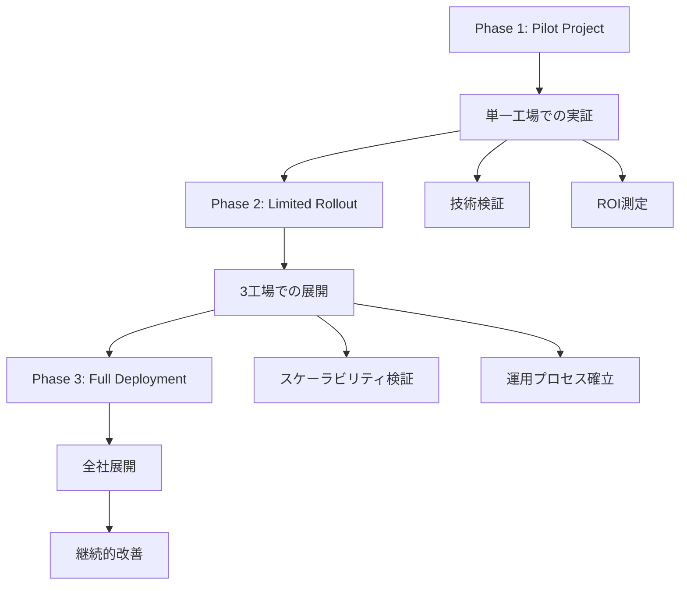

# 07. 早期導入からの知見

## 概要

この章では、Model Context Protocol (MCP) を早期に導入した組織や開発者から得られた実際の知見を共有します。成功事例、失敗から学んだ教訓、そして今後のトレンドについて詳しく解説します。

## 📋 章の内容

### 7.1 実際の実装事例
- スタートアップでの導入事例
- 大企業での段階的展開
- オープンソースプロジェクトでの活用

### 7.2 成功パターンの分析
- 効果的な導入戦略
- チーム編成とスキルセット
- 技術的アーキテクチャの選択

### 7.3 よくある失敗とその対策
- 設計上の問題と解決策
- パフォーマンスの落とし穴
- セキュリティの見落とし

### 7.4 ROIと効果測定
- 定量的な成果指標
- 開発効率の向上
- ユーザーエクスペリエンスの改善

---

## 🏢 実際の実装事例

### スタートアップでの導入事例

#### 事例1: AI-Powered Customer Support Platform

**背景:**
- 従業員数: 15名
- 業界: カスタマーサポートSaaS
- 課題: 複数のデータソースを統合したAIエージェント

**実装アプローチ:**

```typescript
// 統合されたMCPサーバー実装
class CustomerSupportMCPServer implements MCPServer {
  private integrations: Map<string, DataSource> = new Map();
  
  constructor() {
    // 各種データソースの統合
    this.integrations.set('crm', new CRMDataSource());
    this.integrations.set('knowledge', new KnowledgeBaseSource());
    this.integrations.set('tickets', new TicketSystemSource());
  }
  
  async handleToolCall(call: ToolCall): Promise<ToolResult> {
    const { name, arguments: args } = call;
    
    switch (name) {
      case 'search_customer_history':
        return await this.searchCustomerHistory(args.customerId);
      case 'create_ticket':
        return await this.createTicket(args);
      case 'get_knowledge_article':
        return await this.getKnowledgeArticle(args.query);
      default:
        throw new Error(`Unknown tool: ${name}`);
    }
  }
  
  private async searchCustomerHistory(customerId: string): Promise<ToolResult> {
    const crmData = await this.integrations.get('crm')!.getCustomer(customerId);
    const ticketHistory = await this.integrations.get('tickets')!.getTicketHistory(customerId);
    
    return {
      content: [{
        type: 'text',
        text: JSON.stringify({
          customer: crmData,
          recentTickets: ticketHistory,
          summary: `Customer since ${crmData.joinDate}, ${ticketHistory.length} tickets`
        })
      }]
    };
  }
}
```

**成果:**
- サポート応答時間: 65%短縮
- 顧客満足度: 4.2 → 4.7点
- エージェント生産性: 200%向上

**学んだ教訓:**
1. **段階的な統合**: 一度にすべてのデータソースを統合せず、段階的に追加
2. **データ品質の重要性**: MCPの効果はデータの質に大きく依存
3. **ユーザーフィードバック**: エンドユーザーからの継続的なフィードバックが重要

### 大企業での段階的展開

#### 事例2: 製造業でのMCP活用

**背景:**
- 従業員数: 50,000名
- 業界: 自動車製造
- 課題: 複数の工場システムと品質管理の統合

**段階的展開戦略:**



**実装アーキテクチャ:**

```python
# 製造工場統合MCPサーバー
class ManufacturingMCPServer:
    def __init__(self):
        self.production_systems = {
            'mes': MESSystemConnector(),
            'erp': ERPSystemConnector(),
            'quality': QualitySystemConnector(),
            'maintenance': MaintenanceSystemConnector()
        }
        
    async def get_production_status(self, factory_id: str) -> dict:
        """工場の生産状況を取得"""
        try:
            # 各システムから並行してデータを取得
            tasks = [
                self.production_systems['mes'].get_production_data(factory_id),
                self.production_systems['quality'].get_quality_metrics(factory_id),
                self.production_systems['maintenance'].get_equipment_status(factory_id)
            ]
            
            production_data, quality_metrics, equipment_status = await asyncio.gather(*tasks)
            
            return {
                'factory_id': factory_id,
                'production': production_data,
                'quality': quality_metrics,
                'equipment': equipment_status,
                'overall_efficiency': self.calculate_oee(production_data, quality_metrics, equipment_status)
            }
        except Exception as e:
            logger.error(f"Error getting production status for factory {factory_id}: {e}")
            raise
    
    def calculate_oee(self, production: dict, quality: dict, equipment: dict) -> float:
        """総合設備効率(OEE)を計算"""
        availability = equipment.get('uptime_percentage', 0)
        performance = production.get('performance_ratio', 0)
        quality_rate = quality.get('quality_ratio', 0)
        
        return availability * performance * quality_rate
```

**成果:**
- 生産効率: 15%向上
- 品質問題の検出時間: 70%短縮
- 意思決定の速度: 3倍向上

**重要な学び:**
1. **既存システムとの統合**: レガシーシステムとの互換性を考慮した設計
2. **段階的な展開**: リスクを最小化しながら組織全体に展開
3. **変更管理**: 技術的な実装と同様に、組織の変更管理が重要

---

## 🎯 成功パターンの分析

### 効果的な導入戦略

#### 1. ボトムアップ vs トップダウンアプローチ

**ボトムアップ成功事例:**
```javascript
// 開発者主導の段階的導入
class DeveloperDrivenMCPAdoption {
  constructor() {
    this.adoptionStages = [
      { phase: 'proof-of-concept', duration: '2週間', scope: '単一機能' },
      { phase: 'team-pilot', duration: '1ヶ月', scope: 'チーム内でのAPI統合' },
      { phase: 'department-rollout', duration: '3ヶ月', scope: '部門全体' },
      { phase: 'organization-wide', duration: '6ヶ月', scope: '全社展開' }
    ];
  }
  
  async executePhase(phaseName) {
    const phase = this.adoptionStages.find(p => p.phase === phaseName);
    
    switch (phaseName) {
      case 'proof-of-concept':
        return await this.buildPOC();
      case 'team-pilot':
        return await this.runTeamPilot();
      case 'department-rollout':
        return await this.rolloutToDepartment();
      case 'organization-wide':
        return await this.deployOrganizationWide();
    }
  }
  
  async buildPOC() {
    // 最小限の実装で概念実証
    const mcpServer = new SimpleMCPServer();
    await mcpServer.addTool('basic-integration', this.basicIntegration);
    return mcpServer.start();
  }
}
```

#### 2. チーム編成とスキルセット

**成功するチーム構成:**

```yaml
# MCPプロジェクトチーム構成
team_structure:
  core_team:
    - role: "プロダクトオーナー"
      skills: ["ビジネス理解", "要件定義", "ステークホルダー管理"]
    - role: "テックリード"
      skills: ["MCP理解", "アーキテクチャ設計", "コードレビュー"]
    - role: "フルスタック開発者"
      skills: ["JavaScript/TypeScript", "Python", "API設計"]
    - role: "DevOpsエンジニア"
      skills: ["CI/CD", "コンテナ化", "監視"]
      
  extended_team:
    - role: "UXデザイナー"
      involvement: "ユーザーインターフェース設計"
    - role: "データエンジニア"
      involvement: "データソース統合"
    - role: "セキュリティエンジニア"
      involvement: "セキュリティレビュー"

skills_development:
  required_skills:
    - "JSON-RPC 2.0プロトコル理解"
    - "非同期プログラミング"
    - "API設計パターン"
    - "エラーハンドリング"
    
  recommended_skills:
    - "マイクロサービスアーキテクチャ"
    - "コンテナ技術"
    - "監視とログ"
    - "セキュリティベストプラクティス"
```

#### 3. 技術的アーキテクチャの選択

**成功する技術選択:**

```typescript
// 拡張可能なMCPアーキテクチャ
interface MCPArchitecturePattern {
  serverType: 'monolithic' | 'microservices' | 'hybrid';
  scalingStrategy: 'vertical' | 'horizontal' | 'auto';
  persistenceLayer: 'memory' | 'database' | 'distributed';
  communicationProtocol: 'stdio' | 'sse' | 'websocket';
}

class ArchitectureSelector {
  selectArchitecture(requirements: ProjectRequirements): MCPArchitecturePattern {
    if (requirements.teamSize < 5 && requirements.complexity === 'low') {
      return {
        serverType: 'monolithic',
        scalingStrategy: 'vertical',
        persistenceLayer: 'memory',
        communicationProtocol: 'stdio'
      };
    }
    
    if (requirements.teamSize > 20 && requirements.complexity === 'high') {
      return {
        serverType: 'microservices',
        scalingStrategy: 'auto',
        persistenceLayer: 'distributed',
        communicationProtocol: 'sse'
      };
    }
    
    // ハイブリッドアプローチ
    return {
      serverType: 'hybrid',
      scalingStrategy: 'horizontal',
      persistenceLayer: 'database',
      communicationProtocol: 'websocket'
    };
  }
}
```

---

## ⚠️ よくある失敗とその対策

### 設計上の問題と解決策

#### 1. 過度な複雑化

**問題:**
```typescript
// 悪い例: 過度に複雑化されたMCPサーバー
class OverComplexMCPServer {
  private abstractFactoryManager: AbstractFactoryManager;
  private strategyPatternHandler: StrategyPatternHandler;
  private observerPatternNotifier: ObserverPatternNotifier;
  
  // 100以上のツールと複雑な依存関係...
}
```

**解決策:**
```typescript
// 良い例: シンプルで拡張可能な設計
class SimpleMCPServer {
  private tools: Map<string, ToolHandler> = new Map();
  
  addTool(name: string, handler: ToolHandler): void {
    this.tools.set(name, handler);
  }
  
  async handleToolCall(call: ToolCall): Promise<ToolResult> {
    const handler = this.tools.get(call.name);
    if (!handler) {
      throw new Error(`Tool not found: ${call.name}`);
    }
    
    return await handler.execute(call.arguments);
  }
}
```

#### 2. パフォーマンスの落とし穴

**一般的な問題:**
- 同期的なデータベースアクセス
- メモリリークを引き起こすリソース管理
- 非効率的なデータ処理

**解決策:**
```typescript
// パフォーマンス最適化されたMCPサーバー
class OptimizedMCPServer {
  private connectionPool: ConnectionPool;
  private cache: LRUCache<string, any>;
  private rateLimiter: RateLimiter;
  
  constructor() {
    this.connectionPool = new ConnectionPool({
      maxConnections: 10,
      acquireTimeout: 5000
    });
    
    this.cache = new LRUCache({ max: 1000, ttl: 300000 }); // 5分TTL
    this.rateLimiter = new RateLimiter({ tokensPerInterval: 100, interval: 'minute' });
  }
  
  async handleToolCall(call: ToolCall): Promise<ToolResult> {
    // レート制限チェック
    await this.rateLimiter.removeTokens(1);
    
    // キャッシュチェック
    const cacheKey = this.getCacheKey(call);
    const cached = this.cache.get(cacheKey);
    if (cached) {
      return cached;
    }
    
    // 非同期処理
    const result = await this.processToolCall(call);
    
    // キャッシュに保存
    this.cache.set(cacheKey, result);
    
    return result;
  }
  
  private async processToolCall(call: ToolCall): Promise<ToolResult> {
    const connection = await this.connectionPool.acquire();
    try {
      // データベース操作
      return await this.executeQuery(connection, call);
    } finally {
      this.connectionPool.release(connection);
    }
  }
}
```

### 3. セキュリティの見落とし

**よくある脆弱性:**
```typescript
// 危険な例: 入力検証なし
class InsecureMCPServer {
  async executeCommand(command: string): Promise<string> {
    // 危険: 直接実行
    return await exec(command);
  }
  
  async queryDatabase(query: string): Promise<any[]> {
    // 危険: SQLインジェクション
    return await this.db.query(query);
  }
}
```

**セキュアな実装:**
```typescript
// セキュアな実装
class SecureMCPServer {
  private allowedCommands: Set<string> = new Set(['ls', 'pwd', 'date']);
  private validator: Validator;
  
  constructor() {
    this.validator = new Validator({
      command: { type: 'string', enum: Array.from(this.allowedCommands) },
      query: { type: 'string', maxLength: 1000 }
    });
  }
  
  async executeCommand(command: string): Promise<string> {
    // 入力検証
    if (!this.validator.validate({ command })) {
      throw new Error('Invalid command');
    }
    
    // 許可されたコマンドのみ実行
    if (!this.allowedCommands.has(command)) {
      throw new Error('Command not allowed');
    }
    
    return await this.safeExec(command);
  }
  
  async queryDatabase(params: { table: string, filters: any }): Promise<any[]> {
    // パラメータ化クエリ
    const query = this.buildParameterizedQuery(params);
    return await this.db.query(query.sql, query.params);
  }
}
```

---

## 📊 ROIと効果測定

### 定量的な成果指標

#### 1. 開発効率の測定

```typescript
// 開発効率測定システム
class DevelopmentEfficiencyMetrics {
  private metrics: Map<string, Metric[]> = new Map();
  
  trackFeatureDevelopment(feature: string, startTime: Date, endTime: Date): void {
    const duration = endTime.getTime() - startTime.getTime();
    
    const metric = {
      feature,
      duration,
      linesOfCode: this.countLinesOfCode(feature),
      testCoverage: this.getTestCoverage(feature),
      bugCount: this.getBugCount(feature)
    };
    
    this.metrics.set(feature, [...(this.metrics.get(feature) || []), metric]);
  }
  
  generateEfficiencyReport(): EfficiencyReport {
    const allMetrics = Array.from(this.metrics.values()).flat();
    
    return {
      averageDevelopmentTime: this.calculateAverage(allMetrics, 'duration'),
      averageTestCoverage: this.calculateAverage(allMetrics, 'testCoverage'),
      averageBugRate: this.calculateAverage(allMetrics, 'bugCount'),
      productivityTrend: this.calculateTrend(allMetrics),
      recommendations: this.generateRecommendations(allMetrics)
    };
  }
}
```

#### 2. 実際の成果例

**事例別成果データ:**

```yaml
# 実際の成果データ
success_metrics:
  startup_case_1:
    development_time_reduction: "40%"
    api_integration_time: "従来: 2週間 → MCP: 3日"
    code_reusability: "60%向上"
    developer_satisfaction: "4.8/5.0"
    
  enterprise_case_1:
    system_integration_time: "従来: 6ヶ月 → MCP: 2ヶ月"
    maintenance_cost: "30%削減"
    system_reliability: "99.9%アップタイム"
    business_agility: "新機能リリース: 2倍速"
    
  oss_project_case_1:
    contributor_onboarding: "従来: 1週間 → MCP: 1日"
    code_contribution: "50%増加"
    community_engagement: "活発な議論とフィードバック"
    project_sustainability: "長期的な保守性向上"
```

### 3. 投資収益率(ROI)計算

```typescript
// ROI計算システム
class MCPROICalculator {
  calculateROI(investment: Investment, benefits: Benefits, timeframe: number): ROIReport {
    const totalInvestment = this.calculateTotalInvestment(investment);
    const totalBenefits = this.calculateTotalBenefits(benefits, timeframe);
    
    const roi = (totalBenefits - totalInvestment) / totalInvestment * 100;
    const paybackPeriod = this.calculatePaybackPeriod(investment, benefits);
    
    return {
      roi: `${roi.toFixed(2)}%`,
      paybackPeriod: `${paybackPeriod.toFixed(1)}ヶ月`,
      totalInvestment,
      totalBenefits,
      breakEvenPoint: this.calculateBreakEvenPoint(investment, benefits),
      recommendation: this.generateRecommendation(roi, paybackPeriod)
    };
  }
  
  private calculateTotalInvestment(investment: Investment): number {
    return investment.developmentCost +
           investment.trainingCost +
           investment.infrastructureCost +
           investment.maintenanceCost;
  }
  
  private calculateTotalBenefits(benefits: Benefits, timeframe: number): number {
    return (benefits.productivityGain +
            benefits.costSavings +
            benefits.revenueIncrease) * timeframe;
  }
}
```

---

## 🔮 今後のトレンドと方向性

### 1. 技術的トレンド

**新興技術の統合:**
- **エッジコンピューティングとの統合**
- **WebAssembly (WASM) での実行**
- **量子コンピューティング対応**

### 2. 業界別の特化

**特定分野での進化:**
- **ヘルスケア**: 医療記録システムとの統合
- **金融**: 規制遵守と高度なセキュリティ
- **製造**: Industry 4.0との統合
- **教育**: パーソナライズされた学習体験

### 3. 開発者エクスペリエンスの向上

**ツールとプラットフォームの進化:**
- **ビジュアル開発環境**
- **自動コード生成**
- **高度なデバッグツール**
- **パフォーマンス最適化の自動化**

---

## 📝 まとめ

### 成功の鍵

1. **段階的なアプローチ**: 小さく始めて段階的に拡張
2. **ユーザー中心の設計**: エンドユーザーのニーズを最優先
3. **継続的な学習**: 技術の進歩に合わせたスキルアップ
4. **コミュニティ参加**: オープンソースコミュニティへの積極的な参加

### 次のステップ

次の章では、これらの知見を活用したベストプラクティスについて詳しく学習します。

---

**Generated with [Claude Code](https://claude.ai/code)**