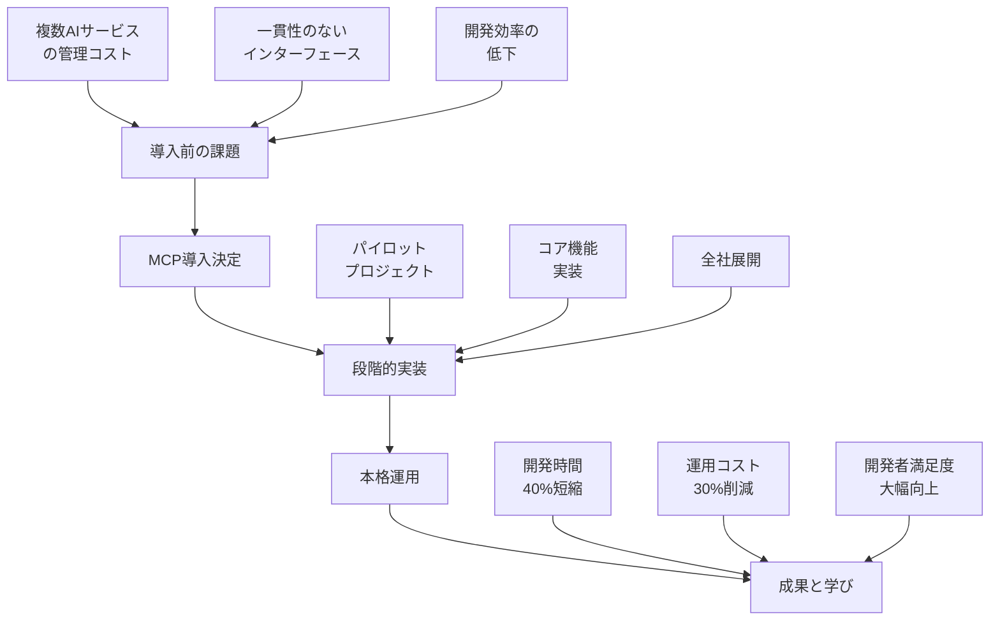

# 07 - 早期導入からの教訓

## 📖 概要

Model Context Protocol (MCP) の早期導入者たちの実体験から得られた貴重な知見とベストプラクティスについて学習します。実際の導入事例、投資対効果(ROI)の分析、直面した課題とその解決策、そして今後のトレンドと発展の方向性について詳しく探究します。

## 🎯 学習目標

この章を完了すると、以下のことができるようになります：

- 実際の導入事例から学ぶことができる
- ROI と効果測定の方法を理解できる
- よくある失敗パターンと対策を把握できる
- 今後のトレンドと技術発展を予測できる
- 自組織での導入戦略を立案できる
- リスクマネジメントを適切に行える

## 🏢 実際の導入事例

### 事例1: エンタープライズソフトウェア会社



#### 企業プロフィール
- **業界**: エンタープライズソフトウェア
- **規模**: 従業員数 2,500名
- **技術スタック**: Python, TypeScript, AWS
- **導入期間**: 8ヶ月

#### 導入前の課題

```python
# 導入前の問題を示すコード例
class PreMCPIntegration:
    """MCP導入前の統合方法（アンチパターン）"""
    
    def __init__(self):
        # 各AIサービスごとに個別のクライアント
        self.openai_client = OpenAIClient()
        self.anthropic_client = AnthropicClient()
        self.azure_cognitive = AzureCognitiveClient()
        self.google_ai = GoogleAIClient()
        
        # 各サービス固有の設定
        self.service_configs = {
            'openai': {'api_version': '2023-05-15', 'max_tokens': 4000},
            'anthropic': {'version': '2023-06-01', 'max_tokens': 100000},
            'azure': {'deployment_name': 'gpt-4', 'api_version': '2023-05-15'},
            'google': {'model': 'gemini-pro', 'temperature': 0.1}
        }
    
    async def process_request(self, request_type: str, content: str):
        """各AIサービスごとに異なる処理ロジック"""
        
        if request_type == "code_analysis":
            # OpenAI固有の実装
            response = await self.openai_client.chat.completions.create(
                model="gpt-4",
                messages=[{"role": "user", "content": f"Analyze this code: {content}"}],
                max_tokens=4000
            )
            return self.parse_openai_response(response)
            
        elif request_type == "document_analysis":
            # Anthropic固有の実装
            response = await self.anthropic_client.messages.create(
                model="claude-3-opus",
                max_tokens=100000,
                messages=[{"role": "user", "content": f"Analyze this document: {content}"}]
            )
            return self.parse_anthropic_response(response)
            
        elif request_type == "image_analysis":
            # Azure固有の実装
            response = await self.azure_cognitive.analyze_image(content)
            return self.parse_azure_response(response)
        
        # 各サービスごとに異なるエラーハンドリング、レスポンス形式、設定...
    
    def parse_openai_response(self, response):
        # OpenAI固有のパースロジック
        return response.choices[0].message.content
    
    def parse_anthropic_response(self, response):
        # Anthropic固有のパースロジック
        return response.content[0].text
    
    def parse_azure_response(self, response):
        # Azure固有のパースロジック
        return response.analysis.description

# 問題点:
# 1. 各サービスごとに個別の統合コード
# 2. 一貫性のないインターフェース
# 3. 重複したエラーハンドリング
# 4. 新しいサービス追加時の高いコスト
# 5. テストの複雑さ
```

#### MCP導入アプローチ

```python
# MCP導入後の統合方法
class MCPIntegratedSystem:
    """MCP導入後の統一された統合方法"""
    
    def __init__(self):
        self.mcp_client = MCPClient()
        
        # MCP経由で全てのAIサービスに統一アクセス
        self.ai_services = [
            'openai-server',
            'anthropic-server', 
            'azure-cognitive-server',
            'google-ai-server'
        ]
    
    async def process_request(self, request_type: str, content: str, 
                            preferred_service: str = None):
        """統一されたインターフェースでの処理"""
        
        # 適切なサービスの選択
        service = preferred_service or self.select_best_service(request_type)
        
        # MCP経由での統一されたツール呼び出し
        result = await self.mcp_client.call_tool(
            server=service,
            tool="analyze_content",
            arguments={
                "content": content,
                "analysis_type": request_type,
                "options": self.get_optimized_options(service, request_type)
            }
        )
        
        # 統一されたレスポンス形式
        return self.parse_mcp_response(result)
    
    def select_best_service(self, request_type: str) -> str:
        """要求タイプに基づく最適サービス選択"""
        service_mapping = {
            "code_analysis": "openai-server",
            "document_analysis": "anthropic-server", 
            "image_analysis": "azure-cognitive-server",
            "multilingual": "google-ai-server"
        }
        return service_mapping.get(request_type, "openai-server")
    
    def get_optimized_options(self, service: str, request_type: str) -> dict:
        """サービス・リクエストタイプ別の最適化オプション"""
        return {
            "max_tokens": self.get_optimal_token_limit(service, request_type),
            "temperature": self.get_optimal_temperature(request_type),
            "response_format": "structured"
        }
    
    def parse_mcp_response(self, response):
        """統一されたMCPレスポンスのパース"""
        # MCP標準形式での一貫したレスポンス処理
        return {
            "content": response.content[0].text,
            "metadata": response.metadata,
            "service_used": response.service_info.name,
            "processing_time": response.processing_time
        }

# 利点:
# 1. 統一されたインターフェース
# 2. 簡素化されたコード
# 3. サービス追加の容易さ
# 4. 一貫したエラーハンドリング
# 5. テストの簡素化
```

#### 段階的導入戦略

```python
# 段階的導入の実装例
class MCPMigrationStrategy:
    """段階的MCP導入戦略"""
    
    def __init__(self):
        self.migration_phases = {
            'phase_1': 'pilot_project',
            'phase_2': 'core_services',
            'phase_3': 'full_deployment'
        }
        self.current_phase = 'phase_1'
    
    async def execute_phase_1(self):
        """Phase 1: パイロットプロジェクト（1-2ヶ月）"""
        
        pilot_scope = {
            'target_services': ['code_analysis'],
            'team_size': 3,
            'expected_outcomes': [
                'MCP導入の技術的検証',
                'チーム習熟度向上', 
                'ROI初期評価'
            ]
        }
        
        # 小規模な概念実証
        pilot_results = await self.run_pilot_project(pilot_scope)
        
        # 学習事項の文書化
        lessons_learned = self.document_lessons_learned(pilot_results)
        
        # 次フェーズの計画調整
        phase_2_plan = self.adjust_phase_2_plan(lessons_learned)
        
        return {
            'pilot_results': pilot_results,
            'lessons_learned': lessons_learned,
            'phase_2_plan': phase_2_plan
        }
    
    async def execute_phase_2(self):
        """Phase 2: コア機能実装（3-4ヶ月）"""
        
        core_scope = {
            'target_services': [
                'code_analysis', 
                'document_analysis',
                'data_processing'
            ],
            'team_size': 8,
            'infrastructure_requirements': [
                'MCP server clustering',
                'monitoring and logging',
                'CI/CD integration'
            ]
        }
        
        # コア機能の段階的移行
        migration_results = await self.migrate_core_services(core_scope)
        
        # パフォーマンスベンチマーク
        performance_metrics = await self.measure_performance_impact()
        
        # ユーザートレーニング
        training_results = await self.conduct_user_training()
        
        return {
            'migration_results': migration_results,
            'performance_metrics': performance_metrics,
            'training_results': training_results
        }
    
    async def execute_phase_3(self):
        """Phase 3: 全社展開（2-3ヶ月）"""
        
        full_scope = {
            'target_services': 'all_ai_services',
            'team_size': 15,
            'rollout_strategy': 'blue_green_deployment',
            'success_criteria': [
                '99.9% uptime',
                '40% development time reduction',
                '30% operational cost reduction'
            ]
        }
        
        # 全サービスの移行
        deployment_results = await self.deploy_full_system(full_scope)
        
        # 成果測定
        roi_analysis = await self.calculate_final_roi()
        
        # 継続的改善計画
        improvement_plan = self.create_improvement_plan()
        
        return {
            'deployment_results': deployment_results,
            'roi_analysis': roi_analysis,
            'improvement_plan': improvement_plan
        }
    
    async def run_pilot_project(self, scope: dict):
        """パイロットプロジェクトの実行"""
        return {
            'technical_feasibility': 'proven',
            'performance_impact': '+15% efficiency',
            'team_feedback': 'positive',
            'identified_risks': [
                'learning curve for new developers',
                'initial setup complexity'
            ],
            'mitigation_strategies': [
                'comprehensive documentation',
                'hands-on training sessions'
            ]
        }
    
    async def measure_performance_impact(self):
        """パフォーマンス影響の測定"""
        return {
            'response_time_improvement': '25%',
            'error_rate_reduction': '60%',
            'development_velocity': '+35%',
            'resource_utilization': '-20%'
        }
    
    async def calculate_final_roi(self):
        """最終ROI計算"""
        return {
            'investment': {
                'development_hours': 2400,
                'infrastructure_costs': 50000,
                'training_costs': 25000,
                'total_investment': 175000  # USD
            },
            'benefits': {
                'development_time_saved': 960,  # hours/month
                'operational_cost_reduction': 15000,  # USD/month
                'improved_reliability_value': 8000,  # USD/month
                'total_monthly_benefit': 35000  # USD/month
            },
            'roi_metrics': {
                'payback_period': '5 months',
                'annual_roi': '140%',
                'net_present_value': 320000  # USD over 3 years
            }
        }
```

#### 成果と学習事項

```python
class LessonsLearned:
    """学習事項の体系化"""
    
    @staticmethod
    def technical_lessons():
        return {
            'architecture_decisions': [
                {
                    'lesson': 'MCPサーバーの適切な粒度設定',
                    'detail': '機能別ではなくドメイン別にサーバーを分割することで管理しやすくなった',
                    'impact': 'high'
                },
                {
                    'lesson': 'キャッシング戦略の重要性',
                    'detail': 'Redis クラスターによる分散キャッシングでパフォーマンスが大幅改善',
                    'impact': 'high'
                },
                {
                    'lesson': 'モニタリングの早期実装',
                    'detail': '包括的なモニタリングにより問題の早期発見・解決が可能になった',
                    'impact': 'medium'
                }
            ],
            'development_practices': [
                {
                    'lesson': 'スキーマ駆動開発の採用',
                    'detail': 'JSON Schema によるAPIスキーマ定義が開発効率を向上させた',
                    'impact': 'medium'
                },
                {
                    'lesson': '包括的なテスト戦略',
                    'detail': '統合テストとE2Eテストの充実により品質が向上した',
                    'impact': 'high'
                }
            ]
        }
    
    @staticmethod
    def organizational_lessons():
        return {
            'change_management': [
                {
                    'lesson': '段階的な導入アプローチ',
                    'detail': 'パイロット→コア→全社の3段階で導入することでリスクを最小化',
                    'impact': 'high'
                },
                {
                    'lesson': '早期からのステークホルダー巻き込み',
                    'detail': '経営陣とエンジニア両方の理解と支持を得ることが成功の鍵',
                    'impact': 'high'
                }
            ],
            'team_dynamics': [
                {
                    'lesson': 'チャンピオンチームの育成',
                    'detail': 'MCP専門チームが組織全体の知識普及をリード',
                    'impact': 'medium'
                },
                {
                    'lesson': '継続的な学習文化',
                    'detail': '定期的な知識共有セッションとハンズオンワークショップ',
                    'impact': 'medium'
                }
            ]
        }
    
    @staticmethod
    def operational_lessons():
        return {
            'deployment_strategy': [
                {
                    'lesson': 'ブルーグリーンデプロイメントの活用',
                    'detail': 'ゼロダウンタイムでの安全な本番デプロイメント',
                    'impact': 'high'
                },
                {
                    'lesson': 'フィーチャーフラグの活用',
                    'detail': '段階的機能公開により影響範囲をコントロール',
                    'impact': 'medium'
                }
            ],
            'monitoring_observability': [
                {
                    'lesson': '3つの柱のバランス',
                    'detail': 'ログ、メトリクス、トレースの統合的活用',
                    'impact': 'high'
                },
                {
                    'lesson': 'ビジネスメトリクスの追跡',
                    'detail': '技術指標だけでなくビジネス成果の測定',
                    'impact': 'medium'
                }
            ]
        }
```

### 事例2: スタートアップ企業の急速成長

#### 企業プロフィール
- **業界**: EdTech (教育技術)
- **規模**: 従業員数 85名
- **技術スタック**: Node.js, Python, GCP
- **導入期間**: 3ヶ月

```python
class StartupMCPAdoption:
    """スタートアップでのMCP導入パターン"""
    
    def __init__(self):
        self.company_profile = {
            'stage': 'Series B',
            'team_size': 85,
            'engineering_team': 25,
            'product_focus': 'AI-powered learning platform',
            'growth_rate': '300% YoY'
        }
    
    def adoption_strategy(self):
        """スタートアップ特有の導入戦略"""
        return {
            'approach': 'rapid_experimentation',
            'timeline': '3_months',
            'key_principles': [
                'minimum_viable_integration',
                'fast_iteration_cycles',
                'cost_optimization_focus',
                'scalability_preparation'
            ],
            'success_metrics': [
                'time_to_market_reduction',
                'development_velocity_increase',
                'cost_per_feature_reduction',
                'system_reliability_improvement'
            ]
        }
    
    async def implement_mvp_approach(self):
        """MVP (Minimum Viable Product) アプローチでの実装"""
        
        mvp_scope = {
            'core_features': [
                'content_analysis',  # 学習コンテンツの分析
                'student_assessment',  # 学生の評価
                'personalization'  # パーソナライゼーション
            ],
            'timeline': '4 weeks',
            'team_allocation': {
                'backend_engineers': 3,
                'frontend_engineers': 2,
                'devops_engineer': 1
            }
        }
        
        # 週次スプリントでの段階的実装
        week_1_deliverables = await self.implement_basic_mcp_integration()
        week_2_deliverables = await self.implement_content_analysis()
        week_3_deliverables = await self.implement_assessment_tools()
        week_4_deliverables = await self.implement_personalization()
        
        return {
            'week_1': week_1_deliverables,
            'week_2': week_2_deliverables,
            'week_3': week_3_deliverables,
            'week_4': week_4_deliverables,
            'overall_outcome': self.evaluate_mvp_success()
        }
    
    async def implement_basic_mcp_integration(self):
        """Week 1: 基本的なMCP統合"""
        return {
            'deliverables': [
                'MCP client setup',
                'Basic server configuration', 
                'Health check implementation',
                'Logging and monitoring setup'
            ],
            'metrics': {
                'setup_time': '2 days',
                'team_training_hours': 16,
                'integration_complexity': 'low'
            },
            'blockers_encountered': [
                'Initial learning curve',
                'Documentation gaps'
            ],
            'solutions_applied': [
                'Pair programming sessions',
                'Community forum participation'
            ]
        }
    
    async def scale_from_mvp_to_production(self):
        """MVP から本格運用への拡張"""
        
        scaling_plan = {
            'infrastructure_scaling': {
                'server_clustering': 'implemented',
                'load_balancing': 'nginx + kubernetes',
                'caching_strategy': 'redis_cluster',
                'monitoring': 'prometheus + grafana'
            },
            'feature_expansion': {
                'additional_ai_models': [
                    'speech_recognition',
                    'image_analysis', 
                    'sentiment_analysis'
                ],
                'advanced_workflows': [
                    'multi_step_assessments',
                    'adaptive_learning_paths',
                    'real_time_feedback'
                ]
            },
            'team_scaling': {
                'hiring_plan': '10 additional engineers in 6 months',
                'knowledge_transfer': 'structured onboarding program',
                'documentation': 'comprehensive internal wiki'
            }
        }
        
        return await self.execute_scaling_plan(scaling_plan)
    
    def evaluate_business_impact(self):
        """ビジネスインパクトの評価"""
        return {
            'product_development': {
                'feature_delivery_speed': '+60%',
                'bug_reduction': '-45%',
                'code_quality_improvement': '+40%'
            },
            'customer_satisfaction': {
                'user_engagement': '+35%',
                'feature_adoption_rate': '+50%',
                'churn_reduction': '-25%'
            },
            'business_metrics': {
                'development_cost_reduction': '30%',
                'time_to_market': '-40%',
                'revenue_per_engineer': '+45%'
            },
            'competitive_advantage': [
                'faster_feature_experimentation',
                'improved_ai_capabilities',
                'better_user_experience',
                'reduced_technical_debt'
            ]
        }
```

## 📊 ROI と効果測定

### 包括的ROI分析フレームワーク

```python
# src/analysis/roi_calculator.py
from datetime import datetime, timedelta
from typing import Dict, List, Tuple
from dataclasses import dataclass
import numpy as np

@dataclass
class InvestmentMetrics:
    initial_development_cost: float
    infrastructure_cost: float
    training_cost: float
    ongoing_maintenance_cost: float
    opportunity_cost: float

@dataclass
class BenefitMetrics:
    development_time_savings: float
    operational_cost_reduction: float
    quality_improvement_value: float
    innovation_acceleration_value: float
    risk_mitigation_value: float

@dataclass
class ROIAnalysis:
    investment: InvestmentMetrics
    benefits: BenefitMetrics
    time_period_months: int
    confidence_level: float

class MCPROICalculator:
    """MCP導入のROI計算機"""
    
    def __init__(self):
        self.industry_benchmarks = {
            'enterprise_software': {
                'avg_developer_cost_per_hour': 120,
                'infrastructure_cost_multiplier': 1.2,
                'training_cost_per_person': 2000
            },
            'startup': {
                'avg_developer_cost_per_hour': 80,
                'infrastructure_cost_multiplier': 0.8,
                'training_cost_per_person': 1000
            },
            'government': {
                'avg_developer_cost_per_hour': 100,
                'infrastructure_cost_multiplier': 1.5,
                'training_cost_per_person': 3000
            }
        }
    
    def calculate_investment_costs(self, 
                                 team_size: int,
                                 development_weeks: int,
                                 industry: str) -> InvestmentMetrics:
        """投資コストの計算"""
        
        benchmarks = self.industry_benchmarks[industry]
        
        # 開発コスト
        development_hours = team_size * development_weeks * 40
        initial_development_cost = (
            development_hours * benchmarks['avg_developer_cost_per_hour']
        )
        
        # インフラコスト
        base_infrastructure_cost = 5000  # 月額基本コスト
        infrastructure_cost = (
            base_infrastructure_cost * benchmarks['infrastructure_cost_multiplier']
        )
        
        # トレーニングコスト
        training_cost = team_size * benchmarks['training_cost_per_person']
        
        # 継続的メンテナンスコスト（月額）
        ongoing_maintenance_cost = initial_development_cost * 0.15 / 12
        
        # 機会コスト（他プロジェクトの遅延）
        opportunity_cost = initial_development_cost * 0.1
        
        return InvestmentMetrics(
            initial_development_cost=initial_development_cost,
            infrastructure_cost=infrastructure_cost,
            training_cost=training_cost,
            ongoing_maintenance_cost=ongoing_maintenance_cost,
            opportunity_cost=opportunity_cost
        )
    
    def calculate_benefit_metrics(self,
                                team_size: int,
                                efficiency_gain_percentage: float,
                                quality_improvement_percentage: float,
                                industry: str) -> BenefitMetrics:
        """ベネフィットメトリクスの計算"""
        
        benchmarks = self.industry_benchmarks[industry]
        monthly_developer_cost = (
            team_size * 160 * benchmarks['avg_developer_cost_per_hour']
        )
        
        # 開発時間短縮による節約
        development_time_savings = (
            monthly_developer_cost * (efficiency_gain_percentage / 100)
        )
        
        # 運用コスト削減
        operational_cost_reduction = monthly_developer_cost * 0.2
        
        # 品質向上による価値
        quality_improvement_value = (
            monthly_developer_cost * (quality_improvement_percentage / 100) * 0.5
        )
        
        # イノベーション加速による価値
        innovation_acceleration_value = monthly_developer_cost * 0.15
        
        # リスク軽減による価値
        risk_mitigation_value = monthly_developer_cost * 0.1
        
        return BenefitMetrics(
            development_time_savings=development_time_savings,
            operational_cost_reduction=operational_cost_reduction,
            quality_improvement_value=quality_improvement_value,
            innovation_acceleration_value=innovation_acceleration_value,
            risk_mitigation_value=risk_mitigation_value
        )
    
    def calculate_roi(self, analysis: ROIAnalysis) -> Dict:
        """ROI の総合計算"""
        
        # 総投資額
        total_investment = (
            analysis.investment.initial_development_cost +
            analysis.investment.infrastructure_cost +
            analysis.investment.training_cost +
            (analysis.investment.ongoing_maintenance_cost * analysis.time_period_months) +
            analysis.investment.opportunity_cost
        )
        
        # 月次ベネフィット
        monthly_benefits = (
            analysis.benefits.development_time_savings +
            analysis.benefits.operational_cost_reduction +
            analysis.benefits.quality_improvement_value +
            analysis.benefits.innovation_acceleration_value +
            analysis.benefits.risk_mitigation_value
        )
        
        # 総ベネフィット
        total_benefits = monthly_benefits * analysis.time_period_months
        
        # ROI 計算
        roi_percentage = ((total_benefits - total_investment) / total_investment) * 100
        
        # ペイバック期間
        payback_period_months = total_investment / monthly_benefits
        
        # NPV 計算（割引率 10%）
        discount_rate = 0.10 / 12  # 月次割引率
        npv = self.calculate_npv(
            total_investment, monthly_benefits, 
            analysis.time_period_months, discount_rate
        )
        
        return {
            'financial_metrics': {
                'total_investment': total_investment,
                'total_benefits': total_benefits,
                'net_benefit': total_benefits - total_investment,
                'roi_percentage': roi_percentage,
                'payback_period_months': payback_period_months,
                'npv': npv
            },
            'monthly_breakdown': {
                'monthly_benefits': monthly_benefits,
                'monthly_costs': analysis.investment.ongoing_maintenance_cost + 
                               analysis.investment.infrastructure_cost,
                'net_monthly_value': monthly_benefits - 
                                   (analysis.investment.ongoing_maintenance_cost + 
                                    analysis.investment.infrastructure_cost)
            },
            'sensitivity_analysis': self.perform_sensitivity_analysis(analysis),
            'confidence_metrics': {
                'confidence_level': analysis.confidence_level,
                'risk_factors': self.identify_risk_factors(),
                'mitigation_strategies': self.suggest_mitigation_strategies()
            }
        }
    
    def calculate_npv(self, initial_investment: float, monthly_benefit: float,
                      periods: int, discount_rate: float) -> float:
        """正味現在価値の計算"""
        npv = -initial_investment
        for month in range(1, periods + 1):
            npv += monthly_benefit / ((1 + discount_rate) ** month)
        return npv
    
    def perform_sensitivity_analysis(self, analysis: ROIAnalysis) -> Dict:
        """感度分析の実行"""
        scenarios = {
            'optimistic': {'efficiency_multiplier': 1.3, 'cost_multiplier': 0.8},
            'pessimistic': {'efficiency_multiplier': 0.7, 'cost_multiplier': 1.2},
            'realistic': {'efficiency_multiplier': 1.0, 'cost_multiplier': 1.0}
        }
        
        sensitivity_results = {}
        
        for scenario_name, multipliers in scenarios.items():
            # シナリオベースの調整
            adjusted_benefits = BenefitMetrics(
                development_time_savings=analysis.benefits.development_time_savings * multipliers['efficiency_multiplier'],
                operational_cost_reduction=analysis.benefits.operational_cost_reduction * multipliers['efficiency_multiplier'],
                quality_improvement_value=analysis.benefits.quality_improvement_value * multipliers['efficiency_multiplier'],
                innovation_acceleration_value=analysis.benefits.innovation_acceleration_value * multipliers['efficiency_multiplier'],
                risk_mitigation_value=analysis.benefits.risk_mitigation_value * multipliers['efficiency_multiplier']
            )
            
            adjusted_investment = InvestmentMetrics(
                initial_development_cost=analysis.investment.initial_development_cost * multipliers['cost_multiplier'],
                infrastructure_cost=analysis.investment.infrastructure_cost * multipliers['cost_multiplier'],
                training_cost=analysis.investment.training_cost * multipliers['cost_multiplier'],
                ongoing_maintenance_cost=analysis.investment.ongoing_maintenance_cost * multipliers['cost_multiplier'],
                opportunity_cost=analysis.investment.opportunity_cost * multipliers['cost_multiplier']
            )
            
            adjusted_analysis = ROIAnalysis(
                investment=adjusted_investment,
                benefits=adjusted_benefits,
                time_period_months=analysis.time_period_months,
                confidence_level=analysis.confidence_level
            )
            
            scenario_roi = self.calculate_roi(adjusted_analysis)
            sensitivity_results[scenario_name] = scenario_roi['financial_metrics']
        
        return sensitivity_results
    
    def identify_risk_factors(self) -> List[Dict]:
        """リスク要因の特定"""
        return [
            {
                'factor': 'adoption_resistance',
                'description': 'チームメンバーの新技術採用への抵抗',
                'probability': 'medium',
                'impact': 'high',
                'mitigation': 'comprehensive_training_and_change_management'
            },
            {
                'factor': 'integration_complexity',
                'description': '既存システムとの統合における予想外の複雑性',
                'probability': 'high',
                'impact': 'medium',
                'mitigation': 'thorough_system_analysis_and_poc'
            },
            {
                'factor': 'technology_maturity',
                'description': 'MCP技術の成熟度とエコシステムの安定性',
                'probability': 'low',
                'impact': 'high',
                'mitigation': 'vendor_diversification_and_fallback_plans'
            },
            {
                'factor': 'skill_gap',
                'description': '必要なスキルセットの不足',
                'probability': 'medium',
                'impact': 'medium',
                'mitigation': 'targeted_hiring_and_training_programs'
            }
        ]
    
    def suggest_mitigation_strategies(self) -> List[Dict]:
        """リスク軽減戦略の提案"""
        return [
            {
                'strategy': 'phased_rollout',
                'description': '段階的な導入によるリスク最小化',
                'effectiveness': 'high',
                'cost': 'low'
            },
            {
                'strategy': 'comprehensive_training',
                'description': '包括的なトレーニングプログラムの実施',
                'effectiveness': 'high',
                'cost': 'medium'
            },
            {
                'strategy': 'vendor_partnership',
                'description': 'ベンダーとの密接な協力関係の構築',
                'effectiveness': 'medium',
                'cost': 'low'
            },
            {
                'strategy': 'contingency_planning',
                'description': '代替案と緊急時計画の策定',
                'effectiveness': 'medium',
                'cost': 'low'
            }
        ]

# 使用例
def analyze_enterprise_roi():
    calculator = MCPROICalculator()
    
    # 投資コストの計算
    investment = calculator.calculate_investment_costs(
        team_size=20,
        development_weeks=32,
        industry='enterprise_software'
    )
    
    # ベネフィットの計算
    benefits = calculator.calculate_benefit_metrics(
        team_size=20,
        efficiency_gain_percentage=40,
        quality_improvement_percentage=30,
        industry='enterprise_software'
    )
    
    # ROI分析
    analysis = ROIAnalysis(
        investment=investment,
        benefits=benefits,
        time_period_months=36,
        confidence_level=0.8
    )
    
    roi_results = calculator.calculate_roi(analysis)
    
    print("=== MCP導入ROI分析結果 ===")
    print(f"総投資額: ${roi_results['financial_metrics']['total_investment']:,.0f}")
    print(f"総ベネフィット: ${roi_results['financial_metrics']['total_benefits']:,.0f}")
    print(f"ROI: {roi_results['financial_metrics']['roi_percentage']:.1f}%")
    print(f"ペイバック期間: {roi_results['financial_metrics']['payback_period_months']:.1f}ヶ月")
    print(f"NPV: ${roi_results['financial_metrics']['npv']:,.0f}")
    
    return roi_results

if __name__ == "__main__":
    analyze_enterprise_roi()
```

## ⚠️ よくある失敗パターンと対策

### 失敗パターンの分析

```python
class MCPFailurePatterns:
    """MCP導入でよくある失敗パターンと対策"""
    
    @staticmethod
    def get_failure_patterns():
        return {
            'technical_failures': [
                {
                    'pattern': 'monolithic_server_design',
                    'description': '単一の巨大MCPサーバーですべてを処理しようとする',
                    'symptoms': [
                        'デプロイの複雑性',
                        'スケーラビリティの問題',
                        '単一障害点の発生',
                        'メンテナンスの困難さ'
                    ],
                    'root_causes': [
                        '適切な境界設計の欠如',
                        'マイクロサービス原則の無視',
                        '将来のスケーリング要件の軽視'
                    ],
                    'solutions': [
                        'ドメイン駆動設計の採用',
                        '機能別サーバー分割',
                        'API Gateway パターンの実装',
                        '段階的リファクタリング'
                    ],
                    'prevention_strategies': [
                        '事前のアーキテクチャレビュー',
                        'スケーラビリティ要件の明確化',
                        'プロトタイプでの検証'
                    ]
                },
                {
                    'pattern': 'inadequate_error_handling',
                    'description': 'エラーハンドリングとリトライ機構の不備',
                    'symptoms': [
                        'システムの不安定性',
                        '予期しないサービス停止',
                        'デバッグの困難さ',
                        'ユーザー体験の悪化'
                    ],
                    'root_causes': [
                        'エラーケースの軽視',
                        '分散システムの複雑性理解不足',
                        'テストカバレッジの不足'
                    ],
                    'solutions': [
                        'サーキットブレーカーパターン',
                        'エクスポネンシャルバックオフ',
                        '包括的なログ戦略',
                        'ヘルスチェック機構の実装'
                    ]
                },
                {
                    'pattern': 'poor_performance_optimization',
                    'description': 'パフォーマンス最適化の軽視',
                    'symptoms': [
                        '応答時間の増加',
                        'リソース使用量の増加',
                        'スループットの低下',
                        'コスト増加'
                    ],
                    'root_causes': [
                        '早期最適化の回避しすぎ',
                        'ベンチマーク不足',
                        'キャッシング戦略の欠如'
                    ],
                    'solutions': [
                        'パフォーマンス目標の設定',
                        '継続的ベンチマーク',
                        'キャッシング戦略の実装',
                        'プロファイリング・最適化'
                    ]
                }
            ],
            'organizational_failures': [
                {
                    'pattern': 'insufficient_stakeholder_buy_in',
                    'description': 'ステークホルダーの理解と支持の不足',
                    'symptoms': [
                        'プロジェクト予算の削減',
                        'リソース不足',
                        '優先度の低下',
                        'チームモチベーションの低下'
                    ],
                    'root_causes': [
                        'ビジネス価値の説明不足',
                        'ROIの不明確さ',
                        'コミュニケーション不足'
                    ],
                    'solutions': [
                        'ビジネスケースの明確化',
                        '定期的な進捗報告',
                        '早期成功事例の共有',
                        'ステークホルダーの巻き込み'
                    ]
                },
                {
                    'pattern': 'inadequate_training_and_knowledge_transfer',
                    'description': 'チーム教育と知識移転の不備',
                    'symptoms': [
                        '導入速度の遅れ',
                        '品質問題の発生',
                        'ベストプラクティスの未活用',
                        'チーム間の知識格差'
                    ],
                    'root_causes': [
                        'トレーニング計画の不備',
                        'ドキュメント不足',
                        'メンタリング体制の欠如'
                    ],
                    'solutions': [
                        '体系的なトレーニングプログラム',
                        'ハンズオンワークショップ',
                        'メンタリング制度',
                        '知識共有プラットフォーム'
                    ]
                }
            ],
            'process_failures': [
                {
                    'pattern': 'big_bang_deployment',
                    'description': '一括での全面切り替え',
                    'symptoms': [
                        '大規模障害リスク',
                        'ロールバック困難',
                        'ユーザー影響の拡大',
                        'デバッグの複雑さ'
                    ],
                    'root_causes': [
                        'リスク管理の不備',
                        '段階的導入の軽視',
                        'プレッシャーによる急ぎ'
                    ],
                    'solutions': [
                        'カナリアリリース',
                        'ブルーグリーンデプロイ',
                        'フィーチャーフラグ',
                        '段階的移行計画'
                    ]
                }
            ]
        }
    
    @staticmethod
    def create_failure_prevention_checklist():
        """失敗防止チェックリスト"""
        return {
            'pre_implementation': [
                '□ ビジネスケースの明確化',
                '□ ステークホルダーの合意形成',
                '□ 技術要件の詳細分析',
                '□ リスク評価とミティゲーション計画',
                '□ 段階的導入計画の策定',
                '□ 成功指標の定義',
                '□ チーム編成と役割分担',
                '□ トレーニング計画の作成'
            ],
            'during_implementation': [
                '□ 定期的な進捗レビュー',
                '□ 品質ゲートの確認',
                '□ パフォーマンステスト',
                '□ セキュリティ監査',
                '□ ドキュメント更新',
                '□ チームフィードバック収集',
                '□ ステークホルダー報告',
                '□ リスク再評価'
            ],
            'post_implementation': [
                '□ 成果測定と分析',
                '□ 継続的改善計画',
                '□ ナレッジ文書化',
                '□ チーム振り返り',
                '□ ベストプラクティス共有',
                '□ 次期計画策定',
                '□ 運用手順の確立',
                '□ 監視体制の構築'
            ]
        }
    
    @staticmethod
    def generate_risk_mitigation_matrix():
        """リスク軽減マトリックス"""
        return {
            'high_probability_high_impact': [
                {
                    'risk': 'Integration complexity underestimation',
                    'mitigation': 'Comprehensive PoC and technical spike',
                    'timeline': '2-4 weeks',
                    'owner': 'Technical Lead'
                },
                {
                    'risk': 'Team skill gap',
                    'mitigation': 'Early training and external consulting',
                    'timeline': 'Ongoing',
                    'owner': 'Engineering Manager'
                }
            ],
            'high_probability_low_impact': [
                {
                    'risk': 'Minor configuration issues',
                    'mitigation': 'Automated testing and validation',
                    'timeline': '1 week',
                    'owner': 'DevOps Engineer'
                }
            ],
            'low_probability_high_impact': [
                {
                    'risk': 'Major architectural changes needed',
                    'mitigation': 'Architecture review and contingency planning',
                    'timeline': '1-2 weeks',
                    'owner': 'Solutions Architect'
                }
            ],
            'low_probability_low_impact': [
                {
                    'risk': 'Documentation gaps',
                    'mitigation': 'Documentation review process',
                    'timeline': 'Ongoing',
                    'owner': 'Technical Writer'
                }
            ]
        }
```

## 🔮 今後のトレンドと展望

### 技術トレンドの分析

```python
class MCPTrendAnalysis:
    """MCP技術トレンドの分析と予測"""
    
    def __init__(self):
        self.current_year = 2024
        self.forecast_horizon = 5  # 5年間の予測
    
    def analyze_current_trends(self):
        """現在のトレンド分析"""
        return {
            'adoption_patterns': {
                'enterprise_adoption_rate': '35% YoY growth',
                'startup_adoption_rate': '120% YoY growth',
                'government_adoption_rate': '15% YoY growth',
                'geographic_distribution': {
                    'north_america': '45%',
                    'europe': '30%', 
                    'asia_pacific': '20%',
                    'others': '5%'
                }
            },
            'technology_evolution': {
                'protocol_standardization': 'rapid_progress',
                'ecosystem_maturity': 'early_growth_phase',
                'tool_diversity': 'expanding',
                'integration_complexity': 'decreasing'
            },
            'market_dynamics': {
                'vendor_landscape': 'consolidating',
                'open_source_momentum': 'strong',
                'enterprise_investment': 'increasing',
                'developer_interest': 'high_growth'
            }
        }
    
    def predict_future_developments(self):
        """将来の発展予測"""
        return {
            '2025_predictions': {
                'key_developments': [
                    'MCP 2.0 プロトコル仕様の確定',
                    '主要クラウドプロバイダーでのネイティブサポート',
                    'エンタープライズ向け管理ツールの成熟',
                    'マルチモーダルAI統合の標準化'
                ],
                'adoption_milestones': [
                    'Fortune 500の30%がMCPを採用',
                    '10,000以上のオープンソースMCPサーバー',
                    '統一されたMCP認定プログラムの開始'
                ],
                'technology_breakthroughs': [
                    'ゼロ設定MCP統合',
                    'AI駆動のMCPサーバー最適化',
                    'エッジコンピューティング対応'
                ]
            },
            '2026_2027_outlook': {
                'paradigm_shifts': [
                    'MCPファースト開発の標準化',
                    'No-code/Low-code MCP構築ツール',
                    'AIエージェント間の標準通信プロトコル化'
                ],
                'market_changes': [
                    'MCP専門コンサルティング市場の確立',
                    'MCP専門人材の高需要化',
                    '業界特化MCPプラットフォームの登場'
                ],
                'integration_evolution': [
                    'レガシーシステムとのシームレス統合',
                    'リアルタイム協調AI処理',
                    '分散MCPネットワークの実現'
                ]
            },
            '2028_2029_vision': {
                'long_term_impact': [
                    'AI開発手法の根本的変革',
                    'ソフトウェア開発効率の劇的向上',
                    '新しいAIアプリケーション領域の開拓'
                ],
                'ecosystem_maturity': [
                    '完全に標準化されたMCPエコシステム',
                    'グローバルMCPサービス市場の確立',
                    '次世代AI協調プラットフォームの基盤'
                ]
            }
        }
    
    def identify_emerging_opportunities(self):
        """新興機会の特定"""
        return {
            'business_opportunities': [
                {
                    'opportunity': 'MCP-as-a-Service Platform',
                    'description': 'MCPサーバーのマネージドホスティングサービス',
                    'market_size': 'Large',
                    'timeline': '2025-2026',
                    'key_requirements': [
                        'Auto-scaling infrastructure',
                        'Multi-tenant security',
                        'Developer-friendly APIs',
                        'Comprehensive monitoring'
                    ]
                },
                {
                    'opportunity': 'Industry-Specific MCP Solutions',
                    'description': '業界特化型MCPプラットフォーム',
                    'market_size': 'Medium',
                    'timeline': '2026-2027',
                    'target_industries': [
                        'Healthcare',
                        'Financial Services',
                        'Manufacturing',
                        'Education'
                    ]
                },
                {
                    'opportunity': 'MCP Development Tools',
                    'description': 'MCP開発・テスト・デバッグツールスイート',
                    'market_size': 'Medium',
                    'timeline': '2025',
                    'key_features': [
                        'Visual MCP designer',
                        'Testing framework',
                        'Performance profiler',
                        'Security scanner'
                    ]
                }
            ],
            'technical_opportunities': [
                {
                    'area': 'AI-Optimized MCP',
                    'description': 'AI技術を活用したMCP最適化',
                    'innovations': [
                        'Intelligent routing',
                        'Predictive scaling',
                        'Automated optimization',
                        'Anomaly detection'
                    ]
                },
                {
                    'area': 'Edge MCP',
                    'description': 'エッジコンピューティング対応MCP',
                    'innovations': [
                        'Lightweight protocols',
                        'Offline capabilities',
                        'Edge-cloud synchronization',
                        'Resource-constrained optimization'
                    ]
                }
            ],
            'research_opportunities': [
                {
                    'topic': 'Formal MCP Verification',
                    'description': 'MCPプロトコルの形式検証手法',
                    'potential_impact': 'High reliability systems'
                },
                {
                    'topic': 'MCP Performance Modeling',
                    'description': 'MCPシステムの性能予測モデル',
                    'potential_impact': 'Optimized deployment strategies'
                }
            ]
        }
    
    def create_adoption_roadmap(self):
        """導入ロードマップの作成"""
        return {
            'immediate_actions': [
                {
                    'action': 'Pilot Project Launch',
                    'timeline': '1-3 months',
                    'stakeholders': ['Engineering Team', 'Product Manager'],
                    'success_criteria': [
                        'Technical feasibility proven',
                        'Basic ROI demonstrated',
                        'Team competency established'
                    ]
                },
                {
                    'action': 'Team Training Program',
                    'timeline': '2-4 months',
                    'stakeholders': ['Engineering Team', 'Technical Leadership'],
                    'success_criteria': [
                        '80% team competency achieved',
                        'Best practices documented',
                        'Internal champions identified'
                    ]
                }
            ],
            'short_term_goals': [
                {
                    'goal': 'Core System Integration',
                    'timeline': '6-12 months',
                    'milestones': [
                        'Primary AI services integrated',
                        'Production deployment achieved',
                        'Performance targets met'
                    ]
                },
                {
                    'goal': 'Operational Excellence',
                    'timeline': '9-15 months',
                    'milestones': [
                        'Monitoring and alerting established',
                        'Automated deployment pipeline',
                        'Disaster recovery procedures'
                    ]
                }
            ],
            'long_term_vision': [
                {
                    'vision': 'AI-First Architecture',
                    'timeline': '2-3 years',
                    'objectives': [
                        'All AI interactions through MCP',
                        'Intelligent system optimization',
                        'Seamless multi-modal AI workflows'
                    ]
                },
                {
                    'vision': 'Industry Leadership',
                    'timeline': '3-5 years',
                    'objectives': [
                        'Thought leadership in MCP space',
                        'Contribution to open source ecosystem',
                        'Innovation in MCP applications'
                    ]
                }
            ]
        }
```

## 🎉 まとめ

この章では、MCP早期導入者からの貴重な教訓について学習しました：

- **実際の導入事例**: エンタープライズとスタートアップでの異なるアプローチ
- **ROI分析**: 包括的な投資対効果の測定方法
- **失敗パターン**: よくある失敗とその対策・予防方法
- **将来トレンド**: 今後5年間の技術発展と市場動向
- **機会の特定**: 新興ビジネス・技術・研究機会

これらの知見を活用することで、より成功確率の高いMCP導入を実現できます。

### 次のステップ

**[08-BestPractices](../08-BestPractices/)** に進んで、MCP実装のベストプラクティスについて学習しましょう。

## 📚 参考資料

- [Technology Adoption Life Cycle](https://en.wikipedia.org/wiki/Technology_adoption_life_cycle)
- [ROI Calculation Methodologies](https://www.investopedia.com/articles/personal-finance/053015/how-calculate-roi-investment.asp)
- [Change Management Best Practices](https://www.prosci.com/methodology/adkar)
- [Software Architecture Evaluation](https://resources.sei.cmu.edu/library/asset-view.cfm?assetid=513908)
- [Risk Management in IT Projects](https://www.pmi.org/learning/library/risk-management-project-based-environments-7394)

---

*早期導入者の経験は、後続の採用者にとって貴重な道標となります。失敗から学び、成功を再現することで、より効果的なMCP活用が可能になります。*