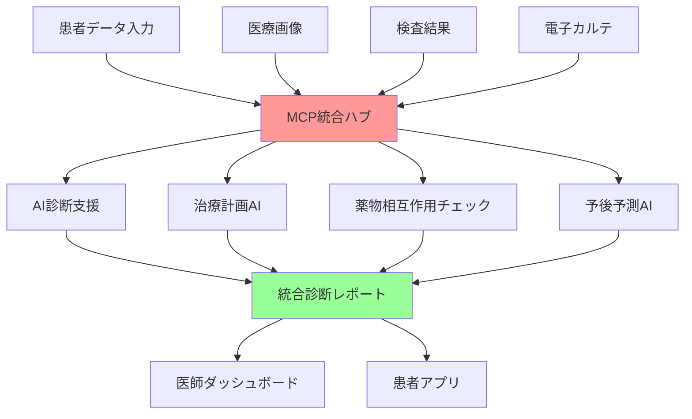
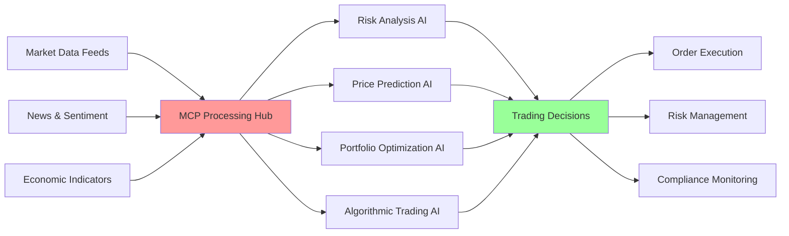

# 09 - ケーススタディ

## 📖 概要

実際のプロダクション環境でのMCP実装事例を通じて、具体的なアーキテクチャ設計、実装パターン、課題解決手法について詳しく学習します。業界別の特化した要件に対応したソリューション、スケーラビリティの実現方法、統合戦略について実践的な知見を習得します。

## 🎯 学習目標

この章を完了すると、以下のことができるようになります：

- 業界特有の要件に対応したMCPアーキテクチャを設計できる
- 実際のプロダクション課題に対する解決策を立案できる
- スケーラブルなMCPシステムの実装パターンを理解できる
- デプロイメント戦略とインフラ設計を最適化できる
- パフォーマンスとコストのバランスを取れる
- 複雑な統合要件に対応できる

## 🏥 ケーススタディ1: ヘルスケアデータ統合プラットフォーム

### プロジェクト概要



#### 要件と制約

- **コンプライアンス**: HIPAA、GDPR準拠
- **可用性**: 99.99%アップタイム要求
- **セキュリティ**: エンドツーエンド暗号化
- **スケーラビリティ**: 1,000病院、100万患者対応
- **レイテンシ**: リアルタイム診断支援（<2秒）

### アーキテクチャ設計

```typescript
// src/healthcare/healthcare-mcp-architecture.ts
import { Server } from '@modelcontextprotocol/sdk/server/index.js';
import { createHash, createCipher, createDecipher } from 'crypto';

interface HealthcareConfig {
  hipaaCompliance: boolean;
  encryptionLevel: 'aes-256-gcm' | 'aes-192-gcm';
  auditLogging: boolean;
  dataRetentionDays: number;
  multiTenancy: boolean;
}

interface PatientData {
  patientId: string;
  demographics: PatientDemographics;
  medicalHistory: MedicalRecord[];
  currentConditions: Condition[];
  medications: Medication[];
  allergies: Allergy[];
  vitalSigns: VitalSigns[];
  labResults: LabResult[];
  imagingStudies: ImagingStudy[];
}

interface AIAnalysisRequest {
  patientId: string;
  analysisType: 'diagnosis' | 'treatment' | 'drug_interaction' | 'prognosis';
  contextData: any;
  urgencyLevel: 'low' | 'medium' | 'high' | 'emergency';
}

export class HealthcareMCPPlatform {
  private server: Server;
  private config: HealthcareConfig;
  private encryptionService: EncryptionService;
  private auditLogger: AuditLogger;
  private complianceMonitor: ComplianceMonitor;
  private aiOrchestrator: AIOrchestrator;
  
  constructor(config: HealthcareConfig) {
    this.config = config;
    this.initializeSecureComponents();
    this.setupMCPServer();
  }
  
  private initializeSecureComponents(): void {
    this.encryptionService = new EncryptionService(this.config.encryptionLevel);
    this.auditLogger = new AuditLogger(this.config.auditLogging);
    this.complianceMonitor = new ComplianceMonitor();
    this.aiOrchestrator = new AIOrchestrator();
  }
  
  private setupMCPServer(): void {
    this.server = new Server({
      name: "healthcare-mcp-platform",
      version: "1.0.0"
    }, {
      capabilities: {
        tools: {},
        resources: {}
      }
    });
    
    // セキュアなツール登録
    this.registerSecureTools();
    
    // リクエストインターセプター（コンプライアンス確保）
    this.setupComplianceInterceptors();
  }
  
  private registerSecureTools(): void {
    // 診断支援ツール
    this.server.setRequestHandler(CallToolRequestSchema, async (request) => {
      const { name, arguments: args } = request.params;
      
      // セキュリティ検証
      await this.validateSecurityContext(request);
      
      // 監査ログ記録
      await this.auditLogger.logAccess(request);
      
      switch (name) {
        case 'ai_diagnosis_support':
          return await this.handleDiagnosisSupport(args);
        
        case 'treatment_recommendation':
          return await this.handleTreatmentRecommendation(args);
        
        case 'drug_interaction_check':
          return await this.handleDrugInteractionCheck(args);
        
        case 'clinical_decision_support':
          return await this.handleClinicalDecisionSupport(args);
        
        case 'patient_risk_assessment':
          return await this.handleRiskAssessment(args);
        
        default:
          throw new Error(`Unknown healthcare tool: ${name}`);
      }
    });
  }
  
  private async handleDiagnosisSupport(args: AIAnalysisRequest): Promise<any> {
    try {
      // 患者データの取得（暗号化された状態）
      const encryptedPatientData = await this.getPatientData(args.patientId);
      
      // 復号化（メモリ内のみ）
      const patientData = await this.encryptionService.decrypt(encryptedPatientData);
      
      // AI分析の実行
      const analysisResult = await this.aiOrchestrator.performDiagnosisAnalysis({
        patientData,
        contextData: args.contextData,
        urgencyLevel: args.urgencyLevel
      });
      
      // 結果の構造化
      const structuredResult = await this.structureDiagnosisResult(analysisResult);
      
      // 信頼度スコアの計算
      const confidenceScore = this.calculateConfidenceScore(structuredResult);
      
      // 結果の暗号化
      const encryptedResult = await this.encryptionService.encrypt({
        diagnosis: structuredResult,
        confidence: confidenceScore,
        timestamp: new Date().toISOString(),
        aiModel: analysisResult.modelUsed,
        compliance: {
          hipaaCompliant: true,
          auditTrail: analysisResult.auditTrail
        }
      });
      
      return {
        content: [
          {
            type: "text",
            text: JSON.stringify(encryptedResult, null, 2)
          }
        ]
      };
    } catch (error) {
      await this.auditLogger.logError('diagnosis_support', error);
      throw new Error(`Diagnosis support failed: ${error.message}`);
    }
  }
  
  private async handleTreatmentRecommendation(args: AIAnalysisRequest): Promise<any> {
    try {
      const patientData = await this.getDecryptedPatientData(args.patientId);
      
      // 複数AIモデルによる治療推奨
      const recommendations = await Promise.all([
        this.aiOrchestrator.performTreatmentAnalysis('primary_model', patientData),
        this.aiOrchestrator.performTreatmentAnalysis('secondary_model', patientData),
        this.aiOrchestrator.performTreatmentAnalysis('specialist_model', patientData)
      ]);
      
      // 推奨の統合と検証
      const consolidatedRecommendations = this.consolidateRecommendations(recommendations);
      
      // 臨床ガイドライン検証
      const guidelineCompliant = await this.validateAgainstGuidelines(
        consolidatedRecommendations, 
        patientData
      );
      
      // エビデンスレベルの付与
      const evidenceAnnotated = this.annotateWithEvidence(consolidatedRecommendations);
      
      return {
        content: [
          {
            type: "text",
            text: JSON.stringify({
              recommendations: evidenceAnnotated,
              guidelineCompliance: guidelineCompliant,
              riskFactors: this.identifyRiskFactors(patientData),
              followUpRequired: this.determineFollowUp(evidenceAnnotated)
            }, null, 2)
          }
        ]
      };
    } catch (error) {
      await this.auditLogger.logError('treatment_recommendation', error);
      throw error;
    }
  }
  
  private async handleDrugInteractionCheck(args: any): Promise<any> {
    const { patientId, proposedMedications } = args;
    
    try {
      const patientData = await this.getDecryptedPatientData(patientId);
      const currentMedications = patientData.medications;
      
      // 薬物相互作用の包括的チェック
      const interactionAnalysis = await this.performDrugInteractionAnalysis({
        currentMedications,
        proposedMedications,
        patientFactors: {
          age: patientData.demographics.age,
          weight: patientData.demographics.weight,
          kidneyFunction: patientData.labResults.find(l => l.type === 'kidney_function'),
          liverFunction: patientData.labResults.find(l => l.type === 'liver_function'),
          allergies: patientData.allergies
        }
      });
      
      // 重要度によるリスク分類
      const riskClassification = this.classifyInteractionRisks(interactionAnalysis);
      
      // 代替薬の提案
      const alternatives = await this.suggestAlternatives(
        proposedMedications, 
        riskClassification.highRisk
      );
      
      return {
        content: [
          {
            type: "text",
            text: JSON.stringify({
              interactionAnalysis: riskClassification,
              alternativeMedications: alternatives,
              monitoringRequirements: this.generateMonitoringPlan(riskClassification),
              patientEducation: this.generatePatientEducation(proposedMedications)
            }, null, 2)
          }
        ]
      };
    } catch (error) {
      await this.auditLogger.logError('drug_interaction_check', error);
      throw error;
    }
  }
  
  private async performDrugInteractionAnalysis(params: any): Promise<any> {
    // 薬物データベースとの照合
    const drugDatabase = await this.getDrugInteractionDatabase();
    
    // 各薬物ペアの相互作用チェック
    const interactions = [];
    
    for (const currentMed of params.currentMedications) {
      for (const proposedMed of params.proposedMedications) {
        const interaction = drugDatabase.checkInteraction(
          currentMed.activeIngredient,
          proposedMed.activeIngredient
        );
        
        if (interaction.severity !== 'none') {
          interactions.push({
            drug1: currentMed,
            drug2: proposedMed,
            interaction,
            patientSpecificRisk: this.calculatePatientSpecificRisk(
              interaction,
              params.patientFactors
            )
          });
        }
      }
    }
    
    return interactions;
  }
  
  private classifyInteractionRisks(interactions: any[]): any {
    return {
      highRisk: interactions.filter(i => i.patientSpecificRisk >= 0.8),
      moderateRisk: interactions.filter(i => i.patientSpecificRisk >= 0.5 && i.patientSpecificRisk < 0.8),
      lowRisk: interactions.filter(i => i.patientSpecificRisk < 0.5),
      contraindications: interactions.filter(i => i.interaction.contraindicated)
    };
  }
  
  private async getPatientData(patientId: string): Promise<any> {
    // 患者データの安全な取得
    return await this.encryptionService.getEncryptedData(`patient:${patientId}`);
  }
  
  private async getDecryptedPatientData(patientId: string): Promise<PatientData> {
    const encryptedData = await this.getPatientData(patientId);
    return await this.encryptionService.decrypt(encryptedData);
  }
  
  private async validateSecurityContext(request: any): Promise<void> {
    // アクセス権限の検証
    const accessToken = request.headers?.authorization;
    if (!accessToken) {
      throw new Error('Authentication required');
    }
    
    // トークンの検証
    const isValid = await this.validateAccessToken(accessToken);
    if (!isValid) {
      throw new Error('Invalid access token');
    }
    
    // RBAC (Role-Based Access Control) の検証
    const userRole = await this.getUserRole(accessToken);
    const requiredPermission = this.getRequiredPermission(request.params.name);
    
    if (!this.hasPermission(userRole, requiredPermission)) {
      throw new Error('Insufficient permissions');
    }
  }
  
  private setupComplianceInterceptors(): void {
    // HIPAA コンプライアンスの自動チェック
    this.server.setRequestHandler(ListToolsRequestSchema, async (request) => {
      await this.complianceMonitor.checkHIPAACompliance(request);
      return this.getAvailableTools(request);
    });
  }
}

// 暗号化サービス
class EncryptionService {
  private algorithm: string;
  
  constructor(algorithm: string) {
    this.algorithm = algorithm;
  }
  
  async encrypt(data: any): Promise<string> {
    const jsonString = JSON.stringify(data);
    const cipher = createCipher(this.algorithm, process.env.ENCRYPTION_KEY!);
    let encrypted = cipher.update(jsonString, 'utf8', 'hex');
    encrypted += cipher.final('hex');
    return encrypted;
  }
  
  async decrypt(encryptedData: string): Promise<any> {
    const decipher = createDecipher(this.algorithm, process.env.ENCRYPTION_KEY!);
    let decrypted = decipher.update(encryptedData, 'hex', 'utf8');
    decrypted += decipher.final('utf8');
    return JSON.parse(decrypted);
  }
  
  async getEncryptedData(key: string): Promise<string> {
    // データベースから暗号化されたデータを取得
    return "encrypted_patient_data";
  }
}

// 監査ログサービス
class AuditLogger {
  private enabled: boolean;
  
  constructor(enabled: boolean) {
    this.enabled = enabled;
  }
  
  async logAccess(request: any): Promise<void> {
    if (!this.enabled) return;
    
    const logEntry = {
      timestamp: new Date().toISOString(),
      userId: this.extractUserId(request),
      action: request.params.name,
      patientId: request.params.arguments?.patientId,
      ipAddress: request.headers?.['x-forwarded-for'],
      userAgent: request.headers?.['user-agent'],
      sessionId: request.headers?.['session-id']
    };
    
    // 監査ログの永続化
    await this.persistAuditLog(logEntry);
  }
  
  async logError(action: string, error: Error): Promise<void> {
    const errorLog = {
      timestamp: new Date().toISOString(),
      action,
      error: error.message,
      stack: error.stack
    };
    
    await this.persistErrorLog(errorLog);
  }
  
  private extractUserId(request: any): string {
    // リクエストからユーザーIDを抽出
    return request.headers?.['user-id'] || 'unknown';
  }
  
  private async persistAuditLog(logEntry: any): Promise<void> {
    // 監査ログの永続化実装
    console.log('Audit log:', logEntry);
  }
  
  private async persistErrorLog(errorLog: any): Promise<void> {
    // エラーログの永続化実装
    console.error('Error log:', errorLog);
  }
}

// コンプライアンス監視
class ComplianceMonitor {
  async checkHIPAACompliance(request: any): Promise<void> {
    // HIPAA 最小必要性原則の確認
    const dataAccessed = this.analyzeDataAccess(request);
    if (!this.isMinimalNecessary(dataAccessed)) {
      throw new Error('HIPAA violation: Excessive data access detected');
    }
    
    // アクセス目的の正当性確認
    const purpose = request.params.arguments?.purpose;
    if (!this.isLegitimateHealthcarePurpose(purpose)) {
      throw new Error('HIPAA violation: Invalid purpose for data access');
    }
  }
  
  private analyzeDataAccess(request: any): string[] {
    // アクセスされるデータフィールドの分析
    return ['demographics', 'medical_history', 'current_medications'];
  }
  
  private isMinimalNecessary(dataFields: string[]): boolean {
    // 最小必要性の判定ロジック
    const allowedFields = ['demographics', 'current_conditions', 'medications'];
    return dataFields.every(field => allowedFields.includes(field));
  }
  
  private isLegitimateHealthcarePurpose(purpose: string): boolean {
    const validPurposes = [
      'treatment',
      'diagnosis',
      'care_coordination',
      'quality_improvement',
      'research_irb_approved'
    ];
    return validPurposes.includes(purpose);
  }
}

// AI オーケストレーター
class AIOrchestrator {
  async performDiagnosisAnalysis(params: any): Promise<any> {
    // 複数AIモデルの統合診断
    const models = ['clinical_bert', 'medical_gpt', 'radiology_cnn'];
    
    const results = await Promise.all(
      models.map(model => this.runDiagnosisModel(model, params))
    );
    
    return this.consolidateDiagnosisResults(results);
  }
  
  async performTreatmentAnalysis(modelName: string, patientData: any): Promise<any> {
    // 治療推奨AIの実行
    return {
      modelUsed: modelName,
      recommendations: [
        {
          treatment: 'medication_adjustment',
          confidence: 0.85,
          evidence: 'clinical_guidelines_v2.1'
        }
      ],
      auditTrail: `Analysis performed by ${modelName} at ${new Date().toISOString()}`
    };
  }
  
  private async runDiagnosisModel(model: string, params: any): Promise<any> {
    // 個別診断モデルの実行
    return {
      model,
      diagnosis: 'preliminary_diagnosis',
      confidence: 0.75,
      reasoning: 'Based on symptom analysis and medical history'
    };
  }
  
  private consolidateDiagnosisResults(results: any[]): any {
    // 複数モデル結果の統合
    return {
      consolidatedDiagnosis: 'final_diagnosis',
      modelConsensus: 0.80,
      individualResults: results,
      modelUsed: 'ensemble_diagnosis_v1.0'
    };
  }
}
```

### デプロイメントアーキテクチャ

```yaml
# k8s/healthcare-deployment.yaml
apiVersion: apps/v1
kind: Deployment
metadata:
  name: healthcare-mcp-platform
  namespace: healthcare-prod
spec:
  replicas: 6
  selector:
    matchLabels:
      app: healthcare-mcp
  template:
    metadata:
      labels:
        app: healthcare-mcp
      annotations:
        vault.hashicorp.com/agent-inject: "true"
        vault.hashicorp.com/agent-inject-secret-encryption: "secret/healthcare/encryption"
    spec:
      securityContext:
        runAsNonRoot: true
        fsGroup: 1000
      containers:
      - name: mcp-server
        image: healthcare-mcp:v1.2.3
        ports:
        - containerPort: 3000
        env:
        - name: NODE_ENV
          value: "production"
        - name: HIPAA_MODE
          value: "enabled"
        - name: ENCRYPTION_LEVEL
          value: "aes-256-gcm"
        resources:
          requests:
            memory: "1Gi"
            cpu: "500m"
          limits:
            memory: "2Gi"
            cpu: "1000m"
        livenessProbe:
          httpGet:
            path: /health
            port: 3000
          initialDelaySeconds: 30
          periodSeconds: 10
        readinessProbe:
          httpGet:
            path: /ready
            port: 3000
          initialDelaySeconds: 5
          periodSeconds: 5
        securityContext:
          allowPrivilegeEscalation: false
          readOnlyRootFilesystem: true
          capabilities:
            drop:
            - ALL

---
apiVersion: v1
kind: Service
metadata:
  name: healthcare-mcp-service
  namespace: healthcare-prod
spec:
  selector:
    app: healthcare-mcp
  ports:
  - port: 443
    targetPort: 3000
    protocol: TCP
  type: LoadBalancer
  annotations:
    service.beta.kubernetes.io/aws-load-balancer-ssl-cert: "arn:aws:acm:us-west-2:123456789:certificate/abc123"
    service.beta.kubernetes.io/aws-load-balancer-ssl-ports: "443"
    service.beta.kubernetes.io/aws-load-balancer-backend-protocol: "http"

---
apiVersion: networking.k8s.io/v1
kind: NetworkPolicy
metadata:
  name: healthcare-mcp-network-policy
  namespace: healthcare-prod
spec:
  podSelector:
    matchLabels:
      app: healthcare-mcp
  policyTypes:
  - Ingress
  - Egress
  ingress:
  - from:
    - namespaceSelector:
        matchLabels:
          name: healthcare-frontend
    ports:
    - protocol: TCP
      port: 3000
  egress:
  - to:
    - namespaceSelector:
        matchLabels:
          name: healthcare-data
    ports:
    - protocol: TCP
      port: 5432
```

## 🏢 ケーススタディ2: 金融トレーディングシステム

### システム要求



### 高性能取引システム実装

```typescript
// src/trading/high-frequency-trading-system.ts
interface TradingConfig {
  maxLatencyMs: number;
  riskLimits: RiskLimits;
  complianceRules: ComplianceRule[];
  marketDataSources: string[];
  tradingHours: TradingHours;
}

interface MarketData {
  symbol: string;
  price: number;
  volume: number;
  timestamp: number;
  bid: number;
  ask: number;
  spread: number;
}

interface TradingSignal {
  symbol: string;
  action: 'buy' | 'sell' | 'hold';
  quantity: number;
  confidence: number;
  reasoning: string;
  timeToExecute: number;
}

export class HighFrequencyTradingMCP {
  private server: Server;
  private config: TradingConfig;
  private marketDataProcessor: MarketDataProcessor;
  private riskEngine: RiskEngine;
  private complianceEngine: ComplianceEngine;
  private orderManager: OrderManager;
  private latencyMonitor: LatencyMonitor;
  
  constructor(config: TradingConfig) {
    this.config = config;
    this.initializeComponents();
    this.setupTradingServer();
  }
  
  private initializeComponents(): void {
    this.marketDataProcessor = new MarketDataProcessor();
    this.riskEngine = new RiskEngine(this.config.riskLimits);
    this.complianceEngine = new ComplianceEngine(this.config.complianceRules);
    this.orderManager = new OrderManager();
    this.latencyMonitor = new LatencyMonitor(this.config.maxLatencyMs);
  }
  
  private setupTradingServer(): void {
    this.server = new Server({
      name: "hft-trading-mcp",
      version: "1.0.0"
    }, {
      capabilities: {
        tools: {},
        resources: {}
      }
    });
    
    this.registerTradingTools();
    this.setupRealtimeDataStreaming();
  }
  
  private registerTradingTools(): void {
    this.server.setRequestHandler(CallToolRequestSchema, async (request) => {
      const startTime = performance.now();
      
      try {
        const { name, arguments: args } = request.params;
        
        let result;
        switch (name) {
          case 'market_analysis':
            result = await this.performMarketAnalysis(args);
            break;
          
          case 'risk_assessment':
            result = await this.performRiskAssessment(args);
            break;
          
          case 'generate_trading_signals':
            result = await this.generateTradingSignals(args);
            break;
          
          case 'execute_trade':
            result = await this.executeTrade(args);
            break;
          
          case 'portfolio_optimization':
            result = await this.optimizePortfolio(args);
            break;
          
          default:
            throw new Error(`Unknown trading tool: ${name}`);
        }
        
        // レイテンシ監視
        const latency = performance.now() - startTime;
        this.latencyMonitor.recordLatency(name, latency);
        
        if (latency > this.config.maxLatencyMs) {
          console.warn(`High latency detected: ${name} took ${latency}ms`);
        }
        
        return result;
      } catch (error) {
        console.error(`Trading tool error: ${error.message}`);
        throw error;
      }
    });
  }
  
  private async performMarketAnalysis(args: any): Promise<any> {
    const { symbols, timeframe, analysisTypes } = args;
    
    // リアルタイム市場データの取得
    const marketData = await this.getRealtimeMarketData(symbols);
    
    // 複数の分析手法を並列実行
    const analysisPromises = analysisTypes.map(async (type: string) => {
      switch (type) {
        case 'technical_analysis':
          return await this.performTechnicalAnalysis(marketData, timeframe);
        case 'sentiment_analysis':
          return await this.performSentimentAnalysis(symbols);
        case 'volume_analysis':
          return await this.performVolumeAnalysis(marketData);
        case 'volatility_analysis':
          return await this.performVolatilityAnalysis(marketData);
        default:
          return null;
      }
    });
    
    const analysisResults = await Promise.all(analysisPromises);
    
    // 分析結果の統合
    const consolidatedAnalysis = this.consolidateMarketAnalysis(analysisResults);
    
    return {
      content: [
        {
          type: "text",
          text: JSON.stringify({
            timestamp: Date.now(),
            symbols,
            analysis: consolidatedAnalysis,
            marketSummary: this.generateMarketSummary(consolidatedAnalysis),
            recommendedActions: this.generateRecommendations(consolidatedAnalysis)
          }, null, 2)
        }
      ]
    };
  }
  
  private async performTechnicalAnalysis(marketData: MarketData[], timeframe: string): Promise<any> {
    const technicalIndicators = {
      sma: this.calculateSMA(marketData, 20),
      ema: this.calculateEMA(marketData, 12),
      rsi: this.calculateRSI(marketData, 14),
      macd: this.calculateMACD(marketData),
      bollinger: this.calculateBollingerBands(marketData, 20),
      fibonacci: this.calculateFibonacciRetracements(marketData)
    };
    
    // トレンド分析
    const trendAnalysis = this.analyzeTrend(technicalIndicators);
    
    // サポート・レジスタンスレベル
    const supportResistance = this.identifySupportResistance(marketData);
    
    // シグナル生成
    const signals = this.generateTechnicalSignals(technicalIndicators, trendAnalysis);
    
    return {
      indicators: technicalIndicators,
      trend: trendAnalysis,
      supportResistance,
      signals,
      confidence: this.calculateTechnicalConfidence(signals)
    };
  }
  
  private async performRiskAssessment(args: any): Promise<any> {
    const { portfolioData, proposedTrades, marketConditions } = args;
    
    // VaR (Value at Risk) 計算
    const valueAtRisk = await this.calculateVaR(portfolioData, proposedTrades);
    
    // ストレステスト
    const stressTestResults = await this.performStressTest(portfolioData, marketConditions);
    
    // 相関分析
    const correlationAnalysis = await this.analyzePortfolioCorrelations(portfolioData);
    
    // リスク指標の計算
    const riskMetrics = this.calculateRiskMetrics(portfolioData, proposedTrades);
    
    // リスク制限の確認
    const riskLimitChecks = this.checkRiskLimits(riskMetrics);
    
    return {
      content: [
        {
          type: "text",
          text: JSON.stringify({
            valueAtRisk,
            stressTestResults,
            correlationAnalysis,
            riskMetrics,
            riskLimitChecks,
            recommendations: this.generateRiskRecommendations(riskMetrics),
            maxExposure: this.calculateMaxAllowableExposure(riskMetrics)
          }, null, 2)
        }
      ]
    };
  }
  
  private async generateTradingSignals(args: any): Promise<any> {
    const { symbols, strategy, riskTolerance } = args;
    
    // マルチファクター分析
    const factors = await this.analyzeMultipleFactors(symbols);
    
    // 機械学習モデルによる予測
    const mlPredictions = await this.generateMLPredictions(symbols, factors);
    
    // 量的分析
    const quantAnalysis = await this.performQuantitativeAnalysis(symbols);
    
    // シグナル統合
    const consolidatedSignals = this.consolidateSignals([
      factors,
      mlPredictions,
      quantAnalysis
    ]);
    
    // リスク調整
    const riskAdjustedSignals = this.adjustSignalsForRisk(
      consolidatedSignals,
      riskTolerance
    );
    
    // 執行可能性チェック
    const executableSignals = await this.filterExecutableSignals(riskAdjustedSignals);
    
    return {
      content: [
        {
          type: "text",
          text: JSON.stringify({
            signals: executableSignals,
            strategy,
            confidence: this.calculateSignalConfidence(executableSignals),
            expectedReturns: this.calculateExpectedReturns(executableSignals),
            riskMetrics: this.calculateSignalRisk(executableSignals)
          }, null, 2)
        }
      ]
    };
  }
  
  private async executeTrade(args: any): Promise<any> {
    const { symbol, action, quantity, orderType, timeInForce } = args;
    
    try {
      // プリトレードリスクチェック
      const riskCheck = await this.riskEngine.preTradeRiskCheck({
        symbol,
        action,
        quantity,
        currentPortfolio: await this.getCurrentPortfolio()
      });
      
      if (!riskCheck.approved) {
        throw new Error(`Trade rejected: ${riskCheck.reason}`);
      }
      
      // コンプライアンスチェック
      const complianceCheck = await this.complianceEngine.validateTrade({
        symbol,
        action,
        quantity,
        timestamp: Date.now()
      });
      
      if (!complianceCheck.approved) {
        throw new Error(`Compliance violation: ${complianceCheck.reason}`);
      }
      
      // 最適執行戦略の決定
      const executionStrategy = await this.determineExecutionStrategy({
        symbol,
        quantity,
        marketConditions: await this.getCurrentMarketConditions(symbol)
      });
      
      // 注文実行
      const executionResult = await this.orderManager.executeOrder({
        symbol,
        action,
        quantity,
        orderType,
        timeInForce,
        strategy: executionStrategy
      });
      
      // ポストトレード分析
      const executionAnalysis = await this.analyzeExecution(executionResult);
      
      return {
        content: [
          {
            type: "text",
            text: JSON.stringify({
              executionResult,
              executionAnalysis,
              riskMetrics: await this.updateRiskMetricsPostTrade(executionResult),
              portfolioImpact: await this.calculatePortfolioImpact(executionResult)
            }, null, 2)
          }
        ]
      };
    } catch (error) {
      await this.logTradeError(symbol, action, quantity, error);
      throw error;
    }
  }
  
  private async getRealtimeMarketData(symbols: string[]): Promise<MarketData[]> {
    // 複数のデータソースから最新の市場データを取得
    const dataPromises = symbols.map(symbol => 
      this.marketDataProcessor.getLatestData(symbol)
    );
    
    const results = await Promise.all(dataPromises);
    return results.filter(data => data !== null);
  }
  
  private calculateSMA(marketData: MarketData[], period: number): number[] {
    const prices = marketData.map(d => d.price);
    const sma = [];
    
    for (let i = period - 1; i < prices.length; i++) {
      const sum = prices.slice(i - period + 1, i + 1).reduce((a, b) => a + b, 0);
      sma.push(sum / period);
    }
    
    return sma;
  }
  
  private calculateEMA(marketData: MarketData[], period: number): number[] {
    const prices = marketData.map(d => d.price);
    const ema = [prices[0]];
    const multiplier = 2 / (period + 1);
    
    for (let i = 1; i < prices.length; i++) {
      ema.push((prices[i] * multiplier) + (ema[i - 1] * (1 - multiplier)));
    }
    
    return ema;
  }
  
  private calculateRSI(marketData: MarketData[], period: number): number[] {
    const prices = marketData.map(d => d.price);
    const gains = [];
    const losses = [];
    
    for (let i = 1; i < prices.length; i++) {
      const change = prices[i] - prices[i - 1];
      gains.push(change > 0 ? change : 0);
      losses.push(change < 0 ? Math.abs(change) : 0);
    }
    
    const rsi = [];
    let avgGain = gains.slice(0, period).reduce((a, b) => a + b, 0) / period;
    let avgLoss = losses.slice(0, period).reduce((a, b) => a + b, 0) / period;
    
    rsi.push(100 - (100 / (1 + (avgGain / avgLoss))));
    
    for (let i = period; i < gains.length; i++) {
      avgGain = ((avgGain * (period - 1)) + gains[i]) / period;
      avgLoss = ((avgLoss * (period - 1)) + losses[i]) / period;
      rsi.push(100 - (100 / (1 + (avgGain / avgLoss))));
    }
    
    return rsi;
  }
  
  private async calculateVaR(portfolioData: any, proposedTrades: any): Promise<any> {
    // Historical Simulation Method
    const historicalReturns = await this.getHistoricalReturns(portfolioData);
    const confidenceLevel = 0.95;
    
    // モンテカルロシミュレーション
    const simulatedReturns = this.runMonteCarloSimulation(portfolioData, 10000);
    
    // VaR計算
    const historicalVaR = this.calculateHistoricalVaR(historicalReturns, confidenceLevel);
    const monteCarloVaR = this.calculateMonteCarloVaR(simulatedReturns, confidenceLevel);
    
    return {
      oneDayVaR: {
        historical: historicalVaR,
        monteCarlo: monteCarloVaR
      },
      tenDayVaR: {
        historical: historicalVaR * Math.sqrt(10),
        monteCarlo: monteCarloVaR * Math.sqrt(10)
      },
      confidenceLevel
    };
  }
}

// リスクエンジン
class RiskEngine {
  private riskLimits: RiskLimits;
  
  constructor(riskLimits: RiskLimits) {
    this.riskLimits = riskLimits;
  }
  
  async preTradeRiskCheck(tradeRequest: any): Promise<any> {
    // ポジションサイズ限度チェック
    const positionCheck = this.checkPositionLimits(tradeRequest);
    
    // 集中度リスクチェック
    const concentrationCheck = this.checkConcentrationRisk(tradeRequest);
    
    // 流動性リスクチェック
    const liquidityCheck = await this.checkLiquidityRisk(tradeRequest);
    
    // 全体的なリスク評価
    const approved = positionCheck.approved && 
                    concentrationCheck.approved && 
                    liquidityCheck.approved;
    
    return {
      approved,
      checks: {
        position: positionCheck,
        concentration: concentrationCheck,
        liquidity: liquidityCheck
      },
      reason: approved ? 'All risk checks passed' : 'Risk limit violation'
    };
  }
  
  private checkPositionLimits(tradeRequest: any): any {
    const maxPositionSize = this.riskLimits.maxPositionSize[tradeRequest.symbol] || 
                          this.riskLimits.defaultMaxPosition;
    
    const approved = tradeRequest.quantity <= maxPositionSize;
    
    return {
      approved,
      currentLimit: maxPositionSize,
      requestedSize: tradeRequest.quantity,
      utilization: tradeRequest.quantity / maxPositionSize
    };
  }
  
  private checkConcentrationRisk(tradeRequest: any): any {
    // セクター、地域、資産クラス別の集中度チェック
    return {
      approved: true,
      sectorConcentration: 0.15,
      maxAllowed: 0.25
    };
  }
  
  private async checkLiquidityRisk(tradeRequest: any): Promise<any> {
    // 流動性指標の取得
    const liquidityMetrics = await this.getLiquidityMetrics(tradeRequest.symbol);
    
    const approved = liquidityMetrics.averageDailyVolume > tradeRequest.quantity * 10;
    
    return {
      approved,
      averageDailyVolume: liquidityMetrics.averageDailyVolume,
      bidAskSpread: liquidityMetrics.bidAskSpread,
      marketImpact: this.estimateMarketImpact(tradeRequest, liquidityMetrics)
    };
  }
  
  private async getLiquidityMetrics(symbol: string): Promise<any> {
    return {
      averageDailyVolume: 1000000,
      bidAskSpread: 0.01,
      marketDepth: 500000
    };
  }
  
  private estimateMarketImpact(tradeRequest: any, liquidityMetrics: any): number {
    // 市場インパクトの推定
    const volumeRatio = tradeRequest.quantity / liquidityMetrics.averageDailyVolume;
    return volumeRatio * liquidityMetrics.bidAskSpread * 0.1;
  }
}

// 型定義
interface RiskLimits {
  maxPositionSize: Record<string, number>;
  defaultMaxPosition: number;
  maxSectorConcentration: number;
  maxVaR: number;
  maxDrawdown: number;
}

interface ComplianceRule {
  id: string;
  type: 'position_limit' | 'trading_hours' | 'insider_trading' | 'market_manipulation';
  parameters: any;
}

interface TradingHours {
  market: string;
  open: string;
  close: string;
  timezone: string;
}
```

## 🎓 ケーススタディ3: 教育プラットフォーム統合

### マルチテナント学習システム

```typescript
// src/education/multi-tenant-learning-platform.ts
interface TenantConfig {
  tenantId: string;
  schoolDistrict: string;
  studentCount: number;
  gradeRanges: string[];
  subjects: string[];
  learningObjectives: LearningObjective[];
  privacySettings: PrivacySettings;
}

interface LearningObjective {
  id: string;
  subject: string;
  gradeLevel: string;
  description: string;
  skills: string[];
  assessmentCriteria: AssessmentCriteria[];
}

interface StudentProfile {
  studentId: string;
  tenantId: string;
  gradeLevel: string;
  learningStyle: 'visual' | 'auditory' | 'kinesthetic' | 'reading';
  currentLevel: Record<string, number>; // subject -> proficiency level
  learningGoals: string[];
  specialNeeds: string[];
  parentalConsent: boolean;
}

export class MultiTenantEducationMCP {
  private server: Server;
  private tenantManager: TenantManager;
  private learningAnalytics: LearningAnalytics;
  private contentRecommendation: ContentRecommendationEngine;
  private assessmentEngine: AssessmentEngine;
  private progressTracker: ProgressTracker;
  
  constructor() {
    this.initializeComponents();
    this.setupEducationServer();
  }
  
  private initializeComponents(): void {
    this.tenantManager = new TenantManager();
    this.learningAnalytics = new LearningAnalytics();
    this.contentRecommendation = new ContentRecommendationEngine();
    this.assessmentEngine = new AssessmentEngine();
    this.progressTracker = new ProgressTracker();
  }
  
  private setupEducationServer(): void {
    this.server = new Server({
      name: "multi-tenant-education-mcp",
      version: "1.0.0"
    }, {
      capabilities: {
        tools: {},
        resources: {}
      }
    });
    
    this.registerEducationTools();
    this.setupTenantIsolation();
  }
  
  private registerEducationTools(): void {
    this.server.setRequestHandler(CallToolRequestSchema, async (request) => {
      const { name, arguments: args } = request.params;
      
      // テナント認証・認可
      const tenantContext = await this.validateTenantAccess(request);
      
      // プライバシー保護チェック
      await this.enforcePrivacyProtection(args, tenantContext);
      
      switch (name) {
        case 'personalized_learning_path':
          return await this.generatePersonalizedLearningPath(args, tenantContext);
        
        case 'adaptive_assessment':
          return await this.conductAdaptiveAssessment(args, tenantContext);
        
        case 'learning_analytics':
          return await this.provideLearningAnalytics(args, tenantContext);
        
        case 'content_recommendation':
          return await this.recommendContent(args, tenantContext);
        
        case 'progress_prediction':
          return await this.predictLearningProgress(args, tenantContext);
        
        case 'intervention_recommendation':
          return await this.recommendInterventions(args, tenantContext);
        
        default:
          throw new Error(`Unknown education tool: ${name}`);
      }
    });
  }
  
  private async generatePersonalizedLearningPath(args: any, tenantContext: any): Promise<any> {
    const { studentId, subject, targetObjectives, timeFrame } = args;
    
    // 学生プロファイルの取得
    const studentProfile = await this.getStudentProfile(studentId, tenantContext.tenantId);
    
    // 現在の習熟度評価
    const currentProficiency = await this.assessCurrentProficiency(studentProfile, subject);
    
    // 学習スタイル分析
    const learningStyleAnalysis = await this.analyzeLearningStyle(studentProfile);
    
    // カリキュラムマッピング
    const curriculumMapping = await this.mapCurriculumObjectives(
      subject,
      targetObjectives,
      tenantContext.config.learningObjectives
    );
    
    // 適応的学習パス生成
    const learningPath = await this.generateAdaptivePath({
      studentProfile,
      currentProficiency,
      learningStyleAnalysis,
      curriculumMapping,
      timeFrame
    });
    
    // パーソナライゼーションの適用
    const personalizedPath = await this.applyPersonalization(learningPath, studentProfile);
    
    return {
      content: [
        {
          type: "text",
          text: JSON.stringify({
            studentId,
            subject,
            learningPath: personalizedPath,
            estimatedCompletion: this.estimateCompletionTime(personalizedPath),
            milestones: this.defineMilestones(personalizedPath),
            recommendedSchedule: this.generateStudySchedule(personalizedPath, timeFrame)
          }, null, 2)
        }
      ]
    };
  }
  
  private async conductAdaptiveAssessment(args: any, tenantContext: any): Promise<any> {
    const { studentId, subject, assessmentType, adaptivityLevel } = args;
    
    const studentProfile = await this.getStudentProfile(studentId, tenantContext.tenantId);
    
    // 適応的質問生成
    const questions = await this.generateAdaptiveQuestions({
      studentProfile,
      subject,
      assessmentType,
      adaptivityLevel
    });
    
    // 難易度調整アルゴリズム
    const difficultyAdjuster = new DifficultyAdjuster(studentProfile.currentLevel[subject]);
    
    // リアルタイム適応評価
    const assessmentFlow = await this.createAdaptiveAssessmentFlow({
      questions,
      difficultyAdjuster,
      studentProfile
    });
    
    return {
      content: [
        {
          type: "text",
          text: JSON.stringify({
            assessmentId: `assessment_${Date.now()}`,
            studentId,
            subject,
            assessmentFlow,
            estimatedDuration: this.estimateAssessmentDuration(assessmentFlow),
            adaptationStrategy: difficultyAdjuster.getStrategy()
          }, null, 2)
        }
      ]
    };
  }
  
  private async provideLearningAnalytics(args: any, tenantContext: any): Promise<any> {
    const { analysisScope, timeRange, studentIds, metrics } = args;
    
    // データプライバシーの確保
    const anonymizedData = await this.anonymizeStudentData(studentIds, tenantContext);
    
    // 学習分析の実行
    const analytics = await this.learningAnalytics.performAnalysis({
      scope: analysisScope,
      timeRange,
      data: anonymizedData,
      metrics,
      tenantConfig: tenantContext.config
    });
    
    // インサイトの生成
    const insights = await this.generateEducationalInsights(analytics);
    
    // 推奨アクションの提案
    const recommendations = await this.generateActionableRecommendations(insights);
    
    return {
      content: [
        {
          type: "text",
          text: JSON.stringify({
            analytics,
            insights,
            recommendations,
            privacyCompliance: {
              anonymized: true,
              tenantIsolated: true,
              consentVerified: true
            }
          }, null, 2)
        }
      ]
    };
  }
  
  private async recommendContent(args: any, tenantContext: any): Promise<any> {
    const { studentId, subject, currentTopic, difficulty, contentTypes } = args;
    
    const studentProfile = await this.getStudentProfile(studentId, tenantContext.tenantId);
    
    // コンテンツフィルタリング（テナント固有）
    const availableContent = await this.getAvailableContent(
      tenantContext.tenantId,
      subject,
      contentTypes
    );
    
    // 協調フィルタリング
    const collaborativeRecommendations = await this.getCollaborativeRecommendations(
      studentProfile,
      availableContent
    );
    
    // コンテンツベースフィルタリング
    const contentBasedRecommendations = await this.getContentBasedRecommendations(
      studentProfile,
      currentTopic,
      availableContent
    );
    
    // ハイブリッド推奨システム
    const hybridRecommendations = await this.combineRecommendations([
      collaborativeRecommendations,
      contentBasedRecommendations
    ]);
    
    // 学習効果予測
    const effectivenessPrediction = await this.predictContentEffectiveness(
      hybridRecommendations,
      studentProfile
    );
    
    return {
      content: [
        {
          type: "text",
          text: JSON.stringify({
            recommendations: hybridRecommendations,
            effectivenessPrediction,
            personalizationFactors: this.getPersonalizationFactors(studentProfile),
            nextSteps: this.generateNextSteps(hybridRecommendations, studentProfile)
          }, null, 2)
        }
      ]
    };
  }
  
  private async validateTenantAccess(request: any): Promise<any> {
    const tenantId = request.headers?.['x-tenant-id'];
    if (!tenantId) {
      throw new Error('Tenant ID required');
    }
    
    const tenantConfig = await this.tenantManager.getTenantConfig(tenantId);
    if (!tenantConfig) {
      throw new Error('Invalid tenant');
    }
    
    return {
      tenantId,
      config: tenantConfig
    };
  }
  
  private async enforcePrivacyProtection(args: any, tenantContext: any): Promise<void> {
    const privacySettings = tenantContext.config.privacySettings;
    
    // COPPA (児童オンラインプライバシー保護法) 準拠チェック
    if (privacySettings.coppaCompliance) {
      await this.validateCOPPACompliance(args);
    }
    
    // FERPA (家族教育権およびプライバシー法) 準拠チェック
    if (privacySettings.ferpaCompliance) {
      await this.validateFERPACompliance(args);
    }
    
    // 保護者同意の確認
    if (args.studentId) {
      const hasConsent = await this.verifyParentalConsent(args.studentId, tenantContext.tenantId);
      if (!hasConsent) {
        throw new Error('Parental consent required');
      }
    }
  }
  
  private setupTenantIsolation(): void {
    // データベースレベルでのテナント分離
    this.tenantManager.setupRowLevelSecurity();
    
    // アプリケーションレベルでのデータ分離
    this.setupApplicationLevelIsolation();
    
    // リソース制限の設定
    this.setupResourceLimits();
  }
  
  private async getStudentProfile(studentId: string, tenantId: string): Promise<StudentProfile> {
    // テナント分離されたデータ取得
    return await this.tenantManager.getStudentData(studentId, tenantId);
  }
  
  private async generateAdaptivePath(params: any): Promise<any> {
    const {
      studentProfile,
      currentProficiency,
      learningStyleAnalysis,
      curriculumMapping,
      timeFrame
    } = params;
    
    // 学習経路最適化アルゴリズム
    const pathOptimizer = new LearningPathOptimizer();
    
    // 個人化された学習シーケンス
    const learningSequence = await pathOptimizer.optimize({
      startingPoint: currentProficiency,
      targetObjectives: curriculumMapping.objectives,
      learningStyle: learningStyleAnalysis.dominantStyle,
      availableTime: timeFrame,
      constraints: curriculumMapping.prerequisites
    });
    
    return learningSequence;
  }
}

// テナント管理
class TenantManager {
  private tenantConfigs: Map<string, TenantConfig> = new Map();
  
  async getTenantConfig(tenantId: string): Promise<TenantConfig | null> {
    return this.tenantConfigs.get(tenantId) || null;
  }
  
  async getStudentData(studentId: string, tenantId: string): Promise<StudentProfile> {
    // Row-Level Security を使用してテナント分離
    const query = `
      SELECT * FROM students 
      WHERE student_id = $1 AND tenant_id = $2
    `;
    
    // データベースクエリの実行（実装は省略）
    return {
      studentId,
      tenantId,
      gradeLevel: '5th',
      learningStyle: 'visual',
      currentLevel: { math: 75, science: 82, reading: 68 },
      learningGoals: ['improve_math_fluency', 'advance_reading_comprehension'],
      specialNeeds: [],
      parentalConsent: true
    };
  }
  
  setupRowLevelSecurity(): void {
    // PostgreSQL Row-Level Security の設定
    const policies = [
      `CREATE POLICY tenant_isolation ON students FOR ALL TO app_user USING (tenant_id = current_setting('app.tenant_id'))`,
      `CREATE POLICY tenant_isolation ON assessments FOR ALL TO app_user USING (tenant_id = current_setting('app.tenant_id'))`,
      `CREATE POLICY tenant_isolation ON learning_content FOR ALL TO app_user USING (tenant_id = current_setting('app.tenant_id'))`
    ];
    
    // ポリシーの適用（実装は省略）
  }
  
  setupApplicationLevelIsolation(): void {
    // アプリケーションレベルでのデータ分離実装
  }
  
  setupResourceLimits(): void {
    // テナント別のリソース制限設定
  }
}

// 学習分析エンジン
class LearningAnalytics {
  async performAnalysis(params: any): Promise<any> {
    const { scope, timeRange, data, metrics, tenantConfig } = params;
    
    const analysisResults = {};
    
    for (const metric of metrics) {
      switch (metric) {
        case 'engagement_patterns':
          analysisResults[metric] = await this.analyzeEngagementPatterns(data, timeRange);
          break;
        case 'learning_velocity':
          analysisResults[metric] = await this.analyzeLearningVelocity(data, timeRange);
          break;
        case 'knowledge_gaps':
          analysisResults[metric] = await this.identifyKnowledgeGaps(data);
          break;
        case 'prediction_accuracy':
          analysisResults[metric] = await this.evaluatePredictionAccuracy(data);
          break;
      }
    }
    
    return analysisResults;
  }
  
  private async analyzeEngagementPatterns(data: any, timeRange: any): Promise<any> {
    // エンゲージメントパターンの分析
    return {
      averageSessionDuration: 24.5, // minutes
      completionRate: 0.78,
      peakEngagementHours: ['10:00-11:00', '14:00-15:00'],
      engagementTrends: {
        increasing: 0.65,
        stable: 0.25,
        decreasing: 0.10
      }
    };
  }
  
  private async analyzeLearningVelocity(data: any, timeRange: any): Promise<any> {
    // 学習速度の分析
    return {
      averageConceptMastery: 3.2, // days per concept
      acceleratingStudents: 0.35,
      atPaceStudents: 0.45,
      strugglingStudents: 0.20
    };
  }
  
  private async identifyKnowledgeGaps(data: any): Promise<any> {
    // 知識ギャップの特定
    return {
      commonGaps: [
        { topic: 'fractions', affectedStudents: 0.42 },
        { topic: 'reading_comprehension', affectedStudents: 0.38 },
        { topic: 'scientific_method', affectedStudents: 0.31 }
      ],
      prerequisiteGaps: [
        { prerequisite: 'basic_arithmetic', impact: 'high' },
        { prerequisite: 'phonics', impact: 'medium' }
      ]
    };
  }
}

// 型定義
interface PrivacySettings {
  coppaCompliance: boolean;
  ferpaCompliance: boolean;
  dataRetentionDays: number;
  parentalConsentRequired: boolean;
  anonymizationLevel: 'none' | 'partial' | 'full';
}

interface AssessmentCriteria {
  skill: string;
  masteryThreshold: number;
  assessmentMethod: string;
}
```

## 🎉 まとめ

この章では、実際のプロダクション環境でのMCP実装事例を通じて、具体的な課題解決手法について学習しました：

- **ヘルスケア事例**: HIPAA準拠、エンドツーエンド暗号化、医療AI統合
- **金融事例**: 高頻度取引、リスク管理、リアルタイム分析
- **教育事例**: マルチテナンシー、プライバシー保護、適応学習

これらの事例から、業界特有の要件に対応したMCPアーキテクチャの設計パターンと実装手法を理解できます。

### 次のステップ

**[10-StreamliningAIWorkflows](../10-StreamliningAIWorkflows/)** に進んで、AI Toolkitを活用したMCPサーバー構築について学習しましょう。

## 📚 参考資料

- [Healthcare Data Security Standards](https://www.hhs.gov/hipaa/for-professionals/security/index.html)
- [Financial Services Cybersecurity Framework](https://www.nist.gov/cyberframework)
- [Educational Privacy Laws (FERPA/COPPA)](https://studentprivacy.ed.gov/)
- [Multi-Tenant Architecture Patterns](https://docs.microsoft.com/en-us/azure/architecture/guide/multitenant/overview)
- [Real-time Trading Systems](https://www.springer.com/gp/book/9783030916596)

---

*実際のケーススタディから学ぶことで、理論と実践のギャップを埋め、より効果的なMCPシステムの構築が可能になります。業界特有の制約と要件を理解することが、成功への鍵となります。*