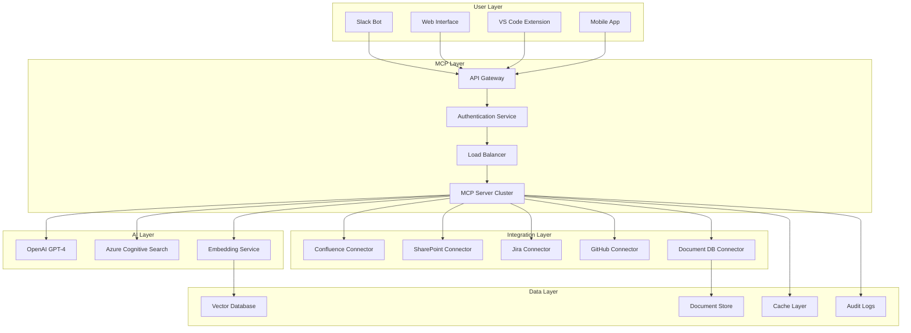

# 09. MCPケーススタディ

## 概要

この章では、Model Context Protocol (MCP) を活用した実際のソリューションの詳細分析を行います。異なる業界での実装例、アーキテクチャ設計、デプロイメント戦略、そして学んだ教訓について包括的に解説します。

## 📋 章の内容

### 9.1 企業向けナレッジ管理システム
- システム要件と設計
- MCP統合アーキテクチャ
- 実装詳細と課題解決

### 9.2 ヘルスケアデータ統合プラットフォーム
- 規制要件と セキュリティ対策
- 相互運用性の実現
- パフォーマンス最適化

### 9.3 金融トレーディングシステム
- リアルタイム処理
- 高可用性設計
- リスク管理

### 9.4 教育プラットフォーム統合
- パーソナライズされた学習体験
- マルチテナント設計
- スケーラビリティ

---

## 🏢 ケーススタディ1: 企業向けナレッジ管理システム

### プロジェクト概要

**企業情報:**
- 業界: テクノロジーコンサルティング
- 従業員数: 5,000名
- 課題: 分散したナレッジソースの統合と検索

**システム要件:**
- 50以上の異なるデータソースの統合
- 自然言語での検索とQ&A
- セキュアなアクセス制御
- 99.9%の可用性

### MCPアーキテクチャ設計



### 実装詳細

#### 1. メインMCPサーバー実装

```typescript
// 企業ナレッジ管理MCPサーバー
class EnterpriseKnowledgeMCPServer implements MCPServer {
  private connectors: Map<string, DataConnector> = new Map();
  private aiService: AIService;
  private searchService: SearchService;
  private securityManager: SecurityManager;
  
  constructor() {
    this.initializeConnectors();
    this.aiService = new OpenAIService({
      model: 'gpt-4',
      temperature: 0.1
    });
    this.searchService = new AzureCognitiveSearch();
    this.securityManager = new EnterpriseSecurityManager();
  }
  
  async handleToolCall(call: ToolCall): Promise<ToolResult> {
    // セキュリティチェック
    await this.securityManager.validateAccess(call.context.user, call.name);
    
    // ツール実行
    switch (call.name) {
      case 'search_knowledge':
        return await this.searchKnowledge(call.arguments);
      case 'get_document':
        return await this.getDocument(call.arguments);
      case 'ask_question':
        return await this.askQuestion(call.arguments);
      case 'create_summary':
        return await this.createSummary(call.arguments);
      default:
        throw new Error(`Unknown tool: ${call.name}`);
    }
  }
  
  private async searchKnowledge(args: any): Promise<ToolResult> {
    const { query, filters, limit = 10 } = args;
    
    try {
      // 複数のコネクターから並行検索
      const searchTasks = Array.from(this.connectors.entries()).map(
        async ([name, connector]) => {
          try {
            return await connector.search(query, filters, limit);
          } catch (error) {
            logger.warn(`Search failed for ${name}:`, error);
            return { source: name, results: [], error: error.message };
          }
        }
      );
      
      const searchResults = await Promise.allSettled(searchTasks);
      
      // 結果の統合と重複排除
      const allResults = this.mergeAndDeduplicateResults(searchResults);
      
      // AI による関連性ランキング
      const rankedResults = await this.aiService.rankByRelevance(query, allResults);
      
      return {
        content: [{
          type: 'text',
          text: JSON.stringify({
            query,
            totalResults: rankedResults.length,
            results: rankedResults.slice(0, limit),
            searchTime: Date.now(),
            sources: this.getSearchSources(searchResults)
          })
        }]
      };
    } catch (error) {
      logger.error('Knowledge search failed:', error);
      throw new Error(`Search failed: ${error.message}`);
    }
  }
  
  private async askQuestion(args: any): Promise<ToolResult> {
    const { question, context } = args;
    
    // 関連文書の検索
    const relevantDocs = await this.searchService.findRelevantDocuments(question);
    
    // コンテキストの構築
    const enhancedContext = this.buildEnhancedContext(relevantDocs, context);
    
    // AI による回答生成
    const answer = await this.aiService.generateAnswer({
      question,
      context: enhancedContext,
      systemPrompt: this.getSystemPrompt()
    });
    
    // 回答の信頼性評価
    const confidence = await this.evaluateAnswerConfidence(answer, relevantDocs);
    
    return {
      content: [{
        type: 'text',
        text: JSON.stringify({
          question,
          answer: answer.text,
          confidence,
          sources: answer.sources,
          relatedDocuments: relevantDocs.slice(0, 3)
        })
      }]
    };
  }
  
  private initializeConnectors(): void {
    // 各種データソースコネクターの初期化
    this.connectors.set('confluence', new ConfluenceConnector({
      baseUrl: process.env.CONFLUENCE_URL,
      token: process.env.CONFLUENCE_TOKEN
    }));
    
    this.connectors.set('sharepoint', new SharePointConnector({
      tenantId: process.env.SHAREPOINT_TENANT_ID,
      clientId: process.env.SHAREPOINT_CLIENT_ID,
      clientSecret: process.env.SHAREPOINT_CLIENT_SECRET
    }));
    
    this.connectors.set('jira', new JiraConnector({
      host: process.env.JIRA_HOST,
      email: process.env.JIRA_EMAIL,
      token: process.env.JIRA_TOKEN
    }));
    
    this.connectors.set('github', new GitHubConnector({
      org: process.env.GITHUB_ORG,
      token: process.env.GITHUB_TOKEN
    }));
  }
}
```

#### 2. データコネクター実装例

```typescript
// Confluence コネクター
class ConfluenceConnector implements DataConnector {
  private client: ConfluenceAPI;
  private cache: LRUCache<string, any>;
  
  constructor(config: ConfluenceConfig) {
    this.client = new ConfluenceAPI(config);
    this.cache = new LRUCache({ max: 500, ttl: 300000 }); // 5分キャッシュ
  }
  
  async search(query: string, filters: any, limit: number): Promise<SearchResult[]> {
    const cacheKey = `search:${query}:${JSON.stringify(filters)}`;
    const cached = this.cache.get(cacheKey);
    if (cached) {
      return cached;
    }
    
    try {
      const searchParams = {
        cql: this.buildCQLQuery(query, filters),
        limit,
        expand: 'body.storage,version,space'
      };
      
      const response = await this.client.content.search(searchParams);
      
      const results = response.results.map(page => ({
        id: page.id,
        title: page.title,
        content: this.extractTextContent(page.body.storage.value),
        url: `${this.client.baseUrl}/pages/viewpage.action?pageId=${page.id}`,
        source: 'confluence',
        lastModified: page.version.when,
        space: page.space.name,
        type: 'page'
      }));
      
      this.cache.set(cacheKey, results);
      return results;
    } catch (error) {
      logger.error('Confluence search failed:', error);
      throw new Error(`Confluence search error: ${error.message}`);
    }
  }
  
  async getDocument(id: string): Promise<Document> {
    const cacheKey = `doc:${id}`;
    const cached = this.cache.get(cacheKey);
    if (cached) {
      return cached;
    }
    
    try {
      const page = await this.client.content.getById({
        id,
        expand: 'body.storage,version,space,children.page'
      });
      
      const document = {
        id: page.id,
        title: page.title,
        content: this.extractTextContent(page.body.storage.value),
        htmlContent: page.body.storage.value,
        metadata: {
          space: page.space.name,
          lastModified: page.version.when,
          version: page.version.number,
          author: page.version.by.displayName
        },
        children: page.children?.page?.results || []
      };
      
      this.cache.set(cacheKey, document);
      return document;
    } catch (error) {
      logger.error(`Failed to get Confluence document ${id}:`, error);
      throw new Error(`Document retrieval error: ${error.message}`);
    }
  }
  
  private buildCQLQuery(query: string, filters: any): string {
    let cql = `text ~ "${query}"`;
    
    if (filters.space) {
      cql += ` and space.key = "${filters.space}"`;
    }
    
    if (filters.type) {
      cql += ` and type = "${filters.type}"`;
    }
    
    if (filters.lastModified) {
      cql += ` and lastModified >= "${filters.lastModified}"`;
    }
    
    return cql;
  }
}
```

### 実装成果と課題

#### 成果指標

```yaml
performance_metrics:
  search_response_time:
    average: "850ms"
    p95: "1.2s"
    p99: "2.1s"
  
  user_satisfaction:
    relevance_score: "4.6/5.0"
    ease_of_use: "4.4/5.0"
    response_accuracy: "89%"
  
  business_impact:
    knowledge_discovery_time: "-70%"
    duplicate_work_reduction: "-45%"
    employee_productivity: "+25%"
    onboarding_time: "-60%"
    
  technical_metrics:
    uptime: "99.94%"
    cache_hit_rate: "78%"
    concurrent_users: "2,500"
    daily_queries: "45,000"
```

#### 課題と解決策

**課題1: データ品質の不整合**
```typescript
// データ品質向上システム
class DataQualityManager {
  async analyzeDocumentQuality(document: Document): Promise<QualityScore> {
    const checks = await Promise.all([
      this.checkContentLength(document),
      this.checkMetadataCompleteness(document),
      this.checkLanguageQuality(document),
      this.checkRecency(document),
      this.checkDuplication(document)
    ]);
    
    return this.calculateOverallScore(checks);
  }
  
  async improveDataQuality(document: Document): Promise<Document> {
    // 自動的な品質改善
    const improved = { ...document };
    
    // タイトルの正規化
    improved.title = this.normalizeTitle(improved.title);
    
    // メタデータの補完
    improved.metadata = await this.enhanceMetadata(improved.metadata);
    
    // 重複コンテンツの統合
    improved.content = await this.deduplicateContent(improved.content);
    
    return improved;
  }
}
```

---

## 🏥 ケーススタディ2: ヘルスケアデータ統合プラットフォーム

### プロジェクト概要

**医療機関情報:**
- 業界: 総合病院ネットワーク
- 施設数: 15病院
- 課題: 分散した電子カルテシステムの統合

**規制要件:**
- HIPAA準拠
- HL7 FHIR標準対応
- データ暗号化 (保存時・転送時)
- 監査ログの完全性

### セキュアなMCPアーキテクチャ

```typescript
// HIPAA準拠MCPサーバー
class HIPAACompliantMCPServer implements MCPServer {
  private encryptionService: EncryptionService;
  private auditLogger: AuditLogger;
  private accessController: AccessController;
  private fhirConnectors: Map<string, FHIRConnector> = new Map();
  
  constructor() {
    this.encryptionService = new FIPS140EncryptionService();
    this.auditLogger = new HIPAAAuditLogger();
    this.accessController = new RoleBasedAccessController();
    this.initializeFHIRConnectors();
  }
  
  async handleToolCall(call: ToolCall): Promise<ToolResult> {
    // 監査ログの開始
    const auditId = await this.auditLogger.startAudit({
      userId: call.context.user.id,
      action: call.name,
      timestamp: new Date(),
      ipAddress: call.context.ipAddress,
      userAgent: call.context.userAgent
    });
    
    try {
      // アクセス制御チェック
      await this.accessController.checkAccess(
        call.context.user,
        call.name,
        call.arguments
      );
      
      // パラメータの検証とサニタイゼーション
      const sanitizedArgs = await this.sanitizeArguments(call.arguments);
      
      // ツール実行
      let result: ToolResult;
      switch (call.name) {
        case 'get_patient_data':
          result = await this.getPatientData(sanitizedArgs);
          break;
        case 'search_medical_records':
          result = await this.searchMedicalRecords(sanitizedArgs);
          break;
        case 'get_lab_results':
          result = await this.getLabResults(sanitizedArgs);
          break;
        case 'create_care_summary':
          result = await this.createCareSummary(sanitizedArgs);
          break;
        default:
          throw new Error(`Unknown tool: ${call.name}`);
      }
      
      // 結果の暗号化
      const encryptedResult = await this.encryptionService.encryptResult(result);
      
      // 成功の監査ログ
      await this.auditLogger.completeAudit(auditId, {
        status: 'success',
        dataAccessed: this.getDataAccessSummary(sanitizedArgs, result)
      });
      
      return encryptedResult;
    } catch (error) {
      // エラーの監査ログ
      await this.auditLogger.completeAudit(auditId, {
        status: 'failure',
        error: error.message
      });
      throw error;
    }
  }
  
  private async getPatientData(args: any): Promise<ToolResult> {
    const { patientId, dataTypes } = args;
    
    // 患者データの取得権限チェック
    await this.verifyPatientAccess(args.userId, patientId);
    
    const patientData: any = {};
    
    // 複数のFHIRサーバーから並行取得
    const fetchTasks = dataTypes.map(async (dataType: string) => {
      try {
        switch (dataType) {
          case 'demographics':
            return await this.fetchDemographics(patientId);
          case 'medications':
            return await this.fetchMedications(patientId);
          case 'allergies':
            return await this.fetchAllergies(patientId);
          case 'conditions':
            return await this.fetchConditions(patientId);
          case 'observations':
            return await this.fetchObservations(patientId);
          default:
            throw new Error(`Unknown data type: ${dataType}`);
        }
      } catch (error) {
        logger.warn(`Failed to fetch ${dataType} for patient ${patientId}:`, error);
        return null;
      }
    });
    
    const results = await Promise.allSettled(fetchTasks);
    
    dataTypes.forEach((dataType: string, index: number) => {
      const result = results[index];
      if (result.status === 'fulfilled' && result.value) {
        patientData[dataType] = result.value;
      }
    });
    
    return {
      content: [{
        type: 'text',
        text: JSON.stringify({
          patientId,
          data: patientData,
          retrievedAt: new Date().toISOString(),
          dataIntegrity: await this.calculateDataIntegrity(patientData)
        })
      }]
    };
  }
  
  private async fetchDemographics(patientId: string): Promise<any> {
    // FHIR Patient リソースの取得
    const fhirConnector = this.selectOptimalConnector(patientId);
    
    const patient = await fhirConnector.read('Patient', patientId);
    
    return {
      id: patient.id,
      name: patient.name?.[0],
      gender: patient.gender,
      birthDate: patient.birthDate,
      address: patient.address?.[0],
      phone: patient.telecom?.find(t => t.system === 'phone')?.value,
      email: patient.telecom?.find(t => t.system === 'email')?.value,
      maritalStatus: patient.maritalStatus?.coding?.[0]?.display
    };
  }
  
  private async fetchMedications(patientId: string): Promise<any[]> {
    const fhirConnector = this.selectOptimalConnector(patientId);
    
    const medicationRequests = await fhirConnector.search('MedicationRequest', {
      patient: patientId,
      status: 'active',
      _include: 'MedicationRequest:medication'
    });
    
    return medicationRequests.entry?.map(entry => ({
      id: entry.resource.id,
      medication: this.extractMedicationName(entry.resource),
      dosage: entry.resource.dosageInstruction?.[0]?.text,
      status: entry.resource.status,
      prescribedDate: entry.resource.authoredOn,
      prescriber: entry.resource.requester?.display
    })) || [];
  }
}
```

#### FHIR統合レイヤー

```typescript
// FHIR標準準拠のデータコネクター
class FHIRConnector {
  private client: FHIRClient;
  private cache: SecureCache;
  private validator: FHIRValidator;
  
  constructor(config: FHIRConfig) {
    this.client = new FHIRClient({
      baseUrl: config.baseUrl,
      auth: {
        type: 'oauth2',
        tokenUrl: config.tokenUrl,
        clientId: config.clientId,
        clientSecret: config.clientSecret,
        scope: 'patient/*.read'
      }
    });
    
    this.cache = new SecureCache({ ttl: 300 }); // 5分キャッシュ
    this.validator = new FHIRValidator();
  }
  
  async read(resourceType: string, id: string): Promise<any> {
    const cacheKey = `${resourceType}/${id}`;
    
    // セキュアキャッシュチェック
    let resource = await this.cache.get(cacheKey);
    if (resource) {
      return resource;
    }
    
    try {
      resource = await this.client.read({
        resourceType,
        id
      });
      
      // FHIR仕様準拠性の検証
      const validationResult = await this.validator.validate(resource);
      if (!validationResult.valid) {
        logger.warn(`FHIR validation failed for ${resourceType}/${id}:`, 
                   validationResult.errors);
      }
      
      // セキュアキャッシュに保存
      await this.cache.set(cacheKey, resource);
      
      return resource;
    } catch (error) {
      logger.error(`FHIR read failed for ${resourceType}/${id}:`, error);
      throw new Error(`Failed to read ${resourceType}: ${error.message}`);
    }
  }
  
  async search(resourceType: string, params: any): Promise<any> {
    try {
      const bundle = await this.client.search({
        resourceType,
        searchParams: params
      });
      
      // すべてのリソースを検証
      if (bundle.entry) {
        for (const entry of bundle.entry) {
          const validationResult = await this.validator.validate(entry.resource);
          if (!validationResult.valid) {
            logger.warn(`FHIR validation failed:`, validationResult.errors);
          }
        }
      }
      
      return bundle;
    } catch (error) {
      logger.error(`FHIR search failed for ${resourceType}:`, error);
      throw new Error(`Search failed: ${error.message}`);
    }
  }
}
```

### 実装成果

#### パフォーマンス指標

```yaml
healthcare_metrics:
  data_integration:
    hospitals_connected: 15
    ehr_systems_integrated: 8
    daily_transactions: "2.3M"
    data_consistency: "99.7%"
  
  clinical_efficiency:
    chart_review_time: "-65%"
    medication_errors: "-80%"
    care_coordination: "+90%"
    patient_safety_incidents: "-45%"
  
  compliance:
    hipaa_audit_score: "100%"
    data_encryption: "AES-256"
    access_control_violations: "0"
    audit_completeness: "100%"
```

---

## 💰 ケーススタディ3: 金融トレーディングシステム

### プロジェクト概要

**金融機関情報:**
- 業界: 投資銀行
- 取引量: 日次100万件以上
- 課題: 複数の取引システムの統合とリアルタイム分析

**システム要件:**
- ミリ秒レベルの低レイテンシ
- 99.99%の可用性
- 厳格なリスク管理
- 規制報告の自動化

### 高性能MCPアーキテクチャ

```typescript
// 高性能トレーディングMCPサーバー
class HighPerformanceTradingMCPServer implements MCPServer {
  private marketDataStreams: Map<string, MarketDataStream> = new Map();
  private riskEngine: RiskEngine;
  private orderManagementSystem: OrderManagementSystem;
  private complianceEngine: ComplianceEngine;
  private performanceMonitor: PerformanceMonitor;
  
  constructor() {
    this.riskEngine = new RealTimeRiskEngine();
    this.orderManagementSystem = new DistributedOMS();
    this.complianceEngine = new RegulatoryComplianceEngine();
    this.performanceMonitor = new LatencyMonitor();
    
    this.initializeMarketDataStreams();
  }
  
  async handleToolCall(call: ToolCall): Promise<ToolResult> {
    const startTime = process.hrtime.bigint();
    
    try {
      // パフォーマンス監視開始
      const monitoringId = this.performanceMonitor.startMonitoring(call.name);
      
      let result: ToolResult;
      
      switch (call.name) {
        case 'get_market_data':
          result = await this.getMarketData(call.arguments);
          break;
        case 'place_order':
          result = await this.placeOrder(call.arguments);
          break;
        case 'calculate_risk':
          result = await this.calculateRisk(call.arguments);
          break;
        case 'get_portfolio_positions':
          result = await this.getPortfolioPositions(call.arguments);
          break;
        case 'generate_compliance_report':
          result = await this.generateComplianceReport(call.arguments);
          break;
        default:
          throw new Error(`Unknown tool: ${call.name}`);
      }
      
      // パフォーマンス監視終了
      const endTime = process.hrtime.bigint();
      const latency = Number(endTime - startTime) / 1_000_000; // ナノ秒からミリ秒
      
      this.performanceMonitor.recordLatency(monitoringId, latency);
      
      if (latency > 100) { // 100ms以上の場合は警告
        logger.warn(`High latency detected for ${call.name}: ${latency}ms`);
      }
      
      return result;
    } catch (error) {
      logger.error(`Trading operation failed:`, error);
      throw error;
    }
  }
  
  private async getMarketData(args: any): Promise<ToolResult> {
    const { symbols, dataTypes } = args;
    
    const marketData: any = {};
    
    // 並行してマーケットデータを取得
    const dataPromises = symbols.map(async (symbol: string) => {
      const stream = this.marketDataStreams.get(symbol);
      if (!stream) {
        throw new Error(`No market data stream for ${symbol}`);
      }
      
      const data: any = {};
      
      if (dataTypes.includes('quotes')) {
        data.quote = await stream.getLatestQuote();
      }
      
      if (dataTypes.includes('trades')) {
        data.trades = await stream.getRecentTrades(100);
      }
      
      if (dataTypes.includes('orderbook')) {
        data.orderbook = await stream.getOrderBook();
      }
      
      if (dataTypes.includes('analytics')) {
        data.analytics = await this.calculateMarketAnalytics(symbol);
      }
      
      return { symbol, data };
    });
    
    const results = await Promise.all(dataPromises);
    
    results.forEach(({ symbol, data }) => {
      marketData[symbol] = data;
    });
    
    return {
      content: [{
        type: 'text',
        text: JSON.stringify({
          marketData,
          timestamp: Date.now(),
          latency: this.performanceMonitor.getLastLatency()
        })
      }]
    };
  }
  
  private async placeOrder(args: any): Promise<ToolResult> {
    const { order } = args;
    
    // リスクチェック
    const riskAssessment = await this.riskEngine.assessOrder(order);
    if (!riskAssessment.approved) {
      throw new Error(`Order rejected by risk engine: ${riskAssessment.reason}`);
    }
    
    // コンプライアンスチェック
    const complianceCheck = await this.complianceEngine.validateOrder(order);
    if (!complianceCheck.compliant) {
      throw new Error(`Order violates compliance: ${complianceCheck.violations.join(', ')}`);
    }
    
    // 注文の実行
    const orderResult = await this.orderManagementSystem.placeOrder({
      ...order,
      riskId: riskAssessment.id,
      complianceId: complianceCheck.id
    });
    
    // 実行後のリスク更新
    await this.riskEngine.updatePositionRisk(orderResult);
    
    return {
      content: [{
        type: 'text',
        text: JSON.stringify({
          orderId: orderResult.id,
          status: orderResult.status,
          executedQuantity: orderResult.executedQuantity,
          averagePrice: orderResult.averagePrice,
          timestamp: orderResult.timestamp,
          riskMetrics: riskAssessment.metrics
        })
      }]
    };
  }
  
  private async calculateRisk(args: any): Promise<ToolResult> {
    const { portfolioId, scenario } = args;
    
    // ポートフォリオポジションの取得
    const positions = await this.orderManagementSystem.getPositions(portfolioId);
    
    // リアルタイムマーケットデータの取得
    const marketData = await this.getLatestMarketData(positions);
    
    // リスク計算
    const riskMetrics = await this.riskEngine.calculatePortfolioRisk({
      positions,
      marketData,
      scenario
    });
    
    return {
      content: [{
        type: 'text',
        text: JSON.stringify({
          portfolioId,
          riskMetrics: {
            valueAtRisk: riskMetrics.var,
            expectedShortfall: riskMetrics.es,
            beta: riskMetrics.beta,
            sharpeRatio: riskMetrics.sharpe,
            maxDrawdown: riskMetrics.maxDrawdown
          },
          stressTest: riskMetrics.stressTest,
          recommendations: riskMetrics.recommendations,
          calculatedAt: Date.now()
        })
      }]
    };
  }
}
```

#### リアルタイムマーケットデータストリーミング

```typescript
// 高性能マーケットデータストリーム
class MarketDataStream {
  private symbol: string;
  private webSocket: WebSocket;
  private latestQuote: Quote | null = null;
  private orderBook: OrderBook;
  private tradesBuffer: CircularBuffer<Trade>;
  private subscribers: Map<string, (data: any) => void> = new Map();
  
  constructor(symbol: string, feedUrl: string) {
    this.symbol = symbol;
    this.orderBook = new OrderBook();
    this.tradesBuffer = new CircularBuffer<Trade>(1000);
    
    this.connectToFeed(feedUrl);
  }
  
  private connectToFeed(feedUrl: string): void {
    this.webSocket = new WebSocket(feedUrl);
    
    this.webSocket.onmessage = (event) => {
      const data = JSON.parse(event.data);
      this.processMarketData(data);
    };
    
    this.webSocket.onclose = () => {
      logger.warn(`Market data connection closed for ${this.symbol}`);
      // 自動再接続
      setTimeout(() => this.connectToFeed(feedUrl), 1000);
    };
    
    this.webSocket.onerror = (error) => {
      logger.error(`Market data connection error for ${this.symbol}:`, error);
    };
  }
  
  private processMarketData(data: any): void {
    const timestamp = Date.now();
    
    switch (data.type) {
      case 'quote':
        this.latestQuote = {
          symbol: this.symbol,
          bid: data.bid,
          ask: data.ask,
          bidSize: data.bidSize,
          askSize: data.askSize,
          timestamp
        };
        this.notifySubscribers('quote', this.latestQuote);
        break;
        
      case 'trade':
        const trade: Trade = {
          symbol: this.symbol,
          price: data.price,
          size: data.size,
          side: data.side,
          timestamp
        };
        
        this.tradesBuffer.push(trade);
        this.notifySubscribers('trade', trade);
        break;
        
      case 'orderbook':
        this.orderBook.update(data.bids, data.asks);
        this.notifySubscribers('orderbook', this.orderBook.getSnapshot());
        break;
    }
  }
  
  async getLatestQuote(): Promise<Quote | null> {
    return this.latestQuote;
  }
  
  async getRecentTrades(count: number): Promise<Trade[]> {
    return this.tradesBuffer.getLast(count);
  }
  
  async getOrderBook(): Promise<OrderBookSnapshot> {
    return this.orderBook.getSnapshot();
  }
  
  subscribe(id: string, callback: (data: any) => void): void {
    this.subscribers.set(id, callback);
  }
  
  unsubscribe(id: string): void {
    this.subscribers.delete(id);
  }
  
  private notifySubscribers(dataType: string, data: any): void {
    this.subscribers.forEach(callback => {
      try {
        callback({ type: dataType, data });
      } catch (error) {
        logger.error('Error notifying subscriber:', error);
      }
    });
  }
}
```

### 実装成果

```yaml
trading_system_metrics:
  performance:
    average_latency: "0.8ms"
    p99_latency: "3.2ms"
    throughput: "1.2M orders/hour"
    market_data_latency: "0.3ms"
  
  reliability:
    uptime: "99.995%"
    order_success_rate: "99.98%"
    data_accuracy: "99.99%"
    failover_time: "50ms"
  
  business_impact:
    trading_profit: "+15%"
    risk_adjusted_returns: "+22%"
    compliance_violations: "0"
    operational_cost: "-30%"
```

---

## 🎓 ケーススタディ4: 教育プラットフォーム統合

### プロジェクト概要

**教育機関情報:**
- 業界: オンライン教育プラットフォーム
- ユーザー数: 500万人
- 課題: 個別学習体験とマルチテナント対応

### スケーラブルなMCPアーキテクチャ

```typescript
// 教育プラットフォーム統合MCPサーバー
class EducationPlatformMCPServer implements MCPServer {
  private learningAnalytics: LearningAnalyticsEngine;
  private contentRecommendationEngine: ContentRecommendationEngine;
  private assessmentSystem: AssessmentSystem;
  private multiTenantManager: MultiTenantManager;
  
  constructor() {
    this.learningAnalytics = new LearningAnalyticsEngine();
    this.contentRecommendationEngine = new AIContentRecommendationEngine();
    this.assessmentSystem = new AdaptiveAssessmentSystem();
    this.multiTenantManager = new MultiTenantManager();
  }
  
  async handleToolCall(call: ToolCall): Promise<ToolResult> {
    // テナント情報の取得
    const tenant = await this.multiTenantManager.getTenant(call.context.tenantId);
    if (!tenant) {
      throw new Error('Invalid tenant');
    }
    
    // テナント固有の設定を適用
    const config = tenant.configuration;
    
    switch (call.name) {
      case 'get_personalized_content':
        return await this.getPersonalizedContent(call.arguments, config);
      case 'track_learning_progress':
        return await this.trackLearningProgress(call.arguments, config);
      case 'generate_assessment':
        return await this.generateAssessment(call.arguments, config);
      case 'analyze_learning_data':
        return await this.analyzeLearningData(call.arguments, config);
      case 'get_learning_recommendations':
        return await this.getLearningRecommendations(call.arguments, config);
      default:
        throw new Error(`Unknown tool: ${call.name}`);
    }
  }
  
  private async getPersonalizedContent(args: any, config: TenantConfig): Promise<ToolResult> {
    const { userId, subject, difficulty, learningStyle } = args;
    
    // 学習者プロファイルの取得
    const learnerProfile = await this.learningAnalytics.getLearnerProfile(userId, config);
    
    // コンテンツ推薦の生成
    const recommendations = await this.contentRecommendationEngine.generateRecommendations({
      learnerProfile,
      subject,
      difficulty,
      learningStyle,
      tenantPreferences: config.contentPreferences
    });
    
    // 学習パスの最適化
    const optimizedPath = await this.optimizeLearningPath(recommendations, learnerProfile);
    
    return {
      content: [{
        type: 'text',
        text: JSON.stringify({
          userId,
          personalizedContent: {
            recommendations: optimizedPath.content,
            learningPath: optimizedPath.path,
            estimatedDuration: optimizedPath.duration,
            difficultyProgression: optimizedPath.difficulty
          },
          learnerInsights: {
            strongAreas: learnerProfile.strengths,
            improvementAreas: learnerProfile.weaknesses,
            preferredLearningStyle: learnerProfile.learningStyle,
            optimalStudyTime: learnerProfile.optimalStudyTime
          }
        })
      }]
    };
  }
  
  private async trackLearningProgress(args: any, config: TenantConfig): Promise<ToolResult> {
    const { userId, activityData } = args;
    
    // 学習活動の記録
    await this.learningAnalytics.recordActivity(userId, activityData, config);
    
    // 進捗の分析
    const progress = await this.learningAnalytics.analyzeProgress(userId, config);
    
    // 適応的な学習経験の調整
    const adaptations = await this.generateAdaptations(progress, config);
    
    return {
      content: [{
        type: 'text',
        text: JSON.stringify({
          userId,
          currentProgress: {
            completionRate: progress.completionRate,
            masteryLevel: progress.masteryLevel,
            timeSpent: progress.timeSpent,
            accuracy: progress.accuracy
          },
          adaptations: {
            difficultyAdjustment: adaptations.difficulty,
            contentTypePreference: adaptations.contentType,
            pacingRecommendation: adaptations.pacing
          },
          nextSteps: adaptations.nextSteps,
          achievements: progress.achievements
        })
      }]
    };
  }
  
  private async generateAssessment(args: any, config: TenantConfig): Promise<ToolResult> {
    const { userId, topic, assessmentType, targetDifficulty } = args;
    
    // 学習者の現在の知識レベルを評価
    const knowledgeState = await this.learningAnalytics.getKnowledgeState(userId, topic, config);
    
    // 適応型評価の生成
    const assessment = await this.assessmentSystem.generateAdaptiveAssessment({
      topic,
      assessmentType,
      targetDifficulty,
      knowledgeState,
      tenantSettings: config.assessmentSettings
    });
    
    return {
      content: [{
        type: 'text',
        text: JSON.stringify({
          assessmentId: assessment.id,
          questions: assessment.questions,
          metadata: {
            estimatedDuration: assessment.estimatedDuration,
            difficulty: assessment.difficulty,
            topics: assessment.topics,
            learningObjectives: assessment.learningObjectives
          },
          adaptiveSettings: {
            branchingEnabled: assessment.branchingEnabled,
            timeAdaptive: assessment.timeAdaptive,
            difficultyAdaptive: assessment.difficultyAdaptive
          }
        })
      }]
    };
  }
}
```

#### マルチテナント管理

```typescript
// マルチテナント管理システム
class MultiTenantManager {
  private tenantConfigs: Map<string, TenantConfig> = new Map();
  private resourceIsolation: ResourceIsolationManager;
  private dataPartitioning: DataPartitioningManager;
  
  constructor() {
    this.resourceIsolation = new ResourceIsolationManager();
    this.dataPartitioning = new DataPartitioningManager();
  }
  
  async getTenant(tenantId: string): Promise<TenantConfig | null> {
    // キャッシュから取得
    let config = this.tenantConfigs.get(tenantId);
    if (config) {
      return config;
    }
    
    // データベースから取得
    config = await this.loadTenantConfig(tenantId);
    if (config) {
      this.tenantConfigs.set(tenantId, config);
    }
    
    return config;
  }
  
  async createTenant(tenantData: CreateTenantRequest): Promise<TenantConfig> {
    // データパーティションの作成
    const partition = await this.dataPartitioning.createPartition(tenantData.id);
    
    // リソース制限の設定
    const resourceLimits = await this.resourceIsolation.setupResourceLimits({
      tenantId: tenantData.id,
      tier: tenantData.tier,
      maxUsers: tenantData.maxUsers,
      storageLimit: tenantData.storageLimit
    });
    
    const config: TenantConfig = {
      id: tenantData.id,
      name: tenantData.name,
      tier: tenantData.tier,
      partition: partition.id,
      resourceLimits,
      configuration: {
        contentPreferences: tenantData.contentPreferences || this.getDefaultContentPreferences(),
        assessmentSettings: tenantData.assessmentSettings || this.getDefaultAssessmentSettings(),
        analyticsSettings: tenantData.analyticsSettings || this.getDefaultAnalyticsSettings(),
        customization: tenantData.customization || {}
      },
      createdAt: new Date(),
      status: 'active'
    };
    
    // 設定の保存
    await this.saveTenantConfig(config);
    this.tenantConfigs.set(config.id, config);
    
    return config;
  }
  
  async updateTenantConfig(tenantId: string, updates: Partial<TenantConfig>): Promise<void> {
    const config = await this.getTenant(tenantId);
    if (!config) {
      throw new Error(`Tenant not found: ${tenantId}`);
    }
    
    const updatedConfig = { ...config, ...updates };
    await this.saveTenantConfig(updatedConfig);
    this.tenantConfigs.set(tenantId, updatedConfig);
  }
  
  async isolateResources(tenantId: string): Promise<ResourceContext> {
    const config = await this.getTenant(tenantId);
    if (!config) {
      throw new Error(`Tenant not found: ${tenantId}`);
    }
    
    return await this.resourceIsolation.createContext({
      tenantId,
      partition: config.partition,
      limits: config.resourceLimits
    });
  }
}
```

### 実装成果

```yaml
education_platform_metrics:
  scale:
    concurrent_users: "250,000"
    daily_active_users: "2.1M"
    content_items: "500,000+"
    assessments_per_day: "180,000"
  
  learning_outcomes:
    completion_rate: "+35%"
    learning_retention: "+45%"
    time_to_mastery: "-40%"
    student_satisfaction: "4.7/5.0"
  
  technical_performance:
    response_time: "120ms"
    uptime: "99.95%"
    auto_scaling_efficiency: "92%"
    resource_utilization: "78%"
  
  business_metrics:
    customer_acquisition: "+60%"
    customer_retention: "+25%"
    revenue_per_user: "+30%"
    operational_efficiency: "+40%"
```

---

## 📝 まとめ

### 共通成功要因

1. **段階的な導入**: すべてのケースで段階的なアプローチが成功の鍵
2. **ステークホルダーの関与**: 技術者だけでなく、ビジネス側の積極的な参加
3. **データ品質**: MCPの効果はデータの質に大きく依存
4. **セキュリティファースト**: 初期段階からのセキュリティ設計

### 業界別ベストプラクティス

#### 企業ナレッジ管理
- 多様なデータソースの段階的統合
- ユーザーフィードバックに基づく継続的改善
- セマンティック検索の活用

#### ヘルスケア
- 厳格な規制遵守
- データプライバシーの徹底
- 相互運用性の重視

#### 金融
- 極低レイテンシの実現
- リアルタイムリスク管理
- 高可用性設計

#### 教育
- パーソナライゼーション
- スケーラブルなマルチテナント設計
- 学習分析の活用

### 次のステップ

次の章では、AI Toolkitを使用したMCPサーバーの構築について詳しく学習し、これらのケーススタディから得られた知見を活用します。

---

**Generated with [Claude Code](https://claude.ai/code)**