# 10 - AIワークフローの合理化: AI Toolkitを活用したMCPサーバー構築

## 📖 概要

Microsoft AI Toolkit for VS Codeと連携したMCPサーバー構築について、包括的なハンズオンワークショップを通じて学習します。AIモデルと実世界のツールを橋渡しするインテリジェントアプリケーションの構築、基礎からカスタムサーバー開発、本番デプロイメント戦略まで実践的なモジュールを通じて習得します。

## 🎯 学習目標

この章を完了すると、以下のことができるようになります：

- AI Toolkit for VS Codeを効率的に活用できる
- AIワークフローを自動化・最適化するMCPサーバーを構築できる
- インテリジェントな開発環境を設計・実装できる
- AIモデルの統合とオーケストレーションができる
- 本番環境での運用戦略を立案・実行できる
- パフォーマンス監視と継続的改善ができる

## 🤖 AI Toolkit for VS Code 統合

### 環境セットアップ

```mermaid
graph TD
    A[VS Code] --> B[AI Toolkit 拡張機能]
    B --> C[MCP Server Integration]
    C --> D[Local AI Models]
    C --> E[Cloud AI Services]
    C --> F[Custom Tools]
    
    D --> G[Ollama Models]
    D --> H[Hugging Face Models]
    E --> I[OpenAI API]
    E --> J[Azure OpenAI]
    F --> K[File Operations]
    F --> L[Database Tools]
    F --> M[Web APIs]
    
    style B fill:#ff9999
    style C fill:#99ff99
```



### AI Toolkit統合MCP実装

```typescript
// src/ai-toolkit/ai-toolkit-mcp-server.ts
import { Server } from '@modelcontextprotocol/sdk/server/index.js';
import { CallToolRequestSchema, ListToolsRequestSchema } from '@modelcontextprotocol/sdk/types.js';

interface AIToolkitConfig {
  aiModels: AIModelConfig[];
  workflows: WorkflowDefinition[];
  integrations: IntegrationConfig[];
  monitoring: MonitoringConfig;
  optimization: OptimizationConfig;
}

interface AIModelConfig {
  id: string;
  type: 'local' | 'cloud';
  provider: 'openai' | 'azure' | 'huggingface' | 'ollama';
  model: string;
  capabilities: string[];
  maxTokens: number;
  temperature: number;
  costPerToken?: number;
}

interface WorkflowDefinition {
  id: string;
  name: string;
  description: string;
  triggers: TriggerConfig[];
  steps: WorkflowStep[];
  outputs: OutputConfig[];
}

interface TriggerConfig {
  type: 'file_change' | 'command' | 'schedule' | 'api_call';
  parameters: any;
  conditions: ConditionConfig[];
}

interface WorkflowStep {
  id: string;
  type: 'ai_analysis' | 'code_generation' | 'file_operation' | 'api_call' | 'notification';
  aiModel?: string;
  parameters: any;
  dependencies: string[];
  retryPolicy: RetryPolicy;
}

export class AIToolkitMCPServer {
  private server: Server;
  private config: AIToolkitConfig;
  private workflowEngine: WorkflowEngine;
  private aiOrchestrator: AIOrchestrator;
  private performanceMonitor: PerformanceMonitor;
  private costTracker: CostTracker;
  
  constructor(config: AIToolkitConfig) {
    this.config = config;
    this.initializeComponents();
    this.setupAIToolkitServer();
  }
  
  private initializeComponents(): void {
    this.workflowEngine = new WorkflowEngine(this.config.workflows);
    this.aiOrchestrator = new AIOrchestrator(this.config.aiModels);
    this.performanceMonitor = new PerformanceMonitor(this.config.monitoring);
    this.costTracker = new CostTracker();
  }
  
  private setupAIToolkitServer(): void {
    this.server = new Server({
      name: "ai-toolkit-mcp-server",
      version: "1.0.0"
    }, {
      capabilities: {
        tools: {},
        resources: {}
      }
    });
    
    this.registerAIToolkitTools();
    this.setupWorkflowTriggers();
    this.initializeMonitoring();
  }
  
  private registerAIToolkitTools(): void {
    this.server.setRequestHandler(CallToolRequestSchema, async (request) => {
      const { name, arguments: args } = request.params;
      const startTime = performance.now();
      
      try {
        let result;
        switch (name) {
          case 'intelligent_code_analysis':
            result = await this.performIntelligentCodeAnalysis(args);
            break;
          
          case 'automated_documentation':
            result = await this.generateAutomatedDocumentation(args);
            break;
          
          case 'smart_refactoring':
            result = await this.performSmartRefactoring(args);
            break;
          
          case 'ai_powered_testing':
            result = await this.generateAIPoweredTests(args);
            break;
          
          case 'workflow_execution':
            result = await this.executeWorkflow(args);
            break;
          
          case 'performance_optimization':
            result = await this.optimizePerformance(args);
            break;
          
          case 'intelligent_search':
            result = await this.performIntelligentSearch(args);
            break;
          
          case 'code_generation':
            result = await this.generateIntelligentCode(args);
            break;
          
          default:
            throw new Error(`Unknown AI Toolkit tool: ${name}`);
        }
        
        // パフォーマンス記録
        const executionTime = performance.now() - startTime;
        this.performanceMonitor.recordExecution(name, executionTime, args);
        
        return result;
      } catch (error) {
        this.performanceMonitor.recordError(name, error, args);
        throw error;
      }
    });
  }
  
  private async performIntelligentCodeAnalysis(args: any): Promise<any> {
    const { filePaths, analysisTypes, depth, language } = args;
    
    // 複数のAIモデルを使用した包括的コード分析
    const analysisPromises = analysisTypes.map(async (type: string) => {
      const aiModel = this.selectOptimalAIModel(type, language);
      
      switch (type) {
        case 'quality_assessment':
          return await this.analyzeCodeQuality(filePaths, aiModel);
        case 'security_scan':
          return await this.performSecurityAnalysis(filePaths, aiModel);
        case 'performance_analysis':
          return await this.analyzePerformance(filePaths, aiModel);
        case 'maintainability_score':
          return await this.assessMaintainability(filePaths, aiModel);
        case 'architecture_review':
          return await this.reviewArchitecture(filePaths, aiModel);
        case 'dependency_analysis':
          return await this.analyzeDependencies(filePaths, aiModel);
        default:
          return null;
      }
    });
    
    const analysisResults = await Promise.all(analysisPromises);
    
    // 結果の統合と優先順位付け
    const consolidatedAnalysis = await this.consolidateAnalysisResults(analysisResults);
    
    // アクション可能な推奨事項の生成
    const recommendations = await this.generateActionableRecommendations(
      consolidatedAnalysis,
      language
    );
    
    // 自動修正の提案
    const autoFixSuggestions = await this.generateAutoFixSuggestions(
      consolidatedAnalysis,
      filePaths
    );
    
    return {
      content: [
        {
          type: "text",
          text: JSON.stringify({
            analysis: consolidatedAnalysis,
            recommendations,
            autoFixSuggestions,
            metrics: {
              overallScore: this.calculateOverallScore(consolidatedAnalysis),
              priorityIssues: this.identifyPriorityIssues(consolidatedAnalysis),
              estimatedFixTime: this.estimateFixTime(autoFixSuggestions)
            }
          }, null, 2)
        }
      ]
    };
  }
  
  private async generateAutomatedDocumentation(args: any): Promise<any> {
    const { projectPath, documentationTypes, targetAudience, outputFormat } = args;
    
    // プロジェクト構造の分析
    const projectStructure = await this.analyzeProjectStructure(projectPath);
    
    // 複数タイプのドキュメント生成
    const documentationPromises = documentationTypes.map(async (type: string) => {
      const aiModel = this.selectDocumentationAI(type, targetAudience);
      
      switch (type) {
        case 'api_documentation':
          return await this.generateAPIDocumentation(projectStructure, aiModel);
        case 'user_guide':
          return await this.generateUserGuide(projectStructure, aiModel, targetAudience);
        case 'developer_guide':
          return await this.generateDeveloperGuide(projectStructure, aiModel);
        case 'architecture_overview':
          return await this.generateArchitectureOverview(projectStructure, aiModel);
        case 'deployment_guide':
          return await this.generateDeploymentGuide(projectStructure, aiModel);
        case 'troubleshooting_guide':
          return await this.generateTroubleshootingGuide(projectStructure, aiModel);
        default:
          return null;
      }
    });
    
    const documentationResults = await Promise.all(documentationPromises);
    
    // ドキュメントの統合とフォーマット
    const formattedDocumentation = await this.formatDocumentation(
      documentationResults,
      outputFormat
    );
    
    // 図表の自動生成
    const diagrams = await this.generateDiagrams(projectStructure, documentationTypes);
    
    // ドキュメント品質の評価
    const qualityAssessment = await this.assessDocumentationQuality(
      formattedDocumentation
    );
    
    return {
      content: [
        {
          type: "text",
          text: JSON.stringify({
            documentation: formattedDocumentation,
            diagrams,
            qualityAssessment,
            updateRecommendations: this.generateUpdateRecommendations(
              projectStructure,
              qualityAssessment
            )
          }, null, 2)
        }
      ]
    };
  }
  
  private async performSmartRefactoring(args: any): Promise<any> {
    const { targetFiles, refactoringTypes, preserveSemantics, testCoverage } = args;
    
    // コードの現状分析
    const currentState = await this.analyzeCurrentCodeState(targetFiles);
    
    // リファクタリング計画の生成
    const refactoringPlan = await this.generateRefactoringPlan(
      currentState,
      refactoringTypes,
      preserveSemantics
    );
    
    // 影響範囲の分析
    const impactAnalysis = await this.analyzeRefactoringImpact(
      refactoringPlan,
      targetFiles
    );
    
    // 段階的リファクタリングの実行
    const refactoringResults = [];
    for (const step of refactoringPlan.steps) {
      const stepResult = await this.executeRefactoringStep(step, testCoverage);
      refactoringResults.push(stepResult);
      
      // 各ステップ後のテスト実行
      if (testCoverage.runAfterEachStep) {
        const testResult = await this.runTests(step.affectedFiles);
        if (!testResult.passed) {
          // リファクタリングの自動ロールバック
          await this.rollbackRefactoringStep(step);
          throw new Error(`Refactoring step ${step.id} failed tests`);
        }
      }
    }
    
    // リファクタリング後の品質評価
    const postRefactoringQuality = await this.assessPostRefactoringQuality(
      targetFiles,
      currentState
    );
    
    return {
      content: [
        {
          type: "text",
          text: JSON.stringify({
            refactoringPlan,
            executionResults: refactoringResults,
            impactAnalysis,
            qualityImprovement: postRefactoringQuality,
            recommendations: this.generatePostRefactoringRecommendations(
              postRefactoringQuality
            )
          }, null, 2)
        }
      ]
    };
  }
  
  private async generateAIPoweredTests(args: any): Promise<any> {
    const { sourceFiles, testTypes, coverageTarget, frameworkPreference } = args;
    
    // ソースコードの分析
    const codeAnalysis = await this.analyzeCodeForTesting(sourceFiles);
    
    // テスト戦略の生成
    const testStrategy = await this.generateTestStrategy(
      codeAnalysis,
      testTypes,
      coverageTarget,
      frameworkPreference
    );
    
    // 複数タイプのテスト生成
    const testGenerationPromises = testTypes.map(async (type: string) => {
      const aiModel = this.selectTestGenerationAI(type, frameworkPreference);
      
      switch (type) {
        case 'unit_tests':
          return await this.generateUnitTests(codeAnalysis, aiModel, frameworkPreference);
        case 'integration_tests':
          return await this.generateIntegrationTests(codeAnalysis, aiModel);
        case 'end_to_end_tests':
          return await this.generateE2ETests(codeAnalysis, aiModel);
        case 'property_based_tests':
          return await this.generatePropertyBasedTests(codeAnalysis, aiModel);
        case 'performance_tests':
          return await this.generatePerformanceTests(codeAnalysis, aiModel);
        case 'security_tests':
          return await this.generateSecurityTests(codeAnalysis, aiModel);
        default:
          return null;
      }
    });
    
    const generatedTests = await Promise.all(testGenerationPromises);
    
    // テストの実行と結果分析
    const testExecution = await this.executeGeneratedTests(generatedTests);
    
    // カバレッジ分析
    const coverageAnalysis = await this.analyzeCoverage(
      generatedTests,
      testExecution,
      coverageTarget
    );
    
    // テスト品質の評価
    const testQualityAssessment = await this.assessTestQuality(
      generatedTests,
      testExecution
    );
    
    return {
      content: [
        {
          type: "text",
          text: JSON.stringify({
            testStrategy,
            generatedTests,
            executionResults: testExecution,
            coverageAnalysis,
            qualityAssessment: testQualityAssessment,
            improvementSuggestions: this.generateTestImprovementSuggestions(
              testQualityAssessment,
              coverageAnalysis
            )
          }, null, 2)
        }
      ]
    };
  }
  
  private async executeWorkflow(args: any): Promise<any> {
    const { workflowId, parameters, executionMode, monitoringLevel } = args;
    
    // ワークフローの取得と検証
    const workflow = await this.workflowEngine.getWorkflow(workflowId);
    if (!workflow) {
      throw new Error(`Workflow ${workflowId} not found`);
    }
    
    // ワークフロー実行コンテキストの作成
    const executionContext = await this.createExecutionContext(
      workflow,
      parameters,
      executionMode
    );
    
    // ワークフローの実行
    const executionResult = await this.workflowEngine.execute(
      workflow,
      executionContext,
      {
        monitoringLevel,
        progressCallback: (step, progress) => {
          this.performanceMonitor.recordWorkflowProgress(
            workflowId,
            step,
            progress
          );
        }
      }
    );
    
    // 実行結果の分析
    const executionAnalysis = await this.analyzeWorkflowExecution(
      executionResult,
      workflow
    );
    
    // パフォーマンス最適化の提案
    const optimizationSuggestions = await this.generateWorkflowOptimizations(
      executionAnalysis,
      workflow
    );
    
    return {
      content: [
        {
          type: "text",
          text: JSON.stringify({
            workflowId,
            executionResult,
            executionAnalysis,
            optimizationSuggestions,
            nextRecommendedActions: this.generateNextActions(
              executionResult,
              workflow
            )
          }, null, 2)
        }
      ]
    };
  }
  
  private async optimizePerformance(args: any): Promise<any> {
    const { targetSystem, optimizationTypes, performanceGoals, constraints } = args;
    
    // 現在のパフォーマンス状態の分析
    const currentPerformance = await this.analyzeCurrentPerformance(targetSystem);
    
    // ボトルネックの特定
    const bottlenecks = await this.identifyBottlenecks(
      currentPerformance,
      optimizationTypes
    );
    
    // 最適化戦略の生成
    const optimizationStrategy = await this.generateOptimizationStrategy(
      bottlenecks,
      performanceGoals,
      constraints
    );
    
    // 最適化の実行
    const optimizationResults = [];
    for (const optimization of optimizationStrategy.optimizations) {
      const result = await this.executeOptimization(optimization, targetSystem);
      optimizationResults.push(result);
      
      // 最適化後のパフォーマンス測定
      const newPerformance = await this.measurePerformance(
        targetSystem,
        optimization.metrics
      );
      
      // 改善効果の評価
      const improvement = this.calculateImprovement(
        currentPerformance,
        newPerformance,
        optimization.expectedImprovement
      );
      
      result.improvement = improvement;
    }
    
    // 総合的なパフォーマンス評価
    const overallAssessment = await this.assessOverallPerformance(
      currentPerformance,
      optimizationResults
    );
    
    return {
      content: [
        {
          type: "text",
          text: JSON.stringify({
            currentPerformance,
            bottlenecks,
            optimizationStrategy,
            optimizationResults,
            overallAssessment,
            continuousImprovementPlan: this.generateContinuousImprovementPlan(
              overallAssessment
            )
          }, null, 2)
        }
      ]
    };
  }
  
  private async performIntelligentSearch(args: any): Promise<any> {
    const { query, searchScope, contextTypes, resultLimit } = args;
    
    // 検索クエリの意図分析
    const queryIntent = await this.analyzeQueryIntent(query);
    
    // 複数のソースからの検索
    const searchPromises = searchScope.map(async (scope: string) => {
      const searchAI = this.selectSearchAI(scope, queryIntent);
      
      switch (scope) {
        case 'codebase':
          return await this.searchCodebase(query, queryIntent, searchAI);
        case 'documentation':
          return await this.searchDocumentation(query, queryAI);
        case 'commit_history':
          return await this.searchCommitHistory(query, searchAI);
        case 'issues_discussions':
          return await this.searchIssuesDiscussions(query, searchAI);
        case 'external_resources':
          return await this.searchExternalResources(query, searchAI);
        default:
          return null;
      }
    });
    
    const searchResults = await Promise.all(searchPromises);
    
    // 結果の統合とランキング
    const consolidatedResults = await this.consolidateSearchResults(
      searchResults,
      queryIntent,
      contextTypes
    );
    
    // 関連性スコアの計算
    const rankedResults = await this.rankSearchResults(
      consolidatedResults,
      query,
      queryIntent
    );
    
    // コンテキスト情報の強化
    const enrichedResults = await this.enrichSearchResults(
      rankedResults.slice(0, resultLimit),
      contextTypes
    );
    
    return {
      content: [
        {
          type: "text",
          text: JSON.stringify({
            query,
            queryIntent,
            results: enrichedResults,
            searchMetrics: {
              totalResults: consolidatedResults.length,
              searchTime: rankedResults.searchTime,
              relevanceScore: rankedResults.averageRelevance
            },
            suggestedQueries: this.generateSuggestedQueries(query, enrichedResults)
          }, null, 2)
        }
      ]
    };
  }
  
  private async generateIntelligentCode(args: any): Promise<any> {
    const { 
      description, 
      language, 
      framework, 
      codeStyle, 
      complexity, 
      includeTests, 
      includeDocumentation 
    } = args;
    
    // 要件の詳細分析
    const requirementAnalysis = await this.analyzeRequirements(
      description,
      language,
      framework
    );
    
    // コード生成戦略の決定
    const generationStrategy = await this.determineGenerationStrategy(
      requirementAnalysis,
      complexity,
      codeStyle
    );
    
    // 段階的コード生成
    const codeGenerationSteps = [
      'architecture_design',
      'core_implementation',
      'error_handling',
      'optimization',
      'documentation',
      'testing'
    ];
    
    const generationResults = {};
    let codeContext = '';
    
    for (const step of codeGenerationSteps) {
      if (step === 'testing' && !includeTests) continue;
      if (step === 'documentation' && !includeDocumentation) continue;
      
      const stepResult = await this.executeCodeGenerationStep(
        step,
        requirementAnalysis,
        generationStrategy,
        codeContext,
        language,
        framework
      );
      
      generationResults[step] = stepResult;
      codeContext += stepResult.code || stepResult.content || '';
    }
    
    // 生成されたコードの検証
    const codeValidation = await this.validateGeneratedCode(
      generationResults,
      requirementAnalysis,
      language
    );
    
    // コード品質の評価
    const qualityAssessment = await this.assessGeneratedCodeQuality(
      generationResults,
      codeStyle,
      complexity
    );
    
    // 改善提案の生成
    const improvementSuggestions = await this.generateCodeImprovements(
      generationResults,
      qualityAssessment
    );
    
    return {
      content: [
        {
          type: "text",
          text: JSON.stringify({
            requirementAnalysis,
            generationStrategy,
            generatedCode: generationResults,
            validation: codeValidation,
            qualityAssessment,
            improvementSuggestions,
            usageInstructions: this.generateUsageInstructions(
              generationResults,
              requirementAnalysis
            )
          }, null, 2)
        }
      ]
    };
  }
  
  private selectOptimalAIModel(taskType: string, language: string): AIModelConfig {
    // タスクタイプと言語に基づいて最適なAIモデルを選択
    const candidates = this.config.aiModels.filter(model => 
      model.capabilities.includes(taskType)
    );
    
    if (candidates.length === 0) {
      return this.config.aiModels[0]; // デフォルトモデル
    }
    
    // コスト、性能、精度を考慮した選択ロジック
    return candidates.reduce((best, current) => {
      const bestScore = this.calculateModelScore(best, taskType, language);
      const currentScore = this.calculateModelScore(current, taskType, language);
      return currentScore > bestScore ? current : best;
    });
  }
  
  private calculateModelScore(model: AIModelConfig, taskType: string, language: string): number {
    // モデルスコアの計算ロジック
    let score = 0;
    
    // 能力適合度
    if (model.capabilities.includes(taskType)) score += 40;
    if (model.capabilities.includes(language)) score += 30;
    
    // コスト効率性
    if (model.costPerToken) {
      score += Math.max(0, 20 - (model.costPerToken * 1000));
    }
    
    // 応答速度（ローカルモデルを優遇）
    if (model.type === 'local') score += 10;
    
    return score;
  }
  
  private async analyzeCurrentCodeState(targetFiles: string[]): Promise<any> {
    // ファイルの読み込みと分析
    const fileAnalyses = await Promise.all(
      targetFiles.map(async (file) => {
        const content = await this.readFile(file);
        return {
          file,
          content,
          metrics: await this.calculateCodeMetrics(content),
          issues: await this.identifyCodeIssues(content),
          dependencies: await this.analyzeDependencies([file])
        };
      })
    );
    
    return {
      files: fileAnalyses,
      overallMetrics: this.aggregateMetrics(fileAnalyses),
      crossFileIssues: await this.identifyCrossFileIssues(fileAnalyses)
    };
  }
  
  private async readFile(filePath: string): Promise<string> {
    // ファイル読み込みの実装
    try {
      const fs = await import('fs');
      return fs.readFileSync(filePath, 'utf-8');
    } catch (error) {
      throw new Error(`Failed to read file ${filePath}: ${error.message}`);
    }
  }
  
  private setupWorkflowTriggers(): void {
    // ワークフロートリガーの設定
    this.config.workflows.forEach(workflow => {
      workflow.triggers.forEach(trigger => {
        this.workflowEngine.setupTrigger(trigger, workflow);
      });
    });
  }
  
  private initializeMonitoring(): void {
    // 監視システムの初期化
    this.performanceMonitor.start();
    this.costTracker.start();
    
    // 定期的な健全性チェック
    setInterval(() => {
      this.performanceMonitor.performHealthCheck();
    }, 60000); // 1分ごと
  }
}

// ワークフローエンジン
class WorkflowEngine {
  private workflows: Map<string, WorkflowDefinition> = new Map();
  private triggers: Map<string, TriggerConfig[]> = new Map();
  
  constructor(workflows: WorkflowDefinition[]) {
    workflows.forEach(workflow => {
      this.workflows.set(workflow.id, workflow);
    });
  }
  
  async getWorkflow(workflowId: string): Promise<WorkflowDefinition | null> {
    return this.workflows.get(workflowId) || null;
  }
  
  async execute(
    workflow: WorkflowDefinition,
    context: any,
    options: any
  ): Promise<any> {
    const execution = {
      workflowId: workflow.id,
      startTime: Date.now(),
      steps: [],
      status: 'running',
      context
    };
    
    try {
      for (const step of workflow.steps) {
        if (options.progressCallback) {
          options.progressCallback(step.id, 'starting');
        }
        
        const stepResult = await this.executeStep(step, execution.context);
        execution.steps.push({
          stepId: step.id,
          result: stepResult,
          executionTime: stepResult.executionTime
        });
        
        // ステップ結果をコンテキストに追加
        execution.context[`step_${step.id}`] = stepResult;
        
        if (options.progressCallback) {
          options.progressCallback(step.id, 'completed');
        }
      }
      
      execution.status = 'completed';
      execution.endTime = Date.now();
      
      return execution;
    } catch (error) {
      execution.status = 'failed';
      execution.error = error.message;
      execution.endTime = Date.now();
      throw error;
    }
  }
  
  private async executeStep(step: WorkflowStep, context: any): Promise<any> {
    const startTime = performance.now();
    
    try {
      let result;
      switch (step.type) {
        case 'ai_analysis':
          result = await this.executeAIAnalysisStep(step, context);
          break;
        case 'code_generation':
          result = await this.executeCodeGenerationStep(step, context);
          break;
        case 'file_operation':
          result = await this.executeFileOperationStep(step, context);
          break;
        case 'api_call':
          result = await this.executeAPICallStep(step, context);
          break;
        case 'notification':
          result = await this.executeNotificationStep(step, context);
          break;
        default:
          throw new Error(`Unknown step type: ${step.type}`);
      }
      
      const executionTime = performance.now() - startTime;
      
      return {
        success: true,
        result,
        executionTime
      };
    } catch (error) {
      const executionTime = performance.now() - startTime;
      
      // リトライポリシーの適用
      if (step.retryPolicy && step.retryPolicy.maxRetries > 0) {
        return await this.retryStep(step, context, error);
      }
      
      return {
        success: false,
        error: error.message,
        executionTime
      };
    }
  }
  
  private async retryStep(
    step: WorkflowStep,
    context: any,
    lastError: Error
  ): Promise<any> {
    // リトライロジックの実装
    let retries = 0;
    while (retries < step.retryPolicy.maxRetries) {
      try {
        await new Promise(resolve => 
          setTimeout(resolve, step.retryPolicy.delayMs * Math.pow(2, retries))
        );
        
        return await this.executeStep(step, context);
      } catch (error) {
        retries++;
        lastError = error;
      }
    }
    
    throw new Error(`Step failed after ${retries} retries: ${lastError.message}`);
  }
  
  setupTrigger(trigger: TriggerConfig, workflow: WorkflowDefinition): void {
    // トリガーセットアップの実装
    const triggerKey = `${trigger.type}_${workflow.id}`;
    
    if (!this.triggers.has(triggerKey)) {
      this.triggers.set(triggerKey, []);
    }
    
    this.triggers.get(triggerKey)!.push(trigger);
    
    // トリガータイプに応じた具体的なセットアップ
    switch (trigger.type) {
      case 'file_change':
        this.setupFileWatcher(trigger, workflow);
        break;
      case 'schedule':
        this.setupScheduledTrigger(trigger, workflow);
        break;
      case 'api_call':
        this.setupAPITrigger(trigger, workflow);
        break;
    }
  }
  
  private setupFileWatcher(trigger: TriggerConfig, workflow: WorkflowDefinition): void {
    // ファイル変更監視の実装
    const chokidar = require('chokidar');
    const watcher = chokidar.watch(trigger.parameters.patterns);
    
    watcher.on('change', async (path: string) => {
      if (this.evaluateConditions(trigger.conditions, { filePath: path })) {
        await this.execute(workflow, { triggerType: 'file_change', filePath: path }, {});
      }
    });
  }
  
  private setupScheduledTrigger(trigger: TriggerConfig, workflow: WorkflowDefinition): void {
    // スケジュールトリガーの実装
    const cron = require('node-cron');
    
    cron.schedule(trigger.parameters.cronExpression, async () => {
      if (this.evaluateConditions(trigger.conditions, { timestamp: Date.now() })) {
        await this.execute(workflow, { triggerType: 'schedule' }, {});
      }
    });
  }
  
  private setupAPITrigger(trigger: TriggerConfig, workflow: WorkflowDefinition): void {
    // API トリガーの実装（Webhookなど）
    // Express.js エンドポイントの設定などを実装
  }
  
  private evaluateConditions(conditions: ConditionConfig[], context: any): boolean {
    return conditions.every(condition => {
      switch (condition.type) {
        case 'file_extension':
          return context.filePath?.endsWith(condition.value);
        case 'time_range':
          const now = new Date();
          const hour = now.getHours();
          return hour >= condition.startHour && hour <= condition.endHour;
        default:
          return true;
      }
    });
  }
  
  private async executeAIAnalysisStep(step: WorkflowStep, context: any): Promise<any> {
    // AI分析ステップの実行
    const aiModel = step.aiModel || 'default';
    const analysisType = step.parameters.analysisType;
    const inputData = this.resolveStepInput(step.parameters.input, context);
    
    // AI分析の実行（具体的な実装は省略）
    return {
      analysisType,
      result: 'AI analysis completed',
      confidence: 0.85
    };
  }
  
  private async executeCodeGenerationStep(step: WorkflowStep, context: any): Promise<any> {
    // コード生成ステップの実行
    const requirements = this.resolveStepInput(step.parameters.requirements, context);
    const language = step.parameters.language;
    
    // コード生成の実行（具体的な実装は省略）
    return {
      generatedCode: '// Generated code here',
      language,
      metrics: {
        linesOfCode: 42,
        complexity: 'low'
      }
    };
  }
  
  private async executeFileOperationStep(step: WorkflowStep, context: any): Promise<any> {
    // ファイル操作ステップの実行
    const operation = step.parameters.operation;
    const filePath = this.resolveStepInput(step.parameters.filePath, context);
    
    switch (operation) {
      case 'read':
        return { content: await this.readFile(filePath) };
      case 'write':
        const content = this.resolveStepInput(step.parameters.content, context);
        await this.writeFile(filePath, content);
        return { success: true };
      case 'delete':
        await this.deleteFile(filePath);
        return { success: true };
      default:
        throw new Error(`Unknown file operation: ${operation}`);
    }
  }
  
  private async executeAPICallStep(step: WorkflowStep, context: any): Promise<any> {
    // API 呼び出しステップの実行
    const url = this.resolveStepInput(step.parameters.url, context);
    const method = step.parameters.method || 'GET';
    const headers = step.parameters.headers || {};
    const body = this.resolveStepInput(step.parameters.body, context);
    
    const response = await fetch(url, {
      method,
      headers,
      body: body ? JSON.stringify(body) : undefined
    });
    
    return {
      status: response.status,
      data: await response.json()
    };
  }
  
  private async executeNotificationStep(step: WorkflowStep, context: any): Promise<any> {
    // 通知ステップの実行
    const message = this.resolveStepInput(step.parameters.message, context);
    const channel = step.parameters.channel;
    
    // 通知の送信（具体的な実装は省略）
    console.log(`Notification sent to ${channel}: ${message}`);
    
    return {
      sent: true,
      channel,
      message
    };
  }
  
  private resolveStepInput(input: any, context: any): any {
    // コンテキストからの値解決
    if (typeof input === 'string' && input.startsWith('${') && input.endsWith('}')) {
      const variableName = input.slice(2, -1);
      return context[variableName];
    }
    return input;
  }
  
  private async writeFile(filePath: string, content: string): Promise<void> {
    const fs = await import('fs');
    fs.writeFileSync(filePath, content, 'utf-8');
  }
  
  private async deleteFile(filePath: string): Promise<void> {
    const fs = await import('fs');
    fs.unlinkSync(filePath);
  }
}

// AI オーケストレーター
class AIOrchestrator {
  private aiModels: Map<string, AIModelConfig> = new Map();
  
  constructor(models: AIModelConfig[]) {
    models.forEach(model => {
      this.aiModels.set(model.id, model);
    });
  }
  
  async executeAITask(
    modelId: string,
    task: string,
    parameters: any
  ): Promise<any> {
    const model = this.aiModels.get(modelId);
    if (!model) {
      throw new Error(`AI model ${modelId} not found`);
    }
    
    switch (model.provider) {
      case 'openai':
        return await this.executeOpenAITask(model, task, parameters);
      case 'azure':
        return await this.executeAzureAITask(model, task, parameters);
      case 'huggingface':
        return await this.executeHuggingFaceTask(model, task, parameters);
      case 'ollama':
        return await this.executeOllamaTask(model, task, parameters);
      default:
        throw new Error(`Unsupported AI provider: ${model.provider}`);
    }
  }
  
  private async executeOpenAITask(
    model: AIModelConfig,
    task: string,
    parameters: any
  ): Promise<any> {
    // OpenAI API 呼び出しの実装
    const OpenAI = require('openai');
    const openai = new OpenAI({
      apiKey: process.env.OPENAI_API_KEY
    });
    
    const response = await openai.chat.completions.create({
      model: model.model,
      messages: [
        {
          role: 'system',
          content: `You are an AI assistant specialized in ${task}.`
        },
        {
          role: 'user',
          content: JSON.stringify(parameters)
        }
      ],
      max_tokens: model.maxTokens,
      temperature: model.temperature
    });
    
    return {
      result: response.choices[0].message.content,
      usage: response.usage,
      model: model.model
    };
  }
  
  private async executeAzureAITask(
    model: AIModelConfig,
    task: string,
    parameters: any
  ): Promise<any> {
    // Azure OpenAI の実装
    // 実装詳細は省略
    return { result: 'Azure AI result', model: model.model };
  }
  
  private async executeHuggingFaceTask(
    model: AIModelConfig,
    task: string,
    parameters: any
  ): Promise<any> {
    // Hugging Face の実装
    // 実装詳細は省略
    return { result: 'Hugging Face result', model: model.model };
  }
  
  private async executeOllamaTask(
    model: AIModelConfig,
    task: string,
    parameters: any
  ): Promise<any> {
    // Ollama ローカルモデルの実装
    // 実装詳細は省略
    return { result: 'Ollama result', model: model.model };
  }
}

// パフォーマンス監視
class PerformanceMonitor {
  private metrics: Map<string, any[]> = new Map();
  private config: MonitoringConfig;
  
  constructor(config: MonitoringConfig) {
    this.config = config;
  }
  
  start(): void {
    console.log('Performance monitoring started');
  }
  
  recordExecution(toolName: string, executionTime: number, args: any): void {
    if (!this.metrics.has(toolName)) {
      this.metrics.set(toolName, []);
    }
    
    this.metrics.get(toolName)!.push({
      timestamp: Date.now(),
      executionTime,
      args,
      success: true
    });
    
    // メトリクスの保存数制限
    const entries = this.metrics.get(toolName)!;
    if (entries.length > this.config.maxMetricsEntries) {
      entries.shift();
    }
  }
  
  recordError(toolName: string, error: Error, args: any): void {
    if (!this.metrics.has(toolName)) {
      this.metrics.set(toolName, []);
    }
    
    this.metrics.get(toolName)!.push({
      timestamp: Date.now(),
      error: error.message,
      args,
      success: false
    });
  }
  
  recordWorkflowProgress(workflowId: string, stepId: string, progress: string): void {
    console.log(`Workflow ${workflowId}, Step ${stepId}: ${progress}`);
  }
  
  performHealthCheck(): void {
    // システムの健全性チェック
    const systemMetrics = {
      memoryUsage: process.memoryUsage(),
      uptime: process.uptime(),
      activeTasks: this.getActiveTasks()
    };
    
    if (this.config.alertThresholds) {
      this.checkAlertThresholds(systemMetrics);
    }
  }
  
  private getActiveTasks(): number {
    // アクティブなタスク数の取得
    return Array.from(this.metrics.values())
      .reduce((total, entries) => total + entries.length, 0);
  }
  
  private checkAlertThresholds(metrics: any): void {
    // アラート閾値のチェック
    if (metrics.memoryUsage.heapUsed > this.config.alertThresholds.maxMemoryMB * 1024 * 1024) {
      console.warn('High memory usage detected');
    }
  }
}

// コスト追跡
class CostTracker {
  private costs: Map<string, number> = new Map();
  
  start(): void {
    console.log('Cost tracking started');
  }
  
  recordAPICall(provider: string, model: string, tokens: number, cost: number): void {
    const key = `${provider}_${model}`;
    const currentCost = this.costs.get(key) || 0;
    this.costs.set(key, currentCost + cost);
  }
  
  getDailyCosts(): Map<string, number> {
    return new Map(this.costs);
  }
  
  getMonthlyCosts(): Map<string, number> {
    // 月次コストの計算
    return new Map(this.costs);
  }
}

// 型定義
interface IntegrationConfig {
  name: string;
  type: 'vscode' | 'github' | 'docker' | 'kubernetes';
  settings: any;
}

interface MonitoringConfig {
  maxMetricsEntries: number;
  alertThresholds: {
    maxMemoryMB: number;
    maxExecutionTimeMs: number;
    maxErrorRate: number;
  };
}

interface OptimizationConfig {
  enableAutoOptimization: boolean;
  optimizationTargets: string[];
  constraints: any;
}

interface ConditionConfig {
  type: string;
  value?: any;
  startHour?: number;
  endHour?: number;
}

interface RetryPolicy {
  maxRetries: number;
  delayMs: number;
  backoffMultiplier: number;
}

interface OutputConfig {
  type: string;
  destination: string;
  format: string;
}
```

## 🚀 実践的ワークショップ

### ワークショップ1: VS Code拡張機能の開発

```typescript
// src/workshop/vscode-extension/extension.ts
import * as vscode from 'vscode';
import { AIToolkitMCPServer } from '../ai-toolkit/ai-toolkit-mcp-server.js';

interface ExtensionConfig {
  mcpServerConfig: any;
  defaultAIModel: string;
  autoAnalysisEnabled: boolean;
  customCommands: CustomCommand[];
}

interface CustomCommand {
  id: string;
  title: string;
  description: string;
  keybinding?: string;
  workflow: string;
  parameters: any;
}

export class MCPVSCodeExtension {
  private mcpServer: AIToolkitMCPServer;
  private context: vscode.ExtensionContext;
  private outputChannel: vscode.OutputChannel;
  private statusBarItem: vscode.StatusBarItem;
  
  constructor(context: vscode.ExtensionContext) {
    this.context = context;
    this.outputChannel = vscode.window.createOutputChannel('MCP AI Toolkit');
    this.statusBarItem = vscode.window.createStatusBarItem(
      vscode.StatusBarAlignment.Right,
      100
    );
  }
  
  async activate(): Promise<void> {
    // MCP サーバーの初期化
    const config = await this.loadConfiguration();
    this.mcpServer = new AIToolkitMCPServer(config.mcpServerConfig);
    
    // コマンドの登録
    this.registerCommands(config.customCommands);
    
    // ファイル変更監視の設定
    this.setupFileWatchers(config);
    
    // ステータスバーの設定
    this.setupStatusBar();
    
    // エディターイベントの監視
    this.setupEditorEventHandlers();
    
    this.outputChannel.appendLine('MCP AI Toolkit Extension activated');
  }
  
  private async loadConfiguration(): Promise<ExtensionConfig> {
    const vsCodeConfig = vscode.workspace.getConfiguration('mcpAIToolkit');
    
    return {
      mcpServerConfig: {
        aiModels: vsCodeConfig.get('aiModels', []),
        workflows: vsCodeConfig.get('workflows', []),
        integrations: vsCodeConfig.get('integrations', []),
        monitoring: vsCodeConfig.get('monitoring', {}),
        optimization: vsCodeConfig.get('optimization', {})
      },
      defaultAIModel: vsCodeConfig.get('defaultAIModel', 'gpt-4'),
      autoAnalysisEnabled: vsCodeConfig.get('autoAnalysisEnabled', true),
      customCommands: vsCodeConfig.get('customCommands', [])
    };
  }
  
  private registerCommands(customCommands: CustomCommand[]): void {
    // 基本コマンドの登録
    const commands = [
      {
        id: 'mcpAIToolkit.analyzeCode',
        callback: () => this.analyzeCurrentFile()
      },
      {
        id: 'mcpAIToolkit.generateDocumentation',
        callback: () => this.generateDocumentation()
      },
      {
        id: 'mcpAIToolkit.smartRefactor',
        callback: () => this.performSmartRefactoring()
      },
      {
        id: 'mcpAIToolkit.generateTests',
        callback: () => this.generateTests()
      },
      {
        id: 'mcpAIToolkit.optimizeCode',
        callback: () => this.optimizeCode()
      },
      {
        id: 'mcpAIToolkit.intelligentSearch',
        callback: () => this.performIntelligentSearch()
      }
    ];
    
    // カスタムコマンドの追加
    customCommands.forEach(command => {
      commands.push({
        id: `mcpAIToolkit.custom.${command.id}`,
        callback: () => this.executeCustomCommand(command)
      });
    });
    
    // VS Code コマンドとして登録
    commands.forEach(command => {
      const disposable = vscode.commands.registerCommand(
        command.id,
        command.callback
      );
      this.context.subscriptions.push(disposable);
    });
  }
  
  private async analyzeCurrentFile(): Promise<void> {
    const editor = vscode.window.activeTextEditor;
    if (!editor) {
      vscode.window.showWarningMessage('No active editor found');
      return;
    }
    
    const document = editor.document;
    const filePath = document.fileName;
    const language = document.languageId;
    
    this.outputChannel.appendLine(`Analyzing file: ${filePath}`);
    this.statusBarItem.text = '$(sync~spin) Analyzing...';
    
    try {
      const analysisResult = await this.mcpServer.server.request({
        method: 'tools/call',
        params: {
          name: 'intelligent_code_analysis',
          arguments: {
            filePaths: [filePath],
            analysisTypes: [
              'quality_assessment',
              'security_scan',
              'performance_analysis',
              'maintainability_score'
            ],
            depth: 'comprehensive',
            language
          }
        }
      });
      
      // 結果の表示
      this.displayAnalysisResults(analysisResult);
      
      // 問題の強調表示
      this.highlightIssues(editor, analysisResult);
      
      this.statusBarItem.text = '$(check) Analysis Complete';
      setTimeout(() => {
        this.statusBarItem.text = 'MCP AI Toolkit';
      }, 3000);
      
    } catch (error) {
      vscode.window.showErrorMessage(`Analysis failed: ${error.message}`);
      this.statusBarItem.text = '$(error) Analysis Failed';
      this.outputChannel.appendLine(`Error: ${error.message}`);
    }
  }
  
  private async generateDocumentation(): Promise<void> {
    const workspaceFolder = vscode.workspace.workspaceFolders?.[0];
    if (!workspaceFolder) {
      vscode.window.showWarningMessage('No workspace folder found');
      return;
    }
    
    const options = await vscode.window.showQuickPick([
      'API Documentation',
      'User Guide',
      'Developer Guide',
      'Architecture Overview',
      'Deployment Guide'
    ], {
      placeHolder: 'Select documentation type',
      canPickMany: true
    });
    
    if (!options || options.length === 0) return;
    
    this.statusBarItem.text = '$(sync~spin) Generating Documentation...';
    
    try {
      const documentationResult = await this.mcpServer.server.request({
        method: 'tools/call',
        params: {
          name: 'automated_documentation',
          arguments: {
            projectPath: workspaceFolder.uri.fsPath,
            documentationTypes: options.map(opt => opt.toLowerCase().replace(/\s+/g, '_')),
            targetAudience: 'developers',
            outputFormat: 'markdown'
          }
        }
      });
      
      // ドキュメントファイルの作成
      await this.createDocumentationFiles(documentationResult);
      
      vscode.window.showInformationMessage('Documentation generated successfully');
      this.statusBarItem.text = '$(check) Documentation Generated';
      
    } catch (error) {
      vscode.window.showErrorMessage(`Documentation generation failed: ${error.message}`);
      this.statusBarItem.text = '$(error) Generation Failed';
    }
  }
  
  private async performSmartRefactoring(): Promise<void> {
    const editor = vscode.window.activeTextEditor;
    if (!editor) {
      vscode.window.showWarningMessage('No active editor found');
      return;
    }
    
    const selection = editor.selection;
    const selectedText = editor.document.getText(selection);
    
    if (selectedText.trim() === '') {
      vscode.window.showWarningMessage('Please select code to refactor');
      return;
    }
    
    const refactoringTypes = await vscode.window.showQuickPick([
      'Extract Method',
      'Rename Variable',
      'Simplify Conditional',
      'Remove Duplication',
      'Improve Readability',
      'Optimize Performance'
    ], {
      placeHolder: 'Select refactoring type',
      canPickMany: true
    });
    
    if (!refactoringTypes || refactoringTypes.length === 0) return;
    
    this.statusBarItem.text = '$(sync~spin) Refactoring...';
    
    try {
      const refactoringResult = await this.mcpServer.server.request({
        method: 'tools/call',
        params: {
          name: 'smart_refactoring',
          arguments: {
            targetFiles: [editor.document.fileName],
            refactoringTypes: refactoringTypes.map(type => 
              type.toLowerCase().replace(/\s+/g, '_')
            ),
            preserveSemantics: true,
            testCoverage: {
              runAfterEachStep: true,
              minimumCoverage: 80
            }
          }
        }
      });
      
      // リファクタリング結果の適用
      await this.applyRefactoringChanges(editor, refactoringResult);
      
      vscode.window.showInformationMessage('Refactoring completed successfully');
      this.statusBarItem.text = '$(check) Refactoring Complete';
      
    } catch (error) {
      vscode.window.showErrorMessage(`Refactoring failed: ${error.message}`);
      this.statusBarItem.text = '$(error) Refactoring Failed';
    }
  }
  
  private async generateTests(): Promise<void> {
    const editor = vscode.window.activeTextEditor;
    if (!editor) {
      vscode.window.showWarningMessage('No active editor found');
      return;
    }
    
    const testTypes = await vscode.window.showQuickPick([
      'Unit Tests',
      'Integration Tests',
      'End-to-End Tests',
      'Property-Based Tests',
      'Performance Tests'
    ], {
      placeHolder: 'Select test types',
      canPickMany: true
    });
    
    if (!testTypes || testTypes.length === 0) return;
    
    this.statusBarItem.text = '$(sync~spin) Generating Tests...';
    
    try {
      const testResult = await this.mcpServer.server.request({
        method: 'tools/call',
        params: {
          name: 'ai_powered_testing',
          arguments: {
            sourceFiles: [editor.document.fileName],
            testTypes: testTypes.map(type => type.toLowerCase().replace(/[\s-]+/g, '_')),
            coverageTarget: 90,
            frameworkPreference: 'jest'
          }
        }
      });
      
      // テストファイルの作成
      await this.createTestFiles(testResult);
      
      vscode.window.showInformationMessage('Tests generated successfully');
      this.statusBarItem.text = '$(check) Tests Generated';
      
    } catch (error) {
      vscode.window.showErrorMessage(`Test generation failed: ${error.message}`);
      this.statusBarItem.text = '$(error) Generation Failed';
    }
  }
  
  private setupFileWatchers(config: ExtensionConfig): void {
    if (!config.autoAnalysisEnabled) return;
    
    // ファイル保存時の自動分析
    const onSaveDisposable = vscode.workspace.onDidSaveTextDocument(async (document) => {
      if (this.shouldAnalyzeFile(document)) {
        await this.performAutomaticAnalysis(document);
      }
    });
    
    this.context.subscriptions.push(onSaveDisposable);
  }
  
  private setupStatusBar(): void {
    this.statusBarItem.text = 'MCP AI Toolkit';
    this.statusBarItem.tooltip = 'AI-powered development assistance';
    this.statusBarItem.command = 'mcpAIToolkit.showMenu';
    this.statusBarItem.show();
    
    // メニューコマンドの登録
    const menuDisposable = vscode.commands.registerCommand(
      'mcpAIToolkit.showMenu',
      () => this.showMainMenu()
    );
    
    this.context.subscriptions.push(this.statusBarItem, menuDisposable);
  }
  
  private setupEditorEventHandlers(): void {
    // エディターの変更監視
    const onChangeDisposable = vscode.workspace.onDidChangeTextDocument((event) => {
      // リアルタイムヒントの提供
      this.provideRealtimeHints(event);
    });
    
    // カーソル位置変更の監視
    const onSelectionChangeDisposable = vscode.window.onDidChangeTextEditorSelection((event) => {
      // コンテキスト情報の更新
      this.updateContextInformation(event);
    });
    
    this.context.subscriptions.push(onChangeDisposable, onSelectionChangeDisposable);
  }
  
  private async showMainMenu(): Promise<void> {
    const options = [
      '$(search) Intelligent Search',
      '$(bug) Analyze Current File',
      '$(book) Generate Documentation',
      '$(gear) Smart Refactoring',
      '$(beaker) Generate Tests',
      '$(rocket) Optimize Performance',
      '$(settings) Configure Settings'
    ];
    
    const selection = await vscode.window.showQuickPick(options, {
      placeHolder: 'Choose an AI-powered action'
    });
    
    if (selection) {
      const action = selection.split(' ')[1].toLowerCase();
      switch (action) {
        case 'intelligent':
          await this.performIntelligentSearch();
          break;
        case 'analyze':
          await this.analyzeCurrentFile();
          break;
        case 'generate':
          if (selection.includes('Documentation')) {
            await this.generateDocumentation();
          } else {
            await this.generateTests();
          }
          break;
        case 'smart':
          await this.performSmartRefactoring();
          break;
        case 'optimize':
          await this.optimizeCode();
          break;
        case 'configure':
          await this.openSettings();
          break;
      }
    }
  }
  
  private async performIntelligentSearch(): Promise<void> {
    const query = await vscode.window.showInputBox({
      placeHolder: 'Enter your search query',
      prompt: 'Search across code, documentation, and history'
    });
    
    if (!query) return;
    
    this.statusBarItem.text = '$(sync~spin) Searching...';
    
    try {
      const searchResult = await this.mcpServer.server.request({
        method: 'tools/call',
        params: {
          name: 'intelligent_search',
          arguments: {
            query,
            searchScope: ['codebase', 'documentation', 'commit_history'],
            contextTypes: ['semantic', 'syntactic', 'temporal'],
            resultLimit: 20
          }
        }
      });
      
      // 検索結果の表示
      await this.displaySearchResults(searchResult);
      
      this.statusBarItem.text = '$(check) Search Complete';
      
    } catch (error) {
      vscode.window.showErrorMessage(`Search failed: ${error.message}`);
      this.statusBarItem.text = '$(error) Search Failed';
    }
  }
  
  private async optimizeCode(): Promise<void> {
    const editor = vscode.window.activeTextEditor;
    if (!editor) {
      vscode.window.showWarningMessage('No active editor found');
      return;
    }
    
    this.statusBarItem.text = '$(sync~spin) Optimizing...';
    
    try {
      const optimizationResult = await this.mcpServer.server.request({
        method: 'tools/call',
        params: {
          name: 'performance_optimization',
          arguments: {
            targetSystem: {
              files: [editor.document.fileName],
              language: editor.document.languageId
            },
            optimizationTypes: ['performance', 'memory', 'readability'],
            performanceGoals: {
              executionTime: 'reduce_by_20_percent',
              memoryUsage: 'reduce_by_15_percent'
            },
            constraints: {
              preserveAPICompatibility: true,
              maintainReadability: true
            }
          }
        }
      });
      
      // 最適化提案の表示と適用
      await this.displayOptimizationSuggestions(optimizationResult);
      
      this.statusBarItem.text = '$(check) Optimization Complete';
      
    } catch (error) {
      vscode.window.showErrorMessage(`Optimization failed: ${error.message}`);
      this.statusBarItem.text = '$(error) Optimization Failed';
    }
  }
  
  private shouldAnalyzeFile(document: vscode.TextDocument): boolean {
    const supportedLanguages = ['typescript', 'javascript', 'python', 'java', 'csharp'];
    return supportedLanguages.includes(document.languageId) && 
           !document.fileName.includes('node_modules');
  }
  
  private async performAutomaticAnalysis(document: vscode.TextDocument): Promise<void> {
    // バックグラウンドでの軽量分析
    this.outputChannel.appendLine(`Auto-analyzing: ${document.fileName}`);
    
    // 実装詳細は省略（パフォーマンスを考慮した軽量な分析）
  }
  
  private async executeCustomCommand(command: CustomCommand): Promise<void> {
    this.statusBarItem.text = `$(sync~spin) ${command.title}...`;
    
    try {
      const result = await this.mcpServer.server.request({
        method: 'tools/call',
        params: {
          name: 'workflow_execution',
          arguments: {
            workflowId: command.workflow,
            parameters: command.parameters,
            executionMode: 'interactive',
            monitoringLevel: 'detailed'
          }
        }
      });
      
      // カスタムコマンドの結果処理
      await this.processCustomCommandResult(result, command);
      
      this.statusBarItem.text = `$(check) ${command.title} Complete`;
      
    } catch (error) {
      vscode.window.showErrorMessage(`${command.title} failed: ${error.message}`);
      this.statusBarItem.text = `$(error) ${command.title} Failed`;
    }
  }
  
  private async displayAnalysisResults(result: any): Promise<void> {
    // Webview パネルでの結果表示
    const panel = vscode.window.createWebviewPanel(
      'mcpAnalysisResults',
      'Code Analysis Results',
      vscode.ViewColumn.Two,
      { enableScripts: true }
    );
    
    panel.webview.html = this.generateAnalysisHTML(result);
  }
  
  private generateAnalysisHTML(result: any): string {
    return `
    <!DOCTYPE html>
    <html>
    <head>
        <meta charset="UTF-8">
        <meta name="viewport" content="width=device-width, initial-scale=1.0">
        <title>Code Analysis Results</title>
        <style>
            body { font-family: var(--vscode-font-family); padding: 20px; }
            .metric { margin: 10px 0; padding: 10px; border-radius: 5px; }
            .good { background-color: var(--vscode-inputValidation-infoBackground); }
            .warning { background-color: var(--vscode-inputValidation-warningBackground); }
            .error { background-color: var(--vscode-inputValidation-errorBackground); }
            .issue { margin: 5px 0; padding: 8px; border-left: 3px solid; }
        </style>
    </head>
    <body>
        <h1>Code Analysis Results</h1>
        <div id="results">
            ${this.formatAnalysisResults(result)}
        </div>
    </body>
    </html>
    `;
  }
  
  private formatAnalysisResults(result: any): string {
    // 分析結果のHTML形式での整形
    let html = '';
    
    if (result.content && result.content[0]) {
      const data = JSON.parse(result.content[0].text);
      
      html += '<h2>Overall Metrics</h2>';
      if (data.metrics) {
        html += `<div class="metric good">Overall Score: ${data.metrics.overallScore}/100</div>`;
      }
      
      html += '<h2>Priority Issues</h2>';
      if (data.metrics && data.metrics.priorityIssues) {
        data.metrics.priorityIssues.forEach((issue: any) => {
          const severity = issue.severity || 'warning';
          html += `<div class="issue ${severity}">
            <strong>${issue.type}:</strong> ${issue.description}
            <br><small>File: ${issue.file}:${issue.line}</small>
          </div>`;
        });
      }
      
      html += '<h2>Recommendations</h2>';
      if (data.recommendations) {
        data.recommendations.forEach((rec: any) => {
          html += `<div class="metric warning">
            <strong>${rec.category}:</strong> ${rec.suggestion}
            <br><small>Impact: ${rec.impact}</small>
          </div>`;
        });
      }
    }
    
    return html;
  }
  
  private highlightIssues(editor: vscode.TextEditor, result: any): void {
    // エディター内の問題箇所をハイライト
    const decorationType = vscode.window.createTextEditorDecorationType({
      backgroundColor: 'rgba(255, 0, 0, 0.2)',
      border: '1px solid red'
    });
    
    const ranges: vscode.Range[] = [];
    
    if (result.content && result.content[0]) {
      const data = JSON.parse(result.content[0].text);
      
      if (data.metrics && data.metrics.priorityIssues) {
        data.metrics.priorityIssues.forEach((issue: any) => {
          if (issue.line && issue.column) {
            const position = new vscode.Position(issue.line - 1, issue.column);
            const range = new vscode.Range(position, position.translate(0, issue.length || 1));
            ranges.push(range);
          }
        });
      }
    }
    
    editor.setDecorations(decorationType, ranges);
  }
  
  private async createDocumentationFiles(result: any): Promise<void> {
    // ドキュメントファイルの作成と保存
    if (result.content && result.content[0]) {
      const data = JSON.parse(result.content[0].text);
      
      if (data.documentation) {
        for (const [type, content] of Object.entries(data.documentation)) {
          const fileName = `docs/${type}.md`;
          const fileUri = vscode.Uri.joinPath(
            vscode.workspace.workspaceFolders![0].uri,
            fileName
          );
          
          await vscode.workspace.fs.writeFile(
            fileUri,
            Buffer.from(content as string, 'utf-8')
          );
        }
      }
    }
  }
  
  private async createTestFiles(result: any): Promise<void> {
    // テストファイルの作成と保存
    if (result.content && result.content[0]) {
      const data = JSON.parse(result.content[0].text);
      
      if (data.generatedTests) {
        for (const testSuite of data.generatedTests) {
          if (testSuite && testSuite.code) {
            const fileName = `tests/${testSuite.name || 'generated'}.test.js`;
            const fileUri = vscode.Uri.joinPath(
              vscode.workspace.workspaceFolders![0].uri,
              fileName
            );
            
            await vscode.workspace.fs.writeFile(
              fileUri,
              Buffer.from(testSuite.code, 'utf-8')
            );
          }
        }
      }
    }
  }
  
  private async applyRefactoringChanges(editor: vscode.TextEditor, result: any): Promise<void> {
    // リファクタリング変更の適用
    const workspaceEdit = new vscode.WorkspaceEdit();
    
    if (result.content && result.content[0]) {
      const data = JSON.parse(result.content[0].text);
      
      if (data.executionResults) {
        data.executionResults.forEach((change: any) => {
          if (change.type === 'text_replacement') {
            const range = new vscode.Range(
              change.startLine,
              change.startColumn,
              change.endLine,
              change.endColumn
            );
            workspaceEdit.replace(editor.document.uri, range, change.newText);
          }
        });
      }
    }
    
    await vscode.workspace.applyEdit(workspaceEdit);
  }
  
  private provideRealtimeHints(event: vscode.TextDocumentChangeEvent): void {
    // リアルタイムヒントの提供
    // 実装詳細は省略（パフォーマンスを考慮）
  }
  
  private updateContextInformation(event: vscode.TextEditorSelectionChangeEvent): void {
    // コンテキスト情報の更新
    // 実装詳細は省略
  }
  
  private async displaySearchResults(result: any): Promise<void> {
    // 検索結果の表示
    const panel = vscode.window.createWebviewPanel(
      'mcpSearchResults',
      'Search Results',
      vscode.ViewColumn.Two,
      { enableScripts: true }
    );
    
    panel.webview.html = this.generateSearchHTML(result);
  }
  
  private generateSearchHTML(result: any): string {
    return `
    <!DOCTYPE html>
    <html>
    <head>
        <meta charset="UTF-8">
        <title>Search Results</title>
        <style>
            body { font-family: var(--vscode-font-family); padding: 20px; }
            .result { margin: 10px 0; padding: 10px; border: 1px solid; border-radius: 5px; }
            .result-title { font-weight: bold; margin-bottom: 5px; }
            .result-snippet { color: var(--vscode-descriptionForeground); }
            .result-meta { font-size: 0.9em; color: var(--vscode-disabledForeground); }
        </style>
    </head>
    <body>
        <h1>Search Results</h1>
        <div id="results">
            ${this.formatSearchResults(result)}
        </div>
    </body>
    </html>
    `;
  }
  
  private formatSearchResults(result: any): string {
    let html = '';
    
    if (result.content && result.content[0]) {
      const data = JSON.parse(result.content[0].text);
      
      if (data.results) {
        data.results.forEach((item: any) => {
          html += `<div class="result">
            <div class="result-title">${item.title}</div>
            <div class="result-snippet">${item.snippet}</div>
            <div class="result-meta">
              File: ${item.file} | Line: ${item.line} | Score: ${item.relevanceScore}
            </div>
          </div>`;
        });
      }
    }
    
    return html;
  }
  
  private async displayOptimizationSuggestions(result: any): Promise<void> {
    // 最適化提案の表示
    if (result.content && result.content[0]) {
      const data = JSON.parse(result.content[0].text);
      
      if (data.optimizationResults) {
        const suggestions = data.optimizationResults.map((opt: any) => opt.description);
        
        const selection = await vscode.window.showQuickPick(
          suggestions,
          {
            placeHolder: 'Select optimizations to apply',
            canPickMany: true
          }
        );
        
        if (selection && selection.length > 0) {
          // 選択された最適化の適用
          await this.applyOptimizations(selection, data.optimizationResults);
        }
      }
    }
  }
  
  private async applyOptimizations(selected: string[], optimizations: any[]): Promise<void> {
    // 最適化の適用
    const workspaceEdit = new vscode.WorkspaceEdit();
    
    optimizations.forEach(opt => {
      if (selected.includes(opt.description) && opt.changes) {
        opt.changes.forEach((change: any) => {
          const uri = vscode.Uri.file(change.file);
          const range = new vscode.Range(
            change.startLine,
            change.startColumn,
            change.endLine,
            change.endColumn
          );
          workspaceEdit.replace(uri, range, change.newText);
        });
      }
    });
    
    await vscode.workspace.applyEdit(workspaceEdit);
    vscode.window.showInformationMessage('Optimizations applied successfully');
  }
  
  private async processCustomCommandResult(result: any, command: CustomCommand): Promise<void> {
    // カスタムコマンド結果の処理
    if (result.content && result.content[0]) {
      const data = JSON.parse(result.content[0].text);
      
      // 結果に応じた処理
      if (data.executionResult && data.executionResult.status === 'completed') {
        vscode.window.showInformationMessage(`${command.title} completed successfully`);
      }
    }
  }
  
  private async openSettings(): Promise<void> {
    // 設定画面を開く
    await vscode.commands.executeCommand('workbench.action.openSettings', 'mcpAIToolkit');
  }
  
  deactivate(): void {
    this.outputChannel.dispose();
    this.statusBarItem.dispose();
    this.outputChannel.appendLine('MCP AI Toolkit Extension deactivated');
  }
}

// VS Code 拡張機能のエントリーポイント
export function activate(context: vscode.ExtensionContext): void {
  const extension = new MCPVSCodeExtension(context);
  extension.activate();
}

export function deactivate(): void {
  // クリーンアップ処理
}
```

### ワークショップ2: 本番運用戦略

```yaml
# deployment/production-deployment.yaml
# Kubernetes本番環境設定
apiVersion: v1
kind: Namespace
metadata:
  name: mcp-ai-toolkit-prod
  labels:
    name: mcp-ai-toolkit-prod
    environment: production

---
apiVersion: apps/v1
kind: Deployment
metadata:
  name: mcp-ai-toolkit-server
  namespace: mcp-ai-toolkit-prod
spec:
  replicas: 3
  strategy:
    type: RollingUpdate
    rollingUpdate:
      maxSurge: 1
      maxUnavailable: 0
  selector:
    matchLabels:
      app: mcp-ai-toolkit-server
  template:
    metadata:
      labels:
        app: mcp-ai-toolkit-server
      annotations:
        prometheus.io/scrape: "true"
        prometheus.io/port: "9090"
        prometheus.io/path: "/metrics"
    spec:
      serviceAccountName: mcp-ai-toolkit-sa
      securityContext:
        runAsNonRoot: true
        runAsUser: 1000
        fsGroup: 1000
      containers:
      - name: mcp-server
        image: mcp-ai-toolkit:v1.0.0
        ports:
        - containerPort: 3000
          name: http
        - containerPort: 9090
          name: metrics
        env:
        - name: NODE_ENV
          value: "production"
        - name: AI_MODELS_CONFIG
          valueFrom:
            configMapKeyRef:
              name: ai-models-config
              key: models.json
        - name: OPENAI_API_KEY
          valueFrom:
            secretKeyRef:
              name: ai-api-keys
              key: openai
        - name: AZURE_OPENAI_KEY
          valueFrom:
            secretKeyRef:
              name: ai-api-keys
              key: azure
        - name: DATABASE_URL
          valueFrom:
            secretKeyRef:
              name: database-credentials
              key: url
        resources:
          requests:
            memory: "512Mi"
            cpu: "250m"
          limits:
            memory: "1Gi"
            cpu: "500m"
        livenessProbe:
          httpGet:
            path: /health
            port: 3000
          initialDelaySeconds: 30
          periodSeconds: 10
          timeoutSeconds: 5
          failureThreshold: 3
        readinessProbe:
          httpGet:
            path: /ready
            port: 3000
          initialDelaySeconds: 5
          periodSeconds: 5
          timeoutSeconds: 3
          failureThreshold: 3
        securityContext:
          allowPrivilegeEscalation: false
          readOnlyRootFilesystem: true
          capabilities:
            drop:
            - ALL
        volumeMounts:
        - name: temp-storage
          mountPath: /tmp
        - name: cache-storage
          mountPath: /app/cache
      volumes:
      - name: temp-storage
        emptyDir: {}
      - name: cache-storage
        persistentVolumeClaim:
          claimName: mcp-cache-pvc

---
apiVersion: v1
kind: Service
metadata:
  name: mcp-ai-toolkit-service
  namespace: mcp-ai-toolkit-prod
  annotations:
    service.beta.kubernetes.io/aws-load-balancer-type: "nlb"
    service.beta.kubernetes.io/aws-load-balancer-ssl-cert: "arn:aws:acm:region:account:certificate/cert-id"
spec:
  type: LoadBalancer
  selector:
    app: mcp-ai-toolkit-server
  ports:
  - port: 443
    targetPort: 3000
    protocol: TCP
    name: https
  - port: 9090
    targetPort: 9090
    protocol: TCP
    name: metrics

---
apiVersion: networking.k8s.io/v1
kind: NetworkPolicy
metadata:
  name: mcp-network-policy
  namespace: mcp-ai-toolkit-prod
spec:
  podSelector:
    matchLabels:
      app: mcp-ai-toolkit-server
  policyTypes:
  - Ingress
  - Egress
  ingress:
  - from:
    - namespaceSelector:
        matchLabels:
          name: ingress-nginx
    ports:
    - protocol: TCP
      port: 3000
  - from:
    - namespaceSelector:
        matchLabels:
          name: monitoring
    ports:
    - protocol: TCP
      port: 9090
  egress:
  - to: []
    ports:
    - protocol: TCP
      port: 443
    - protocol: TCP
      port: 80
  - to:
    - namespaceSelector:
        matchLabels:
          name: database
    ports:
    - protocol: TCP
      port: 5432

---
apiVersion: v1
kind: ConfigMap
metadata:
  name: ai-models-config
  namespace: mcp-ai-toolkit-prod
data:
  models.json: |
    [
      {
        "id": "gpt-4",
        "type": "cloud",
        "provider": "openai",
        "model": "gpt-4",
        "capabilities": ["code_analysis", "documentation", "testing"],
        "maxTokens": 8192,
        "temperature": 0.1,
        "costPerToken": 0.00003
      },
      {
        "id": "gpt-3.5-turbo",
        "type": "cloud",
        "provider": "openai",
        "model": "gpt-3.5-turbo",
        "capabilities": ["code_generation", "refactoring"],
        "maxTokens": 4096,
        "temperature": 0.2,
        "costPerToken": 0.000002
      },
      {
        "id": "azure-gpt-4",
        "type": "cloud",
        "provider": "azure",
        "model": "gpt-4",
        "capabilities": ["security_analysis", "performance_optimization"],
        "maxTokens": 8192,
        "temperature": 0.1,
        "costPerToken": 0.00003
      },
      {
        "id": "codellama-local",
        "type": "local",
        "provider": "ollama",
        "model": "codellama:7b",
        "capabilities": ["code_completion", "simple_refactoring"],
        "maxTokens": 2048,
        "temperature": 0.3
      }
    ]

---
apiVersion: v1
kind: Secret
metadata:
  name: ai-api-keys
  namespace: mcp-ai-toolkit-prod
type: Opaque
data:
  openai: <base64-encoded-openai-key>
  azure: <base64-encoded-azure-key>
  huggingface: <base64-encoded-hf-key>

---
apiVersion: monitoring.coreos.com/v1
kind: ServiceMonitor
metadata:
  name: mcp-ai-toolkit-monitor
  namespace: mcp-ai-toolkit-prod
  labels:
    app: mcp-ai-toolkit-server
spec:
  selector:
    matchLabels:
      app: mcp-ai-toolkit-server
  endpoints:
  - port: metrics
    interval: 30s
    path: /metrics

---
apiVersion: autoscaling/v2
kind: HorizontalPodAutoscaler
metadata:
  name: mcp-ai-toolkit-hpa
  namespace: mcp-ai-toolkit-prod
spec:
  scaleTargetRef:
    apiVersion: apps/v1
    kind: Deployment
    name: mcp-ai-toolkit-server
  minReplicas: 3
  maxReplicas: 10
  metrics:
  - type: Resource
    resource:
      name: cpu
      target:
        type: Utilization
        averageUtilization: 70
  - type: Resource
    resource:
      name: memory
      target:
        type: Utilization
        averageUtilization: 80
  behavior:
    scaleUp:
      stabilizationWindowSeconds: 300
      policies:
      - type: Percent
        value: 100
        periodSeconds: 15
    scaleDown:
      stabilizationWindowSeconds: 300
      policies:
      - type: Percent
        value: 50
        periodSeconds: 60
```

```dockerfile
# Docker本番イメージ
FROM node:18-alpine AS builder

WORKDIR /app

# 依存関係のコピーとインストール
COPY package*.json ./
RUN npm ci --only=production && npm cache clean --force

# ソースコードのコピーとビルド
COPY . .
RUN npm run build

# 本番イメージ
FROM node:18-alpine AS production

# セキュリティ設定
RUN addgroup -g 1000 -S appgroup && \
    adduser -u 1000 -S appuser -G appgroup

# 必要なパッケージのインストール
RUN apk add --no-cache \
    ca-certificates \
    dumb-init \
    && rm -rf /var/cache/apk/*

WORKDIR /app

# ビルド済みアプリケーションのコピー
COPY --from=builder --chown=appuser:appgroup /app/dist ./dist
COPY --from=builder --chown=appuser:appgroup /app/node_modules ./node_modules
COPY --from=builder --chown=appuser:appgroup /app/package*.json ./

# ヘルスチェックスクリプト
COPY --chown=appuser:appgroup healthcheck.js ./

USER appuser

EXPOSE 3000 9090

HEALTHCHECK --interval=30s --timeout=10s --start-period=5s --retries=3 \
  CMD node healthcheck.js

ENTRYPOINT ["dumb-init", "--"]
CMD ["node", "dist/index.js"]
```

### 監視とアラート設定

```yaml
# monitoring/prometheus-rules.yaml
apiVersion: monitoring.coreos.com/v1
kind: PrometheusRule
metadata:
  name: mcp-ai-toolkit-alerts
  namespace: mcp-ai-toolkit-prod
spec:
  groups:
  - name: mcp-ai-toolkit.rules
    rules:
    - alert: MCPHighErrorRate
      expr: rate(mcp_requests_total{status=~"5.."}[5m]) / rate(mcp_requests_total[5m]) > 0.05
      for: 2m
      labels:
        severity: warning
      annotations:
        summary: "High error rate in MCP AI Toolkit"
        description: "Error rate is {{ $value | humanizePercentage }} for the last 5 minutes"
    
    - alert: MCPHighResponseTime
      expr: histogram_quantile(0.95, rate(mcp_request_duration_seconds_bucket[5m])) > 2
      for: 5m
      labels:
        severity: warning
      annotations:
        summary: "High response time in MCP AI Toolkit"
        description: "95th percentile response time is {{ $value }}s"
    
    - alert: MCPAIQuotaExceeded
      expr: mcp_ai_quota_usage_ratio > 0.9
      for: 1m
      labels:
        severity: critical
      annotations:
        summary: "AI API quota nearly exceeded"
        description: "AI API quota usage is at {{ $value | humanizePercentage }}"
    
    - alert: MCPPodCrashLooping
      expr: rate(kube_pod_container_status_restarts_total{namespace="mcp-ai-toolkit-prod"}[15m]) > 0
      for: 2m
      labels:
        severity: critical
      annotations:
        summary: "MCP pod is crash looping"
        description: "Pod {{ $labels.pod }} in namespace {{ $labels.namespace }} is restarting frequently"

---
# monitoring/grafana-dashboard.json
{
  "dashboard": {
    "id": null,
    "title": "MCP AI Toolkit Dashboard",
    "tags": ["mcp", "ai", "monitoring"],
    "timezone": "browser",
    "panels": [
      {
        "id": 1,
        "title": "Request Rate",
        "type": "graph",
        "targets": [
          {
            "expr": "rate(mcp_requests_total[5m])",
            "legendFormat": "{{method}} {{endpoint}}"
          }
        ],
        "yAxes": [
          {
            "label": "Requests per second"
          }
        ]
      },
      {
        "id": 2,
        "title": "Response Time",
        "type": "graph",
        "targets": [
          {
            "expr": "histogram_quantile(0.50, rate(mcp_request_duration_seconds_bucket[5m]))",
            "legendFormat": "50th percentile"
          },
          {
            "expr": "histogram_quantile(0.95, rate(mcp_request_duration_seconds_bucket[5m]))",
            "legendFormat": "95th percentile"
          },
          {
            "expr": "histogram_quantile(0.99, rate(mcp_request_duration_seconds_bucket[5m]))",
            "legendFormat": "99th percentile"
          }
        ]
      },
      {
        "id": 3,
        "title": "AI Model Usage",
        "type": "graph",
        "targets": [
          {
            "expr": "rate(mcp_ai_requests_total[5m])",
            "legendFormat": "{{model}} {{provider}}"
          }
        ]
      },
      {
        "id": 4,
        "title": "Error Rate",
        "type": "graph",
        "targets": [
          {
            "expr": "rate(mcp_requests_total{status=~\"4..|5..\"}[5m]) / rate(mcp_requests_total[5m])",
            "legendFormat": "Error rate"
          }
        ]
      },
      {
        "id": 5,
        "title": "Cost Tracking",
        "type": "graph",
        "targets": [
          {
            "expr": "mcp_ai_cost_total",
            "legendFormat": "{{provider}} cost"
          }
        ]
      }
    ],
    "time": {
      "from": "now-1h",
      "to": "now"
    },
    "refresh": "30s"
  }
}
```

## 🎉 まとめ

この章では、AI Toolkit for VS Codeと連携したMCPサーバー構築について包括的に学習しました：

### 主要な学習内容

- **AI Toolkit統合**: VS Codeとの深い統合による開発体験の向上
- **インテリジェント開発支援**: コード分析、文書生成、リファクタリング、テスト生成
- **ワークフロー自動化**: カスタムワークフローによる開発プロセスの最適化
- **本番運用戦略**: Kubernetes、監視、アラート、セキュリティの実装

### 実践的スキル

- VS Code拡張機能の開発とカスタマイズ
- AIモデルの効率的な活用と最適化
- リアルタイム開発支援システムの構築
- エンタープライズグレードの運用体制の確立

### 次のステップ

これで全章の学習が完了しました。各章で習得した知識を統合して、独自のMCPソリューションを構築してみましょう。

## 📚 参考資料

- [AI Toolkit for VS Code Documentation](https://marketplace.visualstudio.com/items?itemName=ms-windows-ai-studio.windows-ai-studio)
- [VS Code Extension API](https://code.visualstudio.com/api)
- [Kubernetes Best Practices](https://kubernetes.io/docs/concepts/configuration/overview/)
- [Prometheus Monitoring](https://prometheus.io/docs/introduction/overview/)
- [OpenAI API Documentation](https://platform.openai.com/docs)
- [Azure OpenAI Service](https://learn.microsoft.com/en-us/azure/cognitive-services/openai/)

---

*AI Toolkitとの統合により、開発者の生産性を劇的に向上させることができます。継続的な学習と実践を通じて、より効率的な開発ワークフローを確立しましょう。*